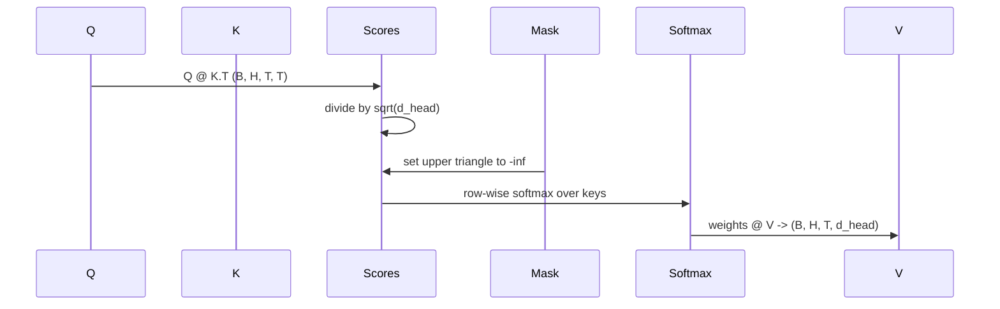

# 多头自注意力

> 一个线性投影，三个视图，H 个并行 head，一个 mask。这就是模型实际使用的 attention block。

**类型:** 构建
**语言:** Python
**先修:** Phase 04 lessons, Phase 07 transformer lessons, 本阶段 Lessons 30 through 32
**时间:** ~90 分钟

## 学习目标
- 将 batched Query/Key/Value 投影实现为一个线性层，并拆分成 H 个 head。
- 使用正确的归一化和 dtype 处理计算 scaled dot-product attention。
- 应用 causal mask，阻止某个位置关注未来位置。
- 检查固定输入的 per-head attention weights，并推理每个 head 关注哪里。
- 在玩具任务上训练一个小 attention block，观察 loss 下降以及 heads 如何专门化。

## 背景框架

Attention 是让一个 token 的表示从同一序列中的其他 token 拉取信息的函数。Self-attention 意味着 query、key、value 都来自同一个输入。Multi-head 意味着投影会拆成 H 个并行 attention 问题，它们的输出再拼接并投影回来。

高效实现模式是一个线性层从 `D` 投影到 `3 * D`，然后切成三个视图，再 reshape 成 H 个 head，每个 head 大小为 `D // H`。matmul、softmax 和加权求和都作为 batched tensor 操作执行，因此 heads 会在加速器上并行运行。

本课会构建这个 block。它还会加入 causal mask，使同一份代码可以作为 decoder-only language model 中的 attention 层。下一课会把 block 堆叠成完整 transformer，再下一课会训练它。

## 形状契约

输入是 `(B, T, D)`。输出是 `(B, T, D)`。mask 是 `(T, T)` 或可广播到该形状。block 内部的中间张量形状为 `(B, H, T, d_head)`，其中 `d_head = D // H`。约束是 `D % H == 0`。

```mermaid
flowchart LR
    A["(B, T, D) input"] --> B[Linear D -> 3D]
    B --> C["split into Q, K, V"]
    C --> D["reshape to (B, H, T, d_head)"]
    D --> E["scores = Q @ K.T / sqrt(d_head)"]
    E --> F[apply causal mask]
    F --> G[softmax over keys]
    G --> H["context = weights @ V"]
    H --> I["reshape to (B, T, D)"]
    I --> J[output Linear D -> D]
    J --> K["(B, T, D) output"]
```

两个线性层（QKV projection 和 output projection）是 block 中唯一的参数。mask、softmax、matmul 和 reshape 都没有参数。

## QKV 拆分

朴素实现有三个独立线性层，分别用于 Q、K、V。高效实现只有一个层，输出 `3 * D` 个特征，然后拆分结果。两者在数学上等价，因为三个分别乘以 `(D, D)` 权重的矩阵乘法，正好等价于一次乘以由它们堆叠而成的 `(3D, D)` 权重的矩阵乘法。

高效版本更快，因为加速器只启动一次 matmul，而不是三次。它也更容易初始化，因为三个子矩阵都在同一个参数张量里，可以一起初始化。

## head reshape

拆分之后，Q、K、V 都是 `(B, T, D)`。为了把它变成 H 个并行 attention 问题，我们 reshape 到 `(B, T, H, d_head)`，再 transpose 到 `(B, H, T, d_head)`。head 维度现在贴着 batch 维度，所以 PyTorch 会把 per-head attention 当作跨 `B * H` 个独立实例的 batched 操作。

`d_head` 维度保持在最后，因此 score matmul `Q @ K.transpose(-2, -1)` 会在这个维度上收缩。结果是 `(B, H, T, T)` 的 per-head attention scores。

## 缩放

scores 在 softmax 之前除以 `sqrt(d_head)`。没有这个缩放时，dot product 会随着 `d_head` 增大而变大，把 softmax 推到某个条目几乎占据全部质量、其他条目极小的区域。在这种区域中梯度很小，学习会停滞。除以 `sqrt(d_head)` 会让 scores 的方差在不同 head size 下大致保持恒定。

## causal mask

decoder-only language model 在预测下一个 token 时只能依赖过去。mask 会强制这一点。具体来说，在 softmax 之前，`(T, T)` score 矩阵中对角线以上的每个条目都会被替换为负无穷。softmax 后这些位置的权重为零。

我们在构造时把 mask 注册为 buffer，让它与模型处于同一设备，并且不进入梯度图。mask 覆盖 block 可能看到的最大上下文长度。前向传播时我们切出左上角 `(T, T)`。

## 输出投影

得到 per-head context vectors `(B, H, T, d_head)` 后，我们 transpose 回 `(B, T, H, d_head)`，reshape 为 `(B, T, D)`，再应用最后的 `(D, D)` 线性投影。output projection 允许模型混合 heads。没有它，H 个 head 只能通过后续层重新组合，block 会被人为限制。

## attention weight 检查

本课在 forward pass 上暴露 `return_weights=True` 标志。设置后，block 会在输出之外返回形状为 `(B, H, T, T)` 的 per-head attention weights。demo 会在短输入上打印某个 head 的权重热图，让你看到 causal-triangle 结构和每个位置的关注点。

在训练好的模型中，不同 head 会学习不同模式。有些 head 关注前一个 token。有些 head 关注序列开头。有些 head 几乎均匀分布 attention。这个检查 hook 是解释性工作的入口。

## 训练 demo

`main.py` 底部的 demo 会把 attention block 接到一个很小的 LM head 上，并在重复任务上训练整个模型。输入的每一行都是一个随机 id 在上下文中重复。目标是输入右移一位，因此模型必须学会下一个 token 与上一个 token 相同。loss 是 cross-entropy。在 H=4、D=32、T=12、词表 64 的设置下，loss 会在 CPU 上三轮内从随机水平（约 `log(64) ~ 4.16`）下降到远低于 `1.0`。

demo 的目的不是训练有用模型，而是确认梯度会流过 block 的每个部分，并且 heads 能在答案显然的任务上学到东西。

## 本课不做什么

本课不添加 feed-forward block。真实模型中的 transformer layer 是 attention 后接一个两层 MLP，每个周围都有 residual connection 和 layer norm。下一课会添加这些。

本课不实现 rotary 或 AliBi positional encoding。二者都应用在同一个 block 的 QKV projection 步骤，但它们是单独的教学单元。这里构建的 block 与二者兼容，只需在 matmul 之前变换 Q 和 K。

本课不实现推理用 KV cache。跨 forward pass 缓存 keys 和 values 是让 autoregressive decoding 变快的优化。它会改变 K 和 V tensor 的形状契约，但不会改变 Q。它属于推理课程。

## 如何阅读代码

`main.py` 定义 `MultiHeadSelfAttention`。这个类持有两个线性层和一个注册的 mask buffer。forward pass 会投影、reshape、算分数、mask、softmax、加权、reshape，并再次投影。底部 demo 会构建一个小模型，把 attention 与 token/positional embeddings 和 LM head 包起来，在 copy task 上训练三轮，并打印 loss curve 和 per-head attention heatmap。`code/tests/test_attention.py` 中的测试固定了形状契约、因果性性质、softmax 性质、head split 性质和梯度流。

运行 demo。然后把 `n_heads` 从 4 增加到 8（保持 `d_model=32`，所以 `d_head=4`），观察 heatmap 如何变化。
