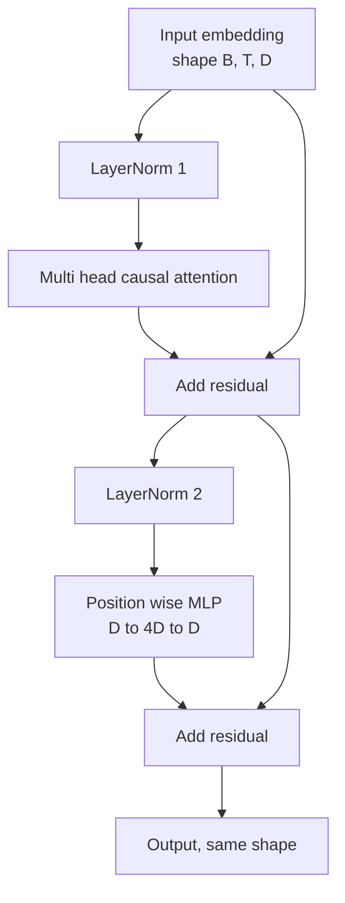
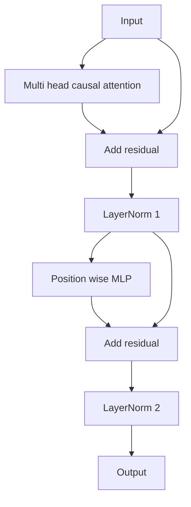

# 从零构建 Transformer Block

> 一个 block 是每个现代 decoder LLM 的基本单位。Layer norm、multi head attention、residual、MLP、residual。pre-LN 变体无需 warmup 就能稳定训练。post-LN 变体是原始论文发布的版本。本课会并排构建二者，并展示在常见学习率下，哪一个能撑过 12 层堆叠。

**类型:** 构建
**语言:** Python
**先修:** Phase 19 lessons 30 to 33（tokenizer、embeddings、attention math、batched data loader）
**时间:** ~90 分钟

## 学习目标

- 用 PyTorch 从四个部件构建 transformer block：LayerNorm、multi head causal attention、residual connections、position wise MLP。
- 将 LayerNorm 放在两种配置中（pre-LN 和 post-LN），并解释为什么其中一种无需 warmup 就能稳定训练。
- 在 multi head attention 内实现 causal masking，使 token `i` 不能看到 token `j > i`。
- 跟踪 12 层堆叠中两个变体的梯度流，并不含糊地解读结果。
- 在下一课组装 124 million parameter GPT 时，把该 block 作为可直接替换的单元复用。

## 要解决的问题

transformer 是重复的 block。一个 block 错一次，重复十二次，你就会得到一个第一轮就发散的模型，或一个一路依赖 warmup hack 的模型。本课会看到的两种失败模式并不罕见。它们会在学习者第一次天真地堆叠 blocks 时出现。一个是 attention layer 关注未来。另一个是 LayerNorm 放在无法在深度上驯服 residual signal 的位置。

一旦看见问题，修复就是机械的。block 正好有两条 residual paths 和两个 normalization positions。正确选择位置，栈的其余部分就只是记账。

## 核心概念

每个 decoder only transformer block 都是一个函数，接收形状为 `(batch, sequence, embedding)` 的张量，并返回同样形状的张量。内部有两个 sublayers 执行工作。



这是 pre-LN 变体。LayerNorm 位于 residual branch 内部、sublayer 之前。residual connection 会把未归一化信号向前传递。

post-LN 变体会把 LayerNorm 移到 residual add 之后。



形状完全相同。训练行为不同。使用 post-LN 时，通过 residual path 反向流动的梯度必须穿过 LayerNorm。在深度十二和学习率 `3e-4` 下，该梯度会收缩得足够快，以至于需要 warmup schedule。Pre-LN 让 residual path 保持未归一化，因此梯度可以干净地传播回 embedding layer。GPT-2 之后的配置采用 pre-LN 正是这个原因。

### Causal multi head attention

attention sublayer 会把输入三路投影为 query、key、value tensors。每个都从 `(B, T, D)` reshape 为 `(B, H, T, D/H)`，其中 `H` 是 head 数量。Scaled dot product attention 会逐 head 计算 `softmax(Q K^T / sqrt(d_k))`，把上三角 mask 为负无穷，通过 softmax 应用 mask，然后乘以 `V`。Heads 会被拼接回单个 `(B, T, D)` 张量，并再投影一次。mask 是唯一让模型具备因果性的部件。忘记 mask，你训练出的模型就会作弊。

### MLP

position wise MLP 会把同一个两层网络独立应用到每个 token。hidden width 是 embedding width 的四倍，activation 是 GELU，第二个 linear 后跟 dropout。MLP 内部没有 token 互相通信。所有 token mixing 都发生在 attention 中。

### residual connections 做两件事

它们让跨深度的梯度路径变成加法，从而让梯度范数在十二层中保持尺度。它们也让每个 block 学习对运行中表示的加性更新，而不是完整替换。两个效果都是 block 能扩展的原因。

## 动手实现

`code/main.py` 实现：

- `class LayerNorm`，带可学习 scale 和 shift、biased eps，并逐 token vector 应用。
- `class MultiHeadAttention`，包含 `num_heads`、`head_dim = d_model // num_heads`、fused QKV projection、注册的 causal mask、attention dropout 和 residual dropout。
- `class FeedForward`，包含两个线性层、GELU activation、dropout。
- `class TransformerBlock`，带 `pre_ln` flag，可在两个变体之间切换。
- 一个 demo：构建一个 6 层 pre-LN stack 和一个 6 层 post-LN stack，使用相同输入，并打印 (a) output shape，(b) 一次 backward pass 后 embedding 处的 gradient norm。

运行：

```bash
python3 code/main.py
```

输出：两个 stack 的 shape check，以及并排的 gradient norms。在相同学习率下，pre-LN stack 的 embedding gradient 比 post-LN stack 大一个数量级，这是 pre-LN 无需 warmup 就能训练的经验证据。

## 技术栈

- `torch` 用于 tensor math、autograd 和 `nn.Module` plumbing。
- 不使用 `transformers`，不使用 pretrained weights。block 从 primitives 实现。

## 生产中的模式

三个模式会把 textbook block 加固到可以上线。

**Fused QKV projection.** 三个独立线性层需要三次 kernel launches 和三次 matmuls。一个宽度为 `3 * d_model` 的线性层在一次 launch 中做同样工作，然后沿最后一轴拆分输出。fused path 在每种加速器上都更快，并且匹配 GPT-2、LLaMA 和 Mistral 参考实现发布的方式。

**注册 causal mask buffer.** mask 只依赖最大上下文长度。在构造时用 `register_buffer` 分配一次，每次 forward pass 切出活跃窗口，跳过每次调用的分配。忘记这一点会让 mask 在长上下文中变成 allocator 热点。

**Dropout 放两处，不是三处。** Dropout 应放在 attention softmax 后（attention dropout）和 MLP 第二个 linear 后（residual dropout）。放在 residual 本身上的 dropout 会破坏让深度梯度流动的加性 identity。一些早期实现犯过这个错误，并付出了训练脆弱的代价。

## 实际使用

- 本课的 block 可以不加修改地插入 lesson 35 的 GPT 组装。
- pre-LN 变体是每个现代 open weights LLM 使用的形式。post-LN 变体是 2017 年原始 attention 论文使用的形式。理解二者足以阅读你会遇到的任何 decoder architecture。
- 把 GELU 换成 SiLU，就得到 LLaMA 家族 activation。把 LayerNorm 换成 RMSNorm，就得到 LLaMA 家族 normalization。同一个骨架。

## 练习

1. 给 block 中每个 linear 添加 `bias=False` flag。现代 open weights LLM 的 linear layers 不带 biases。测量 12 层 768 dim 模型中能节省多少参数。
2. 用手写 RMSNorm 替换 `nn.LayerNorm`，并验证输出形状不变。
3. 添加一个 flag，返回第一个 head 的 attention weights，形状为 `(B, T, T)`。绘制上三角，确认 softmax 后它为零。
4. 构建 sanity check：向两个变体输入一个 `(2, 16, 384)` 张量，`H=6`，在权重初始化相同且 dropout 为零时，断言 forward outputs 不同（例如 `not torch.allclose`）。

## 关键术语

| 术语 | 常见说法 | 实际含义 |
|------|-----------------|------------------------|
| Pre-LN | “Pre norm” | LayerNorm 位于 residual branch 内部、每个 sublayer 之前；residual 携带未归一化信号 |
| Post-LN | “Post norm” | LayerNorm 位于 residual add 之后；这是 2017 年论文发布的形式，需要 warmup |
| Causal mask | “Triangle mask” | 把 attention logits 的上三角设为负无穷，使 token i 不能读取 j 大于 i 的 token |
| Fused QKV | “Combined projection” | 用一个宽度 3D 的 linear 代替三个宽度 D 的 linears；一个 kernel，一次 matmul |
| Residual stream | “Skip connection” | 从上到下流经每个 block 的未归一化张量；每个 block 都向它添加内容 |

## 延伸阅读

- Phase 7 lesson 02（self attention from scratch）用于理解该 block 下方的 attention math。
- Phase 7 lesson 05（full transformer）用于理解同一骨架的 encoder decoder 版本。
- Phase 10 lesson 04（pre training mini GPT）用于理解该 block 接入的训练过程。
- Phase 19 lesson 35（本 track）会把十二个这样的 blocks 堆叠成 GPT model。
