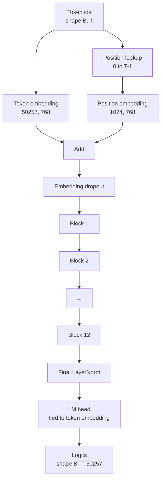
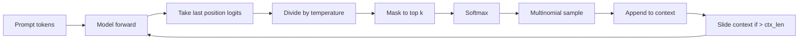

# GPT 模型组装

> 十二个 block 堆叠起来，一个 token embedding，一个可学习 position embedding，一个最终 LayerNorm，以及一个共享权重的语言模型 head。这就是完整的 1.24 亿参数 GPT 模型。本课会把这些部件组装成一个可运行的类，统计参数以确认模型匹配参考的 124M 形状，并用 multinomial sampling、temperature 和 top-k 生成文本。

**类型:** Build
**语言:** Python
**先修:** Phase 19 lessons 30 to 34
**时间:** ~90 minutes

## 学习目标

- 把第 34 课的 transformer block 组装成完整 GPT 模型：token embedding、position embedding、N 个 block、最终 LayerNorm、language model head。
- 复现 1.24 亿参数配置：vocab 50257、context 1024、embedding 768、十二个 heads、十二层。
- 将 language model head 权重绑定到 token embedding，并解释为什么这在该规模下可节省约 3800 万参数。
- 使用 multinomial sampling、temperature scaling 和 top-k truncation 从 prompt 生成文本，并用 sliding window 保持 context length。
- 对照 124M 目标测量参数量和 forward pass 成本。

## 要解决的问题

transformer block 本身什么也做不了。你需要把 token ids 变成向量，混入位置信息，让它们通过堆叠层，再投影回 vocabulary logits。忘掉这四步中的任意一步，模型要么无法 forward，要么位置信息漂移，要么无法“说话”。

模型形状也很重要。参考 GPT-2 small 在上面的精确配置下是 1.24 亿参数。这些数字不是魔法。Vocab 50257 乘以 embedding 768 是 token table。Position 1024 乘以 768 是 position table。十二个 block，每个大约 700 万参数，总计 8400 万。最终 head 通过 weight tying 复用 token table。把各部分加起来就落在 1.24 亿。构建出的模型参数量如果不匹配参考值，通常说明连线有误。

## 核心概念



Token ids 变成 token vectors。Position ids 变成 position vectors。两者相加后送入堆叠层。最终 LayerNorm 是 block 之外的一块，在每个现代变体里都保留下来。LM head 复用 token embedding matrix，这就是 weight tying 的含义。

### Weight tying

Token embedding 的形状是 `(vocab, d_model)`。Language model head 需要从 `d_model` 投影回 `vocab`。二者互为转置。绑定二者意味着字面上使用同一个 parameter tensor，两处复用。在 vocab 50257、d_model 768 时，这个矩阵是 3800 万参数。不绑定时你要付两份成本；绑定时只付一份，而且还会得到稍微更干净的梯度信号，因为 embedding 和 head 会一起更新。

### Position embedding 是可学习的，不是 sinusoidal

GPT-2 使用可学习的 position embedding。Position table 是一个形状为 `(1024, 768)` 的 parameter tensor。模型在每次 forward 时查找 position 0 到 T-1，并把 lookup 加到 token embedding 上。这是最简单的位置方案（RoPE、ALiBi、T5 relative bias 是其他替代方案），也是 124M 参考模型使用的方案。

### Generation：temperature、top-k、multinomial

生成是 autoregressive 的。每一步，模型都会在每个位置返回覆盖完整 vocabulary 的 logits。你只取最后一个位置，除以 temperature，可选地把 top k 之外的所有 logits mask 成 negative infinity，softmax 得到 probabilities，然后从所得分布里 sample 一个 token。



三个旋钮，对应三种不同行为。Temperature 接近零会退化为 greedy。Temperature 为一时匹配模型的自然分布。Top-k 为一就是 greedy。Top-k 四十会过滤长尾。组合很重要；下一课训练会把 generation 用作定性 eval 信号。

## 动手实现

`code/main.py` 实现：

- `class GPTConfig` dataclass，带 124M 默认值：`vocab_size=50257`、`context_length=1024`、`d_model=768`、`num_heads=12`、`num_layers=12`、`mlp_expansion=4`、`dropout=0.1`、`use_bias=True`、`weight_tying=True`。
- `class GPTModel`，包含 token embedding、position embedding、embedding dropout、十二个 `TransformerBlock`、最终 LayerNorm，以及在 flag 开启时绑定到 token embedding 的 `lm_head`。
- `count_parameters` helper，返回唯一参数量（因此计数会尊重 weight tying）。
- `generate` 函数，执行 temperature、top-k、multinomial 和 sliding window context。
- 一个 demo：构建模型，打印参数量并对照参考 124M，从固定 prompt 生成一小段序列，展示 pipeline 端到端可运行。

运行：

```bash
python3 code/main.py
```

输出：与 124M 参考并列的参数量、从随机 prompt 生成的 token ids，以及开启 tying 时 LM head 和 token embedding 共享存储的确认信息。

为了让 demo 保持快速，脚本还会运行一个 tiny config（`d_model=64`、`num_layers=2`）端到端，并内联打印生成的 token sequence。124M config 会被构建，但只执行参数计数和一次 forward pass。

## 技术栈

- `torch` 用于 tensor math、autograd 和 module plumbing。
- `code/main.py` 在本地重新实现第 34 课的同一 block pattern。

## 真实生产中的模式

三个模式决定了模型只是能跑，还是能交付。

**把 residual projections 初始化得小一些。** Attention 的 output projection 和 MLP 的第二个 linear 都直接流入 residual add。如果用和其他 linear 相同的标准差初始化它们，residual stream 会随深度增长，把最终 LayerNorm 推到高热区。对这两个 projection，把 std 缩放为 `1 / sqrt(2 * num_layers)`；residual stream 就能在十二层里保持合理范围。

**缓存 position id tensor，不要重复计算。** `torch.arange(T)` 会在每次 forward 分配新内存。在 `__init__` 中为最大 context 分配一次，每次调用切前 T 项，就能跳过 allocator 往返。

**在参数层级绑定权重，而不是只复制。** 设置 `lm_head.weight = token_embedding.weight` 会共享 tensor；复制不会。Optimizer 需要更新一个 parameter，autograd graph 也需要一次 accumulation。如果复制，head 会从 embedding 漂移出去，weight tying 就没有任何收益。

## 实际使用

- 本课的 model class 与下一课要训练的模型形状相同。
- 把 learned position embedding 替换成 RoPE，就能得到 LLaMA 家族，而无需触碰 block 或 head。
- 把 GELU 替换成 SiLU，并把 LayerNorm 替换成 RMSNorm，就得到 LLaMA 家族的其余变化。
- Generation 函数适用于任何 logits source，不只适用于本模型。你可以在第 37 课从 pretrained GPT-2 文件里拉取 logits，并复用同一个 generation loop。

## 练习

1. 解除 LM head 与 token embedding 的绑定并重新计数参数。验证 delta 是 50257 乘以 768 = 3800 万。
2. 用构造时计算的 sinusoidal table 替换 learned position embedding。确认模型仍能 forward，参数量减少 786,432。
3. 给 generation 添加 `greedy=True` flag，跳过 sampling 并选择 argmax。确认 sequence 在多次运行间是确定性的。
4. 添加 `repetition_penalty` 旋钮，在 softmax 前把 prompt 或 generated history 中任意 token 的 logit 除以一个常数。在固定 prompt 上展示大于一的值会减少输出里的重复次数。
5. 在 `top_k` 旁边添加 `top_p`（nucleus）sampling。用两行检查确认保留 token 的概率和超过 `top_p`。

## 关键术语

| 术语 | 人们常说 | 实际含义 |
|------|----------|----------|
| Weight tying | “Tied embeddings” | LM head 和 token embedding 共享同一个 parameter tensor；节省 vocab times d_model 个参数，并匹配 GPT-2 参考 |
| Position embedding | “Learned positions” | 一个形状为 (context length, d_model) 的独立表，加到 token vectors 上；端到端学习 |
| Sliding window context | “Context cap” | 当 prompt 加 generated tokens 超过 context length 时，丢弃最旧的 tokens，让 active window 能放下 |
| Top-k sampling | “K truncation” | 保留值最高的 K 个 logits，把其余 mask 成 negative infinity，再对剩余项 softmax |
| Temperature | “Sampling temperature” | 在 softmax 前把 logits 除以 T；T 小于 1 会变尖锐，T 等于 1 保持自然分布，T 大于 1 会变平 |

## 延伸阅读

- Phase 19 lesson 34：本模型堆叠的 block。
- Phase 19 lesson 36：用 cross entropy loss 驱动本模型的 training loop。
- Phase 19 lesson 37：把 pretrained GPT-2 weights 加载到这个精确架构中。
- Phase 7 lesson 07（GPT causal language modeling）：next token prediction 的数学。
- Phase 10 lesson 04（pre training mini GPT）：同一架构上的原始训练流程。
