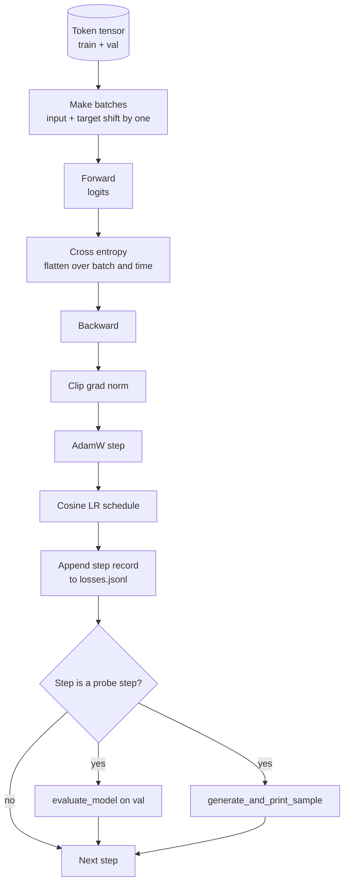

# 训练循环与评估

> 不测量的 loop 会骗人。本课构建驱动 GPT 模型的 training loop：带 weight decay split 的 AdamW、warmup plus cosine learning rate schedule、`calc_loss_batch` helper、在 held out data 上的 `evaluate_model` pass、每 K 步一次的 `generate_and_print_sample` 定性探针，以及一个之后可绘图的 JSONL loss log。同一个骨架可以训练你以后会构建的每一个 decoder LLM。

**类型:** Build
**语言:** Python
**先修:** Phase 19 lessons 30 to 35
**时间:** ~90 minutes

## 学习目标

- 构建 training loop，用正确的 input 和 target 对齐方式为 next token prediction 计算 cross entropy loss。
- 配置 AdamW：对 weight tensors 施加 weight decay，但不对 LayerNorm 或 bias tensors 施加。
- 实现带 linear warmup 和 cosine decay 的 learning rate schedule，并读取随时间变化的 LR。
- 用 `evaluate_model` 在 held out split 上评估，让 eval loss 可在多次运行间比较。
- 每 K 步用 `generate_and_print_sample` 生成定性样本，在 loss curve 暴露 divergence 之前捕捉它。
- 把 per step loss 持久化到 JSONL，让你可以重载、绘图，并把 training log 作为交付物发布。

## 要解决的问题

一个只打印 loss、其他什么都不做的 training script 会以三种方式失败。它无法告诉你 loss 是否因为正确原因下降（模型可能只是过拟合 training set，从未真正学会）。它无法告诉你 divergence 是否正在开始（loss 可能 spike 一步然后恢复，也可能 spike 一步然后崩溃）。它也无法告诉你模型学到了什么（loss 是标量；generated sample 是一段文字）。除非 loop 做测量，否则这三种失败都会被隐藏。

本课的 loop 用三种方式测量。每一步记录 training batch loss。每 K 步记录 held out batch loss。每 K 步从固定 prompt 生成 continuation。Training log 落在 JSONL 中，因此 artifact 就是 loop 的证词。

## 核心概念



两个不那么显然的部分是 loss alignment 和 AdamW decay split。

### Loss alignment

模型会在每个位置预测下一个 token。如果 input batch 是 tokens `[t0, t1, t2, t3]`，target batch 必须是 `[t1, t2, t3, t4]`。Cross entropy 在扁平形状 `(batch * seq, vocab)` 上与扁平 target `(batch * seq,)` 计算。忘记 shift，你就会把模型训练成预测自身，它会收敛到零 loss，却学不到任何有用东西。

### AdamW decay split

Weight decay 正则化 weight tensors，但不正则化 normalization scales 或 biases。对 LayerNorm scale 施加 decay 会慢慢把 scale 推向零，破坏 normalization。对 bias 施加 decay 在数学上无害，但浪费计算。标准 split 是：matrix shaped tensors（linear weights、embedding tables）施加 decay，任何看起来像 scale 或 shift 的东西都不施加。

### Warmup plus cosine schedule

Warmup 在几百步内把 learning rate 从零提升到目标值，让 optimizer state 有时间填充。Cosine decay 在剩余步骤中把 learning rate 降回接近零，让最终阶段用小 step size 微调权重。这个组合是 open weights LLM training 中最常见的 schedule，因为它移除了前一千步和后一千步里大部分脆弱时刻。

### Held out evaluation

`evaluate_model` 从 validation split 运行固定数量的 batches，累计 loss，除以 batch count，然后返回。没有 gradient。没有 dropout。给定相同 seed 和相同 split，该数字在多次运行间可复现。把 held out loss 与 training loss 并排报告，是发现 overfitting 的方式。

### Qualitative sampling as an early signal

一个 training loss 下降得很好、但 generated samples 全是同一个 token 的模型是坏的。一个 loss curve 看起来平坦、但 generated samples 逐渐变成连贯词语的模型正在学习。定性探针比阅读完整曲线更快，并能捕捉标量漏掉的模式。

## 动手实现

`code/main.py` 实现：

- `make_batches(token_ids, batch_size, context_length)`，把长 token tensor 切成 input 和 target pairs。
- `calc_loss_batch(model, inputs, targets)`，执行 forward、flatten，并返回标量 cross entropy。
- `evaluate_model(model, val_loader, max_batches)`，在 no grad 下迭代固定数量的 validation batches，并返回 mean loss。
- `generate_and_print_sample(model, prompt, max_new_tokens)`，在固定 prompt 上运行第 35 课的 generation function 并打印结果。
- `build_param_groups(model, weight_decay)`，生成 AdamW 的两组 parameter list。
- `cosine_with_warmup(step, warmup_steps, total_steps, max_lr, min_lr)`，返回给定 step 的 LR。
- `train(...)`，运行 loop，持久化 `outputs/losses.jsonl`，并每 `eval_every` 步打印 eval loss 和 sample。
- 一个 demo：在 synthetic data 上训练 tiny model 若干步，写入 JSONL log，并在 probe points 打印 eval loss 和 sample。该 demo 在 CPU 上远少于一分钟即可运行。

运行：

```bash
python3 code/main.py
```

输出：per step loss line、每个 probe step 的 eval loss、每个 probe step 的 generated sample，以及一个最终的 `outputs/losses.jsonl`，你可以对每一行用 `json.loads` 加载。

## 技术栈

- `torch` 用于 autograd、optimizer 和 modules。
- `main.py` 在本地重新实现第 35 课的 `GPTModel` 和 supporting modules。

## 真实生产中的模式

三个模式会把 textbook loop 变成你可以放心跑一整夜的东西。

**Gradient norm clipping 不可商量。** 一个坏 batch（异常数据、LR spike、数值边界情况）会产生巨大 gradient，抹掉数小时训练成果。在 `backward` 之后、`step` 之前调用 `torch.nn.utils.clip_grad_norm_(params, max_norm=1.0)`，能让 optimizer 保持在安全范围。Clipping value 是自由参数；一是多数设置都能扛住的默认值。

**使用可恢复的 JSONL logging，而不是 pickled state。** 把 per step loss records 作为 `{"step": int, "train_loss": float, "lr": float}` 行写入 JSONL 是耐用的：任何 crash 都会留下可读 artifact，你可以 grep，也可以用三十行 Python 绘图，还可以通过读取最后一步恢复训练。Pickled state 会绑定到产生文件时的精确 module layout，跨 refactor 很脆弱。

**Eval batches 来自固定切片。** Validation tokens 在脚本启动时切成 batches，而不是即时生成。可复现性依赖 eval batches 在多次运行间完全相同；否则比较两次运行的 eval loss 时，测到的 batch shuffle 和模型一样多。

## 实际使用

- 本课的 loop 是训练真实数据上 124M 模型的同一骨架。把 synthetic token tensor 换成 `datasets` 风格的 loader，loop 无需改变即可运行。
- JSONL log 是把 training run 变成 evidence 的交付物。下一课会用它比较 freshly trained checkpoint 和 pretrained checkpoint。
- Qualitative sample probe 是标量 loss 无法替代的兜底信号。

## 练习

1. 添加 `weight_decay_groups()` unit tests，确认 scale 和 bias parameters 落入 no decay group，而 linear 和 embedding weights 落入 decay group。
2. 用小 text file 中的 bytes 替换 synthetic random tokens，让 demo 在可读内容上训练。验证 generated sample 使用了文件中出现的 characters。
3. 给 cosine schedule 添加 `max_lr` 的 10 percent 作为 `min_lr` floor，并重新绘图。
4. 除 JSONL log 外，每 `eval_every` 步保存一个 checkpoint。添加 `resume_from` flag，重载 model state 和 optimizer state。
5. 在 loss 旁边记录 per step throughput（tokens per second），并确认它保持在稳定区间。

## 关键术语

| 术语 | 人们常说 | 实际含义 |
|------|----------|----------|
| Loss alignment | “Shift by one” | Input tokens 位于 positions 0..T-1，target tokens 位于 positions 1..T；cross entropy 在 flattened shapes 上计算 |
| Decay split | “Two groups” | AdamW 接收带 weight decay 的 matrix shaped tensors，以及不带 decay 的 scale 或 bias tensors |
| Warmup | “Ramp” | Learning rate 在固定步数内从零爬升到目标值，让 optimizer state 可以填充 |
| Eval batches | “Held out batches” | Validation token tensor 的固定切片，在脚本启动时切一次，并在每次 probe 中相同使用 |
| Qualitative probe | “Sample print” | 每 K 步从固定 prompt 生成一小段并打印，以捕捉单靠 loss 会隐藏的 failure modes |

## 延伸阅读

- Phase 19 lesson 35：loop 驱动的模型。
- Phase 19 lesson 37：把 pretrained weights 加载到同一模型中。
- Phase 10 lesson 04（pre training mini GPT）：真实数据上的流程。
- Phase 10 lesson 10（evaluation）：超越 cross entropy loss 的更广 eval surface。
