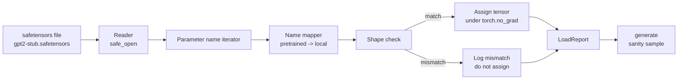

# Loading Pretrained Weights

> 从零训练一个 1.24 亿参数模型是预算决策；加载一个已发布 checkpoint 则是日常操作。本课会把 pretrained GPT-2 风格 weights 从 safetensors 文件加载到第 35 课的精确架构中，逐块走过 parameter name mapping，并做一次 sanity generation 来证明加载成功。没有网络，没有第三方 loaders，没有不透明魔法。

**类型:** Build
**语言:** Python
**先修:** Phase 19 lessons 30 to 36
**时间:** ~90 minutes

## 学习目标

- 用 `safetensors` Python library 读取 safetensors 文件，并检查 tensor names 和 shapes。
- 把每个 pretrained parameter name 映射到第 35 课 GPT model 内的一个 parameter。
- 处理 published GPT-2 weights 与本课程模型之间不同的两套命名约定：`wte/wpe/h.N.attn.c_attn/c_proj` 和 `mlp.c_fc/c_proj`，对上本地命名的 `tok_embed/pos_embed/blocks.N.attn.qkv/out_proj` 和 `mlp.fc1/fc2`。
- 在任何 weight assignment 发生之前，检测并拒绝 shape mismatch，并给出清晰错误。
- 用加载后的 weights 生成一小段 continuation，确认 tokens 来自 loaded distribution，而不是 randomly initialized distribution。

## 要解决的问题

Published weights 不是为你的架构打包的。它们携带的是原始实现使用的名字。Pretrained file 有一个形状为 `(2304, 768)` 的 `transformer.h.0.attn.c_attn.weight`；你的模型期望形状为 `(2304, 768)` 的 `blocks.0.attn.qkv.weight`（这是同一个矩阵，只是 layout convention 不同），或者你的模型使用 `nn.Linear`，它会以转置方式存储矩阵。同一个 parameter 会以三种细微不同的身份出现（name、shape、byte layout），loader 必须把三者协调起来。

盲目复制的 loader 会把正确 tensor 放进错误位置，得到一个生成胡言乱语的模型。遇到 shape 不同就拒绝复制但不记录日志的 loader，又会让你猜到底哪个 tensor 没落上。本课的 loader 是显式的：每次 assignment 都会记录，每个 shape 都会检查，并且 `LoadReport` 会汇总 hits、misses 和 shape mismatches，让你能读懂发生了什么。

## 核心概念



Name mapper 只是一个从 string 到 string 的函数。Shape check 就是一个 if。Assignment 发生在 `torch.no_grad()` 内，因此 autograd 不会追踪加载过程。Report 保存每个 name 的结果。

### GPT-2 命名约定

Published GPT-2 weights 使用这样的名字：

| Pretrained name | Shape | Meaning |
|-----------------|-------|---------|
| `wte.weight` | (50257, 768) | Token embedding |
| `wpe.weight` | (1024, 768) | Position embedding |
| `h.N.ln_1.weight` | (768,) | LayerNorm 1 scale at block N |
| `h.N.ln_1.bias` | (768,) | LayerNorm 1 shift at block N |
| `h.N.attn.c_attn.weight` | (768, 2304) | Fused QKV linear weight |
| `h.N.attn.c_attn.bias` | (2304,) | Fused QKV linear bias |
| `h.N.attn.c_proj.weight` | (768, 768) | Attention output projection |
| `h.N.attn.c_proj.bias` | (768,) | Attention output projection bias |
| `h.N.ln_2.weight` | (768,) | LayerNorm 2 scale |
| `h.N.ln_2.bias` | (768,) | LayerNorm 2 shift |
| `h.N.mlp.c_fc.weight` | (768, 3072) | MLP fc1 weight |
| `h.N.mlp.c_fc.bias` | (3072,) | MLP fc1 bias |
| `h.N.mlp.c_proj.weight` | (3072, 768) | MLP fc2 weight |
| `h.N.mlp.c_proj.bias` | (768,) | MLP fc2 bias |
| `ln_f.weight` | (768,) | Final LayerNorm scale |
| `ln_f.bias` | (768,) | Final LayerNorm shift |

有两个意外点需要提前规划。`c_attn`、`c_proj`、`c_fc` 这些 linears 的矩阵存储方式，相对于 `nn.Linear.weight` 的期望是转置的。Loader 会在 assignment 时转置。LM head 完全不在文件里；模型依赖与 `wte` 的 weight tying，因此 `wte` 落地后，head 会通过 aliasing 设置好。

### 本地命名约定

本课程中的模型使用描述性名字：

| Local name | Meaning |
|------------|---------|
| `tok_embed.weight` | Token embedding |
| `pos_embed.weight` | Position embedding |
| `blocks.N.ln1.scale` | LayerNorm 1 scale at block N |
| `blocks.N.ln1.shift` | LayerNorm 1 shift |
| `blocks.N.attn.qkv.weight` | Fused QKV |
| `blocks.N.attn.qkv.bias` | Fused QKV bias |
| `blocks.N.attn.out_proj.weight` | Attention output projection |
| `blocks.N.attn.out_proj.bias` | Output projection bias |
| `blocks.N.ln2.scale` | LayerNorm 2 scale |
| `blocks.N.ln2.shift` | LayerNorm 2 shift |
| `blocks.N.mlp.fc1.weight` | MLP fc1 |
| `blocks.N.mlp.fc1.bias` | MLP fc1 bias |
| `blocks.N.mlp.fc2.weight` | MLP fc2 |
| `blocks.N.mlp.fc2.bias` | MLP fc2 bias |
| `final_ln.scale` | Final LayerNorm scale |
| `final_ln.shift` | Final LayerNorm shift |

映射是一个固定函数。本课把它作为 dict 提供，由 loader 迭代。

### Stub fixture

真实 GPT-2 weights 是 0.5 GB。Demo 不会下载它们；它会在首次运行时生成一个小 safetensors fixture，使用精确的 GPT-2 命名约定，并采用适合 12-block 模型、d_model 192 而不是 768 的 shapes。Fixture 结构正确，可以覆盖 loader 中的每条 code path。把 fixture 换成真实文件，loader 无需修改即可工作。

## 动手实现

`code/main.py` 实现：

- 第 35 课 `GPTModel` 的一个小型 replica，让本课自包含。
- `make_pretrained_to_local(num_layers)`，展开 per-layer entries。
- `load_safetensors(model, path)`，迭代 names、映射 names、检查 shape、转置 conv1d-style weights，并在 `torch.no_grad()` 下赋值。返回 `LoadReport`。
- `make_stub_safetensors(path, cfg)`，用精确的 pretrained naming convention 生成 fixture file。
- 一个 demo：首次运行时创建 `outputs/gpt2-stub.safetensors`，构建 fresh model，从 random init 捕获一次 generated continuation，加载 stub，再捕获另一次 continuation，打印两者，并验证二者不同（load 确实改变了模型）。

运行：

```bash
python3 code/main.py
```

输出：fixture path、per-name load log、`LoadReport` summary、load 前 continuation、load 后 continuation，以及 fixture 中注入的一个 intentionally bad tensor 触发的 shape mismatch，用来覆盖 failure path。

## 技术栈

- `safetensors` 用于 on disk format 和 streaming reader。
- `torch` 用于模型和 assignment math。
- 没有 `transformers`，没有 `huggingface_hub`，没有 network calls。

## 真实生产中的模式

三个模式能让 loader 经受住你没有创建的 weights。

**任何 assignment 之前都先 validate 文件。** 打开文件，列出每个 tensor name 及其 dtype 和 shape，运行完整 mapping 与 shape checks，并且只在成功时开始 assignment。半加载模型是 silent failure machines。

**记录每次 assignment 的 source name 和 destination name。** 当某些东西看起来不对时，log 会告诉你哪个 tensor 落到了哪里；替代方案就是读 hexdumps。本课的 `LoadReport` dataclass 会跟踪 `loaded`、`missing`、`unexpected` 和 `shape_mismatch` lists，并在最后打印 summary。

**LM head 是 weight tying alias，不是单独 copy。** 在加载 `tok_embed` 后设置 `model.lm_head.weight = model.tok_embed.weight` 是 canonical pattern。把 embedding matrix copy 到新的 `lm_head.weight` parameter 会破坏 tying，并悄悄让参数量翻倍。

## 实际使用

- Loader 适用于任何使用 pretrained naming convention 的 safetensors 文件。真实 GPT-2 files（small / medium / large / xl）无需改代码即可工作；只有 model config 不同。
- 同一模式可以扩展到 LLaMA、Mistral、Qwen weights，只要更新 name map。Shape checks 和 report 保持相同。
- Load 后的 sanity generation 是一个快速 gate：如果 post-load samples 看起来像 pre-load samples，说明 load 没有改变模型，也就是 mapping 悄悄 miss 了每个 tensor。

## 练习

1. 给 loader 添加 `dtype` argument，在 assignment 时把每个 tensor cast 到目标 dtype（`bfloat16`、`float16`、`float32`）。确认 `float32` model 可以 downcast 到 `bfloat16` 并仍能 generate。
2. 添加 `expected_layers` argument，拒绝加载 `h.N` indices 与模型 `num_layers` 不匹配的 checkpoint。
3. 把 loader 接入第 35 课的 generation function，并生成两个 side by side samples：一个来自 random init，一个来自 loaded fixture。
4. 添加 export path：用 pretrained naming convention 把当前 model state 写入一个 fresh safetensors file。Round trip loader，并确认 report 有 zero shape mismatches。
5. 扩展 `NAME_MAP` 以处理 LLaMA naming convention（no biases、RMSNorm、fused qkv layout），并在你生成的 stub LLaMA fixture 上重新运行 loader。

## 关键术语

| 术语 | 人们常说 | 实际含义 |
|------|----------|----------|
| Name map | “Key remapping” | 从 pretrained tensor names 到 local parameter names 的函数；通常是一个 literal dict，每个 layer index 在 loop 中展开一组 entries |
| Shape mismatch | “Bad shape” | Pretrained tensor 位于 mapped name 下，但其 dimensions 与 local parameter 不一致；loader 拒绝赋值并记录这一对 |
| Transpose-on-load | “Conv1d layout” | Published GPT-2 以 nn.Linear 期望值的转置形式存储 attention 和 MLP projections；loader 在 assignment 时转置 |
| Weight tying alias | “Shared LM head” | 设置 model.lm_head.weight = model.tok_embed.weight，让 head 和 embedding 共享存储；因此 head 不在文件里 |
| Load report | “Coverage summary” | 一个小 dataclass，跟踪 loaded、missing、unexpected 和 shape_mismatch lists；打印它就是判断 load 是否成功的方式 |

## 延伸阅读

- Phase 19 lesson 35：接收 weights 的架构。
- Phase 19 lesson 36：生成同形状 checkpoint 的 training loop。
- Phase 10 lesson 11（quantization）：内存紧张时如何处理 loaded weights。
- Phase 10 lesson 13（building a complete LLM pipeline）：围绕 load 和 inference 的完整生命周期。
