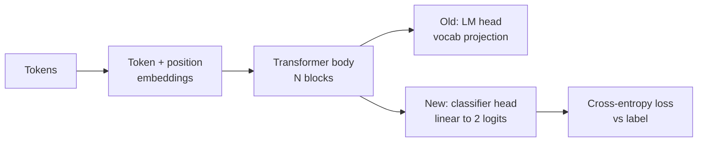
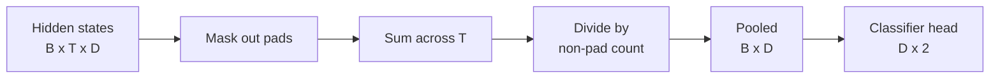
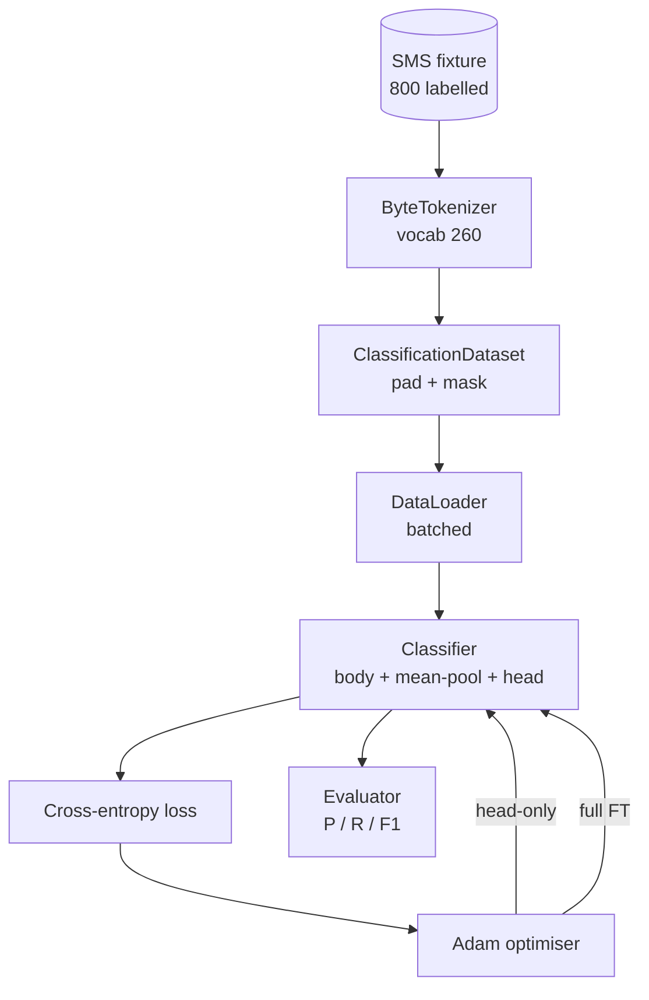

# Capstone Lesson 38: 通过 Head Swap 进行 Classifier Fine-Tuning

> Track B 的第一个 capstone。Pretrained language model 是一组 self-attention blocks，末尾接一个 token-prediction head。当你想区分 spam vs ham 时，head 是错的，但 body 大多是对的。本课会把 head 拆掉，在 pooled representation 上接一个 two-class linear layer，并用两种方式训练 classifier：final-layer only 和 full fine-tuning。Eval 是 held-out split 上的 precision、recall 和 F1。你会学到每种策略带来什么、代价是什么。

**类型:** Build
**语言:** Python (torch, numpy)
**先修:** Phase 19 lessons 30-37 (NLP LLM track: tokenizer, embedding table, attention block, transformer body, pre-training loop, checkpointing, generation, perplexity)
**时间:** ~90 minutes

## 学习目标

- 在不重新初始化 body 的情况下，用 classification head 替换 language-model head。
- 实现两种 training regimes：frozen body（head-only）和 full fine-tuning，并共享同一个 training loop。
- 构建 tokeniser-aware data pipeline，能 padding、mask padding，并 pool attention output。
- 从 raw logits 计算 precision、recall、F1 和 confusion matrix。
- 推理 parameter count、training time 和 head-room 之间的 trade-off。

## 要解决的问题

你在通用语料上 pre-trained 了一个小 transformer。Output head 会把最后 hidden state 投影到 1000-token vocabulary。现在你有 800 条标注为 spam 或 ham 的 SMS messages，想要一个 binary classifier。有三种选项。

错误选项是在 800 个样本上从零训练一个 fresh classifier。Pretrained model 的 body 已经编码了有用结构：word identity、position、simple co-occurrence。扔掉它就是浪费构建它所花的 compute。

两个正确选项是 head swap with the body frozen，以及 head swap with the body trainable。Head-only training 很快，memory 几乎免费，并且在这么少的数据上很少 overfit。Full fine-tuning 更慢，可能在小数据上 overfit，但当 downstream domain 偏离 pretraining corpus 时可以达到更高 accuracy。

本课会同时构建二者，让你能在同一个 fixture 上比较它们。

## 核心概念

模型是一个函数 `f_theta(tokens) -> hidden_states`。Head 是一个函数 `g_phi(hidden) -> logits`。Swapping heads 意味着保留 `theta` 并替换 `g_phi`。Body 的 parameters 是昂贵部分。Head 只是一个 linear layer。

有两组 trainable parameters 很重要：

- `theta`（body）：每个 attention block 有数万权重。
- `phi`（head）：`hidden_dim * num_classes` 个 weights，加一个 bias。

在 head-only training 中，你对 `phi` 计算 gradients，并让 `theta` 上的 gradients 为零。PyTorch 允许你通过对 body parameters 设置 `requires_grad=False` 来做到这一点。然后 optimiser 只会看到 head，body 保持 frozen。

在 full fine-tuning 中，你让 gradients 回传穿过整个 stack。Body 的 weights 会漂移，以适应 classification objective。风险是在小数据上发生 catastrophic forgetting：body 的 pretraining 会被 overfitting noise 冲掉。

## 池化问题

Classifier 需要每个 sequence 一个 vector，而不是每个 token 一个 vector。三种常见选择：

- **Mean pool**：沿 sequence 平均 hidden states，并用 attention mask 加权。
- **CLS pool**：前置一个 special token，只使用它的 output。这是 BERT 的做法。
- **Last-token pool**：使用最后一个非 padding token。这是 GPT-class classifiers 的做法。

本课使用带显式 attention-mask weighting 的 mean pooling。它最简单，对不同 sequence lengths 给出稳定信号，也不需要 pretraining 一个 CLS token。

## 数据

八百条 SMS messages，平衡为 400 spam 和 400 ham，会在 `code/main.py` 中 deterministically 生成。Generator 使用固定 seed，挑选 templates 并替换 slot fillers，输出长度在 5 到 25 tokens 之间的 messages。真实 datasets 会有这个 fixture 没有的 noise。Fixture 的重点是 reproducibility。

数据按 80/20 切分：640 train，160 test。Splits 是 stratified 的，所以 test set 保持 50/50 balance。带已知 balance 的 held-out set 能让 precision 和 recall 被读作诚实数字。

## 指标

Binary classification 以 class 1 作为 positive class（spam）。Counts 是：

- `TP`：预测为 spam，实际是 spam。
- `FP`：预测为 spam，实际是 ham。
- `FN`：预测为 ham，实际是 spam。
- `TN`：预测为 ham，实际是 ham。

三个 headline metrics：

- `precision = TP / (TP + FP)`。被标记为 spam 的 messages 中，有多少比例确实是 spam？
- `recall = TP / (TP + FN)`。实际 spam 中，有多少比例被模型标记出来？
- `F1 = 2 * P * R / (P + R)`。二者的 harmonic mean。

Confusion matrix 会把四个 counts 打印成 2x2 grid。Demo 会为两种 training regimes 都把它写到 stdout。

## 架构

Body 是一个刻意 tiny 的 transformer：vocab 260、hidden 64、4 heads、2 blocks、max sequence 32。它足够小，能在 CPU 上九十秒内把两种 regimes 都训练到收敛。它在本课中不是 pretrained；相反，`pretrain_quick` helper 会在同一个 fixture 的 text 上做五个 epochs 的 LM training，让 body 有一个非平凡起点。这让本课保持自包含。

## 你将构建什么

实现是一个 `main.py` 加一个 test module（`code/tests/test_main.py`）。

1. `ByteTokenizer`：把 bytes 映射到 ids，并保留一个 pad id。
2. `Block`：带 multi-head attention 和 feed-forward layer 的 transformer block。Pre-norm。
3. `LMBody`：token + position embeddings 加一组 blocks。返回 hidden states。
4. `MeanPool`：在 sequence axis 上做 mask-weighted average。
5. `Classifier`：body、pool、linear head。Body 在不同 regimes 间是同一个 instance。
6. `freeze_body` 和 `unfreeze_body`：切换 body parameters 上的 `requires_grad`。
7. `train_classifier`：一个共享 loop。接收 model 和一个为当前 trainable parameter group 配置的 optimiser。
8. `evaluate`：运行 test set 并返回 `Metrics(precision, recall, f1, confusion)`。
9. `run_demo`：先短暂 pretrain body，再训练并评估 head-only，然后训练并评估 full，打印两个 reports，并以 zero 退出。

## 为什么比较重要

Head-only regime 通常训练更快，也更优雅地 underfit。在这个 fixture 上，你通常会看到 head-only training 二十个 epochs 后 precision 接近 0.9、recall 接近 0.85。Full fine-tuning 大约慢三倍，最终结果会在几个百分点内上下波动，取决于 random seed。

本课不选赢家。它教你读数字和成本。在 800 个样本和 tiny body 上，head-only 是正确选择。在 80,000 个样本和更大 body 上，full fine-tuning 开始变得值得。你从本课带走的契约是 API：同一个 `train_classifier` 函数处理两者，切换只是一次调用。

## 延伸目标

- 添加第三种 regime，只 unfreeze 最后一个 block。这有时叫 partial fine-tuning。它比 full FT 成本低，比 head-only 学得多。
- 添加 learning-rate scheduler。在 head 上使用 cosine schedule，同时在 body 上使用更小的 constant rate，是常见 production setup。
- 用 learned attention pool 替换 mean pooling：一个带一个 learned query 的小 attention layer。它常常在较长 sequences 上胜过 mean pool。

实现给了你 hooks。Tests 固定了 contract。数字由你继续推进。
