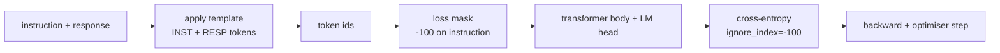
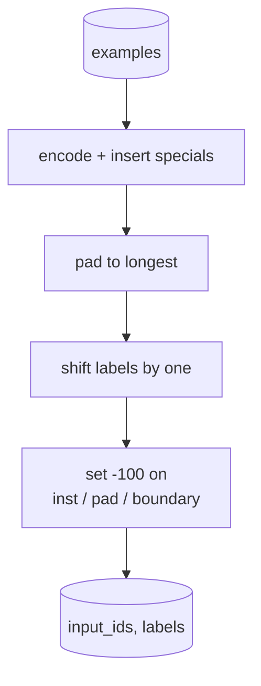
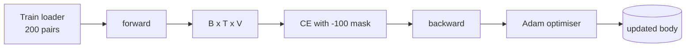

# Capstone Lesson 39: 通过 Supervised Fine-Tuning 做 Instruction Tuning

> Pretrained base model 可以延长一段 sequence，但不会遵循 instruction。Supervised fine-tuning 是修复这一点的最小改动：给模型喂 paired examples，其中包含 instruction 和 desired response，并训练 body 预测 response tokens。关键技巧是 loss 只应该计算 response，而不是 instruction。本课会构建一个 Alpaca-style SFT loop，使用 custom collate function 将 instruction tokens mask 为 `ignore_index=-100`，在 200 个 instruction-response pairs 上训练，并用 exact-match 在 held-out split 上评估。

**类型:** Build
**语言:** Python (torch, numpy)
**先修:** Phase 19 lessons 30-37 (NLP LLM track: tokenizer, embedding table, attention block, transformer body, pre-training loop, checkpointing, generation, perplexity)
**时间:** ~90 minutes

## 学习目标

- 将 paired instruction-response data 格式化为带显式 boundary tokens 的单个 causal sequence。
- 构建 collate function，mask instruction tokens，让 cross-entropy 只计算 response tokens。
- 在 SFT objective 下训练 tiny transformer body，并观察 eval metric 移动。
- 实现 greedy generation 和 temperature-sampled generation，并尊重 response-start boundary。
- 在 generated completions 上计算 held-out exact-match。

## 要解决的问题

一个基于 next-token prediction 训练的 base model 并不知道 instruction 是什么。给它字符串 `"What is the capital of France?"`，它会继续这个问题，或者编造一个新句子。模型有语言能力，但没有格式契约。

SFT contract 是一个 string template。每个 training example 都变成一个有三个区域的单一 sequence：

```text
<INST> What is the capital of France? <RESP> The capital of France is Paris.
```

Boundary tokens 是训练时保留的 special tokens。模型学到 `<RESP>` 之后的一切都是 response，而 response 才是被评分的内容。Base model 的 next-token objective 仍然适用；它只是被训练在一个每个 example 都具有这种形状的 corpus 上。

但这里有个陷阱。如果把整个 sequence 喂给 vanilla cross-entropy loss，你也在训练模型预测 instruction tokens。Instruction 是给定的。你希望这些位置上有零 gradient。修复方式就是 mask。

## 核心概念



`ignore_index` 是 `torch.nn.functional.cross_entropy` 的一个功能。任何 target position 等于 `ignore_index` 都贡献零 loss 和零 gradient。PyTorch 中的惯例是 `-100`。Collate function 为每个 example 构建两个 tensors：`input_ids`（完整 sequence）和 `labels`（`input_ids` 的 copy，但 instruction positions 被覆盖成 `-100`）。

模型在 forward pass 中看到完整 sequence；attention 可以 attend to instruction。Loss 只计算 response tokens。这正是你想要的：condition on the instruction，predict the response。

## 数据

两百个 instruction-response pairs 在 `main.py` 中 deterministically 生成。它们覆盖六种 task types：

- factual single-shot (capital of X)
- arithmetic
- list extraction
- one-sentence summary
- code (print, sort)
- definition

每个 task 都有一个 templated instruction 和 deterministic response。这是刻意简化的。Exact-match 很脆弱，而本课使用一个正确答案就是某个特定字符串的 fixture。真实 SFT datasets 需要 fuzzy metrics；原则完全相同。

Splits 是 160 train、40 test。Test set 覆盖所有六种 task types，因此可以报告 per-category exact-match。

## Tokenisation and Padding

Tokeniser 是 byte-level，并带三个 reserved specials：

- `INST_ID = 256`：标记 instruction region 的开始。
- `RESP_ID = 257`：标记 instruction 和 response 之间的 boundary。
- `PAD_ID = 258`：用于 variable-length batches 的 padding。

Sequence 是 `[INST] inst_bytes [RESP] resp_bytes [PAD]*`。Collate function：

1. Tokenises each example.
2. Pads every example in the batch to the longest sequence in the batch.
3. Builds `labels` = `input_ids` shifted by one (causal LM target), with:
   - The instruction region replaced by `-100`.
   - The padding region replaced by `-100`.
   - The `RESP_ID` boundary position itself replaced by `-100` (you do not train the model to predict the boundary token; it predicts what follows).



Shift 是标准 causal trick：`input_ids` 的 position `i` 预测 position `i+1`，因此 `labels[i] = input_ids[i+1]`（input 会丢弃 final position，target 会丢弃 first）。Mask 在 shift 后应用，才能落在正确位置。

## 训练



Loop 是标准 PyTorch SFT loop。Adam，learning rate 大约 3e-4 到 1e-3，在这个 fixture 上十到二十个 epochs，没有 scheduler。模型足够小（hidden 96、2 blocks、max length 64），可以在 CPU 上两分钟内训练到收敛。

每第五个 epoch，loop 会在 held-out set 上运行一个 tiny eval pass 并打印 exact-match。看着 exact-match 从 epoch one 的 0.0 变到 epoch fifteen 附近的 0.85，就是本课的回报：你能看到模型同时学习格式和答案。

## Generation

Eval 时，模型收到 instruction prefix `[INST] inst_bytes [RESP]`，然后生成 tokens，直到：

- sequence 达到 `max_len`，或者
- 模型发出 special stop heuristic：连续两个 sentence-ending bytes（`.`、`!`、`?`）。

本课提供 greedy decoding 和可选 temperature sampler。Exact-match 使用 greedy，因为 temperature 会让 metric 随机化。真实系统通常会 sample，然后用 fuzzy 方式 judge；这条 pipeline 是第 41 课。

## Exact-Match Evaluation

Exact-match 是最严格的文本 metric。Predicted response string 会被 normalised（lowercase、strip whitespace、collapse double spaces），reference response 也以同样方式 normalised，然后二者比较。每个 example 的 metric 要么 1，要么 0。Aggregate 是 mean。

真实 SFT pipelines 会用 token-level F1（第 41 课）和 judge model 补充 exact-match。Exact-match 仍然有用，因为它毫不含糊；如果它说 0.7，就表示正好 70 percent 的 test instructions 产生了与 gold response character for character 相同的输出。

## 你将构建什么

实现是一个 `main.py` 加 tests。

1. `InstructionTokenizer`：带 reserved specials 的 byte-level encoder。可以 encode instruction prefix 或 full pair。
2. `make_dataset`：用固定 seed 生成跨六种 task types 的 200 pairs。
3. `SFTDataset`：每个 example 返回 `(input_ids, labels)`，且已经准备好 mask。
4. `sft_collate`：dynamic padding，构建 batch tensor，并在 instruction 和 pad positions 上设置 `-100`。
5. `TinyGPT`：transformer body 加 tied 或 untied LM head。
6. `train_sft`：SFT loop，带 per-epoch eval hooks。
7. `generate`：从 prefix 开始 causal decode，greedy 或 sampled，带 stop heuristic。
8. `exact_match`：normalised string comparison，返回 `[0, 1]` 中的 float。
9. `run_demo`：构建 data，训练二十个 epochs，评估，打印 per-category breakdown，并在成功时以 zero 退出。

## 为什么 mask 很重要

没有 mask 时，loss 会把 instruction tokens 当作 targets。模型学会预测 instruction。这是另一个 objective，会以两种方式产生更差模型。第一，model capacity 被浪费在重构用户总是会提供的输入。第二，因为在大多数 batches 中 instruction tokens 多于 response tokens，response loss 在 gradient sum 中占比更小；optimizer 在你关心部分上的 effective learning rate 比预期更低。Mask 不是润色；它就是 objective。

## 延伸目标

- 添加 learning-rate warmup followed by cosine decay。SFT 对 LR 比 pretraining 更敏感。
- 添加 per-token loss logging，并绘制训练过程中的 loss curve。注意 early epochs 由 template tokens（`<RESP>`、common prefixes）主导，later epochs 由实际 answer tokens 主导。
- 把 eval 扩展到 BLEU-1 或 chrF。Exact-match 会低估那些生成同义改写但答案相同的模型。
- 添加带 multi-turn formatting 的 chat template，并在包含 follow-ups 的 fixture 上训练。

实现给了你 format contract、mask 和 loop。从 base model 到 instruction follower 的 objective change，就是一个 collate function。
