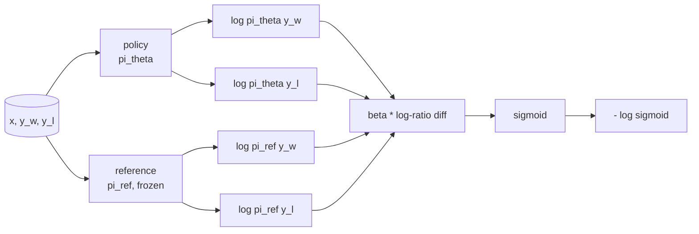
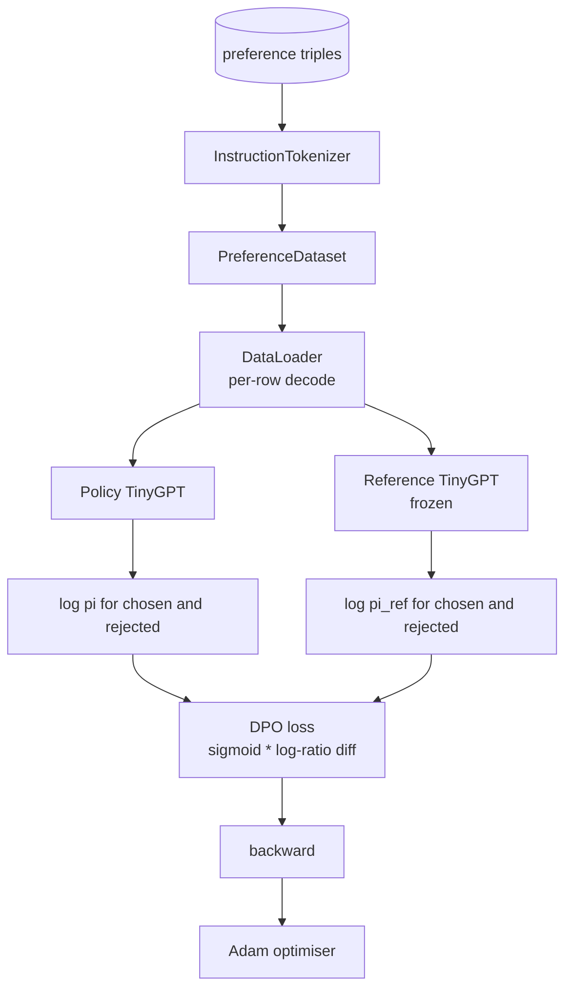

# Capstone Lesson 40: 从零实现 Direct Preference Optimization

> Reward models 和 PPO 是经典 RLHF stack。DPO 把这套 stack 折叠成一个 supervised loss，直接用 preference pairs 拟合 policy。本课从 reward-difference identity 推导 DPO loss，提供可运行的 reference model 加 policy model，计算 per-token log-probabilities，并在 chosen 和 rejected completions 的 preference fixture 上训练 tiny transformer。Tests 会固定 loss math 和 gradient direction，让你知道实现与论文匹配。

**类型:** Build
**语言:** Python (torch, numpy)
**先修:** Phase 19 lessons 30-37 (NLP LLM track: tokenizer, embedding table, attention block, transformer body, pre-training loop, checkpointing, generation, perplexity)
**时间:** ~90 minutes

## 学习目标

- 将 DPO loss 推导为 scaled log-ratio difference 上的 sigmoid，并把它连接到 implicit reward。
- 构建 reference model + policy model pair，其中 reference frozen、policy trainable。
- 在两个模型下计算 sequence-level log-probabilities，并 mask prompt tokens。
- 在 `(prompt, chosen, rejected)` triples 上训练 policy，并观察 chosen log-prob 相对 rejected 上升。
- 用 tests 固定 loss math、gradient sign 和 reference invariance。

## 要解决的问题

你有一个 SFT model。它会遵循 instructions，但 outputs 不稳定；有些 completions 清晰，有些啰嗦或错误。你还有一个小 preference pairs dataset：同一个 prompt 下，人类把一个 completion 标为 chosen，另一个标为 rejected。

经典 RLHF 答案是两阶段 pipeline。先在 preferences 上训练 reward model。再用 PPO 针对 reward 优化 policy。这可行，但昂贵：PPO 期间内存里有两个模型，需要 KL control 让 policy 靠近 reference，当 reward model 脆弱时还会 reward hacking。

DPO 用单个 supervised loss 替换两个阶段。Reward model 从不显式存在。Policy 直接在 preference pairs 上训练，同时带有朝向 SFT reference 的显式 KL penalty。在 Bradley-Terry preference model 下有相同最优解，代码少得多。

## 核心概念

从 Bradley-Terry model 开始。给定 prompt `x` 和两个 completions `y_w`（chosen）与 `y_l`（rejected），人类偏好 `y_w` 的概率是

```text
P(y_w > y_l | x) = sigmoid( r(x, y_w) - r(x, y_l) )
```

其中 `r` 是某个 latent reward function。RLHF 先从 preferences 拟合 `r`，再训练 policy `pi`，在一个 KL anchor 下最大化 `r`：

```text
max_pi   E_{x, y~pi} [ r(x, y) ] - beta * KL(pi || pi_ref)
```

DPO 推导观察到，在这个 objective 下的 optimal policy `pi*` 可以用 `r` 写成 closed form：

```text
pi*(y | x) = (1/Z(x)) * pi_ref(y | x) * exp( r(x, y) / beta )
```

重新整理 `r`：

```text
r(x, y) = beta * ( log pi*(y | x) - log pi_ref(y | x) ) + beta * log Z(x)
```

`log Z(x)` 项对 `y_w` 和 `y_l` 是相同的（它依赖 `x`，不依赖 `y`），因此在计算 preference difference 时会抵消：

```text
r(x, y_w) - r(x, y_l) = beta * ( log pi_theta(y_w|x) - log pi_ref(y_w|x)
                                - log pi_theta(y_l|x) + log pi_ref(y_l|x) )
```

代入 Bradley-Terry sigmoid，并对 preference pairs 取 negative log likelihood：

```text
L_DPO(theta) = - E_{(x, y_w, y_l)} [
  log sigmoid( beta * ( log pi_theta(y_w|x) - log pi_ref(y_w|x)
                       - log pi_theta(y_l|x) + log pi_ref(y_l|x) ) )
]
```

这就是 loss。它是对每个 example 的一个标量做 sigmoid，这个标量由四个 log-probabilities 计算而来。没有单独 reward model。没有 PPO。Loss 中没有 KL term；KL constraint 已经烘进 closed-form derivation 里。



## 梯度符号

任何 training run 前，一个有用的 sanity check 是对 `log pi_theta(y_w | x)` 求梯度：

```text
d L_DPO / d log pi_theta(y_w | x) = - beta * (1 - sigmoid(z))
```

其中 `z` 是 sigmoid 的 argument。它对所有 `z` 都是负的，这意味着：提高 policy 对 chosen completion 的 log-probability 会降低 loss。对称地，关于 `log pi_theta(y_l | x)` 的梯度是正的：提高 rejected log-probability 会增加 loss。Training 会把 chosen 往上推，把 rejected 往下推。Reference 是 frozen 的；它不会移动。

## 数据

本课自带十二个 preference triples。每个都是 `(prompt, chosen, rejected)`。Chosen completion 短且精确。Rejected 啰嗦、跑题或错误。这些 pairs 覆盖与第 39 课相同的 task families（capital、arithmetic、list），所以从 SFT base 出发的 policy 有一个合理起点。

Fixture 刻意很小。生产中的 DPO 用数万 pairs；这里的重点是 loss math 和 loop 能在 tiny dataset 上端到端运行，并且 chosen-versus-rejected log-prob gap 会明显增长。

## Reference Invariance

DPO implementation 必须小心处理 reference model。Reference 是 frozen in place 的 SFT model。三个性质必须成立：

- Reference parameters 永远不接收 gradients。
- Reference log-probabilities 在 epochs 之间永远不变。
- Policy 从与 reference 相同的 weights 开始。（Optimal `theta` 是 reference 加 learned update；把 policy 初始化为 reference 的 copy 是定义良好的起点。）

实现通过以下方式强制这些性质：

- 在 reference forward passes 中包裹 `torch.no_grad()`。
- 对每个 reference parameter 设置 `requires_grad=False`。
- 在 reference 构建后通过 `policy.load_state_dict(reference.state_dict())` 构造 policy。

## 架构



模型与第 39 课使用的 TinyGPT 相同（decoder-only、causal、byte tokeniser）。Reference 和 policy 共享架构；训练中 policy 的 weights 会从 reference 漂移出去，而 reference 保持 fixed。

## 你将构建什么

实现是一个 `main.py` 加 tests。

1. `InstructionTokenizer`：带 `INST` 和 `RESP` specials 的 byte tokeniser。形状与第 39 课相同。
2. `TinyGPT`：decoder-only transformer。形状与第 39 课相同，因此即便跳过 39，本课也自包含。
3. `make_preferences`：返回十二个 `(prompt, chosen, rejected)` triples。
4. `sequence_log_prob`：给定 model、prompt prefix 和 completion，返回 completion 上 next-token log-probabilities 的总和（不贡献 prompt positions）。
5. `dpo_loss`：接收四个 log-probabilities 和 `beta`，返回 per-example loss tensor 和用于 logging 的 implicit reward delta。
6. `train_dpo`：per-epoch loop，计算 policy 与 reference 下 chosen 和 rejected 的 log-probs，应用 loss，并 step Adam。
7. `evaluate_margins`：返回任意时刻 policy 下 mean chosen-rejected log-probability margin。
8. `run_demo`：从小型 warm-up pretrain 构建 reference 和 policy，复制 weights，训练三十步，打印 per-step loss 和 margin，并在成功时以 zero 退出。

## 为什么 DPO 有效

DPO 在 Bradley-Terry preference model 下与 RLHF 数学等价，只是 reward 的 parameterisation 不同。Implicit reward `r(x, y) = beta * (log pi(y|x) - log pi_ref(y|x))` 可以从 preferences 中识别到一个关于 `x` 的函数为止，而它在 difference 中会抵消。Closed-form policy 让你跳过显式 reward model。KL constraint 被结构性地强制：`pi` 相对 `pi_ref` 的任何偏离都会让 log-ratio 变大，而 sigmoid 会饱和，当 policy 走得太远时会 damp gradient。Reference 是你的 safety net。

## 延伸目标

- 给 log-probability sum 添加 length normalisation：除以 completion length。Length bias 是一个已知 DPO failure mode：模型会偏好更短 completions，因为它们的 log-probabilities 在绝对值上更大。
- 添加 IPO variant of the loss：把 sigmoid + log 替换为 `(z - 1)^2`。比较 fixture 上的 convergence。
- 添加 label-smoothing parameter，在 hard chosen-rejected label 和 uniform 0.5 之间插值。
- 用更小更便宜的模型替换 reference（knowledge distillation flavour）。

实现给了你 loss、reference invariance 和 training loop。数学才是本课。代码让数学变得具体。
