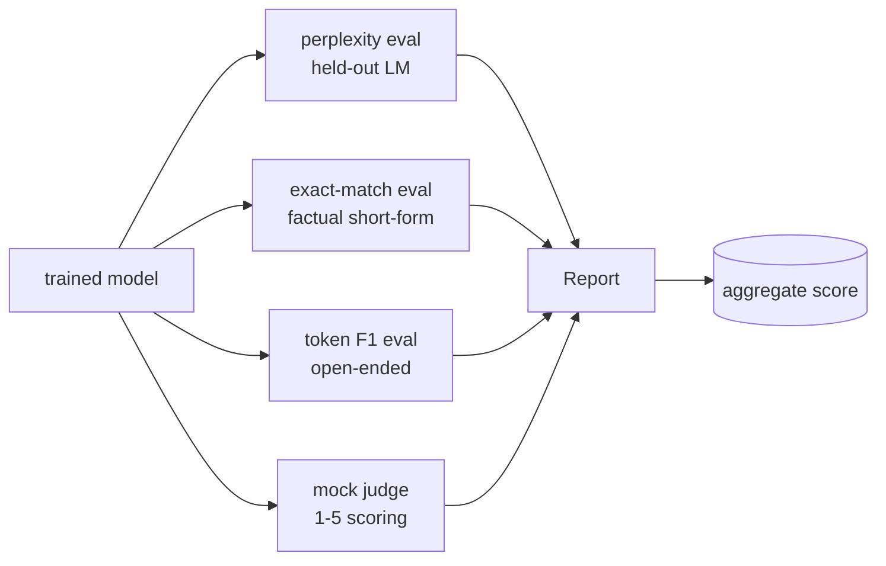
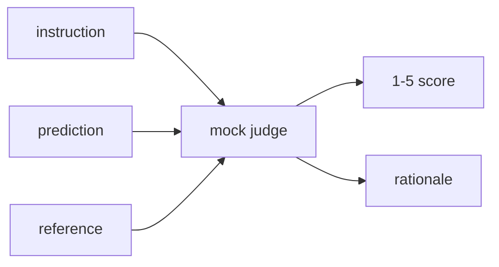
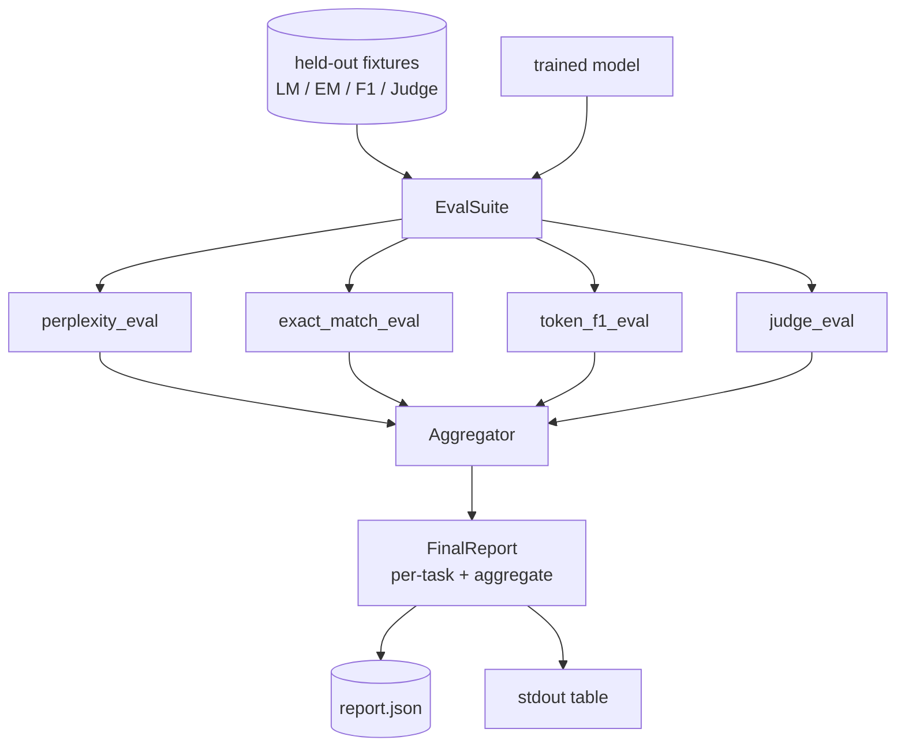

# Capstone Lesson 41: 完整 Evaluation Pipeline

> Training 是你能用 loss curves 监控的部分。Evaluation 是你必须设计的部分。本课构建一个统一 eval pipeline：接收任意 trained language model，在其上运行四种 heterogeneous evals，把结果聚合成 per-task report，并提供一个本地 mock LLM-as-judge，让 loop 不用网络也能运行。四种 evals 覆盖每个待交付模型都需要的维度：language modelling（perplexity）、short-form correctness（exact-match）、open-form similarity（token F1）和 qualitative scoring（judge）。

**类型:** Build
**语言:** Python (torch, numpy)
**先修:** Phase 19 lessons 30-37 (NLP LLM track: tokenizer, embedding table, attention block, transformer body, pre-training loop, checkpointing, generation, perplexity)
**时间:** ~90 minutes

## 学习目标

- 在 tiny transformer 上用 masked-token accounting 计算 held-out perplexity。
- 在 short-form factual prompts 上运行 exact-match eval。
- 通过 normalisation 计算 predicted 和 reference strings 之间的 token-level F1。
- 构建一个本地 mock LLM-as-judge，用 1-5 分为 model outputs 评分。
- 把四种 evals 聚合成一个带 per-task breakdown 的 weighted report。

## 要解决的问题

单一 metric 永远无法描述一个 language model。Perplexity 说明模型拟合 language distribution 的程度，但不说明它是否回答问题。Exact-match 说明模型是否产出 gold string，但会惩罚正确 paraphrases。Token F1 会宽容 paraphrase，却可能被与错误内容的 lexical overlap 欺骗。LLM-as-judge 捕捉 qualitative dimensions，但昂贵且随机。

你真正想要的 pipeline 同时包含四者。每个 eval 覆盖其他 eval 漏掉的一个维度。每个 eval 都运行在为该 metric 形状化的不同 held-out data subset 上。最终 report 会并排展示 per-task numbers 和 aggregate，让 reviewer 一眼看出模型正在做哪些 trade-offs。

本课会在一个文件里端到端构建这条 pipeline。

## 核心概念

每个 eval 都是一个从 `(model, dataset) -> EvalResult` 的函数。Result 携带 metric value、用于 inspection 的 per-example details，以及一个用于 aggregate 的 name。Pipeline 用 config 把它们组合起来，config 说明运行哪些 evals 以及如何加权。

## 正确计数 Perplexity

Perplexity 是 `exp(mean negative log-likelihood per token)`。实现里有两个陷阱：

- Mean 必须在实际 token positions 上计算，而不是在 batch * sequence 上计算。Padding tokens 必须从 denominator 中排除，否则 perplexity 会看起来比实际更好。
- 模型预测 next token，因此 position `i` 的 logits 预测 position `i+1` 的 token。这里的 off-by-one 错误很隐蔽：loss 仍然能训练，但 metric 变得毫无意义。

Eval 会在 non-pad positions 上计算每个 batch 的 `-log p(token)` 总和，以及每个 batch 的 token count，最后再相除。这比平均 per-batch perplexities 数值上更安全（后者会 under-weight short sequences），并且匹配教科书定义。

## 带 normalisation 的 Exact-match

Harness 会在比较前 normalise prediction 和 reference：

- Lowercase。
- Strip surrounding whitespace。
- Collapse internal whitespace runs to a single space。
- 如果两侧只因 punctuation 不同，则 drop trailing terminal punctuation（`.`、`!`、`?`）。

Normalisation 让 exact-match 在实践中可用。模型说 `"Paris"` 是对的；说 `"Paris."` 也是对的；说 `"  paris  "` 也是对的。Metric 仍然要求 normalisation 后答案是同一个 string。

## 正确实现 Token F1

Token F1 是在 bag-of-tokens 上计算的 precision 和 recall 的 harmonic mean。步骤：

1. Normalise prediction 和 reference（与 exact-match 同样规则）。
2. 把二者 split 成 token lists（whitespace tokenisation）。
3. 计算 multiset intersection。
4. Precision = `intersection_count / len(pred_tokens)`。Recall = `intersection_count / len(ref_tokens)`。F1 = harmonic mean。

如果 prediction 和 reference 都为空，F1 是 1（vacuous match）。如果只有一侧为空，F1 是 0。这个模式匹配 SQuAD evaluation reference，并能在 paraphrases 上产生稳定数字。

## 本地 Mock LLM-as-Judge

真实 judge 是 API 后面的 frontier model。本课的 judge 必须离线运行。Mock judge 是一个 deterministic scorer，接收 instruction、model prediction 和 reference，并返回 `{1, 2, 3, 4, 5}` 中的分数和一行 rationale。Scoring rules 是显式的：

- 如果 normalised prediction 等于 normalised reference，给 5。
- 如果 prediction 和 reference 之间的 token F1 至少 0.8，给 4。
- 如果 token F1 在 `[0.5, 0.8)`，给 3。
- 如果 token F1 在 `[0.2, 0.5)`，给 2。
- 否则给 1。

这不是真实 judge，但它有正确 interface。之后只需改一个函数即可换成真实模型。Pipeline 不关心。

## 聚合

Aggregate 是 normalised eval scores 的 weighted mean。每个 eval 都报告自己在 `[0, 1]` 中的数字：

- Perplexity：normalise 为 `1 / (1 + log(perplexity))`。Perplexity 为 1 时映射到 1，infinity 映射到 0。
- Exact-match：已经在 `[0, 1]`。
- Token F1：已经在 `[0, 1]`。
- Judge：除以 5。

Weights 可配置。默认组合是 0.2 perplexity、0.3 exact-match、0.3 token F1、0.2 judge。Weights 的选择是 product decision；本课暴露这个旋钮，让你可以实验。

## 架构

`EvalSuite` 是薄 orchestrator。每个 individual eval 都是一个 free function，接收 `(model, tokenizer, dataset, config)` 并返回 `EvalResult`。`Aggregator` 收集 results 并生成 final report。Demo 打印 table，并写入一份 JSON copy，供 downstream CI ingest。

## 你将构建什么

实现是一个 `main.py` 加 tests。

1. `TinyGPT`：与 lessons 38-40 相同的 decoder-only architecture，内置进来让本课独立。
2. `InstructionTokenizer`：带 INST / RESP / PAD specials 的 byte tokeniser。
3. 四个 fixtures：一个 LM corpus、一个 EM set、一个 F1 set 和一个 judge set。每个二十个 examples，deterministic。
4. `perplexity_eval`：返回带 perplexity value 和 per-token loss histogram 的 `EvalResult`。
5. `exact_match_eval`：返回 mean EM 和 per-example records。
6. `token_f1_eval`：返回 mean token F1 和 per-example records。
7. `mock_judge` 和 `judge_eval`：per-example score 和 rationale，以及全 set 的 mean score。
8. `Aggregator.normalise`：per-eval normalisation rule。
9. `Aggregator.aggregate`：weighted mean 和 assembled report。
10. `run_demo`：短暂训练 tiny model，运行全部四种 evals，打印 report table 并写入 JSON，成功时以 zero 退出。

## 阅读 report

Report 有三层。顶部是 aggregate score。其下是四个 per-eval numbers。再往下是用于 diagnostics 的 per-example breakdowns。失败的 CI run 通常想要 aggregate，但追踪 regression 的 reviewer 想要 per-example breakdown，以便看到模型在哪些 inputs 上出错。

JSON dump 使用 stable keys，因此 CI dashboard 可以跨版本绘制 trend lines。Pretty-printed table 是给训练后盯着 terminal 的人看的。

## 延伸目标

- 添加 calibration eval：模型的 softmax probabilities 是否匹配 accuracy？按 confidence 分桶 predictions，并报告每个 bucket 的 empirical accuracy。
- 添加 robustness eval：给每个 example 标注 perturbation（typo、paraphrase、distractor），并报告每种 perturbation 下的 metric drop。
- 用 HTTP call 后面的真实模型替换 mock judge。Function signature 不变。
- 添加 per-task weight learning：不使用固定 weights，而是把 weights 拟合到 models 的 target preference order。

实现给了你四种 evals、aggregator 和 report。真实 evaluation pipelines 会在其上叠加更多维度；模式保持不变：每个 eval 一个函数，一个 aggregator，一个 report。
