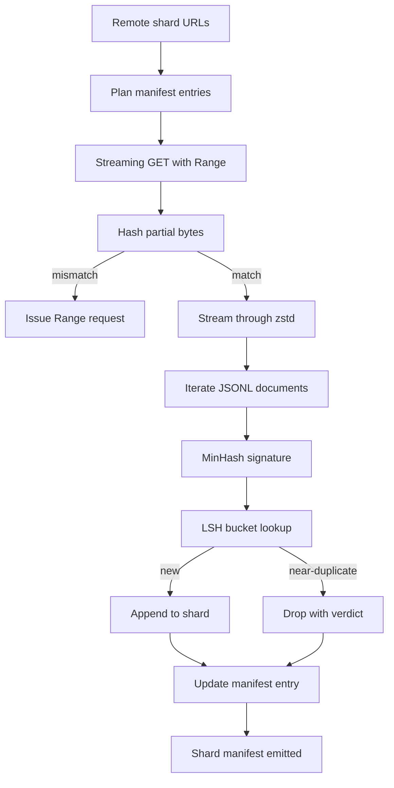

# 大型语料下载器

> 训练语言模型远在第一次前向传播之前就已经开始。语料必须落到磁盘上，完成解压、去重并可寻址，而且在网络于 4% 处断开之前，恢复策略就必须已经设计好。本课构建一个流式下载器：拉取压缩分片，用 Zstandard 边下载边解压，用 MinHash 加局部敏感哈希为近重复内容打指纹，并写出一个后续流水线可以信任的分片 manifest。

**类型:** Build
**语言:** Python
**先修:** Phase 19 lessons 30-37
**时间:** ~90 minutes

## 学习目标

- 使用 `urllib` 流式读取远程分片，并用 `zstandard` 解压，而不把整份文件缓冲进内存。
- 通过对已验证字节偏移发出 HTTP `Range` 请求来恢复部分下载。
- 为每篇文档构建 MinHash signature，并用 LSH 分桶，让近重复文档发生碰撞。
- 产出包含内容哈希、字节大小、文档数和去重判定的分片 manifest。

## 要解决的问题

第一次在 200 GB 语料上训练时，网络在 41% 处断开，脚本带着一个 `urllib` 异常退出。第二次它在 78% 处断开。到 99% 时，你已经把循环重写了三遍。你从第一分钟就必须为两类失败做设计：部分下载恢复，以及重复文档移除。两者都有成熟方案；两者又经常被跳过，因为流水线往往从一行 `requests.get` 开始，然后慢慢长出锋利的牙齿。

恢复是一个 HTTP 问题。服务器必须支持 `Range`，客户端必须用磁盘上的记录跟踪已验证偏移，而这个已验证偏移必须在进程死亡后仍然存在。如果偏移和文件哪怕差一个字节，恢复下载就会写入垃圾，语料会以一种只有到 tokenization 阶段才暴露的方式损坏。

去重是一个 signature 问题。精确哈希去重会漏掉近重复：同一篇 Wikipedia 文章带着三种不同的样板 footer 出现，同一份代码文件换了一个 license header，同一篇博客文章每个链接都带着跟踪参数。MinHash 加 LSH 可以用次线性成本抓住这些重复。成本是每篇文档一个 signature，以及每个 signature 一次桶查找。

## 核心概念



### 使用 `urllib` 流式处理

标准库 `urllib.request.urlopen` 返回一个类文件对象。把它包进 `zstandard.ZstdDecompressor().stream_reader`，字节就会从网络穿过解压器进入文档迭代器，而不必在内存里物化压缩分片或解压后的分片。唯一的内存成本是行缓冲、当前文档的 MinHash signature，以及 LSH index。

### 使用 `Range` 恢复

下载器为每个分片写两个文件：分片本身和一个 `.partial.json` checkpoint。checkpoint 记录 `verified_bytes`、`expected_size`、`sha256_prefix`（对前 `verified_bytes` 个字节计算）以及源 URL。启动时，下载器读取 checkpoint，重新计算磁盘字节上的 `sha256_prefix`，只有重新计算的哈希匹配时才恢复。如果哈希不对，partial 会被丢弃，下载从 byte zero 重启。静默损坏不可能发生，因为已验证字节会被检查，而不是被假设正确。

### MinHash 加 LSH

MinHash 用固定空间估计两个集合的 Jaccard similarity。对一篇文档来说，集合就是文本的 shingles（重叠 n-grams）。signature 是 `k` 个最小哈希值，每个值对应一个独立哈希函数。两篇 Jaccard similarity 为 `s` 的文档，在 signature 任意一个分量上相同的概率为 `s`。

LSH 随后把这 `k` 个分量分成 `b` 个 band，每个 band 有 `r` 行，其中 `k = b * r`。两篇文档至少在一个 band 上碰撞的概率是 `1 - (1 - s^r)^b`，它会在你通过 `(b, r)` 调好的 `s` 附近形成尖锐阈值。典型语料去重阈值是 `s = 0.8`，LSH 研究文献中常用 `k = 128`、`b = 32`、`r = 4` 达到这个区域。

### Shard manifest 是契约

下载器唯一持久输出是 manifest。manifest 对每个分片保存 URL、解压后字节数、文档数、去重后的唯一文档数，以及最终分片文件的 sha256。下游 tokenization 读取 manifest，而不是读取目录列表。如果某个分片缺失，或者 sha256 不对，manifest 会告诉下一阶段拒绝启动。manifest 是“数据已下载”和“数据已下载且可验证”之间的判定边界。

## 动手实现

`code/main.py` 实现：

- `ShardPlanner` - 读取分片 URL 列表并生成计划好的 manifest entries。
- `StreamingDownloader` - 打开带可选 `Range` 的 `urllib` 流，写入临时文件，在每个 chunk 上更新 `.partial.json` checkpoint，并在恢复时验证 sha256 prefix。
- `ZstdDocIterator` - 把类文件流包进 `zstandard.ZstdDecompressor`，并按行 yield 一篇文档。
- `MinHasher` - 使用一组固定 hash seed，为字符串生成 `k` 分量 signature。
- `LSHIndex` - 按 band 对 signature 分桶并报告碰撞。
- `Dedup` - 组合 hasher 和 index，把每篇文档标记为 `keep` 或 `near_duplicate`，并附上匹配的 shard id。
- `ManifestWriter` - 收集每个分片的统计并写出 `manifest.json`。

文件底部的 demo 会在磁盘上构建一个小型合成语料，用 `zstandard` 压缩它，通过 `file://` URL 下载，执行去重，并打印 manifest。

运行：

```bash
python3 code/main.py
```

脚本以 zero 退出并打印 manifest summary。

## 生产模式

有四个模式可以把本课扩展到真实语料。

**先写 checkpoint，再写字节。** `.partial.json` 必须在字节追加到分片之前完成 `fsync`。否则断电会颠倒顺序：磁盘上有分片字节，checkpoint 里没有它们，下一次恢复会以为已验证字节比实际更少，重复追加的 suffix bytes 会损坏文件。先 checkpoint，再写入。这和 write-ahead log 是同一种纪律。

**分片化 LSH index。** 一个覆盖全语料的单一 LSH index 在 200 GB 规模下放不进 RAM。按第一个 band hash 分区 LSH index，把分区存到磁盘上，并且只查询新 signature 会落入的那个分区。成本是每篇文档多一次磁盘读取；收益是 LSH index 不再成为硬性的内存上限。

**立 tombstone，而不是删除。** 被丢弃的重复项会在 manifest 中记录 verdict `near_duplicate`，并记录与它发生碰撞的文档 shard id。删除它们会丢失重复项和保留项之间的链接。tombstone 保留审计轨迹，也让下游 pass 未来可以改变阈值判断。

**manifest 中每个分片有 sha256，manifest 自身也有 sha256。** manifest 本身获得一个内容哈希。下游阶段先验证 manifest hash，再信任每个分片 entry。否则 manifest 就是静默攻击面：能编辑一个文件的攻击者可以损坏整条流水线。

## 实际使用

生产模式：

- **每次 CI 运行都恢复。** CI runner 是临时的。下载器必须假设每次运行都是新磁盘，并从 cache 或 remote 恢复。`--cache-dir` 是一等 flag。
- **在 tokenization 前去重。** Tokenization 很贵。同一篇文档跑两次，就是为同一条 loss curve 付两倍成本。去重在 tokenization 上游，而不是下游。
- **把 manifest 作为 merge gate。** 训练运行从 pinned commit 读取 manifest sha256。新的数据集版本需要新的 manifest commit。代码和数据之间的链接是 git，不是口口相传。

## 交付成果

`outputs/skill-corpus-downloader.md` 在真实项目中会描述哪些 URL 喂给下载器、checkpoint 目录如何布局、去重使用什么 shingle width 和 `(k, b, r)` 三元组，以及 manifest 在版本控制中放在哪里。本课交付这个引擎。

## 练习

1. 添加一个 `--shingle-width` flag，测量宽度 3、5、9 下去重判定如何变化。为选定默认值辩护。
2. 通过嗅探 magic bytes，在 zstd 旁边添加 gzip 支持。下载器不应该要求调用方指定 codec。
3. 添加 `--resume-only` 模式：如果找不到 checkpoint，就拒绝启动全新下载。这在 CI 中很有用，可以防止一次运行意外重新拉取 200 GB。
4. 把 LSH index 移到 shelf 或 sqlite 文件中，并测量它相对内存版本的吞吐。
5. 在启动时添加 manifest sha256 检查。如果磁盘上的 manifest 与 `manifest.lock` 中的 manifest hash 不一致，下载器应 fail closed。

## 关键术语

| Term | What people say | What it actually means |
|------|-----------------|------------------------|
| Shard | “一个文件” | 带有自身 sha256 的语料自包含切片，是恢复和去重的单位 |
| MinHash signature | “指纹” | 集合的 `k` 分量 sketch，其中每个分量是一个独立 hash 在集合上的最小值 |
| LSH band | “桶” | `r` 个 signature 分量组成的一组，用作碰撞检测的单个 bucket key |
| Verified bytes | “恢复偏移” | 磁盘上 sha256 prefix 与 checkpoint 匹配的字节；唯一安全的恢复偏移 |
| Manifest | “索引” | 下载器产物的唯一持久记录，包括内容哈希 |

## 延伸阅读

- [RFC 7233](https://datatracker.ietf.org/doc/html/rfc7233) - HTTP Range requests，也就是恢复协议
- [Zstandard format specification](https://datatracker.ietf.org/doc/html/rfc8478) - 让流式解压安全的 frame format
- [MinHash](https://en.wikipedia.org/wiki/MinHash) - 本课使用的 signature family
- [Locality-sensitive hashing](https://en.wikipedia.org/wiki/Locality-sensitive_hashing) - 去重阈值背后的 banding scheme
- Phase 19 · 43 - 下载器喂给的 HDF5 tokenized corpus
- Phase 19 · 44 - 在语料上训练的 cosine schedule
- Phase 19 · 45 - 消费 schedule 的 AMP loop
