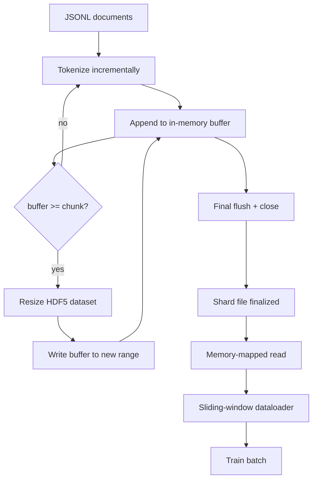

# HDF5 分词语料库

> 下载后的语料必须落在一种训练器能以线速流式读取的布局里。磁盘上的 JSONL 经不起 16 个 dataloader worker。带可调整大小、chunked integer dataset 的 HDF5 可以。本课把流式 tokenization 写入可调整大小的 HDF5 dataset，跨多个文件做分片写入，在训练时做 memory-mapped 读取，并构建一个用正确 packing 规则产出固定长度序列的 sliding-window dataloader。

**类型:** Build
**语言:** Python
**先修:** Phase 19 lessons 30-37
**时间:** ~90 minutes

## 学习目标

- 把文档流式写入具有确定性 chunking 的可调整大小 HDF5 integer dataset。
- 将写入分片到多个 HDF5 文件，让失败范围受限，并让并行成为可能。
- 通过 HDF5 由 page cache 支撑的 chunked layout 读回 token，让 dataloader 只在 batch time 才复制到 batch buffer。
- 实现一个 sliding-window dataloader，用显式 packing 规则产出固定长度训练序列。

## 要解决的问题

现代语言模型训练会让几十个 worker 以每秒数十万 sample 的速度读取 token。磁盘上的 JSONL 在第一次冷 cache page fault 时就会垮掉：JSON parser 很慢，文档边界不可寻址，想 seek 到 “sample 4,217,884” 需要扫描文件。即使是压缩效果不错的 Parquet 也不合适，因为训练器不想要列；它想要一个支持 O(1) random access 的扁平 token stream。

HDF5 合适，是因为它提供 chunked、可调整大小、仅整数的 dataset，并且在读取时对 page cache 友好。训练器请求 `tokens[3,200,000 : 3,200,8192]`，HDF5 会从 page cache 把请求的 hyperslab 复制到新分配的 NumPy array。成本是每个 worker 一个打开的文件句柄，以及一个 chunk 大小的 page-cache footprint；相比解码 JSONL 的成本，这可以忽略。

构建问题在于让写入侧保持诚实。Resizable dataset 很容易被误用：一次写一篇文档，会让 HDF5 文件碎片化到不可用；一次 resize 写入所有文档，进程死亡就会丢掉整个 shard。正确纪律是 buffer-then-extend，buffer size 与 chunk size 匹配，并用 sharded write 把工作负载拆到多个文件中，让崩溃最多损失一个 shard。

## 核心概念



### 正确使用 Resizable HDF5

token dataset 以 `maxshape=(None,)` 和固定 `chunks=(chunk_size,)` 创建。写入通过把 token 缓冲进长度为 `chunk_size` 的 NumPy array 来推进。当 buffer 填满时，dataset 恰好按 `chunk_size` resize，并把 buffer 写入新的 range。到 shard 末尾时，残余 buffer 会写进最后一个 partial range。每次写入都是连续且 chunk-aligned 的，除了最后一次；reader 会根据 shard 的 HDF5 attributes 中记录的 `token_count` 截断它。

### Sharded write

单个 HDF5 文件是单点故障。流水线并行写 shard：来自 Phase 19 lesson 42 的每个 input shard 产出一个 HDF5 output shard。`shards.json` index 对每个 shard 记录文件路径、token count、document count，以及 token 上的 sha256。训练器读取 `shards.json` 计算 global offsets 并验证语料。

### Memory-mapped read

训练时，每个 worker 以 `swmr=True` 模式打开自己负责的 HDF5 文件，并请求 `tokens[start:stop]`。一旦 chunk 变热，HDF5 的 chunk layout 会让这是一次 page-cache-backed read。worker 从不物化整个文件：slice 被复制进 dataloader 的 batch buffer，然后 dataloader 在 batch time 把它复制到 pinned-memory training tensor。热路径在每次 chunk transition 上有一次 syscall；其余都是 RAM access。

### Sliding-window dataloader

dataloader 是唯一知道 training-sequence length 的阶段。它在 global token stream 中选择随机 start index，读取 `window_size + 1` 个 token，并返回 `(input, target) = (tokens[:-1], tokens[1:])`。文档边界不会被强制切断：一个 window 可以跨越两篇文档，中间用显式的 `boundary_token_id` 分隔，让模型学会使用 separator。这是标准 packing 规则；也是初学者容易忘掉的规则，最后得到的语料会变成 8% training boundary token 和 92% natural text。

## 动手实现

`code/main.py` 实现：

- `Tokenizer` - 一个对 demo 足够好的 byte-level deterministic tokenizer。接口是 `encode(text) -> list[int]` 和 `vocab_size`。
- `HDF5ShardWriter` - 打开可调整大小的 integer dataset，把 token 缓冲到 chunk size，以固定 stride resize 并写入，在 close 时把 `token_count` 和 `sha256` 记录为 HDF5 attributes。
- `ShardedTokenizationPipeline` - 迭代 input documents，把它们路由到 writer，并产出 `shards.json` index。
- `MmapTokenStore` - 打开 shard files 做 memory-mapped reads，计算 global offsets，并暴露单一 `get_slice(start, stop)` API。
- `SlidingWindowDataloader` - 从 global stream 选择随机 windows，并 yield `(input_ids, target_ids)` NumPy arrays。

文件底部的 demo 会构建一个很小的内存语料，将其 tokenize 到两个 shard，通过 memory map 打开它们，运行 dataloader 10 个 batch，并打印每个 batch 的 shape 和 checksum。

运行：

```bash
python3 code/main.py
```

脚本以 zero 退出并打印 batch checksums。

## 生产模式

有四个模式可以把本课扩展到真实训练运行。

**Chunk size 等于典型读取量。** 训练器每个 sample 读取 `window_size + 1` 个 token。把 HDF5 chunk 设为 `window_size` 的倍数，读取就会与 page cache 对齐。chunk 不匹配会让吞吐减半，因为每个 sample 都碰到两个 chunk。

**Token count 放在 attributes 中，而不是隐含在 dataset 中。** 因为 chunk size 不一定整除文档边界，dataset 的尾部 slice 可能只填了一部分。把真实 `token_count` 存成 dataset 的 HDF5 attribute，并让 reader 截断到这个值。否则 reader 会越过真实末尾，读到 zero-padded tokens，模型会学着预测 zero。

**带并行验证的 sharded sha256。** 每个 shard 都有 token bytes 上的 sha256。训练器能在训练开始前并行验证所有 shard。错误 sha256 会让运行尽早失败，而不是在第三个 epoch、十六小时之后才失败。

**两侧都用 `swmr=True`，writer 带 `libver="latest"`。** Single-Writer-Multiple-Reader mode 要求 writer 用 `libver="latest"` 打开，先创建所有 dataset，再设置 `file.swmr_mode = True`。之后 writer 必须在每次 resize 后调用 `dataset.flush()`，这样以 `swmr=True` 打开的 reader workers 才能看到一致数据。漏掉 `libver="latest"` 或在结构变更后启用 SWMR，是 “file is locked” 故障的常见来源。

## 实际使用

生产模式：

- **每个 source shard 对应一个 HDF5。** downloader（lesson 42）每个 URL 产出一个 shard；tokenization（本课）每个 source shard 产出一个 HDF5。1:1 mapping 让恢复和部分失败处理变得直接。
- **Boundary token id。** boundary token 是 tokenizer vocab 的一部分，也是 dataloader 注入的唯一 token。如果模型应该忽略它，training loss 会 mask boundary token；否则模型会学会把它当作 sequence separator。
- **以 `shards.json` 作为事实来源。** 添加新 shard 意味着写 HDF5、计算 sha256、追加 entry。训练器启动时读取一次这个文件，之后完全不碰目录列表。

## 交付成果

`outputs/skill-hdf5-tokenized-corpus.md` 在真实项目中会描述哪个 tokenizer 喂给流水线、什么 chunk size 匹配训练器 window、`shards.json` 在版本控制中放在哪里，以及 dataloader workers 如何跨文件分片。本课交付这个引擎。

## 练习

1. 给 HDF5 writer 添加 `--compression gzip` flag，并在 demo 语料上测量吞吐成本。为选定默认值辩护。
2. 给 sliding-window dataloader 添加 deterministic seed，并验证相同 seed 的两次运行产出完全相同的 batch。
3. 添加 `--validate` 模式：读取每个 shard，重新计算其 token 上的 sha256，并与 `shards.json` 对比。CI 应在训练开始前运行它。
4. 比较 chunk size 等于、等于一半、等于两倍 window size 时的 dataloader 吞吐。报告 page-cache effect。
5. 添加 `--max-document-tokens` flag，在写入时截断很长的文档。为这个方案相对读取时再决定的 trade-off 辩护。

## 关键术语

| Term | What people say | What it actually means |
|------|-----------------|------------------------|
| Resizable dataset | “Append-only” | 具有 `maxshape=(None,)` 的 HDF5 dataset，通过按 chunk 大小 stride 的 `resize` 调用增长 |
| Chunked layout | “HDF5 如何存储它” | 固定大小的磁盘页，kernel 可以 memory-map，dataloader 可以连续读取 |
| `swmr` mode | “边写边读” | Single-Writer-Multiple-Reader mode，让 dataloader workers 安全共享文件 |
| Shard index | “shards.json” | 所有 token shards 的持久 index，包含 offsets 和 content hashes |
| Sliding window | “Training sample” | global token stream 中的固定长度 slice，训练器把它与 shift-by-one target 配对 |

## 延伸阅读

- [HDF5 chunking documentation](https://docs.hdfgroup.org/hdf5/v1_14/) - 本课使用的 chunked、resizable dataset layout
- [h5py user guide](https://docs.h5py.org/en/stable/) - HDF5 的 Python bindings
- [NumPy memory mapping](https://numpy.org/doc/stable/reference/generated/numpy.memmap.html) - HDF5 通过 h5py 暴露的读取侧 primitive
- Phase 19 · 42 - 本课 tokenizes 的 downloader 输出
- Phase 19 · 44 - 消费这个 dataloader 的 cosine schedule
- Phase 19 · 45 - 包装 training step 的 AMP loop
