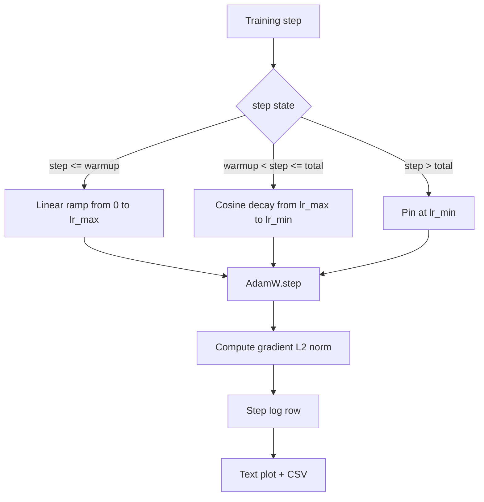

# 带线性 Warmup 的 Cosine LR

> 除了 loss function，learning-rate schedule 是第二重要的决定。带 cosine decay 和 linear warmup 的 AdamW 是现代语言模型训练的默认选择，因为它让模型在脆弱的前一千次 update 中看到较小的有效 step size，逐步升到配置的 peak，再平滑衰减回接近 zero。本课构建这个 schedule，绘制随 training steps 变化的曲线，把 gradient norms 与 schedule 一起记录，并证明该 schedule 遵守 warmup、peak 和 decay 边界。

**类型:** Build
**语言:** Python
**先修:** Phase 19 lessons 30-37
**时间:** ~90 minutes

## 学习目标

- 实现一个接入 cosine learning-rate schedule 和 linear warmup 的 AdamW optimizer。
- 在任意 step 计算 schedule 的精确值，避免跨运行的 floating-point drift。
- 将 gradient L2 norm 与 learning rate 并排记录，让 training health 可观测。
- 把 schedule 渲染成肉眼可读的 text plot，以及任何工具都能消费的 CSV。

## 要解决的问题

训练的前一千次 update 最吵。模型权重仍接近初始化。optimizer 的 running second-moment estimate 尚未稳定。gradient norm 又大又噪。如果这些 update 期间 learning rate 已处于 peak，模型要么直接发散，要么落进一个再也逃不出的 loss plateau。两个成熟修复是 gradient clipping（Phase 19 lesson 45 的主题），以及一个从小开始再逐步升高的 learning-rate schedule。

cosine-with-warmup schedule 有三个区域。从 step zero 到 `warmup_steps`，learning rate 从 zero 线性扩展到配置的 peak `lr_max`。从 `warmup_steps` 到 `total_steps`，learning rate 沿 cosine 曲线上半部分从 `lr_max` 衰减到 `lr_min`。在 `total_steps` 之后，learning rate 固定在 `lr_min`，这样配置错误而 overshoot 的训练器不会静默离开 schedule。

构建问题在于 schedule 很容易产生 off by one 错误。off-by-one 会在训练六小时后表现为：模型开始过拟合的那一刻，learning rate 高出或低出 1%。除非在边界处做穷尽测试，否则它是不可见的。

## 核心概念



### Warmup 公式

当 `step` 位于 `[0, warmup_steps]` 且 `warmup_steps > 0` 时，learning rate 为 `lr_max * step / warmup_steps`。退化的 `warmup_steps = 0` case 被视为 “no warmup”：schedule 在 step zero 直接从 `lr_max` 开始，并立即进入 cosine decay。一些 test harness 会传入 `warmup_steps = 0`，检查 schedule 仍能产出可用曲线。

### Cosine 公式

当 `step` 位于 `(warmup_steps, total_steps]` 时，learning rate 为 `lr_min + 0.5 * (lr_max - lr_min) * (1 + cos(pi * progress))`，其中 `progress = (step - warmup_steps) / max(1, total_steps - warmup_steps)`。在 `step = warmup_steps` 时，cosine 计算为 `cos(0) = 1`，得到 `lr_max`，与 warmup endpoint 精确匹配。在 `step = total_steps` 时，cosine 计算为 `cos(pi) = -1`，得到 `lr_min`，与 decay endpoint 精确匹配。

两个 endpoint 上的连续性不是偶然。这正是 schedule 被实现为一个覆盖 `step` 的单一函数，而不是三个拼接函数的原因。拼接出来的 schedule 在第一次修改 `lr_max` 时就会丢掉一个边界。

### total steps 之后的 floor

当 `step > total_steps` 时，learning rate 保持在 `lr_min`。契约是明确的：schedule 不报错，也不外推；它固定在 floor，并让 trainer 记录 warning。需要延长训练的 trainer 会改变 schedule 的 `total_steps`，而不是改变 loop。

### 把 gradient norm 与 rate 一起记录

schedule 是 training health 的一半。gradient norm 是另一半。training loop 每个 step 同时记录二者。发散的训练运行会在 loss 之前先出现 gradient norm spike；调得好的 warmup 会让 norm 随 rate 线性上升；过激的 peak 会表现为 warmup 后 norm 持续偏高。磁盘上的数据集是 `step, lr, grad_l2_norm, loss`。CSV 是唯一持久记录。

## 动手实现

`code/main.py` 实现：

- `CosineWithWarmup` - 一个 stateless function `lr(step) -> float`，覆盖配置好的 schedule。
- `TrainState` - 把 model、`AdamW` optimizer 和 schedule 包装进单个 step function。
- `TrainState.step` - 运行一次 forward pass、一次 backward pass，记录 gradient L2 norm，并把 `lr(step)` 应用到 optimizer。
- `plot_schedule_ascii` - 将 schedule 渲染为肉眼可读的 text plot。
- `write_schedule_csv` - 以每个 step 一行产出 learning rate。

文件底部的 demo 构建一个很小的 `nn.Linear` model，在固定 input batch 上训练 20 steps，并打印每个 step 的 learning rate、gradient norm 和 loss。schedule 也会渲染为 text plot，用于视觉 sanity check。

运行：

```bash
python3 code/main.py
```

脚本以 zero 退出，并打印逐 step training log 和 schedule plot。

## 生产模式

有四个模式能把 schedule 提升为生产 artifact。

**Schedule 存在 config 中，而不是 code 中。** trainer 从提交到 git 的 YAML 或 JSON config 读取 `warmup_steps`、`total_steps`、`lr_max`、`lr_min`。schedule 可复现，因为 config 是 content-addressed；schedule 可审计，因为 config 是 PR diff 的一部分。

**Step counter 是 monotonic，并与 epoch 解耦。** 当 dataset 被 sharded 或 dataloader 重启时，一些框架会混淆 step 和 epoch。schedule 从 trainer 的 checkpoint 读取 `global_step`，而不是从局部 counter 读取。恢复运行会继续处于正确的 schedule 位置，因为 step counter 是持久轴。

**Schedule plot 放在 run directory。** 每次训练运行都把 `outputs/lr_schedule.png`（本课中是 text plot）写进它的 run directory。reviewer 浏览目录时无需重跑任何东西，就能 sanity-check schedule。这会在 PR 阶段抓住配置错误的 schedule 类 bug。

**Log row schema 固定。** `step, lr, grad_l2_norm, loss`，顺序不变。下游 notebook 或 dashboard 读取这个 schema；不 bump version 就重命名列，会让所有现有 dashboard 失效。

## 实际使用

生产模式：

- **先 sweep peak，再 sweep 任何其他东西。** `lr_max` 是最敏感的 knob。先在小模型上 sweep；最佳 `lr_max` 随模型规模变化很弱，所以小模型 sweep 是强 prior。
- **Warmup 是 total steps 的比例，而不是绝对数量。** 一个 200-million-step run 用 2,000 warmup steps，几乎立刻就到 peak；一个 20,000-step run 用同样数量，则 warmup 占 10%。把 warmup 配成比例（典型：1-3 percent），让 schedule 随训练时长缩放。
- **`lr_min` 有意不为 zero。** 相当于 `lr_max` 10 percent 的 floor 会让 optimizer 在长尾阶段继续学习。`lr_min = 0` 的 schedule 会产出一条图上很好看的训练曲线，以及一个其实还没完成训练的模型。

## 交付成果

`outputs/skill-cosine-warmup.md` 在真实项目中会描述哪个 config 承载 schedule、global counter 从 trainer 的哪个 step 读取，以及什么 `lr_max` sweep 产出了部署值。本课交付这个引擎。

## 练习

1. 添加一个 inverse-square-root 版本的 schedule，并在 200-step toy training run 上比较它。哪条曲线产出更低的 final loss？
2. 添加一个 `--restart` flag，在 `total_steps / 2` 处加入第二个 warmup。为 warm restarts 在 toy run 上是改善还是伤害辩护。
3. 添加一个 unit test 来证明 schedule 连续：对 `[0, total_steps]` 中的每个 step，差值 `|lr(step+1) - lr(step)|` 都被 `lr_max / warmup_steps` 约束。
4. 把 schedule 接入 `torch.optim.lr_scheduler.LambdaLR`，让它能与 framework code 组合。本课使用 plain step function；wrapper 改变了什么？
5. 添加一个 `--plot-png` flag，通过 `matplotlib` 写出真实 plot。为本课 text plot 和 PNG 哪一个更适合 CI run 的默认值辩护。

## 关键术语

| Term | What people say | What it actually means |
|------|-----------------|------------------------|
| Warmup | “慢启动” | 在前 `warmup_steps` 次 update 中，从 zero 到 `lr_max` 的线性 ramp |
| Cosine decay | “平滑下降” | 在剩余 steps 上，从 `lr_max` 到 `lr_min` 的上半段 cosine 曲线 |
| Floor | “训练之后” | 超过 `total_steps` 后，schedule 固定的 `lr_min` 值 |
| Gradient norm | “grads 的 L2” | 拼接后的 gradient vector 的 Euclidean norm，每个 step 记录 |
| Global step | “Schedule axis” | 一个能跨重启存活、驱动 schedule 的 monotonic step counter |

## 延伸阅读

- [Loshchilov and Hutter, SGDR: Stochastic Gradient Descent with Warm Restarts (arXiv 1608.03983)](https://arxiv.org/abs/1608.03983) - cosine schedule 的 reference paper
- [Loshchilov and Hutter, Decoupled Weight Decay Regularization (arXiv 1711.05101)](https://arxiv.org/abs/1711.05101) - AdamW 的 reference paper
- [PyTorch torch.optim.lr_scheduler](https://docs.pytorch.org/docs/stable/optim.html#how-to-adjust-learning-rate) - step functions 如何与 framework schedulers 组合
- Phase 19 · 42 - 这个 schedule 消费的 downloader 语料
- Phase 19 · 43 - 与 schedule 共同演进的 dataloader
- Phase 19 · 45 - gradient clipping and AMP，loop 中的下一层
