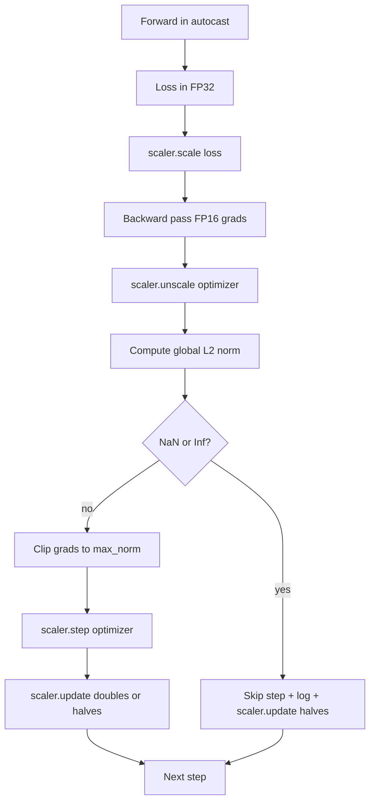

# 梯度裁剪与混合精度

> 上一课的 optimizer 和 schedule 假设 gradients 是正常的。它们通常不是。一个坏 batch 就能让 gradient norm 暴涨三个数量级。Mixed-precision training 还会在 loss 侧引入 FP16 overflow，放大这个问题。本课构建生产训练离不开的两条安全带：把 gradient clipping 到配置好的 global L2 norm，以及一个带 autocast 和 GradScaler 的 mixed-precision loop，用来检测 NaN 和 Inf、干净地跳过 step，并记录 scaling factor 供取证。

**类型:** Build
**语言:** Python
**先修:** Phase 19 lessons 30-37
**时间:** ~90 minutes

## 学习目标

- 在所有 parameter gradients 上计算 global L2 norm，并在超过配置阈值时原地 clip。
- 用 autocast 加 GradScaler 包装 training step，让 FP16 forward 和 backward pass 能经受 overflow。
- 在 loss 或 gradient 中检测 NaN 和 Inf，跳过 optimizer step，并记录 skip。
- 每个 step 报告 GradScaler 的 scaling factor，让长串 skips 立刻可见。

## 要解决的问题

昨天还干净运行的训练，今天在 step 8,217 处 loss curve 垂直上升。罪魁祸首是一个 batch，它的 gradient norm 是 4,200，是此前峰值的二十倍。没有 clipping，optimizer 会应用一个 step，把模型过去一小时学到的东西全部重置。使用 norm 1.0 的 global L2 clip，同一个 batch 只贡献 unit-norm update；loss 保持在趋势线上；运行活下来。

Mixed-precision training 通过在 FP16 中计算 forward pass 和大部分 backward pass，把吞吐推高 2-3x。代价是 FP16 的 exponent range 很窄。典型 gradient 在 FP16 中 overflow 后会变成 Inf，随后通过后续层传播成 NaN，并在下一次 optimizer step 中把每个 weight 设成 NaN。PyTorch 的 GradScaler 通过在 backward pass 前把 loss 乘以一个大的 scaling factor，并在 optimizer step 前把 gradients 除以同一个 factor 来解决这个问题。如果 unscale 时任何 gradient 是 Inf 或 NaN，scaler 会跳过 step 并把 scaling factor 减半；如果此前 N 个 step 都干净，scaler 会把 factor 加倍。训练过程中，factor 会找到 FP16 range 允许的最高值。

构建问题在于正确接线。clip before unscale 时，threshold 作用在 scaled gradients 上；clip after unscale 时，GradScaler 的操作顺序很重要。正确顺序是：`scaler.scale(loss).backward()`，然后 `scaler.unscale_(optimizer)`，然后 `clip_grad_norm_`，然后 `scaler.step(optimizer)`，最后 `scaler.update()`。任何其他顺序都会产出静默损坏的 loop。

## 核心概念



### Global L2 norm

global L2 norm 是拼接后的 gradient vector 的 Euclidean norm，而不是每个 parameter 单独的 norm。PyTorch 用 `torch.nn.utils.clip_grad_norm_(parameters, max_norm)` 实现它。这个函数返回 pre-clip norm，所以本课可以同时记录自然值和 clipped value，这对诊断“我们每一步都在 clipping”是必要的。

### autocast 和 GradScaler

`torch.amp.autocast(device_type)` 是一个 context manager，会选择性地用 FP16 运行 eligible operations（大多数 matmul 类操作）。`torch.amp.GradScaler(device_type)` 是一个 helper，会在 backward 前 scale loss，并在 optimizer step 前 inverse-scale gradients。二者被设计为一起使用；只用其中一个是 test 应该抓住的配置错误。

本课使用 CPU autocast，因为 CI 能运行它；同样模式只需把 `device_type="cpu"` 改成 `device_type="cuda"` 就能原样迁移到 CUDA。CPU 上的 GradScaler 是 stub（CPU autocast 默认已经使用 BF16，不需要 loss scaling），但本课包含调用点，让接线与 GPU loop 完全一致。

### NaN 和 Inf 检测

检测发生在两个位置。第一，backward 前用 `torch.isfinite` 检查 loss 本身；Inf 或 NaN loss 不会产出有用 gradients，会在进入 optimizer 前被跳过。第二，在 `scaler.unscale_(optimizer)` 后，本课用 `has_non_finite_grad(...)` 扫描 unscaled gradients，并把任何 Inf 或 NaN 视为 skip。两次检查一起覆盖 forward-pass 和 backward-pass 两种失败模式。

### Scaling factor diagnostics

scaling factor 是 GradScaler 的内部状态。本课每个 step 读取 `scaler.get_scale()`，并把它与 learning rate 和 gradient norm 放在一起记录。健康运行会显示 scaling factor 按二的幂上升，直到接近 `2^17` 或 `2^18` 饱和。异常运行会显示 factor 在高低值之间振荡，这说明模型 gradients 有时在范围内、有时不在。没有 logging，这个诊断不可见。

## 动手实现

`code/main.py` 实现：

- `clip_global_l2_norm` - 对 `torch.nn.utils.clip_grad_norm_` 的 wrapper，返回 pre-clip 和 post-clip norm。
- `has_non_finite_grad` - 扫描 gradients 中 NaN 和 Inf 的 helper。
- `AmpTrainState` - 包装 model、`AdamW` optimizer、GradScaler 和 autocast device。暴露 `step(inputs, targets)`，运行完整的 clipping、scaling 和 skip-on-NaN pipeline。
- `StepLog` 和 `SkipLog` - 结构化的 per-step records。
- 一个 demo：训练小型 `nn.Linear` model 20 steps，在 step 5 向 gradient 注入 Inf 以触发 skip path，并打印结果 log。

运行：

```bash
python3 code/main.py
```

脚本以 zero 退出，并打印每行标记为 `STEP` 或 `SKIP` 的 per-step log；至少有一行是 `SKIP`。

## 生产模式

有四个模式把这个 loop 提升为生产 training step。

**Skip counter 是 alert，而不是 log line。** 每次训练运行有少量 skipped steps 是健康的。每个 epoch 有数百次 skip 则是硬 alert：模型处在 FP16 无法承载的状态，loop 正在静默失败。本课跟踪 1,000-step rolling skip rate；生产中会在 rate 超过 5 percent 时 page。

**Clip threshold 存在 config 中。** `max_norm = 1.0` 是语言模型训练的现代默认值。先在小模型上 sweep；更大的 threshold 允许模型从真正困难的 batch 中恢复；更小的 threshold 约束最坏情况，代价是更噪的 loss curve。threshold 应该放在与 lesson 44 的 schedule 相同的 YAML 或 JSON config 中。

**Norm log 与 schedule 一起写到 CSV。** CSV columns 是 `step, lr, grad_l2_pre_clip, grad_l2_post_clip, loss, skipped, skip_reason, scaler_scale`。reviewer 打开文件时能在同一行看到 schedule、gradient story、scaling factor 和 skip outcome（含 reason）。把这些列拆到多个文件里会制造错位分析。

**即使 skip，`scaler.update()` 也每步运行。** 干净 step 上，scaler 读取 no-inf counter、递增它，并可能加倍 factor。skipped step 上，scaler 减半 factor 并重置 counter。忘记在 skip path 调 `update()`，就是产生“scaling factor 从未改变”的 bug。

## 实际使用

生产模式：

- **Autocast device 匹配 optimizer device。** GPU 训练用 `torch.amp.autocast(device_type="cuda")`；CPU 用 `torch.amp.autocast(device_type="cpu")`。混用 device 会产生静默 type error，表面看 loss curve 正常，但模型没有学习。
- **Backward 前检查 loss。** `torch.isfinite(loss).all()` 是一次 tensor reduction；成本可以忽略，而遇到 NaN loss 时节省的是整个 training step。永远运行它。
- **`zero_grad` 中使用 `set_to_none=True`。** 把 gradients 设为 `None` 而不是 zero，让 optimizer 可以跳过不受影响 parameter groups 的计算。这个设置是免费的吞吐提升，也略微降低 bug 表面积。

## 交付成果

`outputs/skill-clip-amp.md` 在真实项目中会描述 training step 使用什么 clip threshold 和 autocast device、per-step CSV 在版本控制中放在哪里，以及生产 skip-rate alert threshold 是多少。本课交付这个引擎。

## 练习

1. 用真实 loss spike（把某个 batch 的 target 乘以 1e8）替换合成的 Inf 注入，并验证 skip path 触发。
2. 添加 `--bf16` mode，把 autocast 切到 BF16 而不是 FP16。BF16 的 exponent range 比 FP16 更宽，几乎不需要 loss scaling；验证同一 demo 上 skip rate 降为 zero。
3. 添加 unit test：当没有发生 clipping 时，gradient-clip wrapper 正确返回 pre-clip 和 post-clip norm。
4. 添加 rolling-window skip-rate 计算，以及一个 CLI flag：如果 rate 在连续 100 steps 中超过配置阈值，就让运行失败。
5. 把 loop 接线到 canonical CSV（`step, lr, grad_l2_pre_clip, grad_l2_post_clip, loss, skipped, skip_reason, scaler_scale`），并通过每行后 flush 确认文件能经受 Ctrl-C。

## 关键术语

| Term | What people say | What it actually means |
|------|-----------------|------------------------|
| Global L2 norm | “Clip target” | 跨所有可训练参数拼接后的 gradient vector 的 Euclidean norm |
| autocast | “Mixed precision” | 在 `with` block 内选择性以 FP16（或 BF16）执行 eligible operations |
| GradScaler | “Loss scaler” | 在 backward 前乘大 loss，并在 optimizer step 前 inverse-scale gradients 的 helper |
| Skip | “Bad step” | 因为 gradient 或 loss 非有限而拒绝执行的 optimizer step；scaler 会减半 factor |
| Scaling factor | “Scaler state” | GradScaler 当前 multiplier；干净区间后加倍，每次 skip 后减半 |

## 延伸阅读

- [Micikevicius et al., Mixed Precision Training (arXiv 1710.03740)](https://arxiv.org/abs/1710.03740) - 原始 loss-scaling proposal
- [Pascanu, Mikolov, Bengio, On the difficulty of training recurrent neural networks (arXiv 1211.5063)](https://arxiv.org/abs/1211.5063) - gradient-clipping reference paper
- [PyTorch torch.amp.GradScaler](https://docs.pytorch.org/docs/stable/amp.html) - 本课包装的 scaler API
- [PyTorch torch.nn.utils.clip_grad_norm_](https://docs.pytorch.org/docs/stable/generated/torch.nn.utils.clip_grad_norm_.html) - 本课使用的 clipping primitive
- Phase 19 · 42 - 喂给 loop 的 downloader 语料
- Phase 19 · 43 - loop 消费的 dataloader
- Phase 19 · 44 - 这个 loop 组合的 schedule
