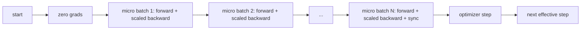
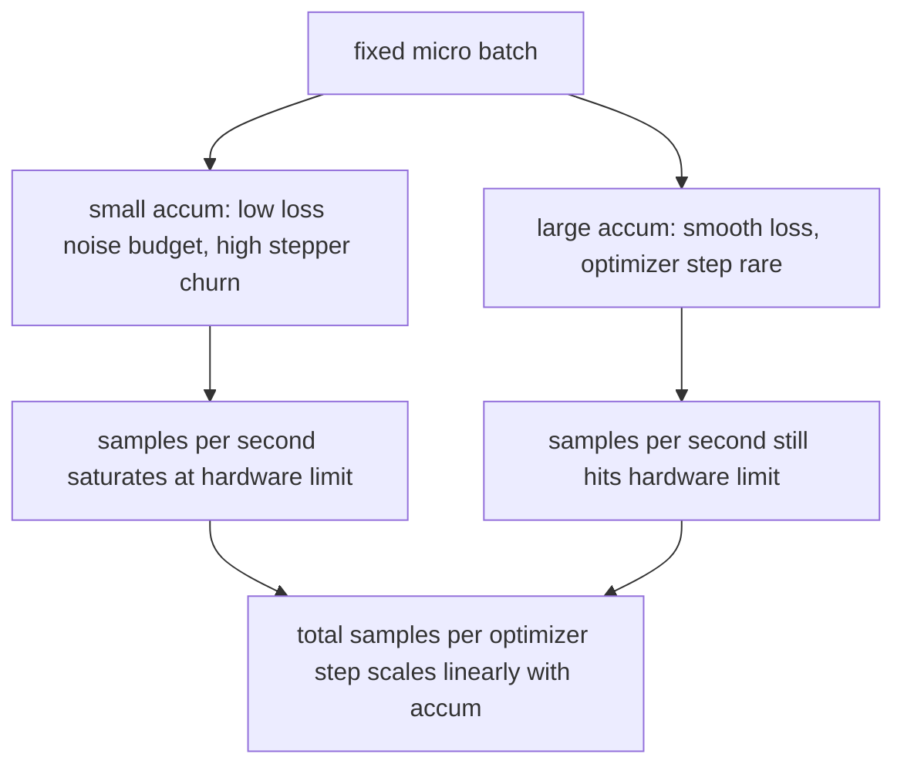

# 梯度累积

> 用你负担不起的 effective batch 训练，一次只跑一个 micro-batch。scale loss，暂缓 optimizer step，让 gradients 堆积起来。

**类型:** Build
**语言:** Python
**先修:** Phase 19 lessons 42 to 45
**时间:** ~90 minutes

## 学习目标

- 推导 effective batch 恒等式：`effective_batch = micro_batch * accum_steps`。
- 实现 per-micro-batch loss scaling，让 accumulated gradient 匹配单次 full-batch backward。
- 在最后一个 micro-batch 前跳过 optimizer synchronization（sync-on-last-step）。
- 读取 throughput against effective batch curve，并解释 diminishing return。

## 要解决的问题

你想用 512 的 effective batch 训练，因为 loss curve 更平滑，optimizer step 在这个规模上更合理。桌上的 accelerator 在 32 个 examples 后就会内存耗尽。batch 加倍不可能。model 减半也不可能。2017 年这个领域抓住并一直沿用的技巧是：运行 16 次 backward pass，让 gradients 在 parameter buffers 中累积，只在计数达到目标时才 step optimizer。

风险在于 loss 不再是大 batch 时的同一个数字。16 个 mini-batches 的 cross entropy 如果朴素相加，会是一次 full batch loss 的 16 倍。没有 scaling，gradient direction 是对的，但 magnitude 错了，optimizer step 会大 16 倍。修复只是一除。这个修复也很容易忘。

## 核心概念



契约很短：

- 每个 micro-batch 的 loss 在 `backward()` 前除以 `accum_steps`。PyTorch 默认会把 gradients 累加进 `param.grad`；这个除法把 running sum 拉回正确尺度。
- optimizer step 只在每个 effective batch 后触发，也就是最后一个 micro-batch 的 backward 之后。中途 step 会扭曲此后整个运行依赖的每个 parameter。
- optimizer 的 state（momentum buffers、Adam moments）每个 effective step 前进一次，而不是每个 micro-batch 前进一次。否则 exponential moving averages 会看到错误频率，并过早消耗 schedule。
- 在单设备上，这只是 bookkeeping。在 multi-rank cluster 上，同样模式会把非最终 micro-batches 包进 `no_sync` context，跳过 gradient all-reduce；最后一个 micro-batch 一次性 reduce 完整 accumulated gradient，而不是支付 N 次网络成本。

### 代码中的等价性证明

```python
loss = criterion(model(x_full), y_full)
loss.backward()
opt.step()
```

等价于

```python
for x, y in chunks(x_full, y_full, n):
    scaled = criterion(model(x), y) / n
    scaled.backward()
opt.step()
```

除了 floating point summation order。loop 结束时 accumulated gradient buffer 与单次 full-batch backward 会产生的 tensor 相同。lesson code 在 `equivalence_check` 中用低于 1e-4 的 max-abs difference 断言这一点。

### 成本去了哪里

每个 micro-batch 都要一次 forward 和一次 backward。使用 accumulation 时，你用时间换内存。`outputs/accum-curve.json` 中的 throughput curve 展示了在固定 micro-batch 下 effective batch 增大时发生什么：



没有免费午餐。`accum_steps` 翻倍，optimizer step 的 wall time 也翻倍。变化的是 gradient estimate 的方差：在同样 wall budget 下，你做了更少 optimizer steps，但每一步平均了更多 samples。文献会把 large batch 和 small batch 当成不同优化问题；本课关注的是机械机制，而不是统计性质。

## 动手实现

`code/main.py` 是可运行 artifact。它做三件事。

### Step 1: equivalence check

`equivalence_check()` 用相同 seed 构建同一个 network 的两份拷贝。一份在一次 forward pass 中看到 16-sample batch。另一份看到四个 4-sample chunks，并把 loss 除以四。函数会在 optimizer step 前比较 gradient buffers，并在 step 后比较 parameters。断言是 `max_abs_diff < 1e-4`。

### Step 2: sync-on-last-step pattern

`train_one_optimizer_step` 遍历 micro-batches。除了最后一个以外，每个 micro-batch 都进入 `no_sync_context(model)`。在单进程中，这个 context 是 no-op；在 DDP 中，这就是跳过 gradient all-reduce 的位置。不管如何，bookkeeping 相同。`sync_counter` 记录我们离开 no_sync scope 的次数；对 N 个 micro-batches 来说，每个 effective step 的 count 是一次，而不是 N 次。

### Step 3: throughput curve

`sweep_effective_batches` 用固定 micro-batch 和一组 accumulation steps 运行同一个 model。每个设置都记录：

- `samples_per_sec`: 已见 total samples 除以 wall time
- `median_step_ms`: 每个 effective step 的 50th percentile
- `sync_calls`: 已触发的 collective points
- `avg_loss`: sweep 的 optimizer steps 上的平均值

输出落在 `outputs/accum-curve.json`，并且可从 notebook 复用。

运行：

```bash
python3 code/main.py
```

脚本先打印 equivalence diff，再打印 sweep table，然后打印 JSON path。Exit code zero。

## 实际使用

在生产训练中，gradient accumulation 藏在一个 knob 后面。PyTorch 的模式是 `accumulation_steps = effective_batch // (micro_batch * world_size)`。这里不允许使用的框架会包装同一个 loop，但步骤相同：scale loss，在非最终 micros 跳过 sync，accumulate，一次 step。

野外常见三个模式：

- micro-batch size 被选到能 saturate device memory。更小会浪费 accelerator cycles。更大会崩溃。
- effective batch 由 learning rate schedule 选择。大 effective batch 需要 scaled learning rates 和 warmup；这就是 2017 年以来一直被讨论的 linear scaling rule。
- accumulation count 是二者之间的桥，也是你唯一能在 runtime 自由调节、而不用重写 data loader 的 knob。

## 交付成果

`outputs/skill-gradient-accumulation.md` 捕获这份 recipe，让同伴能把它丢进新 repo：按 `accum_steps` scale loss，在非最终 micros 跳过 optimizer sync，每个 effective batch 只 step optimizer 一次，把 throughput against effective batch 记录成 JSON，让 trade-off 可见。

## 练习

1. 用 `--num-steps 100` 重新跑 sweep，并绘制 samples per second against effective batch。曲线在哪里变平？
2. 添加一个错误 scaling 版本（不除），展示 step 1 时相对 reference 的 parameter diff。
3. 把 SGD 换成 AdamW，并确认 optimizer state 每个 effective step 前进一次，而不是每个 micro-batch 一次。
4. 引入真实 `DistributedDataParallel` wrapper，并把 `no_sync_context` 路由到它的方法。确认每个 effective batch 的 sync_calls 降低 N-1。
5. 修改 equivalence check，比较两种不同 micro splits（2 by 8 vs 4 by 4），并解释你需要放宽的任何 tolerance。

## 关键术语

| Term | What people say | What it actually means |
|------|-----------------|------------------------|
| Micro batch | 你 forward 的 batch | 单次 forward pass 能放进内存的 slice |
| Accum steps | 每个 step 的 backward passes | 在一次 optimizer step 前累加的 backwards 数量 |
| Effective batch | “那个 batch” | Micro batch 乘以 accum steps 再乘以 data parallel world size |
| Loss scaling | 除以 N | per-micro-batch division，让 summed gradients 匹配 full batch |
| Sync on last | 跳过其余 | 只在 window 中最后一个 backward 上运行 gradient collective |

## 延伸阅读

- PyTorch docs on `DistributedDataParallel.no_sync`，用于 sync-on-last-step trick 的生产版本。
- Goyal et al., 2017，关于 large batch training 的 linear scaling，是关心 effective batch 的 canonical reason。
- PyTorch issue tracker，关于 gradient accumulation 与 mixed precision unscaling 的交互。
- Phase 19 lessons 42 to 45 覆盖本课假设的 model、data loader、optimizer 和 trainer scaffolding。
- Phase 19 lesson 47 覆盖 checkpoint and resume，让长时间 accumulation run 能经受 wallclock cap。
