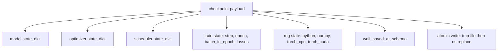
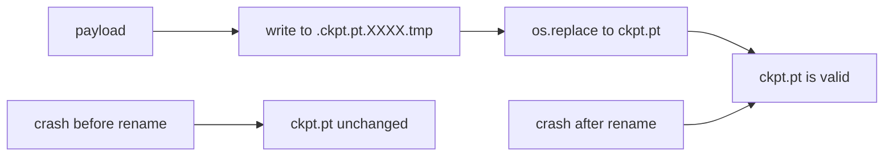
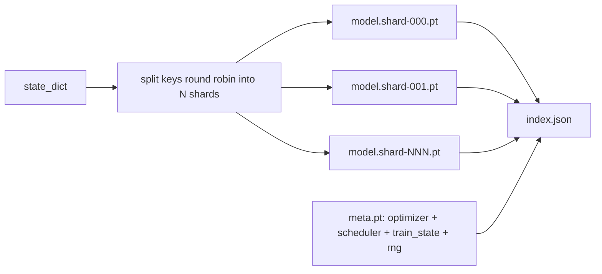

# Checkpoint Save and Resume

> 训练中断会杀死运行；checkpoints 让它们继续。原子地保存 model、optimizer、scheduler、loss history、step counter 和 RNG state，这样任何时刻被 kill，磁盘上都留下一个有效文件。

**类型:** Build
**语言:** Python
**先修:** Phase 19 lessons 42 to 45
**时间:** ~90 minutes

## 学习目标

- 把完整 training state 捕获到单个 payload 中，并能重载到一个全新进程。
- 实现 atomic save：先写临时文件再 rename，保证崩溃永远不会留下半写入文件。
- 恢复 Python、NumPy 和 PyTorch 的 RNG state，让 resume 后的 loss 匹配未中断 baseline。
- 为大到放不进单个文件的模型构建 sharded checkpoint layout，包含 hash-verified shards 和 JSON index。

## 要解决的问题

你设置了一个 18 小时的训练 job。wallclock cap 是 4 小时。第 11 小时，cluster 因为你薪级以上的人批准了 kernel upgrade 而重启。没有 checkpoints，你只能从头开始。没有 resume，你还会丢掉 optimizer state，而它花了前 11 小时才学出来；所以即使 model weights 幸存，AdamW moments 也没了，下一步会朝着训练轨迹早已越过的方向猛跳。

正确 artifact 是一个包含继续训练所需一切的单文件：model parameters、optimizer state、scheduler state、用于绘图的 loss history、当前 step 和 epoch 以及 batch-in-epoch counters，还有每个随机性来源的 RNG state。没有 RNG state，resumed loss curve 就是另一条曲线。同一个 model，同一份 data，不同 shuffle、不同 dropout mask、dashboard 上不同数字。

Atomic save 是契约的另一半。直接写最终文件名意味着写入中途崩溃会留下损坏文件；resume 会读到垃圾。写入同目录的临时文件，再 rename，则中途崩溃会让上一个好文件保持不变。rename 在 POSIX file systems 上是原子的。

## 核心概念



### 五个 state buckets

| Bucket | Why it matters |
|--------|----------------|
| Model | Weights 和 buffers；模型是什么。 |
| Optimizer | Momentum 和 adaptive moments；没有它们，下一步就是另一个优化问题。 |
| Scheduler | Learning rate 在曲线上的位置；cosine schedules 尤其在意。 |
| Train counters | Step、epoch、batch-in-epoch，以及绘制 dashboard 的 loss history。 |
| RNG state | dropout、data shuffling，以及模型内部任何 sampling 的 determinism。 |

### Atomic save



两条规则。第一，临时文件必须与目标文件在同一目录，这样 rename 保持在同一个 file system 中；跨设备 rename 不是原子的。第二，临时文件名每次尝试都要唯一，这样两个 writers 不会互相踩。

### Sharded checkpoints

当模型变大时，单文件 payload 会变得过大：加载太慢，检查太难，网络共享在读取中途抖一下就很痛苦。修复方法是把 parameter state 拆成 shards，并写一个把它们连在一起的小 index。



index 记录 shard count、每个 shard 的 sha256，以及 meta file 的 sha256。任何 hash 不匹配时，loader 都会大声失败。shards 可以落在不同物理磁盘上；meta 很小，并且先读。

### Resume continues mid epoch

resume 如果跳到下一个 epoch 开头，会浪费从几分钟到一天不等的工作。修复是 `(epoch, batch_in_epoch)` 加 RNG state。load 后，training loop 会把 random number generator 快进过当前 epoch 中已经消费过的 batches，并从 `batch_in_epoch` 继续。本课代码精确执行这一点；断言是 resume 后的 loss trajectory 在 1e-4 内匹配未中断 baseline。

## 动手实现

`code/main.py` 提供四个 primitives 和一个 demo driver。

### Step 1: capture and restore RNG state

`capture_rng_state` 返回一个 dict，包含 Python 的 `random.getstate`、NumPy 的 `np.random.get_state`，以及 PyTorch CPU 和 CUDA RNG bytes。`restore_rng_state` 反向执行。CPU tensor 是一个 uint8 byte buffer，PyTorch 的 RNG 知道如何消费它。

### Step 2: atomic save

`atomic_save` 把 payload 写入 target directory 中的 temp file，然后用 `os.replace` 把它换到最终名称。`atomic_write_json` 对 sharded index 做同样的事。

### Step 3: full checkpoint round trip

`save_checkpoint` 把 model、optimizer、scheduler、train state 和 RNG 打包进一个 dict。`load_checkpoint` 反向执行，并返回一个 `TrainState`。schema field 是 upgrade hook：未来格式变更会 bump version string，并由 loader dispatch。

### Step 4: sharded variant

`save_sharded_checkpoint` 把 parameter keys round-robin 分配到 N 个 shards，使用各自的 atomic save 写入每个 shard，写出包含 optimizer、scheduler 和 train state 的 meta file，并写出带 shard sha256s 的 JSON index。`load_sharded_checkpoint` 在 merge 前验证每个 shard。

### Step 5: resume demo

`run_resume_demo` 训练一个小模型到 `total_steps`，在 `interrupt_at` 保存 checkpoint，然后继续。第二个进程恢复 checkpoint 并运行剩余 steps。函数返回 interruption point 后两条 loss trajectories 的 max absolute difference。恢复 RNG 后，差异是 zero 或 floating-point noise。

运行：

```bash
python3 code/main.py
```

single-file 和 sharded demos 都会断言 max-diff 低于 1e-4。summary 落在 `outputs/resume-demo.json`。

## 实际使用

生产训练栈会把 checkpointing 作为 trainer 的一部分交付。形状相同：model + optimizer + scheduler + counters + RNG，原子写入，按 step 命名，便于找到最新文件。Sharded layouts 通过并行读取支持大模型加载；让它可行的是 index.json。

需要强制执行三个模式：

- **Schema 是 payload 中的字符串。** migrations 基于它分支。没有它，你无法在不破坏旧运行的前提下演进格式。
- **给每个 shard 计算 sha256。** 静默截断的下载是最糟糕的 bug；loader 要么尽早失败，要么很晚才失败。
- **诚实设置 checkpoint cadence。** 每 N steps 保存一次，或每 wallclock-minute 保存一次，以更短者为准。否则在长 step 中崩溃，会浪费整整一个窗口的工作。

## 交付成果

`outputs/skill-checkpoint-save-resume.md` 是任意新 training script 可用的 recipe：payload shape、atomic write、RNG capture、sharded index。把这个 skill 放进 repo，在 periodic save site 接上 `save_checkpoint`，在 startup 接上 `load_checkpoint`，运行就能经受 kill。

## 练习

1. 用按 parameter group 分片（以 `.weight` vs `.bias` 结尾的 layers）替换 round-robin sharding。各自什么时候更好？
2. 扩展 save loop，只保留最近 K 个 checkpoints，并 prune 更旧的。磁盘很小时，正确的 K 是多少？
3. 添加 `--ckpt-every-seconds` flag，按 wallclock interval 触发保存，而不只按 step count。
4. 添加 checksum verification path：启动时扫描目录中每个 checkpoint，并报告哪些损坏。
5. 实现 `migrate_v1_to_v2` function，给 payload 添加新字段并 bump schema string。让 load 能容忍两个版本。

## 关键术语

| Term | What people say | What it actually means |
|------|-----------------|------------------------|
| Atomic save | “写入然后祈祷” | 写入同目录 temp file，再用 os.replace 换到目标名 |
| State dict | “weights” | 以 parameter name 为 key 的 model parameters 和 buffers |
| Sharded checkpoint | “大模型文件” | 多个文件，每个 shard 一个，加上 meta file 和带 sha256s 的 JSON index |
| RNG state | “Random seed” | python random、numpy、torch CPU、torch CUDA 的 captured state；不只是 seed |
| Mid-epoch resume | “Restart” | 快进 RNG，并从同一 epoch 的下一个 batch 继续 |

## 延伸阅读

- POSIX `rename` semantics，用于支撑 `os.replace` 依赖的 atomicity claim。
- PyTorch documentation on `torch.save` and `torch.load`，包括跨设备 restore 的 `map_location`。
- Phase 19 lesson 46 覆盖本课 checkpoint payload 要跨越存活的 gradient accumulation。
- Phase 19 lesson 48 覆盖本方案兼容的 distributed wrappers state dict format。
- Linux kernel `fsync` documentation，关于 atomic rename 背后的 durability guarantee。
