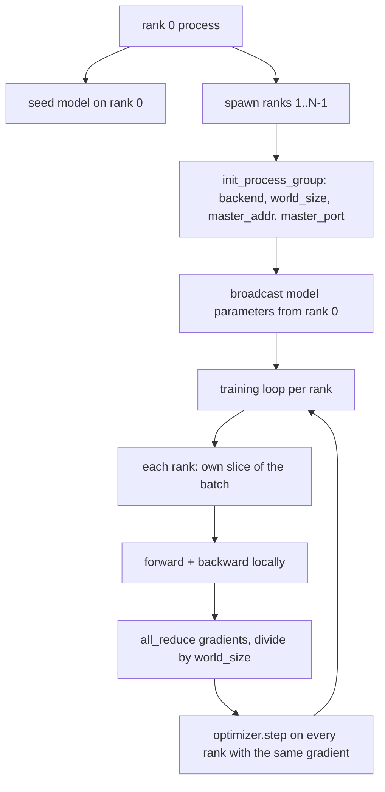
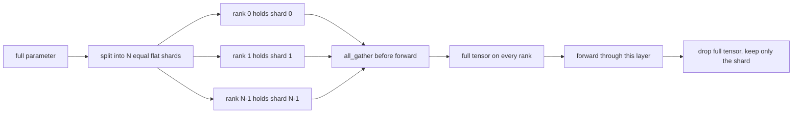

# 从零实现 Distributed Data Parallel 和 FSDP

> Multi-rank training 是两个 collectives 和一条规则。启动时 broadcast parameters，backward 后 average gradients，永远不要让 ranks 在自己处于哪个 step 上产生分歧。

**类型:** Build
**语言:** Python
**先修:** Phase 19 lessons 42 to 45
**时间:** ~90 minutes

## 学习目标

- 使用 `gloo` backend 在 N 个 ranks 间启动 process group，不需要特殊硬件。
- 实现一个最小 DDP wrapper：构造时 broadcast parameters，backward 后 all-reduce gradients。
- 证明 per-rank gradients 的 all-reduce 匹配 concatenated input 上的 single-process gradient。
- 勾勒 FSDP parameter sharding：每个 rank 持有一个 slice，forward pass 时 gather full tensor，用完后丢掉。

## 要解决的问题

模型能放进一个 device。数据集放不下。优化预算说你希望每个 wallclock second 看到 N 倍 examples。第一根杠杆是 data parallel：每个 rank 在 batch 的不同 slice 上运行同一个 model，然后在 optimizer step 前 average gradients。第二根杠杆是 FSDP：模型也放不进一个 device，所以每个 rank 持有每个 parameter 的一小部分，并在 forward pass 期间逐层重构 full tensors。

痛点是 bookkeeping。如果 parameters 在 ranks 间漂移，运行会静默损坏。如果 average gradients 但不 average loss，dashboard 会撒谎。如果 collective backend 无法就 topology 达成一致，运行会永远挂起。修复方法是亲手写一次 collectives，并且永远不要信任你无法复现的 wrapper。

本课在 CPU 上运行。不假设 CUDA。`gloo` backend 随每个 PyTorch build 提供，并接受 `torch.multiprocessing` workers；同一份代码切换到 multi-GPU node 上的 `nccl` 时，不需要改变结构。

## 核心概念



### 重要的两个 collectives

| Collective | What it does | When |
|------------|--------------|------|
| `broadcast` | 把一个 rank 上的 tensor 复制到所有其他 ranks | Parameter init、scheduler state、任何 one-to-all sync |
| `all_reduce` | 在所有 ranks 上对 tensor 求和（或均值、最大值），每个 rank 都得到结果 | backward 后的 gradient averaging |
| `all_gather` | 每个 rank 贡献一个 tensor，每个 rank 得到拼接结果 | Logits collection、FSDP parameter unshard |

DDP 契约是构造时 `broadcast`，backward 后 `all_reduce`。FSDP sketch 则在每层 forward pass 前增加 `all_gather`。

### Gradient averaging 匹配 single-process gradient

一个跨 N 个 ranks、每个 rank batch 为 B examples 的模型，必须产出与单进程在 N*B batch 上训练相同的 gradient。技巧是把 per-rank gradients 求和再除以 N，得到 average loss gradient，也就是 cross entropy 使用 mean reduction 时在 full batch 上会产出的 gradient。本课代码用 manual all-reduce gradient 和 reference single-process gradient 之间 `max-abs-diff < 1e-3` 断言这一点。

### FSDP sketch



内存收益是精确的：每个 rank 的 parameter memory 降到 1/N。成本是 gather，每次 forward pass 都要支付。生产 FSDP 会把 gather 与上一层 compute overlap，所以 wallclock 成本远小于朴素核算。本课对每个 parameter 做 round-trip，并断言 reconstruction 与原始值 bit-equal。

### CPU 和 gloo backend

CUDA 是生产目标，但同样代码路径存在于 CPU 上。`gloo` 是 CPU collective backend。它在 GPU 上比 `nccl` 慢几个数量级，但 API surface 完全相同。本课 process group 以 `backend="gloo"` 初始化，ranks 通过 `torch.multiprocessing` spawn，而不是用 `torchrun`；二者最终都会到达同样的 `torch.distributed` 调用。在 multi-GPU node 上，唯一变化是 `backend="nccl"`、device tensors，以及用 `torchrun` 启动。

## 动手实现

`code/main.py` 是可运行 artifact。

### Step 1: bring up the process group

```python
os.environ["MASTER_ADDR"] = "127.0.0.1"
os.environ["MASTER_PORT"] = str(port)
dist.init_process_group(backend="gloo", rank=rank, world_size=world_size)
```

`MASTER_ADDR` 和 `MASTER_PORT` 是 rendezvous：每个 rank 都拨到同一个 host 的同一个 port。本课通过 bind-and-close 技巧选择空闲 port，避免同一机器上多个运行发生冲突。

### Step 2: broadcast at construction

`MinimalDDP.__init__` 遍历每个 parameter 和 buffer，并调用 `dist.broadcast(tensor, src=0)`。Rank 0 的值成为 canonical init。没有它，每个 rank 会用自己的 seed 初始化，从 step one 开始就发散。

### Step 3: all-reduce gradients after backward

```python
def all_reduce_grads_(module, world_size):
    for p in module.parameters():
        if p.grad is None:
            p.grad = torch.zeros_like(p.data)
        dist.all_reduce(p.grad.data, op=dist.ReduceOp.SUM)
        p.grad.data.div_(world_size)
```

每个 rank 最终得到同一个 averaged gradient。optimizer step 现在是每个 rank 上相同 input 的函数，这就是 parameters 能在整个运行中保持同步的原因。

### Step 4: prove the equivalence

`manual_all_reduce_matches_single_process` 在 rank 0 上构建同一个 model，并把 post-all-reduce gradient 与单进程在 concatenated input 上计算的 gradient 对比。max-abs-diff 大约是 1e-8。

### Step 5: FSDP round trip

`fsdp_round_trip_sketch` 会 flatten 每个 parameter，把它 pad 到 `world_size` 的倍数，slice，all-gather，再 unpad。每个 rank 的 reconstruction 都等于原始值。这就是 unshard step；反向操作（forward 后 re-shard）是从 gathered tensor 上取一个 slice。

运行：

```bash
python3 code/main.py
```

默认 world size 是 2。两个 CPU processes 会 spawn，通过 `gloo` 互相通信，并以 zero 退出。输出 `outputs/ddp-demo.json` 捕获每个 rank 的 parameter sums、all-reduce 后的 gradient norm、FSDP round-trip result，以及 manual-vs-reference gradient diff。

## 实际使用

生产训练栈调用同样 primitives。PyTorch 的 `DistributedDataParallel` 增加了：post-backward gradient hooks，用来让 all-reduce 与 backward overlap；bucketed all-reduce，把多个小 gradients 合并进一次 collective；以及 lesson 46 使用的 `no_sync` context。

PyTorch 的 FSDP 增加了：每层一个 flat parameter view，让每个 rank 持有一个 contiguous buffer；下一层 unshard 与当前层 compute 的 overlap；以及可选的 shard CPU offload。

形状保持不变：启动时 broadcast，backward 后 reduce，parameters 放不下时 shard 它们。

## 交付成果

`outputs/skill-distributed-fsdp-ddp.md` 为新的 training script 承载 recipe：用 `gloo` 在 CPU 上、用 `nccl` 在 GPU 上启动 process group，把 model 包进一个构造时 broadcast、backward 后 reduce 的 DDP shell，可选地用 FSDP sketch 中的 all_gather pattern 分片 parameters。

## 练习

1. 使用 `--world-size 4` 运行，并确认整个运行中 param spread 保持在 1e-3 以下。
2. 用 `dist.all_reduce(op=dist.ReduceOp.AVG)` 替换手动 averaging，并测量差异。
3. 给 DDP wrapper 添加 post-backward hook，让 all-reduce 与 backward 的其余部分 overlap；测量 wallclock 改善。
4. 实现 FSDP re-shard step：forward pass 后，再用 local shard 替换 full tensor。确认 per-rank memory 下降。
5. 在 CUDA box 上把 backend 切到 `nccl`。记录哪些 environment variables 改变，哪些保持不变。

## 关键术语

| Term | What people say | What it actually means |
|------|-----------------|------------------------|
| Backend | “gloo or nccl” | 实现 collective ops 的 library；gloo 是 CPU，nccl 是 GPU |
| World size | “Total ranks” | group 中的进程数量；group 是 collectives 操作的单位 |
| Rank | “Worker id” | group 内的进程标识符，从 zero 开始 |
| All-reduce | “Sum the grads” | 对所有 ranks 上的 tensor 求和，每个 rank 最终得到同一结果 |
| Unshard | “Gather the params” | 通过 all_gather 从 per-rank slices 重构 full tensor |

## 延伸阅读

- PyTorch `torch.distributed` documentation，用于本课依赖的 collective semantics。
- `gloo` library 的 collective list，其形状与 CUDA-backed `nccl` primitives 相同。
- Phase 19 lesson 46，关于把 DDP all-reduce 包进 `no_sync` 的 gradient accumulation pattern。
- Phase 19 lesson 47，关于能经受 DDP 和 FSDP runs 的 checkpoint layout。
- PyTorch FSDP documentation，关于这里 sketch 的 parameter sharding 的生产实现。
