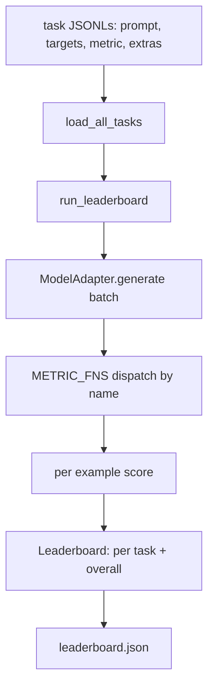
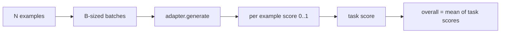

# 语言模型评估 Harness

> 一个模型在你无法定义的任务上表现很好，往往只是碰巧表现好。harness 把任务定义、指标、运行器和排行榜放进一个短小、可替换的形状里。

**类型:** 构建
**语言:** Python
**先修:** 第 19 阶段第 42 到 45 课
**时间:** ~90 分钟

## 学习目标

- 将任务定义为 JSONL 文件，每个样例包含 `prompt`、`targets`、`metric` 和可选的 `extras`。
- 实现五种指标：exact match、rouge-l F1、executable check、multiple choice 和 substring contains。
- 构建一个运行器，按任务批处理样例，并分发给可替换的模型 adapter。
- 输出 leaderboard JSON，包含每个任务的分数、延迟，以及可复现的总体平均分。

## 要解决的问题

每周都会出现一个新的语言模型。营销说法是它表现很好。诚实的问题是：在哪些事情上好？诚实的答案是你自己写的排行榜，因为供应商的排行榜正是他们调优过的那一个。

如果仓库里没有 harness，你只能凭感觉比较两个模型。有了 harness，你就能在固定任务集、固定指标和可 diff 的 JSON 输出上按分数比较它们。harness 是昨天的运行和今天的运行之间的契约。没有它，回归就会被发布出去。

陷阱是把 harness 过拟合到单个模型。修复方式就是反向利用同一个陷阱：harness 小到十五分钟能读完，任务小到可以随仓库发布，指标从零写起以便同事审计，adapter 是唯一放模型特定代码的地方。替换 adapter，排行榜会动；替换任务，排行榜会动。除此之外不该有任何东西动。

## 核心概念



### 任务规格

每个样例是一行 JSONL：

```json
{"id": "arith-00", "prompt": "compute: 2 + 2", "targets": ["4"], "metric": "exact_match"}
```

对于需要评分辅助数据的指标，`extras` 携带旁路 payload：

```json
{
  "id": "code-00",
  "prompt": "python: write a function f that doubles its input",
  "targets": ["ok"],
  "metric": "code_exec",
  "extras": {"io_pairs": [[1, 2], [3, 6]]}
}
```

一个任务就是 `outputs/tasks/` 下的一个 `.jsonl` 文件。文件名就是任务名。同一个文件中的所有样例共享一个指标。

### 五个夹具任务

| Task | Metric | What it tests |
|------|--------|---------------|
| arithmetic | exact_match | 确定性答案上的 token 级正确性 |
| summary | rouge_l | 与单行参考摘要之间的最长公共子序列 F1 |
| code-exec | code_exec | 可执行测试：预测出的函数必须满足一组输入输出对 |
| multiple-choice | multiple_choice | 预测的首字母必须匹配允许的字母 |
| generation | substring_contains | 自由形式文本必须包含至少一个目标子串 |

### 指标契约

每个指标都是一个从 `(prediction, targets, extras) -> float in [0.0, 1.0]` 的函数。harness 会对逐样例分数求平均得到任务分数，再对任务分数求平均得到总体分数。指标函数都很小：

- `exact_match`: lowercase、折叠空白、判断相等。
- `substring_contains`: 相同的规范化，然后做子串测试。
- `multiple_choice`: 取第一个字符并转为大写。
- `rouge_l`: LCS 长度分别除以 prediction 和 reference 的长度，再取 precision 与 recall 的 F1。
- `code_exec`: 在受限命名空间执行 prediction，对每个输入输出对调用 `f(x)`，统计匹配数。

`code_exec` 指标会在剥离过的 builtins 命名空间中运行 prediction。本课测试会断言 `import os` 失败，因为 `os` 不在命名空间里；代码预测不能访问文件系统。

### 模型 adapter

```python
class ModelAdapter(Protocol):
    def generate(self, prompts: Sequence[str]) -> List[str]: ...
    @property
    def name(self) -> str: ...
```

adapter 是替换点。本课提供 `ToyAdapter`，它是一个确定性的模式匹配器，会为五个夹具任务中的每个 prompt 返回正确答案。真实 adapter 会调用模型并返回输出。harness 不关心用的是哪一个。

### 运行器

`run_task` 每次取 `batch_size` 个 prompt，并分发给指标函数。`run_leaderboard` 遍历每个任务并求平均。`write_leaderboard` 输出带 schema 字符串的 JSON，这样未来格式变化不会悄悄破坏 dashboard。



## 动手实现

`code/main.py` 是可运行产物。

### 第 1 步：播种夹具任务

`seed_fixture_tasks(target_dir)` 会写入五个 `.jsonl` 文件。第一次运行 `main.py` 时，如果目录为空，就会播种这些任务。

### 第 2 步：加载任务

`load_all_tasks(task_dir)` 读取每个 `.jsonl`，并返回从任务名到 `Example` 记录列表的 dict。以 `#` 开头的注释行和空行会被跳过，这样贡献者可以给文件加注释。

### 第 3 步：实现指标

每个指标都是一个小函数，并配有单元测试。本课测试套件包含 13 个用例，覆盖规范化、部分重叠、代码执行和不安全代码拒绝。

### 第 4 步：编写运行器

`run_task` 遍历 batch，并生成 `TaskResult`，其中包含分数、正确数、总数和延迟。`run_leaderboard` 遍历所有任务并生成带总体平均分的 `Leaderboard`。

### 第 5 步：输出 JSON

`write_leaderboard` 序列化 leaderboard。`--include-per-example` 标志会导出逐样例记录，这样分数变化时，你可以将预测与上一次运行做 diff。

运行它：

```bash
python3 code/main.py
```

脚本在首次运行时播种夹具，用 toy adapter 打分（它会答对所有夹具），并写入 `outputs/leaderboard.json`。使用 toy adapter 时总体分数是 1.0；`test_main.py` 中的 stub adapter 测试展示了当 adapter 无法回答时，同一个 harness 会产出 0.0。

## 实际使用

要接入真实模型，写一个 adapter。形状如下：

```python
class HttpAdapter:
    name = "vendor.v1"

    def __init__(self, endpoint, api_key):
        self.endpoint = endpoint
        self.api_key = api_key

    def generate(self, prompts):
        out = []
        for prompt in prompts:
            response = http_post(self.endpoint, prompt, self.api_key)
            out.append(response["text"])
        return out
```

在 `main()` 顶部把 `ToyAdapter` 换成 `HttpAdapter`。harness、任务、指标和排行榜都保持不变。

在真实项目中发布这个 harness 时，要强制执行三个模式：

- **固定任务文件。** `leaderboard.json` 要么携带 hash 固定的任务内容，要么把 JSONL 一起带上；否则任务文件一变分数也会变，而你无法判断到底是哪一个变了。
- **diff 预测，而不只是 diff 分数。** `--include-per-example` 标志让你看到分数下降那天模型具体说了什么。
- **限制 batch size。** 真实 adapter 有速率限制。较小的 batch size 能让 harness 兼容不同供应商。

## 交付成果

`outputs/skill-lm-eval-harness.md` 携带这份配方：JSONL 任务规格、五个指标、可替换 adapter、批处理运行器、带 schema 字符串的 leaderboard JSON。`outputs/tasks/` 中的任务文件就是夹具；可以把它们复制进真实项目作为起点。

## 练习

1. 添加第六个任务，并从零写一个自定义指标（类似 BLEU 的 overlap、类似 BLEURT 的 reference scoring，或任何有清晰契约的指标）。
2. 扩展 `code_exec`，捕获 stdout，并接受一组期望 stdout 作为 targets。
3. 添加 leaderboard diff 命令：给定两个 `leaderboard.json` 文件，打印哪些任务发生变化以及变化幅度。
4. 限制每个样例的延迟。用 timeout 包住 adapter 调用；在 leaderboard 中暴露单独的 `timeouts` 列。
5. 在 leaderboard 中用 sha256 固定任务内容，这样未来读者可以验证自己评分的是同一批任务。

## 关键术语

| Term | What people say | What it actually means |
|------|-----------------|------------------------|
| Task spec | “评估格式” | JSONL 文件，每个样例包含 prompt、targets、metric 和可选 extras |
| Metric | “评分方式” | 从 (prediction, targets, extras) 到 [0, 1] 浮点数的函数 |
| Adapter | “模型客户端” | 拥有 generate(prompts) -> list[str] 方法的对象；唯一的模型特定代码 |
| Leaderboard | “计分板” | JSON，包含每个任务的分数、总数、延迟和总体平均分 |
| Code exec metric | “运行并检查” | 在受限命名空间执行 prediction，并与输入输出对比较 |

## 延伸阅读

- 原始 lm-evaluation-harness 可作为生产参考，它大得多，但形状相同。
- HuggingFace 的 lighteval 是同一契约的另一种实现。
- 第 19 阶段第 46 课介绍了 harness 所评分训练栈中使用的 gradient accumulation 模式。
- 第 19 阶段第 47 课介绍了你要评分的 checkpoint 格式；在 leaderboard 中固定 checkpoint hash。
- 第 19 阶段第 48 课介绍了产出被测模型的分布式训练栈。
