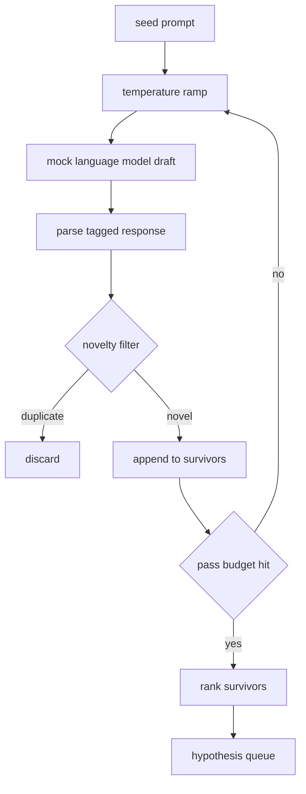

# 假设生成器

> 一个会问两遍同一个问题的研究 agent 正在浪费 token。诀窍是强制每个草稿落在新的地方。

**类型:** 构建
**语言:** Python
**先修:** 第 19 阶段 Track A 第 20-29 课
**时间:** ~90 分钟

## 学习目标
- 从 seed prompt 驱动 sampler，并把它的输出转成带类型的 hypothesis 记录。
- 在每一轮提高 sampler temperature，让下一个草稿比上一个漂移得更远。
- 用一个小 embedding 模型和 cosine distance 阈值过滤近重复项。
- 用融合 novelty、specificity 和 testability 的评分函数对保留下来的候选排序。
- 让每一步都保持确定性，使同一个 seed 总是生成同一个队列。

## 为什么先生成再过滤

一个 planner 对一个模型问一次，只得到一个 hypothesis。这对演示样例没问题。对研究循环来说，这是错误的形状。循环需要一个有深度的排序队列，这样当第一个 hypothesis 失败时，runner 可以立即拿到下一个，而不用再支付一次完整采样流程的成本。

两个想法组合起来产生这个队列。第一个是 temperature ramping：每次经过 sampler 都把 temperature 提高一点，让后面的草稿更愿意游走。第二个是 novelty filtering：每个草稿之后，generator 都会测量它与此前每个 survivor 的 embedding distance，并拒绝落在同一簇内的内容。

本课提供一个 mock language model，它会针对固定 prompt 返回脚本化 token 序列。这个 mock 足以演练完整路径：输入 seed prompt、应用 temperature ramp、解析候选、运行 novelty filter、输出排序队列。

## Hypothesis 形状

```text
Hypothesis
  id             : int           (monotonic within a run)
  text           : str           (the claim)
  variables      : list[str]     (what changes between conditions)
  metric         : str           (what the runner will measure)
  baseline_ref   : str | None    (which paper or run the comparison cites)
  draft_pass     : int           (which sampler pass produced this)
  temperature    : float         (the sampler setting at draft time)
  novelty_score  : float         (distance from prior survivors, 0..1)
  rank_score     : float         (weighted sum used for ordering)
```

`variables` 和 `metric` 不是自由文本。parser 会从带标签的 response 中提取它们。第 52 课的 runner 在构建 experiment config 时会直接读取这些字段。

`baseline_ref` 是可选的，但推荐提供。第 53 课的 evaluator 需要一个 baseline 来比较。如果 hypothesis 省略它，evaluator 会回退到同一 metric 上的上一次运行。

## 架构



这个循环很直接。有意思的部分是每个方框都有硬契约。

## Temperature ramp

从 `t_min` 开始，到 `t_max` 结束，步长为 `(t_max - t_min) / (n_passes - 1)`。每一轮都用当前 temperature 调用 sampler，从 `GeneratorConfig.schedule()` 生成 `n_passes` 个均匀间隔的值。mock model 通过在一组以 `(prompt, temp_bucket)` 为键的脚本化 response 之间切换来遵守 temperature。bucket 是开区间，所以 temperature 的小变化会选中不同 bucket，并产生不同草稿。在生产中，sampler 会是真实模型，并透传 `temperature=t`。

默认 schedule 是从 `0.2` 到 `1.2` 的六轮。六轮足以填充队列，也不会为 novelty filter 反正会拒绝的样本付出太多成本。低于 `0.2` 时，模型会复读 seed。高于 `1.2` 时，response 往往偏题并无法通过 parser。

## Novelty filter

每个草稿被解析之后，generator 会 embed 文本，并与每个已接受 hypothesis 比较。embedding 是一个小型 hashed bag of word tokens，并归一化到单位长度。两个单位向量之间的 cosine distance 是 `1 - dot(a, b)`。如果草稿到任一 prior survivor 的最小距离高于 `novelty_threshold`，它就通过。默认值是 `0.25`。

hashed embedding 并不花哨。它是确定性的、零依赖，而且足以捕捉明显情况：两个草稿共享了大部分名词。生产部署会换成小型 sentence model。接口保持不变。

## Rank score

```text
rank_score = w_novelty * novelty_score
           + w_specificity * specificity_score
           + w_testability * testability_score
```

三个子分数。`novelty_score` 是到 prior survivors 的最小 embedding distance。`specificity_score` 是 hypothesis 中具体变量的数量除以目标数量。`testability_score` 在 hypothesis 同时指定 metric 和 baseline 时为一，只指定 metric 时为二分之一，否则为零。

默认权重是 `0.4`、`0.3`、`0.3`。这些权重放在 generator config 中，因此下游 lesson 可以调整它们，而不用 fork 代码。

## Mock language model

```python
class MockLLM:
    def sample(self, prompt: str, temperature: float, seed: int) -> str:
        ...
```

给定 `(prompt, temperature, seed)` 三元组时，sampler 是确定性的。mock 维护一个脚本化 response 表，以 `(prompt_signature, temperature_bucket)` 为键。如果表中没有某个 key 的条目，sampler 会返回一个无法通过 parser 的 fallback。其中一个测试会覆盖这条 fallback 路径。

seed 会混入 response，所以相同 `(prompt, temperature)` 对在不同 seed 下会产生不同草稿。在测试中我们固定 seed，让结果可复现。在真实部署中，seed 会来自系统时钟或计数器。

## 输出队列

输出是一组按 `rank_score` 降序排列的 `Hypothesis` 记录。第 52 课的 runner 弹出队首、运行实验，第 53 课的 evaluator 写回 verdict。如果 verdict 表示 hypothesis 错了，runner 就弹出下一个。

队列是有限的。当队列为空时，orchestrator 可以放宽 seed prompt 并再次运行 generator，也可以停止并报告预算已耗尽。

## 如何阅读代码

`code/main.py` 定义了 `Hypothesis`、`MockLLM`、`HypothesisGenerator` 和一个确定性 demo。generator 暴露一个 `run(seed_prompt)` 方法，返回排序后的队列；pass 数量从 `GeneratorConfig.n_passes` 读取，而不是作为参数传入。embedding 是 token 的 hashed bag。novelty filter 是单个函数。rank score 是单个函数。没有任何东西依赖 `numpy`；embedding math 是纯 stdlib，因此本课保持可移植。

`code/tests/test_generator.py` 覆盖线性路径、重复项拒绝路径、parser 失败路径、temperature ramp 边界和 rank ordering。

## 它放在何处

第 50 课生成队列。第 51 课取队首并运行 literature search，以确认或反驳它。第 52 课取同一个队首并运行真实实验。第 53 课读取两者的输出并写入 verdict。这四课组合成一个没有人在其中的研究循环；人可以在任何边界介入。
