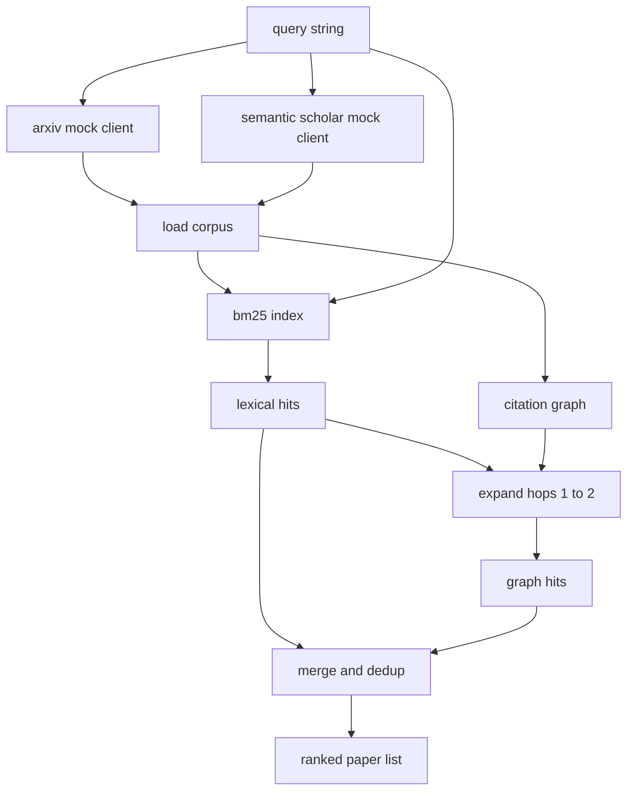

# 文献检索

> hypothesis 很便宜。知道是否已经有人证明过它，才是昂贵的部分。构建 retrieval layer，在 runner 启动 sandbox 之前回答这个问题。

**类型:** 构建
**语言:** Python
**先修:** 第 19 阶段 Track A 第 20-29 课
**时间:** ~90 分钟

## 学习目标
- 用下游循环会读取的字段建模一条小型 paper record。
- 只用 stdlib 数据结构在 abstract 上构建 BM25 index。
- 遍历 citation graph，浮现 lexical search 漏掉的论文。
- 通过稳定 paper id 对 lexical pass 和 graph pass 的命中结果去重。
- 把两个 mock external APIs 包装在单个 client 后面，这样真实 endpoint 接入时，上游调用点保持不变。

## 为什么要两次 retrieval pass

对 abstract 做 keyword search，会返回与 query 共享词汇的 paper。这覆盖了大多数表层情况。它会漏掉两类。第一类是 foundational paper 使用了不同词汇；例如查询 "sparse attention" 会漏掉一篇题为 "block selection in transformer routing" 的论文。第二类是 relevant paper 是引用某个已知 anchor 的 follow up；先找到 anchor 再向前遍历，比暴力搜索 abstract pool 更高效。

本课构建这两种 pass。abstract 上的 BM25 捕捉 lexical hits。citation graph traversal 从 seed set 出发，向前和向后扩展一到两跳。两者的并集按 paper id 去重，并用一个小型 combined score 排序。

## Paper 形状

```text
Paper
  id          : str           (stable identifier, "p001" for the mock corpus)
  title       : str
  abstract    : str
  year        : int
  authors     : list[str]
  references  : list[str]     (paper ids this paper cites)
  citations   : list[str]     (paper ids that cite this paper)
  source      : str           (which mock api supplied it, "arxiv" or "s2")
```

`references` 和 `citations` 字段构成有向 citation graph。两个 mock APIs 返回的字段有重叠但并不完全相同，因此 corpus loader 会按 `id` 对它们取并集。

## 架构



retrieval client 拥有两个 pass 和 merge。调用者交给它一个 query，得到一个 ranked list，其中每个条目携带每篇 paper 的 score 字段（`bm25_score`、`graph_distance`、`recency_score`、`final_score`），用于解释排序。

## 从零实现 BM25

实现的是标准 Okapi BM25，默认参数为 `k1=1.5`、`b=0.75`。index 是两个 dictionary：`term -> doc_frequency` 和 `term -> list of (doc_id, term_count)`。document length 是 abstract 的 token count。average document length 在 index 构建时计算一次。对 query 评分时，会对 query term 求和：`idf * tf_norm`，其中 `tf_norm` 是标准 BM25 的长度归一化 term frequency。

tokeniser 是先 `lower`，再按非字母数字字符 split。它不做 stemming。生产系统会换成小型 stemmer。接口保持不变。

```text
idf(t)      = log((N - df + 0.5) / (df + 0.5) + 1.0)
tf_norm(t)  = (f * (k1 + 1)) / (f + k1 * (1 - b + b * dl / avgdl))
score(d, q) = sum over t in q of idf(t) * tf_norm(t)
```

## Citation graph traversal

graph 从 corpus 构建一次。Forward edges 从一篇 paper 指向它的 references。Backward edges 从一篇 paper 指向它的 citations。遍历是 breadth first search，由 top BM25 hits 作为种子，最多两跳。

两跳是刻意设置的上限。一跳太浅；agent 往往想要 immediate ancestor 或 descendant。三跳会在连通 graph 上让结果规模爆炸，并且常常偏离主题。本课把 hop limit 暴露为 config knob，这样下游循环可以收紧它。

## Dedup 和 ranking

两个 pass 会返回重叠集合。merge 按 paper id 作为 key。每篇 paper 的 final score 是一个 weighted blend。

```text
final_score = w_bm25 * bm25_score_norm
            + w_graph * graph_score
            + w_recency * recency_score
```

`bm25_score_norm` 是 BM25 score 除以 merged set 中最大 BM25 score（所以这个字段位于零到一之间）。`graph_score` 对 direct lexical hits 为一，然后一跳为 `0.6`，两跳为 `0.3`，否则为零。`recency_score` 是从 corpus 最小年份的零到最大年份的一条线性 ramp。

默认权重是 `0.5`、`0.3`、`0.2`。权重是 config；陈旧话题可能会调低 recency，而快速变化的话题会调高它。

## Mock corpus

corpus 有一百篇 paper，由 `build_corpus()` 生成。每篇 paper 都有手写 title 和 abstract，主题来自五类之一：attention sparsity、retrieval augmentation、low rank adapters、dataset distillation 和 evaluation harnesses。references 和 citations 被连接起来，使每个 topic 形成一个连通 sub graph，并带有少量跨 topic edge。

两个 mock API client（`ArxivMockClient`、`SemanticScholarMockClient`）读取同一个 corpus，但暴露不同字段。Arxiv 返回 title、abstract、year、authors。Semantic Scholar 添加 references 和 citations。retrieval client 按 id 取并集；跨 client 字段不一致的处理会推迟到后续 lesson。

## 第 52 和 53 课读取什么

第 52 课的 runner 会读取 `paper.id`、`paper.title` 和 abstract 的前三句，作为 experiment 的 context。第 53 课的 evaluator 会读取 `paper.year` 和 `paper.references`，把 baseline 归因到特定 paper。

retrieval client 返回一个 `RetrievalResult`，其中既有 ranked list，也有每个 query 的 metrics：hit count、average score、top score、total wall time。runner 会记录这些信息，供下游 observability pass 绘制质量随时间变化的图。

## 如何阅读代码

`code/main.py` 定义了 `Paper`、`ArxivMockClient`、`SemanticScholarMockClient`、`BM25Index`、`CitationGraph`、`RetrievalClient` 和一个确定性 demo。mock clients 和 corpus 放在同一个文件里，所以本课保持可移植。BM25 实现是一个 class，约六十行。graph traversal 是一个 method。

`code/tests/test_retrieval.py` 覆盖 lexical path、graph path、merge、dedup 和 empty query。

## 它放在何处

第 50 课产生一个 hypothesis。第 51 课搜索文献，检查该 hypothesis 是否已经被解决。如果没有，第 52 课运行实验。第 53 课读取 retrieval result 和 experiment metrics，写出 verdict。retrieval client 是四个阶段中最便宜的一个，因此在 orchestrator 中最先运行。
