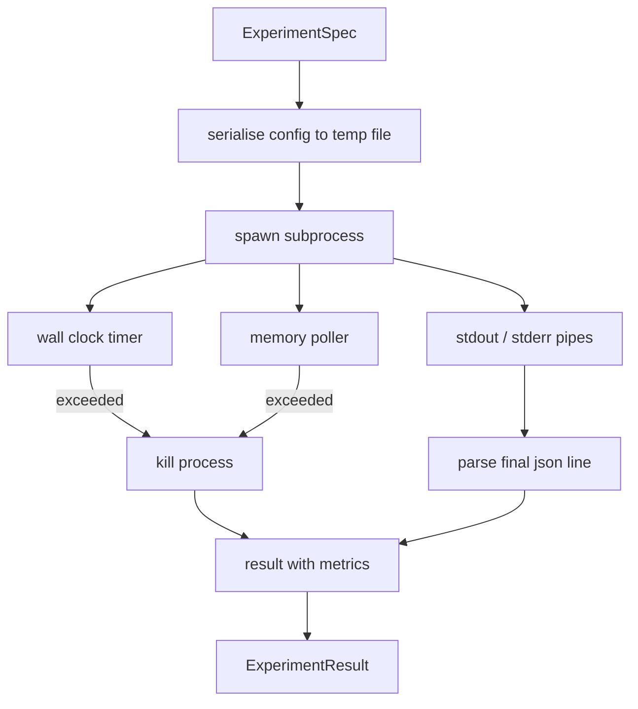

# 实验运行器

> 循环的诚实程度只取决于它的测量。构建一个 runner：接收 spec，在 sandboxed subprocess 中执行，并输出 evaluator 可以信任的 json metrics blob。

**类型:** 构建
**语言:** Python
**先修:** 第 19 阶段 Track A 第 20-29 课
**时间:** ~90 分钟

## 学习目标
- 将 experiment 编码为 typed spec，runner 可以把它 serialise 给 subprocess。
- 启动带硬 wall clock timeout 和软 memory cap 的 subprocess，并把二者都暴露为 terminal conditions。
- 将 stdout、stderr 和 structured metrics blob 捕获到单个 result record 中。
- 构建 ablation table，在固定 base spec 上一次只 sweep 一个 configuration knob。
- 给定 seed 时让每个 result 保持确定性，使 evaluator 在多次运行间看到相同数字。

## 为什么用 subprocess

研究循环会运行不受信任的代码。hypothesis 来自 sampler，experiment script 来自同一路径；把其中任何一个当成 in-process 安全代码，都是在邀请一次会拖垮 orchestrator 的崩溃。Subprocess 是语言自带的最简单隔离：独立进程、独立地址空间，以及父进程侧的 signal handle。

这里的 runner 没有实现完整 sandboxing。没有 cgroup，没有 seccomp filter，没有 namespace remapping。它具备的是 wall clock timeout、轮询 memory growth 的循环，以及在任一限制被触发时 terminate process 的 kill path。这是每个更复杂 sandbox 都会扩展的 runtime contract。本课把契约保持到一口气能读完。

## ExperimentSpec 形状

```text
ExperimentSpec
  spec_id        : str            (stable id, "exp_001")
  hypothesis_id  : int            (link back to the queue from lesson 50)
  script_path    : str            (path to the python script to run)
  config         : dict           (passed to the script as one json arg)
  seed           : int            (deterministic seed for the experiment)
  wall_timeout_s : float          (hard timeout, killed on exceed)
  memory_cap_mb  : int            (soft cap, polled; killed on exceed)
  metric_keys    : list[str]      (which fields the evaluator will read)
```

script 放在磁盘上；runner 会把 config 写入一个 temp file path，script 负责读取它。script 应该在 stdout 上打印单行 json，其 keys 是 `metric_keys` 的超集。stdout 上其他任何内容都会被捕获，但 metrics parser 会忽略它。

## 架构



runner 是一个带主方法的 class。poller 是一个小线程，每隔一个 poll interval 醒来一次，在可用时从 proc filesystem 读取 subprocess 的 `psutil` equivalent；当平台不暴露它时，就 fallback 到 no op。

## 为什么是 soft memory cap

硬 memory caps 需要 `resource.setrlimit`，且只适用于 POSIX。本课提供一种可移植方法：从平台轮询 resident set size，如果 subprocess 超过 cap 就 kill。cap 是软的，因为 poller 有非零 interval；process 可能在两次 poll 之间短暂超过 cap，然后再降下来。runner 会记录最大观测 RSS，让 evaluator 能看见该运行离限制有多近。

在不支持 process inspection 的系统上，poller 会记录一次性 warning 并禁用自身。wall clock timeout 仍然生效。本课测试覆盖两条路径。

## 捕获 stdout 和 stderr

runner 会在完成后 drain 两个 pipe。stdout 会逐行扫描；最后一行能解析为 json 且包含所有必需 `metric_keys` 的内容，会被当作 metrics blob。更早的 json lines 会保留在 result 中作为 `intermediate_metrics`；evaluator 可以用这些数据绘制 learning curves。

stderr 会原样捕获进 result。runner 不会因为非零 exit code 抛异常；相反，它会在 result 中记录 code。任何非零 exit 都标记为 `"crash"`，即使 script 打印过 metrics，因此 evaluator 默认把 partial runs 当作失败。

## Ablation table

```python
def ablate(base: ExperimentSpec, knob: str, values: list[Any]) -> list[ExperimentSpec]:
    ...
```

给定一个 base spec 和 knob name，这个 helper 会为每个 value 返回一个 spec，其中 `config[knob]` 被覆盖。每个 spec 都会得到一个派生 `spec_id`（`f"{base.spec_id}_{knob}_{value}"`）。runner 提供一个 `AblationRunner`，按顺序运行它们，并返回一个以 knob value 为 key 的 `AblationTable`。

为什么一次只扫一个 knob。Full factorial sweeps 会指数爆炸，并产生 evaluator 无法解释的结果。一次一个 knob 会产生一个干净的轴，evaluator 可以绘图。本课只把 multi knob sweeps 支持为由 caller 组合的重复 single knob ablations。

## Determinism

每个 spec 都携带一个 seed。runner 通过 config dict 将 seed 转发给 script（`config["__seed"] = spec.seed`）。`code/experiments/` 中的 mock experiment scripts 会遵守 seed，并在多次运行间生成相同 metrics。第 53 课的 evaluator 依赖这一点；没有 determinism 时，一个“regression”可能只是不同的随机初始化。

## Mock experiment script

本课提供一个 experiment script：`code/experiments/sparsity_experiment.py`。它是真实脚本，会读取 config file，模拟一个带 numpy random pass 的小型训练运行，并打印一个 json metrics blob。该脚本遵守 `sleep_s` knob，用于测试 timeouts，也遵守 `allocate_mb` knob，用于测试 memory poller。

simulation 并不训练任何真实东西。它是一段数值计算，模仿训练循环的形状：loss curve、final perplexity、wall time。本课重点是 runner，而不是 simulation。真实 experiment script 会 import model。

## Result 形状

```text
ExperimentResult
  spec_id              : str
  hypothesis_id        : int
  exit_code            : int
  terminal             : "ok" | "timeout" | "oom" | "crash"
  wall_time_s          : float
  peak_rss_mb          : float | None
  metrics              : dict
  intermediate_metrics : list[dict]
  stdout_tail          : str
  stderr_tail          : str
```

evaluator 会先读取 `metrics` 和 `terminal`。如果 terminal 不是 `"ok"`，experiment 就算 failed run，evaluator 的 verdict 会自动给出。否则 metrics 会进入 significance test。

## 如何阅读代码

`code/main.py` 定义了 `ExperimentSpec`、`ExperimentResult`、`ExperimentRunner`、`AblationRunner` 和一个确定性 demo。subprocess management 是一个 class。memory poller 是一个小线程。ablation helper 是单个函数。

`code/experiments/sparsity_experiment.py` 是测试中使用的 mock experiment。它从 argv 读取 config file path，并在完成时写出一行 json metrics。

`code/tests/test_runner.py` 覆盖 success path、timeout path、crash path、ablation table，以及跨两次运行的 determinism check。

## 它放在何处

第 50 课生成 hypothesis。第 51 课过滤掉文献已经解决的内容。第 52 课为剩下的内容运行 experiment。第 53 课读取 result、运行 significance test，并写出 orchestrator 针对 hypothesis id 存储的 verdict。
