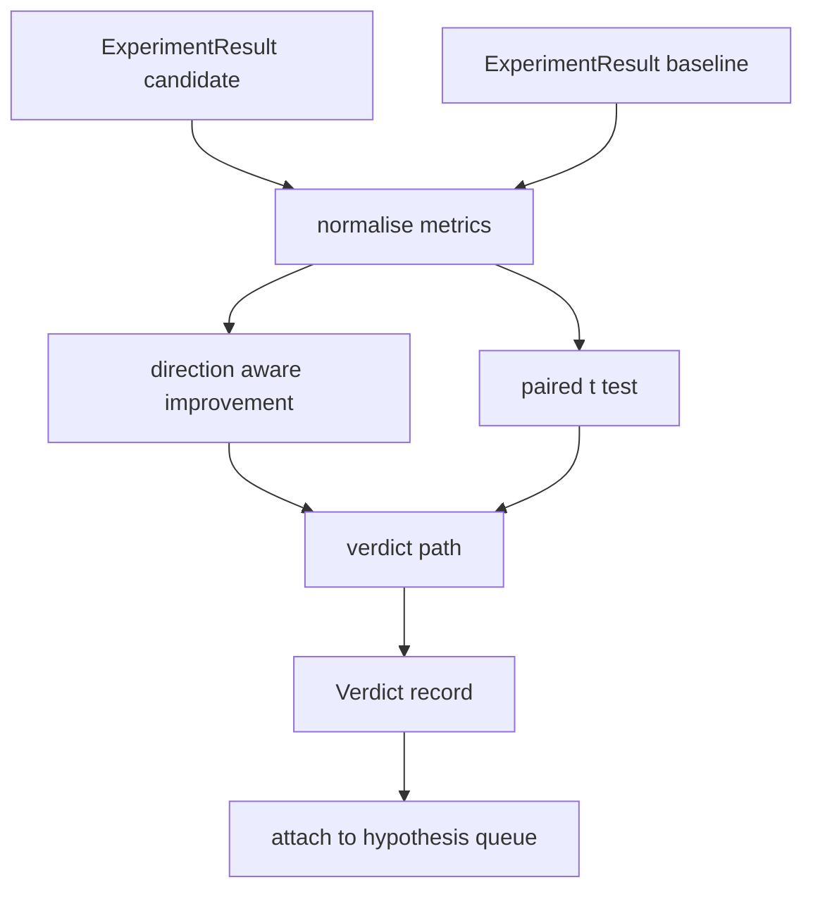

# 结果评估器

> runner 产出了数字。evaluator 决定这些数字代表提升、回归，还是噪声。构建把 metrics 转成一句结论的 verdict 路径。

**类型:** 构建
**语言:** Python
**先修:** 第 19 阶段 Track A 第 20-29 课
**时间:** ~90 分钟

## 学习目标
- 使用 direction aware improvement 和固定阈值，将 candidate run 与 baseline 比较。
- 在 per seed metrics 上从零实现 paired t test，并读取得到的 p value。
- 归一化 log scaled metrics，使下游 report 能将它们与 linear metrics 混合。
- 输出 per hypothesis verdict，orchestrator 可以把它附加到第 50 课的队列上。
- 让每一步保持 pure，使相同输入总是产生相同 verdict。

## 为什么用 paired test

runner 给出的单个数字并不能说明变化是否真实。同一个配置换一个 seed 会得到不同 perplexity。变化可能只是噪声。正确比较方式是 paired：相同 seed、相同数据，candidate 跑一次，baseline 跑一次。每个 seed 贡献一个差值。这些差值的均值是 effect。这些差值的 standard error 是 noise floor。

本课从零实现这个 test。没有 `scipy.stats`。数学小到一屏就能读完。

```text
diffs    = [a_i - b_i for i in seeds]
mean     = sum(diffs) / n
variance = sum((d - mean) ** 2 for d in diffs) / (n - 1)
t_stat   = mean / sqrt(variance / n)
df       = n - 1
p_value  = two_sided_p(t_stat, df)
```

two sided p value 使用 regularised incomplete beta function。本课提供一个小型实现，使用 Lentz continued fraction。整个东西是六十行 stdlib math。

## Direction aware improvement

有些 metrics 变大时更好（accuracy、throughput）。另一些 metrics 变小时更好（loss、perplexity、wall time）。evaluator 在每个 metric 上都携带 `direction` 字段。

```text
if direction == "higher_is_better":
    improvement = (candidate - baseline) / abs(baseline)
elif direction == "lower_is_better":
    improvement = (baseline - candidate) / abs(baseline)
```

Improvement 是带符号的。在 higher is better metric 上，负 improvement 意味着 candidate 更差。verdict path 会一起读取符号和幅度。

一个平坦阈值（`improvement_threshold=0.02`，百分之二）决定变化是否大到值得调用。低于该阈值时，无论 p value 如何，verdict 都是 "noise"；这个循环不关心用户无法测量的变化。

## 架构



evaluator 运行三项独立计算，并在 verdict path 中把它们合并。每项计算都是 pure function，没有 shared state。

## Log normalisation

perplexity 与 loss 呈指数关系。loss 下降 0.1 会让 perplexity 有大得多的下降。直接比较两个配置下的 perplexity 没问题，但如果要在单个 report 中把它与 linear metrics 混合，就需要归一化。

本课对任何 `scale` 字段为 `"log"` 的 metric，在计算 improvement 前取自然对数。随后阈值会在 log space 中应用。perplexity 从 32 降到 28 时，在 lower is better metric 上是 `log(28) - log(32) = -0.133`，这远高于百分之二阈值。

```text
if scale == "log":
    a = log(candidate)
    b = log(baseline)
else:
    a = candidate
    b = baseline
```

`scale="linear"`（默认）的 metrics 会跳过 transform。同一条代码路径处理二者。

## Per seed paired test

第 52 课的 runner 每次 run 输出一个 final metrics blob。对于 paired test，evaluator 需要 candidate 的每个 seed 一个 blob，baseline 的每个 seed 一个 blob。orchestrator 会在一组 seeds 上用两种配置运行相同 experiment，并把两个 `ExperimentResult` 记录列表交给 evaluator。

evaluator 会按 seed 配对（seed 位于 `result.metrics["seed"]`），并遍历请求的 metric。如果两个列表中的 seed 不匹配，evaluator 会抛出 `PairingError`。orchestrator 应该重新运行。

## Verdict 形状

```text
Verdict
  hypothesis_id          : int
  metric                 : str
  direction              : "higher_is_better" | "lower_is_better"
  scale                  : "linear" | "log"
  candidate_mean         : float
  baseline_mean          : float
  improvement            : float       (signed, fraction; see direction rules)
  p_value                : float | None  (None if n < 2)
  significance_threshold : float
  improvement_threshold  : float
  verdict                : "improved" | "regressed" | "noise" | "failed"
  rationale              : str
```

verdict path 是一个小型 decision table：

```text
1. If any candidate result has terminal != "ok": verdict = "failed"
2. else if |improvement| < improvement_threshold:  verdict = "noise"
3. else if p_value is None or p_value > significance: verdict = "noise"
4. else if improvement > 0:                          verdict = "improved"
5. else:                                             verdict = "regressed"
```

Rationale 是一句人类可读的句子，orchestrator 可以把它记录到 hypothesis id 上。

## 如何阅读代码

`code/main.py` 定义了 `MetricSpec`、`Verdict`、`Evaluator`、t statistic 和 incomplete beta helpers，以及一个确定性 demo。t test 用纯 stdlib math 实现；numpy 只用于读取 metrics list 并计算 means 和 variances。

`code/tests/test_evaluator.py` 覆盖 improved path、regressed path、noise path（小幅提升）、noise path（低 n）、failed terminal path、log normalised path、针对已知参考值的 t test，以及 pairing error。

## 它放在何处

第 50 课产生 hypothesis queue。第 51 课过滤掉文献已经解决的内容。第 52 课在 candidate 和 baseline 配置下跨 seeds 运行 experiment。第 53 课读取这些 runs 并写出 verdict。orchestrator 会把这四个组件拼接起来：

```text
for hypothesis in queue:
    literature = retrieval.search(hypothesis.text)
    if literature_settles(hypothesis, literature):
        attach(hypothesis, verdict="settled")
        continue
    candidates = runner.run_all(specs_for(hypothesis))
    baselines  = runner.run_all(baseline_specs_for(hypothesis))
    metric_spec = MetricSpec("perplexity", direction=LOWER, scale=LOG)
    verdict = evaluator.evaluate(hypothesis.id, metric_spec, candidates, baselines)
    attach(hypothesis, verdict)
```

这个 orchestrator 不在本课中；这四课通过各自定义的 dataclasses 组合起来，不需要额外 glue。
