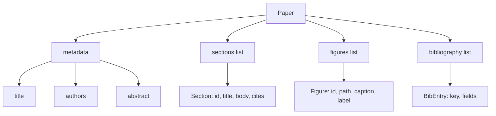
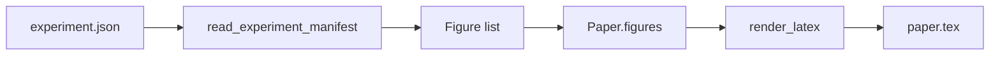
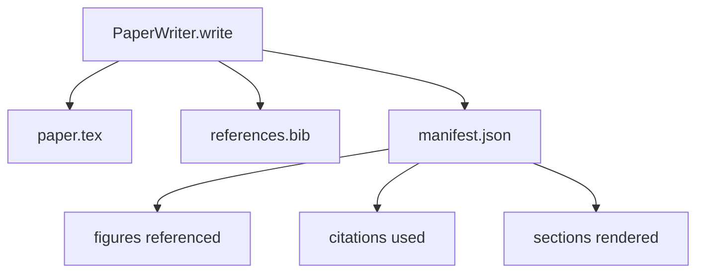

# 论文写作器

> LaTeX skeleton 是研究者和排版器之间的契约。如果契约破了，文档就无法编译，而且失败会很响亮。先构建 skeleton，再填充它。

**类型:** 构建
**语言:** Python
**先修:** 第 19 阶段第 50-53 课
**时间:** ~90 分钟

## 学习目标

- 把 research paper 当作具有已知 section graph 的 structured artifact，而不是 freeform document。
- 生成 LaTeX skeleton，在写任何 prose 之前声明 abstract、sections、figure slots 和 bibliography keys。
- 通过确定性的 slot mechanism，把 experiment outputs（paths 和 captions）中的 figures 注入 skeleton。
- 接入一个 mocked prose generator，从 structured outline 填充每个 section，让 harness 在没有模型的情况下也可测试。
- 输出单个 `paper.tex`、一个 `references.bib` 和一个 manifest，列出每个被引用的 figure 与每个使用的 citation。

## 为什么先做 skeleton

从 prose 开始的 draft 会积累结构债。introduction 长出三个其实属于 related work 的段落。某个 figure 在定义之前被引用。bibliography 里同一篇 paper 有三个 key。等作者注意到时，重写成本已经高于写作成本。

skeleton 会反转这一点。结构先作为 data 声明。Sections 是带名称和顺序的 slots。Figures 是带 ids 和 captions 的 slots。Bibliography keys 在顶部与它们指向的 entries 一起声明。Prose 一次生成进一个 slot。harness 可以在任何 prose 写入之前验证每个 figure 都有 slot、每个 citation 都有 entry、每个 section 都出现在 table of contents 中。

这和前面 lessons 对 plans、tool calls 和 traces 应用的纪律相同。结构就是契约。

## Paper 形状

每个字段都是普通 Python data。renderer 是从 `Paper` 到 LaTeX string 的 pure function。harness 可以在渲染前 introspect paper：计算 sections、列出 missing figure files、检查每个 `\cite{key}` 是否有匹配的 `BibEntry`。

## Render 契约

renderer 保证三个属性。第一，skeleton 中的每个 figure slot 都会输出一个 `\begin{figure}` block，带有形如 `fig:<id>` 的稳定 label。第二，每个 section 都会输出一个 `\section{}`，带有形如 `sec:<id>` 的稳定 label，使 cross-references 可用。第三，bibliography 输出一个 `\bibliography` block，并且 `references.bib` 精确包含 paper 上声明的 entries，不多也不少。

违反其中任何一条都是 render error，而不是 warning。skeleton 是契约；静默丢掉 figure 的 render 是契约破裂。

## 从 experiments 注入 figure

这个 track 中更早的 lessons 生成了作为 JSON manifests 的 experiment outputs。每个 manifest 携带一组 artifacts，包含 paths 和 short captions。paper writer 读取该 manifest，并生成 `Figure` 记录。

注入过程是确定性的。Figure ids 来自 experiment name 加单调计数器。Captions 来自 manifest。Paths 会相对于 paper 的 output directory 归一化，所以即使 experiment outputs 位于磁盘其他位置，LaTeX 也能编译。

## Mocked prose generator

本课不调用模型。`MockProseGenerator` 读取 outline shape 并确定性地产生 prose。outline shape 是每个 section 一个短字符串。generator 会把这个字符串扩展成两个短段落，并把 section title 编织进去。生成的 prose 只会在 outline 声明时按需提到 figures 和 citations。

这足以测试 writer 的所有行为。真实实现会把 generator 替换成模型调用。它周围的 harness 不变。这就是把 prose generator 声明为 callable 的价值：测试替换成确定性版本，生产替换成模型版本，pipeline 的其余部分完全相同。

## Manifest 输出

writer 会向 output directory 输出三个文件。

manifest 是下游 evaluator 或 critic loop 会读取的内容。它不 parse LaTeX；它读取 manifest。下一课 critic loop 会把这个 manifest 当作输入，并产生 feedback list。这就是 manifest 是契约一部分而 LaTeX 不是的原因。

## Validation gates

writer 在写入任何文件前运行四个 gates。

1. paper 内每个 figure id 都是唯一的。
2. 每个 section 的 `cites` 字段都引用 paper 上声明过的 bibliography key。
3. abstract 非空。
4. title 非空。

失败的 gate 会抛出 `PaperValidationError`，并附带精确原因。harness 会把原因暴露为 failure mode。没有 partial write：要么三个文件都输出，要么一个都不输出。

## 如何阅读代码

`code/main.py` 定义了 `Paper`、`Section`、`Figure`、`BibEntry`、`PaperValidationError`、`MockProseGenerator`、`PaperWriter` 和 `render_latex` 函数。`write` method 接收一个 output directory，并输出 `paper.tex`、`references.bib` 和 `manifest.json`。`read_experiment_manifest` helper 会把 experiment manifests 列表转换成 `Figure` 记录。

`code/tests/test_paper_writer.py` 覆盖：无 sections 的 skeleton render、包含两个 sections 和两个 figures 的完整 render、missing-citation gate、duplicate-figure-id gate、manifest content，以及 LaTeX-string contract（每个 section 输出 `\section{}`，每个 figure 输出 `\begin{figure}`）。

## 继续扩展

真实实现会想要两个扩展。第一，多格式 render：同一个 `Paper` shape 可以编译成用于 blog posts 的 Markdown 和用于 previews 的 HTML。renderer 变成 `Paper` 上的一种 strategy。第二，citation enrichment：在给定本地 DOI cache 的情况下，writer 从 citation key 获取 BibTeX entries。二者都有价值，也都可以不触碰 skeleton contract 就加入。

skeleton 是这次押注。Sections、figures 和 citations 作为 data 声明，prose 生成进 slots，manifest 与 LaTeX 一起输出。其他每个改进都可以叠加在它之上。
