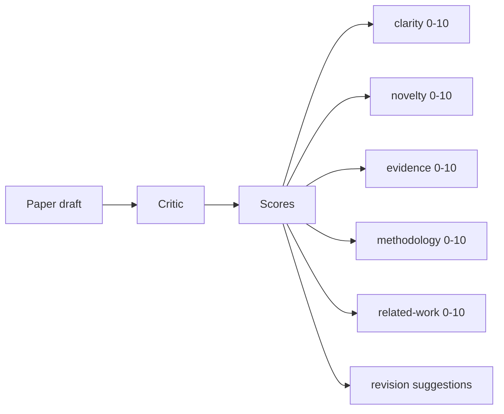
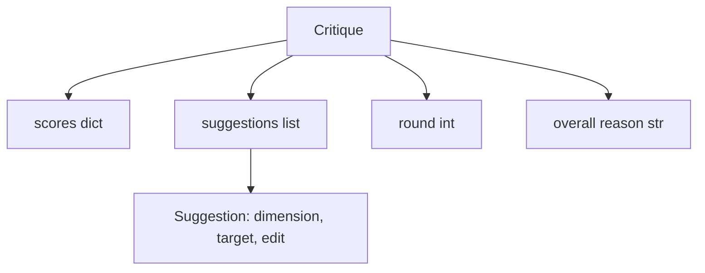
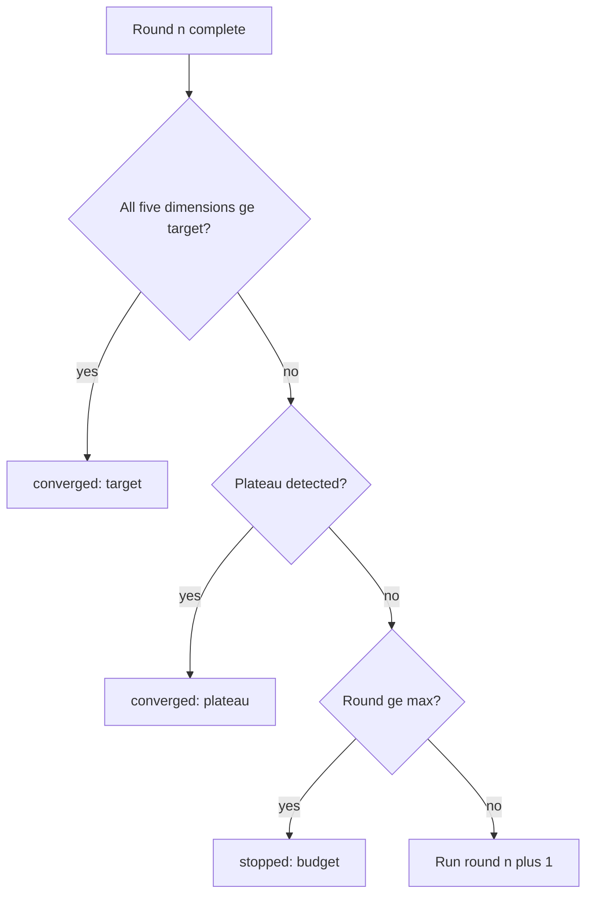
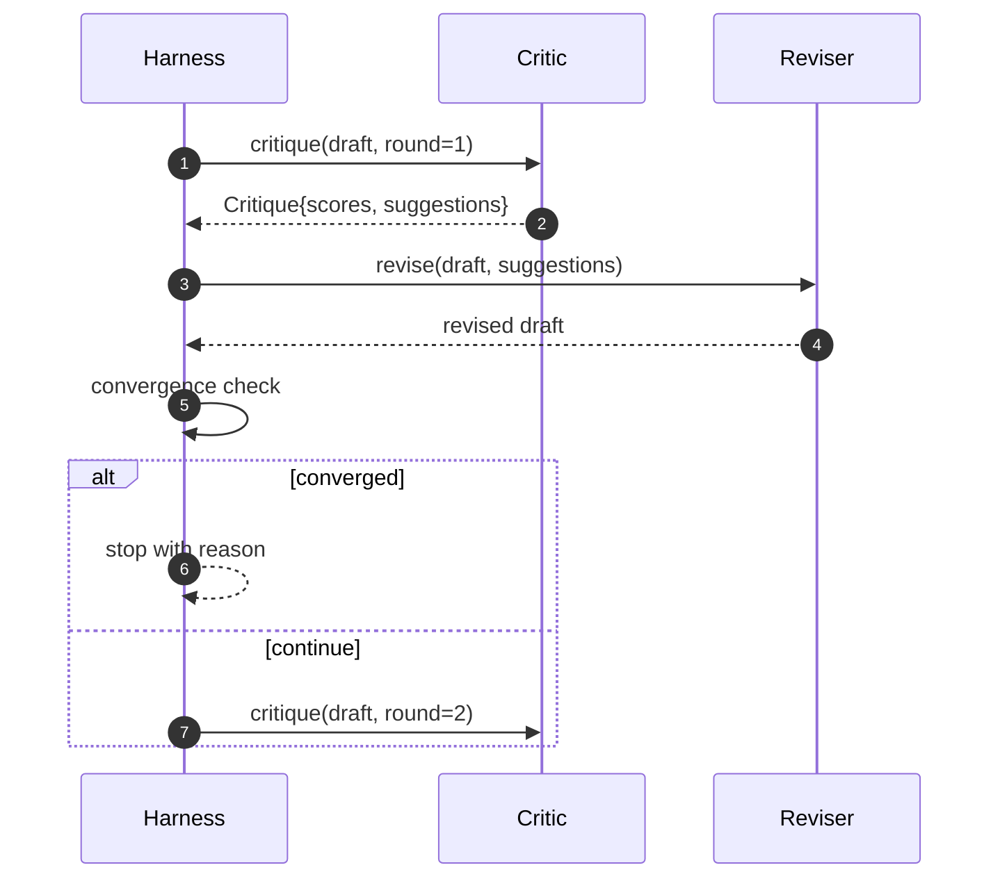

# Critic Loop

> 第一次就返回“看起来不错”的 critic 是坏的。永远返回“还需要改”的 critic 也是坏的。真正有意思的 critic 是会收敛的那个，而你必须工程化地设计收敛。

**类型:** 构建
**语言:** Python
**先修:** Phase 19 lessons 50-53
**时间:** ~90 分钟

## 学习目标

- 从 clarity、novelty、evidence、methodology、related-work 五个固定维度给论文草稿打分。
- 把每一轮 critique 作为结构化 revision diff 应用，而不是自由形式重写。
- 通过比较各轮分数检测收敛；在 plateau、达到目标或预算耗尽时停止。
- 用最大迭代预算限制轮数，避免不收敛的 critic 永远运行。
- 发出逐轮 trace，让 dashboard 或下一阶段能渲染分数轨迹。

## 为什么使用五个固定维度

freeform critic 是一个返回建议段落的模型。下一轮 revision 会把这段文字当作环境上下文。rewrite 是否处理了 criticism 无法验证，因为 criticism 从来没有结构。

五个维度给 harness 一个契约。



score 是一个向量。harness 会跨轮观察每个维度。一个提升 clarity 但拉低 evidence 的 revision，是 evidence 上的回归，而 convergence check 能看见它。纯模型 critic 无法提供这种保证。

## Critique 形状



每条 suggestion 都携带它要改善的 dimension、目标 section，以及 reviser 可应用的 `edit` 指令。reviser 也是一个 callable。本课附带一个确定性 reviser，会把 edit instruction 解释为向 section 追加内容的操作。model-driven reviser 会把同一字段解释为 prompt。契约不变。

## 收敛规则，按顺序

critic loop 会在三个条件任意一个触发时终止。



target 是最严格的情况：五个维度（clarity、novelty、evidence、methodology、related_work）中的每一个都必须达到 `>= target_score`（默认 `8.0`），loop 才返回 success。均值很高但一个维度薄弱还不够。plateau detection 会比较当前轮 mean 和上一轮 mean。如果连续两轮 improvement 都低于 `plateau_epsilon`（默认 `0.1`），loop 会以 `plateau` 退出。budget 是轮数硬上限（默认 `5`），并以 `budget` 退出。

顺序很重要。target 优先于 plateau，plateau 优先于 budget。如果第三轮达到 target，同时也会触发 plateau，结果是 `target`，不是 `plateau`。

## 为什么 plateau detection 跨两轮运行

一轮 plateau 只是噪声。真实 critic 即便面对固定 draft，每次迭代也会返回略有不同的分数，因为确定性评分仍依赖应用了哪些 suggestions 以及应用顺序。要求连续两轮 plateau 会过滤掉这种噪声。如果 harness 报告 plateau，draft 就确实停止改善了。

## 本课中的确定性 critic

本课不调用模型。附带的 critic 是一个 callable，它基于三个信号给 draft 打分：平均 section body 长度（clarity）、figure count 和 citation count（evidence）、paper metadata 上的 `originality_tag` 字段（novelty）。reviser 知道如何把每个分数向上推。

```text
clarity      grows when the average section body length increases
novelty      grows when originality_tag is set to "high"
evidence     grows when a section's figure_refs is non-empty
methodology  grows when a section titled "Method" exists with body
related-work grows when a section titled "Related Work" exists with body
```

reviser 会把每条 suggestion 解释为一次有目标的追加。第一轮之后，harness 可以观察到 score 上升。测试使用这个性质来断言 loop 会缩小差距。

## 完整 loop 契约



harness 拥有 round counter、trace 和 convergence check。critic 拥有 score。reviser 拥有 diff。三者都不触碰另外两者的状态。

## Trace 输出

每一轮都会发出一个 trace event，包含 round number、score vector、suggestion count 和 convergence verdict。完整 trace 会与 final draft 一起返回。下游 dashboard 可以渲染每轮分数图。下一课 iteration scheduler 会读取 trace，判断这个 branch 是否值得保留。

## 防止坏 critic 的 budgets

如果一个 critic 产生的 suggestions 永远不改善 score，loop 会被锁进 max-iteration ceiling。trace 会让这一点可见：五轮、scores 持平、verdict 为 `budget`。用户会把它读成 critic bug，而不是 draft bug。另一种做法是只暴露 final draft，但那会隐藏诊断。trace-first design 会把问题浮出来。

## 如何阅读代码

`code/main.py` 定义 `Critique`、`Suggestion`、`Critic` protocol、`Reviser` protocol、`CriticLoop`，以及一个 `make_deterministic_critic_pair` factory，用于返回确定性 critic 和匹配的 reviser。还包含一个最小 `Paper` 形状，让本课可以独立运行。

`code/tests/test_critic_loop.py` 覆盖：第一轮之后的单调改善、tuned draft 上的 target convergence、两个 flat rounds 后的 plateau detection、没有 suggestion 能改善时的 budget exhaustion、reviser 应用 suggestion、trace shape。

## 继续扩展

真实实现会想要两个扩展。第一，dimension weights：workshop paper 会更重视 novelty 而不是 methodology；journal paper 则相反。convergence check 会变成 weighted mean。第二，paired critics：一个 critic 打分，第二个 critic 在 reviser 看到 suggestions 之前裁决它们。二者都有价值，并且都能组合到同一个 `Critique` 形状上。

赌注是 score vector。一旦 critique 变成结构化数据，其他每个改进、收敛规则、dashboard、paired critic，都能接入而不改变 loop。
