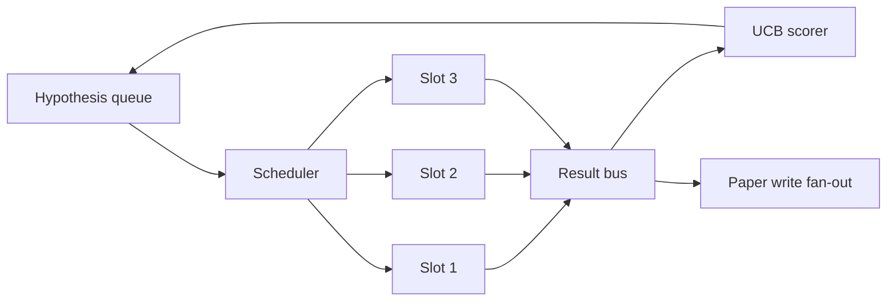
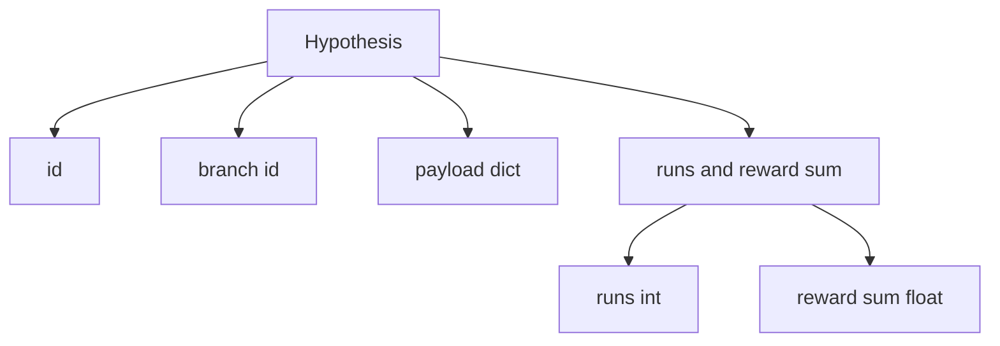
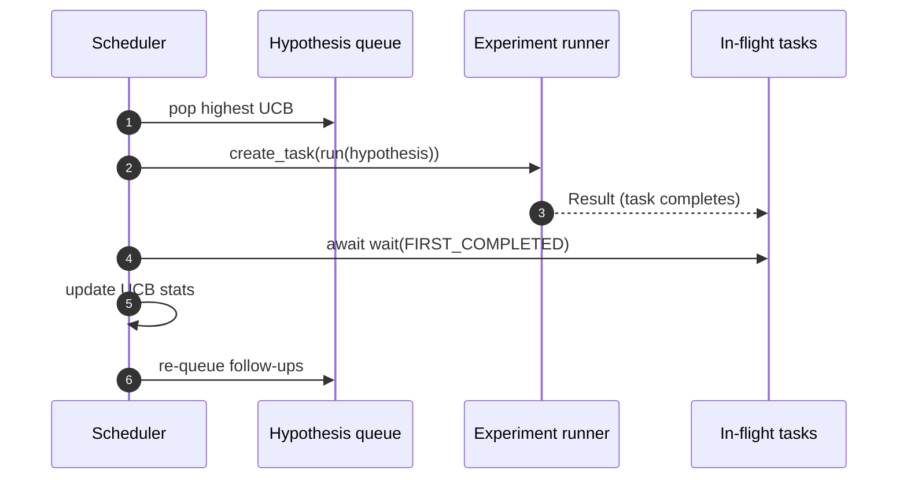

# 迭代调度器

> 没有 scheduler 的 research loop，只是一个自以为聪明的 queue。scheduler 是 loop 决定停止探索什么的地方，而这个决定就是整场游戏。

**类型:** Build
**语言:** Python
**先修:** Phase 19 lessons 50-53
**时间:** ~90 minutes

## 学习目标

- 将 research workflow 建模为 hypothesis queue，它向并行 experiment slots 供给任务，并把结果扇回队列。
- 使用 asyncio 并发运行多个 experiments，让 scheduler 始终保持所有 slots 忙碌。
- 用 UCB 为每个 hypothesis branch 打分，让 scheduler 在不放弃 exploration 的前提下剪掉低收益 branches。
- 将完成的结果 fan out 到 paper-write stage 和 re-queue stage，让高收益 branch 生成 follow-up hypotheses。
- 暴露每次 iteration 的 trace，其中包含 branch scores、slot occupancy 和 pruning decisions。

## 要解决的问题

扁平 worklist 会按提交顺序运行 jobs。当每个 job 都彼此独立时，这没有问题。Research 并不独立：experiment three 的发现会改变 experiments four 和 five 的优先级。一个能读取 result fan-in 并重新排序 queue 的 scheduler，会在每单位 compute 上完成更多有用工作。

有趣的设计选择是 scoring rule。greedy scorer 总是挑当前 leader，永远不探索。uniform scorer 永远不利用已有收益。UCB（upper confidence bound）是中间道路：利用 leader，同时为尝试次数更少的 branches 保留容量。

## 系统形态



queue 持有 hypotheses。scheduler 在 slot 释放时选择 UCB 最高的 hypothesis。每个 slot 异步运行一个 experiment。完成的 experiments 会把 result 扇出到 bus 上。bus 更新来源 branch 的 UCB statistics，并在某个 branch 的 yield 跨过阈值时 fan out 到 paper-write stage。

## Hypothesis 形态



`branch` 是 UCB statistics 的 key。多个 hypotheses 可以共享一个 branch（branch 是 research direction；hypothesis 是其中一次 trial）。`runs` 是该 branch 已完成 experiments 的计数，`reward_sum` 是累计 reward。UCB 会读取两者。

## UCB 打分

本课使用的 UCB 公式是经典 UCB1。

```text
ucb(branch) = mean_reward(branch) + c * sqrt( ln(total_runs) / runs(branch) )
```

`total_runs` 是所有 branches 上已完成 experiments 的总数。`c` 是 exploration weight；本课默认是 `sqrt(2)`。零次运行的 branch 会得到 `+inf`，因此未尝试的 branches 总会先被调度。mean reward 高的 branch 会一直保持高分，直到其他 branches 追上；运行许多次但 reward 不高的 branch 会被运行次数更少的 alternatives 超过。

pruning gate 与 picker 是分开的。当某个 branch 在至少 `prune_after_runs` 次 trials（默认 `3`）之后 mean reward 低于绝对 floor（默认 `0.2`）时，pruning 会把它从未来调度中移除。这会让 queue 保持有界。

## 使用 asyncio 的并行槽位

scheduler 使用 `asyncio.create_task` 驱动 experiments。每个 task 运行 experiment runner（一个 `async def` callable），并返回 `Result`。主循环用 `asyncio.wait(..., return_when=asyncio.FIRST_COMPLETED)` 等待 in-flight tasks 集合，并在每个 task 完成时触发 scoring update。



三个 slots 会并发运行。主循环绝不会阻塞在单个 experiment 上。只要某个 slot 释放，scheduler 就继续启动新的 tasks，直到 queue 为空且没有 in-flight tasks。

## Fan-out：paper triggers

当某个 branch 的 mean reward 跨过 `paper_threshold`（默认 `0.7`），且该 branch 尚未产出 paper 时，scheduler 会把一个 `paper.trigger` event 扇出到 output list 上。下游 lesson fifty-four 的 paper writer 会拾取它。本课把 trigger 捕获为 list，这样 tests 就可以断言它。

## Fan-out：follow-up hypotheses

当高收益 result 到达时，scheduler 可以调用用户提供的 `expander`，在同一个 branch 上生成一个或多个 follow-up hypotheses。expander 是从 `Result` 到 `list[Hypothesis]` 的 pure function。本课附带一个 deterministic expander：任何 reward 超过 paper threshold 的 result 都会生成两个 follow-ups。

## Budgets

两个 budgets 保护 scheduler，避免 runaway loops。

```text
max_experiments    : total count of experiments run across all branches
max_seconds        : wall-clock cap (asyncio time)
```

任一 budget 触发时，scheduler 都会停止调度新 tasks，等待 in-flight tasks 完成，并返回 final trace。trace 包含 `stop_reason`。

## Trace 与最终报告

每个 scheduling decision（pick、dispatch、result、prune、fan-out）都会发出一个 event。final report 会汇总 per-branch stats、total runs、total wall-clock，以及已触发的 paper triggers。下一课 end-to-end demo 会读取这个 report 来驱动 paper writer。

## 如何阅读代码

`code/main.py` 定义 `Hypothesis`、`Result`、`BranchStats`、`IterationScheduler`，以及一个 `make_deterministic_runner` factory；该 factory 返回一个 reward 可预测的 asyncio experiment runner。runner 会 sleep 固定 `delay_ms`（默认 `5ms`），因此 concurrency 是可观察的。

`code/tests/test_scheduler.py` 覆盖：UCB 会先选择未尝试 branches、并行 slot occupancy、跨过 threshold 时触发 paper triggers、低收益 trials 后 branch pruning、fan-out follow-up hypotheses，以及 budget exit（experiment count 和 wall clock 两种）。

## 延伸阅读

真实实现会需要三个扩展。第一，跨 sessions 持久化 UCB stats：当前 statistics 存在内存中；真实 scheduler 应该 checkpoint 它们，这样 restart 后能保留已经花掉的 exploration budget。第二，多目标 scoring：每个 result 不再发出 scalar reward，而是发出 vector，UCB 变成 Pareto-style picker。第三，contextual bandits：picker 以 hypothesis features（length、complexity）为条件，让相似 hypotheses 共享 exploration。

scheduler 是 research 超越 worklist 的地方。一旦 UCB 接好、slots 并行运行，其他任何改进都能组合在其上。
