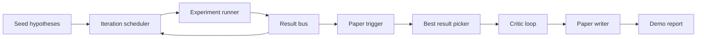
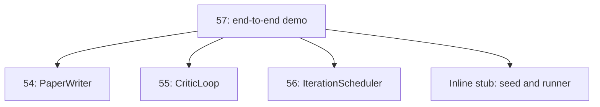
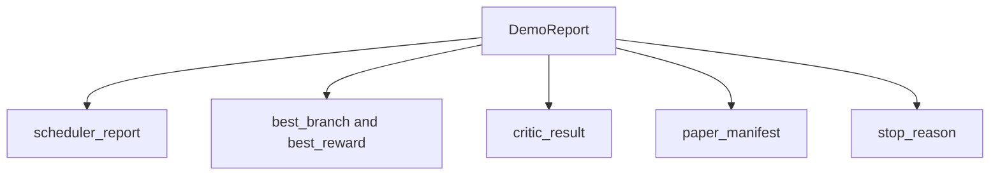

# 端到端 Research Demo

> demo 是你之前写下的每个 contract 都必须组合起来的地方。只要其中一个 contract 泄漏，demo 就是抓住它的那一课。

**类型:** Build
**语言:** Python
**先修:** Phase 19 lessons 50-53
**时间:** ~90 minutes

## 学习目标

- 端到端接好 auto-research loop：hypothesis seed、experiment runner、scheduler、critic loop、paper writer。
- 通过普通 Python imports 组合前面四个 Track D lessons 的 primitives，而不是引入 framework。
- 运行 loop 直到自终止，并发出一个列出每个 stage 输出的 demo report。
- 保持 demo deterministic，让 test suite 可以断言 final shape。
- 当任一 stage 的 contract 破裂时暴露清晰 failure mode，避免下一个 stage 在 broken input 上继续运行。

## 这里组合了什么



五个 stages。seed 是三个 hypotheses 的列表。scheduler 用三个并行 slots 在它们之上运行六个 experiments。bus 报告一个或多个 paper triggers。picker 选择单个最佳 result。critic loop 基于该 result 构建的 draft 进行迭代。paper writer 发出最终 LaTeX、BibTeX 和 manifest。

## 为什么 import，而不是复制

每个早前 lesson 都提供一个带 public dataclasses 和 functions 的 `main.py`。demo 通过把 `sys.path` 调整到每个 lesson 的 parent directory 来 import 它们。这不是 framework wiring；它与早前 lessons 中 test files 已经使用的 import 相同。



inline stub 代表 lessons fifty 到 fifty-three：一个小型 seed hypotheses generator 和一个 synchronous reward function。用户可以通过调整两个 imports，把 inline stub 替换成那些 lessons 中的真实 primitives。

## Determinism 保证

demo 从构造上就是 deterministic。experiment runner 使用 seeded numpy。critic loop 的 reviser 会按固定顺序遍历固定 dimensions。paper writer 的 prose generator 是 lesson fifty-four 中的 mocked 版本。scheduler 的 UCB picker 用 iteration order 打破 ties，而不是 random choice。

给定相同 seed，demo 会发出相同 report。test 通过运行 demo 两次并比较 manifest 来断言这个性质。

## Demo report 形态



每个 field 都逐字来自 upstream stage。demo 不转换任何输出；它只是组合它们。这正是 demo 要测试的东西。

## Failure mode 处理

每个 stage 要么成功，要么抛出 typed error。

```text
Scheduler ........ returns SchedulerReport with stop_reason
                   in {queue_empty, max_experiments, deadline}
Best-result pick . raises NoTriggerError if no paper trigger fired
Critic loop ...... returns LoopResult with status converged or stopped
Paper writer ..... raises PaperValidationError on contract break
```

任一 stage 失败都会用 typed exception 短路 demo。tests 固定了这个 contract：`test_no_triggers_raises_typed_error` 和 `test_best_picker_raises_when_no_triggers` 会断言在没有 branch 触发 trigger 时，picker 抛出 `NoTriggerError` / `BestResultError`，并且 writer 永远不会被调用。

## Best-result picker

scheduler 按 branch 发出 paper triggers。picker 会选择所有 triggers 中 mean reward 最高的 branch。ties 按 branch id 的字母序打破，因此 demo 是 deterministic 的。picker 是一个小型 pure function；test 用固定 scheduler report 固定它的行为。

## 接好 critic loop

lesson fifty-five 中的 critic loop 作用在 `MiniPaper` 上。demo 通过填入 branch id 到 abstract、播种两个 sections（Introduction 和 Results），并根据 branch 的 mean reward 设置 `originality_tag`（`>= 0.8` 为 high，`>= 0.6` 为 medium，否则为 low），从 picked branch 构建一个 `MiniPaper`。

reviser 随后把 draft 迭代到 convergence。输出会进入 paper writer。

## 接好 paper writer

lesson fifty-four 中的 paper writer 作用在带 figures 和 bibliography 的完整 `Paper` shape 上。demo 通过 `mini_to_full_paper` 升级 converged `MiniPaper`：它会为 selected branch 附加一张 figure，并基于 critic 建议的 cite keys 并集构建一个小型 synthetic bibliography。demo 添加的每个 cite 也会添加到 bibliography list，因此 validation 会通过。

## 如何阅读代码

`code/main.py` 定义 `BestResultError`、`NoTriggerError`、`DemoReport`、`pick_best_branch`、`build_mini_paper`、`mini_to_full_paper` 和 `run_demo`。顶部 imports 会一次性调整 `sys.path`，并从对应 lessons 中拉取 `PaperWriter`、`CriticLoop` 和 `IterationScheduler`。

`code/tests/test_e2e.py` 覆盖：demo 端到端运行并发出一个五个 fields 都填充好的 report、两次运行之间的 determinism、没有 branch 跨过 threshold 时的 NoTriggerError、writer contract 破裂时的 PaperValidationError、paper manifest 包含 picked branch 的 figure，以及 scheduler stop reason 属于 expected values。

## 延伸阅读

demo 变绿后，值得接入三个扩展。第一，persistent state：每个 stage 的 result 都写入一个小 JSON store，这样 restart 可以恢复，而不必重跑便宜 stages。第二，dashboard：scheduler 和 critic loop 的 trace events 渲染为一条 timeline。第三，真实 model calls：把 mocked prose generator 和 deterministic critic 换成 model-driven 版本；wiring 不需要改变。

demo 的职责是证明 composition 就是 architecture。五个 lessons，四个 imports，一个 report。下次你添加一个 stage，wiring 只会精确多一行。
