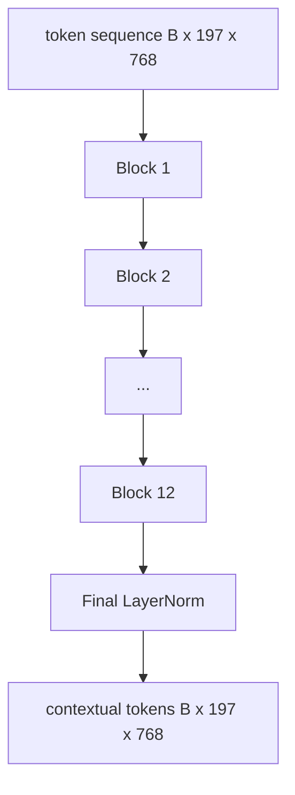
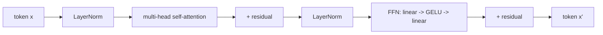

# Vision Transformer 编码器

> 只有 patches 还不会“看”。一个 12-layer pre-LN transformer，带 12 个 attention heads，会把 patch tokens 序列变成 contextual tokens 序列，并让 CLS token 在最终 hidden state 中聚合 whole-image features。本课是每个现代 vision-language model 的引擎室。

**类型:** Build
**语言:** Python
**先修:** Phase 19 lessons 30-37 (Track B foundations)
**时间:** ~90 minutes

## 学习目标

- 实现一个带 multi-head self-attention 和 feed-forward sub-layer 的 pre-LN transformer block。
- 堆叠 12 个 blocks、12 个 heads，形成 ViT-Base encoder。
- 接入 lesson 58 的 patch front end，并运行一次 forward pass。
- 验证 CLS token 会从每个 patch 聚合信息。

## 要解决的问题

patch embedding 产生 197 个 tokens 的序列，每个 token 都是一个 vector，但它不知道其他任何 patch。一张猫的图片需要每个 patch 知道哪些 patches 包含胡须、哪些包含背景、哪些包含眼睛。transformer 就是逐层建立这种 awareness 的机制。没有它，patch front end 只是一个聪明的 tokenizer，并没有理解。

标准 recipe 是十二层深、十二个 heads 宽，使用 pre-LayerNorm placement、GELU activation，以及 4x 的 feed-forward expansion。这个 recipe 是 CLIP ViT-L、SigLIP、DINOv2、Qwen-VL family、InternVL，以及 2025-2026 年所有其他 open-weight vision encoders 的主干。这个 recipe 稳定到你可以阅读其中任一 paper，并默认它使用这种 block shape，除非 paper 明确说明不是。

## 核心概念





### Pre-LN vs post-LN

Original Transformer 把 LayerNorm 放在 residual 之后。Pre-LN（在每个 sub-layer 之前应用 LayerNorm）是每个现代 vision-language model 使用的版本，因为它不需要学习率 warm-up 技巧也能稳定训练。差异只是 forward pass 中的一行，但在 depth 12+ 时 gradient flow 有天壤之别。

### Multi-head self-attention

每个 head 都把 token vector 投影到自己的 `(query, key, value)` 三元组，dimension 为 `head_dim = hidden / num_heads`。当 `hidden = 768` 且 `heads = 12` 时，每个 head 的 `dim = 64`。12 个 heads 并行 attend，然后它们的 outputs concat 回 dimension 768，并通过 output projection。multi-head 的意义是，一个 head 可以学习“attend to the cat eye”，另一个学习“attend to the background gradient”，彼此不干扰。

### 为什么 feed-forward expansion 是 4x

FFN 是 `hidden -> 4 * hidden -> hidden`，中间使用 GELU。factor 4 是经验结果，自 2017 年以来在 language 与 vision transformers 中都成立。更小（2x）会 underfit；更大（8x）在固定 data budget 下会 overfit。MLP 是 model 存储大部分 learned facts 的地方，而更宽的中间层就是它们所在的位置。

| Component | Parameters at ViT-Base scale |
|-----------|------------------------------|
| qkv projection per block | `3 * 768 * 768 = 1.77M` |
| output projection per block | `768 * 768 = 590K` |
| FFN per block (4x expansion) | `2 * 768 * 4 * 768 = 4.72M` |
| LayerNorm per block | `4 * 768 = 3K` |
| Total per block | about 7.1M |
| 12 blocks | about 85M |
| Plus front end | about 86M total |

ViT-Base 是一个 86M-parameter encoder。按 2026 标准这并不大（SigLIP-So400M 是 400M，Qwen-VL ViT 是 675M），但 architecture 除了 width 和 depth 之外是相同的。

### 要 causal mask 吗？

Vision Transformers 是 encoder-only 且 bidirectional 的：任意 token `i` 都可以 attend to 任意 token `j`。没有 mask。lesson 61 中 decoder-side cross-attention 会使用 causal mask，但在 vision encoder 内部，attention 是 fully connected 的。

### CLS token 学到了什么

CLS token 一开始是 learned parameter，本身没有 patch content，并通过每个 block 的 attention 累积信息。到 final layer 时，CLS row 是整张 image 的 vector summary；下游 heads 会把这个单一 vector 投影到 class logits、contrastive embeddings，或作为 text decoder 的 cross-attention keys。

## 动手实现

`code/main.py` 实现：

- `MultiHeadSelfAttention`，包含 `qkv` 和 output projections、scaled-dot-product attention math，以及 shape assertions。
- `FeedForward`，4x-expansion GELU MLP。
- `Block`，一个用 residuals 组合 attention 和 feed-forward sub-layers 的 pre-LN block。
- `ViT`，12 个 blocks 的 stack，带 final LayerNorm。
- `VisionEncoder`，把 lesson 58 的 `VisionFrontEnd` 接到 `ViT` stack，并暴露一个返回 contextual sequence 和 pooled CLS vector 的 `forward()`。
- 一个 demo：将 synthesized 224x224 fixture image 送过完整 encoder，并打印 input shape、output shape、parameter count，以及每隔一层的 CLS norm。

运行：

```bash
python3 code/main.py
```

输出：fixture 会被编码为 `(1, 197, 768)` tensor。CLS norm 会随着 layers 组合而向上漂移，然后在 final LayerNorm 处稳定。Total parameters 报告约为 86M。

## 实际使用

这里定义的 encoder，除了 width 和 depth 之外，就是 2025-2026 年每个 open-weight VLM 内部使用的同一套 block stack。差异在于：

- **Width and depth.** ViT-Large 是 `hidden=1024, depth=24, heads=16`；SigLIP So400M 是 `hidden=1152, depth=27, heads=16`。同一个 block。
- **Pooling head.** CLS pooling（本课）vs average pooling（SigLIP）vs attention pooling（后来的 VLMs）。
- **Position handling.** fixed sinusoidal（lesson 58）vs learned 1D vs ALiBi vs 2D RoPE。block math 不变。
- **Register tokens.** DINOv2 prepends 4 个额外 learned tokens。一行代码。

这套 block stack 是 substrate。接下来的 lessons（60-63）站在它上面。

## 测试

`code/test_main.py` 覆盖：

- 单个 block 保持 shape，并且对 input batch size 不变
- attention scores 在 key axis 上求和为一（softmax sanity）
- residual paths 已接好（zero input 仍会通过 CLS token 产生 non-zero output）
- 4-layer stacked forward pass 产生正确 shape
- gradients 会从 CLS output 流向 patch projection

运行：

```bash
python3 -m unittest code/test_main.py
```

## 练习

1. 添加 register tokens（4 个 learned vectors，在 CLS 之后 prepend）并重新运行。通过 last layer 上 softmax distribution 的 entropy 比较 attention map smoothness。

2. 将 pre-LN 换成 post-LN，并在 synthetic shape classifier 上训练一个 epoch。观察哪一种不需要 LR warm-up 也能稳定训练。

3. 将 causal masking 实现为 `attn_mask` argument，让同一个 block 可以复用为 decoder block。mask shape 是 `(seq, seq)`，lower-triangular。

4. 使用 `torch.profiler` 在 batch sizes 1、8、64 下 profile 一次 forward pass。主导 wall time 的是 MLP layer，而不是 attention。

5. 将某个 attention head 的 q-k-v projections 替换为 low-rank LoRA adapter，freeze 其余部分，并验证 gradient 只在预期位置流动。

## 关键术语

| Term | What it means |
|------|---------------|
| Pre-LN | 在每个 sub-layer 之前而不是之后应用 LayerNorm |
| Self-attention | 每个 token attend to 同一 sequence 中的所有其他 tokens |
| Multi-head | hidden dim 被拆分到 `H` 个独立 attention heads 中 |
| FFN expansion | feed-forward layer 先扩宽到 `4 * hidden`，再收缩回来 |
| CLS pooling | 使用第一个 token 的 final hidden state 作为 image summary |

## 延伸阅读

- An Image is Worth 16x16 Words (ViT, 2021)，关于 encoder recipe。
- DINOv2 (2023)，关于 register tokens 和 self-supervised pretraining objective。
- SigLIP (2023)，关于 average-pooling variant，以及 lesson 62 中使用的 sigmoid contrastive loss。
