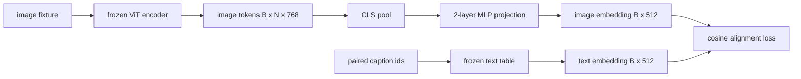

# 模态对齐投影层

> vision encoder 产生 image tokens。text decoder 消费 text tokens。两者生活在不同 vector spaces 中。一个小型 two-layer MLP 会把 image tokens 投影到 text embedding space 中，而针对 paired caption 的 cosine alignment loss 会把两个 spaces 拉到一致。这个 projection 是 vision-language model 中最小的一块，也是对 transfer 最关键的一块。

**类型:** Build
**语言:** Python
**先修:** Phase 19 lessons 30-37 (Track B foundations)
**时间:** ~90 minutes

## 学习目标

- 构建 two-layer MLP projection，将 image features 映射到 text embedding space。
- 构造 mock text embedding table（不使用 pretrained tokenizer，也不使用真实 corpus）。
- 计算 projected image tokens 与 paired caption embedding 之间的 cosine alignment loss。
- 在 frozen vision encoder 和 frozen text table 下，只训练 projection。

## 要解决的问题

你有一个 vision encoder（lessons 58-59），它产生 dimension 为 `vision_hidden = 768` 的 tokens。你有一个想接在上面的 text decoder，它的 embedding dimension 是 `text_hidden = 512`（任何其他数字也一样合理）。decoder 期望 text-shaped tokens。image tokens 不是 text-shaped：它们生活在 encoder 在 vision-only pretraining 中学到的 basis 中，与 decoder 的 word vectors 没有关系。

Two-layer MLP projection（linear、GELU、linear）桥接这个 gap。它足够小（大约 `768 * 1024 + 1024 * 512 = 1.3M` parameters），可以在单张 GPU 上数分钟内训练，并且它是 alignment phase 中唯一必须学习的部分。vision encoder 保持 frozen。text embedding table 保持 frozen。只有 projection 会移动。这是 LLaVA 在 2023 年发布的 recipe，BLIP-2 将其重塑为 Q-Former，之后每个 open-weight VLM 都以某种形式采纳了它。

## 核心概念



### projection 前的 pooling

vision encoder 发出 197 个 tokens。text 侧有一个 caption-level embedding。要对齐它们，每个 sample 需要一个 image-level vector。CLS pooling 最简单：取 encoder 的第一个 token 并投影它。对全部 197 tokens 做 mean pooling 是另一个选择，也是 SigLIP 使用的方式。两者都会把 197 个 vectors 池化成一个。

### 为什么是两层，而不是一层

单个 linear projection 可以旋转和缩放，但如果两个 spaces 有 curvature mismatches，它无法修复 basis。两个 linear layers 中间的 GELU 给 projection 一个 non-linear bend；经验上这足以把 CLIP-style features 对齐到 language model embeddings。更深的 projections（LLaVA-NeXT 使用 GLU；Qwen-VL 使用一叠 attention layers）是扩展；two-layer MLP 是 canonical baseline，也是 BLIP-2 的 Q-Former projection head 在底层携带的形态。

| Layer | Shape | Parameters |
|-------|-------|------------|
| fc1 | `(vision_hidden, projection_hidden)` | `768 * 1024 + 1024` |
| activation | GELU | 0 |
| fc2 | `(projection_hidden, text_hidden)` | `1024 * 512 + 512` |

对于 `768 -> 1024 -> 512` head，约 1.3M parameters。

### Cosine alignment loss

Align 并不意味着 `image_emb == text_emb`。Align 意味着 `image_emb` 在 joint space 中与 `text_emb` 指向相同方向。cosine loss 是 `1 - cos_sim(image, text)`，范围从 0（perfectly aligned）到 2（opposite）。训练会让每个 pair 的 loss 趋近于零。lesson 62 会泛化到 contrastive batch（InfoNCE），在那里每张 image 都必须比 batch 中任何其他 caption 更接近自己的 caption；本课使用 per-pair 版本，让 dynamics 更可见。

### Frozen encoder 是关键

vision encoder 有 86M parameters。text table 还有几百万。用 mock corpus 训练所有参数从一开始就不可行。freeze 两者意味着 projection 的 1.3M parameters 是唯一变化的部分，在 synthetic pairs 上几百步就足以把 loss 拉低。这正是每个 adapter-based VLM 的 operational shape：重的部分保持 frozen，轻的 bridge 负责训练。

## 动手实现

`code/main.py` 实现：

- `MLPProjector(in_dim, hidden_dim, out_dim)`，带 GELU activation 的 two-layer linear MLP。
- `MockTextEmbedding(vocab_size, dim)`，一个从 seed deterministic init 的 frozen embedding table。
- `make_pair(seed, vocab_size)`，合成一个 paired (image, caption) sample。captions 是短 id sequences；caption embedding 是 token embeddings 的 mean-pool。
- `cosine_alignment_loss(image_emb, text_emb)`，per-pair `1 - cos_sim` objective。
- 一个 training loop：在 32 个 synthetic pairs（循环使用）上训练 projection 200 steps，vision encoder 和 text table 保持 frozen，并每 25 steps 打印 loss。

运行：

```bash
python3 code/main.py
```

输出：training report 会从约 1.07 的 initial loss 降到 200 steps 内约 0.80，展示仅靠 projection 就能把 image tokens 拉向 text space。final cosine similarity per pair 也会被打印。

## 实际使用

同一模式出现在每个 open-weight VLM 中：

- **LLaVA 1.5.** 从 CLIP-ViT-L hidden 到 LLaMA embedding dim 的 two-layer GELU MLP projection。Frozen vision encoder、frozen LLM，只训练 projection（然后在 stage two 中 unfreeze LLM）。
- **BLIP-2.** Q-Former 用 32 个 learned query tokens 通过 cross-attention 读取 image tokens，然后投影到 LLM embedding dim。Q-Former 最末端的 projection head 就是本课 MLP 的对应物。
- **MiniGPT-4.** 从 BLIP-2 Q-Former output 到 Vicuna embedding dim 的 single linear projection。
- **Qwen-VL.** 带数层的 cross-attention adapter，但最终部分仍然是到 LM embedding dim 的 projection。

shape 会变化，但 role 完全相同：pool image tokens，project 到 text embedding dim，单独训练。

## 测试

`code/test_main.py` 覆盖：

- projector output shape 匹配配置的 `out_dim`
- frozen text embedding table 没有任何 `requires_grad` parameters
- cosine loss 在 identical vectors 上为零，在 anti-parallel vectors 上为 2
- projector gradient 在一次 backward pass 后流动
- training loop 让 step 0 到 step 200 之间的 loss 降低

运行：

```bash
python3 -m unittest code/test_main.py
```

## 练习

1. 将 CLS pooling 替换为对 196 个 patch tokens 的 mean pooling，并比较 200 steps 后的 final loss。mean pooling 通常在 synthetic data 上训练更快；CLS 在 natural images 上 sample-efficient 更高。

2. 给 cosine loss 添加一个 learned scalar temperature（`cos / tau`），并观察当 `tau` 太小（gradient noise）或太大（loss plateaus high）时会发生什么。

3. 将 two-layer MLP 换成 single linear layer，并量化 loss gap。non-linearity 在 natural image features 上更重要，在 synthetic ones 上较不重要。

4. 对 projector weights 添加一个小 L2 penalty，并观察它与 cosine alignment 的相互作用（cosine 是 scale-invariant，因此 penalty 主要会收缩 unused directions）。

5. 持久化 projector weights，然后 reload 并在没有 vision encoder backward pass 的情况下运行 inference，以验证 deploy time 只需要 projector。

## 关键术语

| Term | What it means |
|------|---------------|
| Modality alignment | 让 image 和 text embeddings 能在一个 shared space 中比较的行为 |
| Projection head | 将一个 space 映射到另一个 space 的小模块，通常是 2-layer MLP |
| Cosine similarity | dot product 除以两个 L2 norms 的乘积 |
| Frozen encoder | vision（或 text）model 的所有 parameters 都是 `requires_grad=False` |
| Mock corpus | synthetic pairs，让 training 不依赖 dataset download |

## 延伸阅读

- LLaVA paper，关于 two-stage train（先 project，再 unfreeze LM）。
- BLIP-2 paper，关于 Q-Former 作为 learnable projection alternative。
- Qwen-VL technical report，关于 cross-attention adapters 作为更深的 projection heads。
