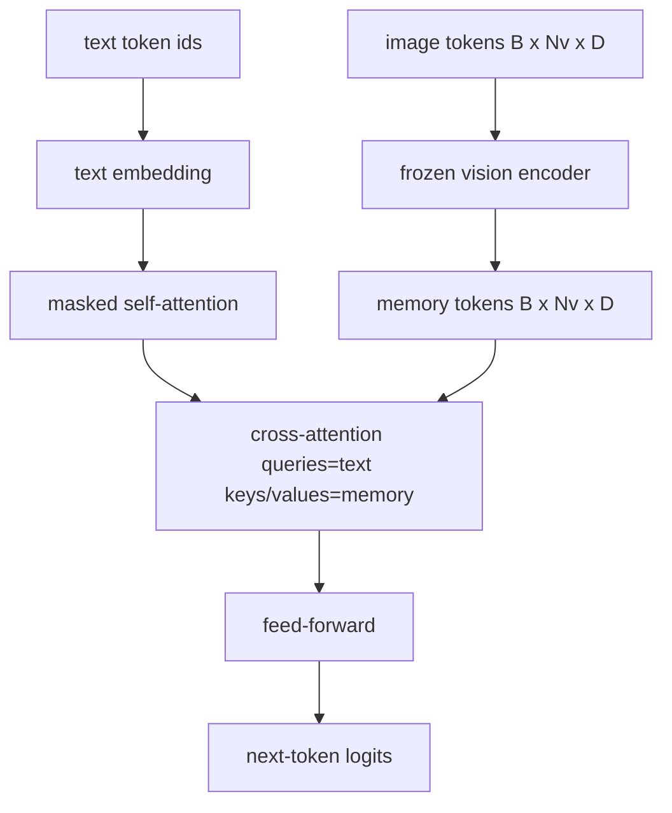
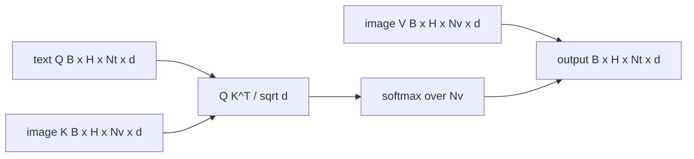

# Cross-Attention 融合

> projection layer 将一个 image vector 与一个 caption vector 对齐。真实的 vision-language decoder 需要每个 text token 都 attend to 每个 patch token，这样 model 才能把每个词 grounding 到一个区域。Cross-attention 就是这种 grounding 发生的方式。text 发起 queries；vision keys 和 values 作答。本课会构建 cross-attention block、causal text self-attention，以及让两者都合法的 mask shapes。

**类型:** Build
**语言:** Python
**先修:** Phase 19 lessons 30-37 (Track B foundations)
**时间:** ~90 minutes

## 学习目标

- 实现 multi-head cross-attention，其中 query stream 是 text，key/value stream 是 vision。
- 组合一个 decoder block：causal self-attention + cross-attention + feed-forward。
- 正确处理 mask shapes：self-attention 使用 causal mask，cross-attention 不使用 mask。
- 用 batched text tokens 和固定 image tokens 池运行一次 forward pass。

## 要解决的问题

把 image tokens 和 text tokens 连接成一个序列是一种 fusion 选项（early fusion，Chameleon 和 Emu3 采用的路径）。Cross-attention 是另一种（late fusion，Flamingo 引入并被之后所有 Flamingo-shaped decoders 复制的路径）。在 late fusion 中，text decoder 在 text-only tokens 上运行，并在每层通过 cross-attention 伸手读取 image stream。

Late fusion 有两个优势。第一，text stream 保持干净，model 保留 text-only capabilities。第二，image stream 每张 image 只计算一次，并在每个 decode step 中复用，因此即使生成长 captions 也很便宜。代价是每个 block 多一个 attention sub-layer。

## 核心概念





### Mask shapes

decoder block 内部的两种 attention 需要不同 masks：

| Attention | Query length | Key length | Mask | Why |
|-----------|--------------|------------|------|-----|
| Self-attention | `Nt` (text) | `Nt` (text) | Causal: lower-triangular `(Nt, Nt)` | Text tokens 在 autoregression 期间不能向前看 |
| Cross-attention | `Nt` (text) | `Nv` (vision) | No mask | 整张 image 对每个 text position 都可见 |

本课包含一个 shape-validation function，因此把两者弄混的错误会以 `ValueError` 暴露，而不是变成悄悄坏掉的 loss curve。

### 为什么 cross-attention 不使用 mask

image 在生成任何 text 之前已经完全观测到。caption 的 token `t` 可以 attend to image 的任意 patch；image patches 上没有 temporal order。一些 Flamingo variants 在 interleaving multiple images 和 text segments 时会添加 per-sample masking pattern，但对于单张 image 加一条 caption，cross-attention 会看到全部内容。

### Key/value caching

image keys 和 values 在 decode 开始时计算一次并保存在 cache 中。每个新 text token 都使用 cache，不需要重新计算。这就是 captioning inference 快的原因：heavy ViT 运行一次；cross-attention 在每一步复用它的 keys 和 values。本课暴露 cache，并测试 cache-hit path。

### Block composition

decoder block 的运行顺序是：pre-LN -> self-attention -> residual -> pre-LN -> cross-attention -> residual -> pre-LN -> feed-forward -> residual。三个 sub-layers 各有自己的 LayerNorm。Flamingo paper 在 cross-attention 上添加了 learned gate，让 model 可以选择退出 image path，代价是 training-time stability；这里使用的 canonical baseline 没有 gate。

```python
class DecoderBlock:
  def forward(self, text_tokens, image_tokens, text_mask, cross_mask):
      text_tokens = text_tokens + self.self_attn(self.ln1(text_tokens),
                                                 mask=text_mask)
      text_tokens = text_tokens + self.cross_attn(self.ln2(text_tokens),
                                                  image_tokens,
                                                  mask=cross_mask)
      text_tokens = text_tokens + self.ffn(self.ln3(text_tokens))
      return text_tokens
```

## 动手实现

`code/main.py` 实现：

- `CrossAttention(hidden, heads)`，带独立 `q` 和 `kv` projections 的 multi-head cross-attention。
- `CausalSelfAttention(hidden, heads)`，来自标准 decoder 的 masked self-attention。
- `DecoderBlock`，用 pre-LN residuals 组合三个 sub-layers。
- `VisionLanguageDecoder`，四层 decoder，由 mock vision encoder output 和小型 text embedding table 喂入。
- `causal_mask(length)`，返回 `(length, length)` lower-triangular boolean tensor。
- 一个 demo：喂入 batch size 为二、text sequence length 为 10、image memory length 为 197 的数据，并打印 output shape、self-attention mask shape，以及 cross-attention output norm per position。

运行：

```bash
python3 code/main.py
```

输出：decoder 产生 `(2, 10, text_vocab)` logits tensor。Mask shape 是 `(10, 10)`。KV-cache reuse check 会确认 cached 与 uncached paths 的 logits 相同。

## 实际使用

Cross-attention 出现在两个 production families 中：

- **Flamingo and IDEFICS.** 每 K 个 language model blocks 插入一个 cross-attention sub-layer，并使用 frozen LM。vision-language adapter 是 cross-attention block 加它的 gate。
- **BLIP-2.** Q-Former 使用一组固定的 32 个 query tokens，对 image features 做 cross-attention，然后把 queries 投影到 LM embedding space。

本课中的 block shape 可以直接映射到二者。mask discipline（self 上 causal，cross 上 none）是相同的。

## 测试

`code/test_main.py` 覆盖：

- causal mask 是 lower-triangular，并匹配 expected boolean shape
- cross-attention output shape 是 `(B, Nt, hidden)`，与 key length 无关
- KV-cache path 与 uncached path 在 float tolerance 内匹配
- text 与 image streams 之间的 shape mismatch 会抛出清晰的 `ValueError`
- 完整 decoder forward pass 产生正确 batch 和 sequence shape

运行：

```bash
python3 -m unittest code/test_main.py
```

## 练习

1. 给 cross-attention residual 添加 learned tanh gate（Flamingo trick），并验证 training 会从接近零的 initial gate 开始 converge。gate 从 0 开始；model 在混入 image stream 之前恢复 text-only behavior。

2. 实现 interleaved attention，让同一个 decoder 消费 multiple images 加 multiple text segments。构建 per-sample cross-attention mask，防止 text segment 2 attend to image 1。

3. 在 `Nt=64, Nv=576`（higher resolution 下的 24x24 grid）时 profile cross-attention vs self-attention layer。cross-attention cost 是 `Nt * Nv`，在高 image resolution 下会主导。

4. 在 cross-attention map 上添加 query-side dropout，并测量 demo 上的 caption diversity（cross map 中 dropout 增大时，caption sample variance 会增加）。

5. 将 cross-attention layer 替换为 Q-Former-style attention block，其中固定的 32-token query pool 每层 attend to image features 一次。

## 关键术语

| Term | What it means |
|------|---------------|
| Late fusion | text 和 vision 保持在独立 streams；cross-attention 在每个 block 桥接它们 |
| Cross-attention | Q 来自一个 stream，K 和 V 来自另一个 stream |
| Causal mask | lower-triangular boolean mask，防止 autoregression 期间向前看 |
| KV cache | image keys 和 values 存储一次，并在每个 decode step 复用 |
| Memory tokens | decoder 伸手读取的 frozen image tokens |

## 延伸阅读

- Flamingo (2022)，关于带 gated cross-attention 的 canonical late-fusion design。
- BLIP-2 (2023)，关于 Q-Former，也就是装扮成 learned query pool 的 cross-attention block。
- IDEFICS (2023)，关于 Flamingo recipe 的 open-weight reproduction。
