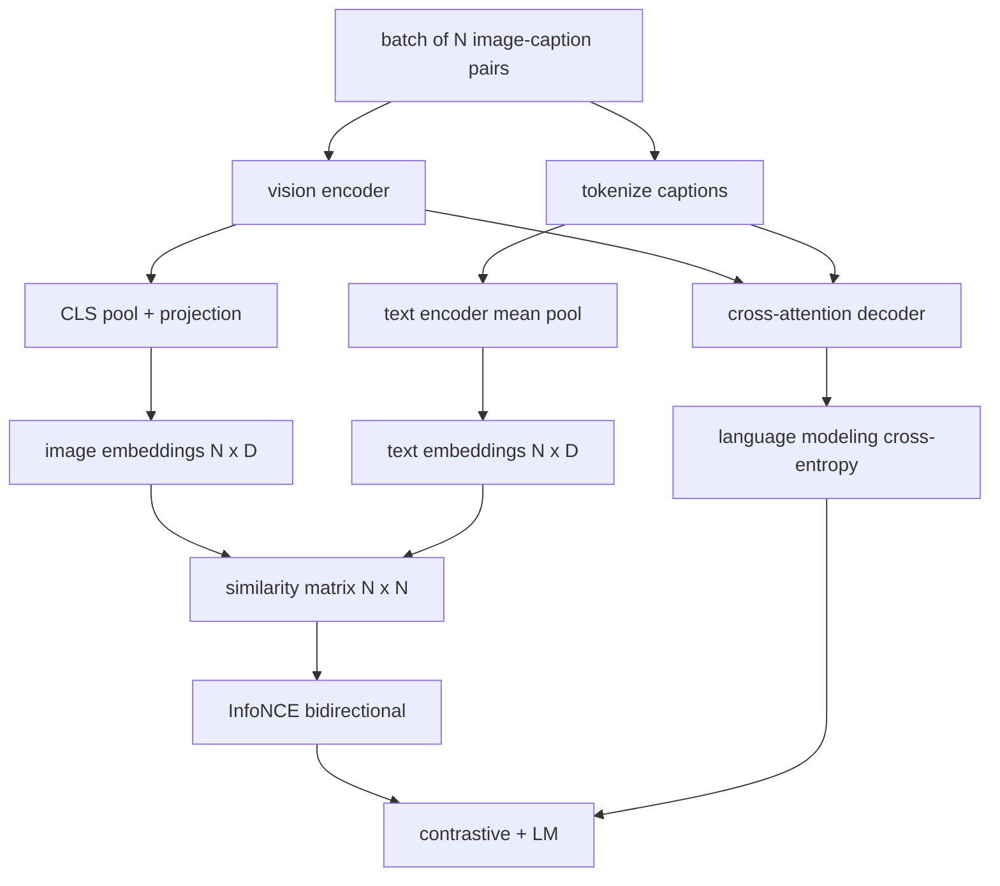

# Vision-Language 预训练

> encoder、projection 和 decoder 已经接好。现在把它们一起训练。两个 objectives 驱动学习：contrastive image-text loss（InfoNCE）把 matching pairs 拉到 joint embedding space 中靠近彼此；language modeling loss 要求 decoder 为每张 image 写 caption。组合起来，它们既教会 network 为 caption 找到正确 image，也教会它为 image 写 caption。

**类型:** Build
**语言:** Python
**先修:** Phase 19 lessons 30-37 (Track B foundations)
**时间:** ~90 minutes

## 学习目标

- 在一批 image-caption pairs 上实现 InfoNCE contrastive loss。
- 将 contrastive loss 与 autoregressive language modeling loss 组合起来。
- 不下载真实 dataset，合成一个 200-pair mock image-caption corpus。
- 运行 50-step demo training loop，并观察两个 losses 都在下降。

## 要解决的问题

vision-language model 需要两种技能。它必须会 ranking：给定 caption，在许多 images 中找到正确 image。它也必须会 generate：给定 image，写出 caption。只在一种技能上 pretrain model，会得到半个系统。CLIP 做好了 ranking，但不能 caption。GPT-4V 可以 caption，但 ranking 使用单独的 retrieval head。Multi-objective pretraining 在一次 pass 中得到两者。

InfoNCE 处理 ranking 这一半。对于 N 个 pairs 的 batch，model 把 N 个 matching pairs 作为 positives，把 `N^2 - N` 个 mismatched pairs 作为 negatives，然后在得到的 `(N, N)` similarity matrix 上运行 cross-entropy loss。LM loss 处理 generation 这一半：在 image 条件下做标准 next-token prediction。两个 losses 都可微，并且可以共享 encoder、projector 和 decoder weights。

## 核心概念



### InfoNCE 一段话版

把 N 个 image embeddings 作为 rows stack 起来，把 N 个 text embeddings 也作为 rows stack 起来。对二者做 L2-normalize。计算 `N x N` matrix `S = I T^T / tau`，其中 `tau` 是 learned temperature。diagonal entries 是 matching pairs；off-diagonal entries 是 negatives。用沿 diagonal 运行的 target `argmax` 应用 cross-entropy：row `i` 应该在 column `i` 有最高 entry。对 columns 对称地再做一次。total 是两者平均。这就是八行代码里的 CLIP loss。

### Temperature 很重要

temperature `tau` 控制 softmax 有多尖。太小（例如 `tau = 0.01`）时，gradient 几乎只来自最 hard 的 negative，training 会很 noisy。太大时，softmax 变平，gradient 消失。CLIP 把 `tau` 作为 parameter 学习；这里的 demo 也这样做。

### Language modeling loss

decoder 通过 cross-attention 消费 image memory tokens，并在每个 position 预测下一个 text token。Loss 是标准 cross-entropy，target 是 next-position。Padding positions 会从 loss 中 mask out。

### 组合 losses

`total = contrastive + lm_weight * lm`，其中 `lm_weight` 是 scalar（通常为 1.0）。两个 losses 共享流向 encoder 和 projection 的 gradients；只有 decoder 接收 LM-loss gradient。这是 CoCa、BLIP 和 SigLIP-style models 都在使用的 multi-task recipe，只是 weightings 各有不同。

| Component | Loss surface | Affects |
|-----------|--------------|---------|
| InfoNCE | Pair ranking in the joint space | Encoder + projection + text head |
| LM | Token prediction conditioned on image | Encoder + projection + decoder |
| Combined | Multi-task | Whole stack |

### 为什么 50 steps 对 demo 足够

mock corpus 是一个 synthetic 200-pair set，包含 random images 和 random caption ids。用 batch size 16 训练 50 个 SGD steps 后，即使 absolute values 仍高于真实数据模型能达到的水平，两个 losses 也会明显下降。demo 的重点是确认 gradient plumbing 端到端可用，并且添加 LM loss 不会破坏 contrastive objective。

## 动手实现

`code/main.py` 实现：

- `MultimodalModel`，组合一个小型 ViT encoder、MLP projector、tiny text-side encoder（对 embedded ids 做 mean-pool），以及 lesson 61 的 cross-attention decoder。
- `info_nce_loss(image_emb, text_emb, temperature)`，bidirectional CLIP-style contrastive loss。
- `lm_loss(logits, target_ids, padding_id)`，masked next-token cross-entropy。
- `make_mock_corpus(seed, n_pairs)`，返回 200 个 deterministic (image, caption_ids) pairs。
- 一个 training loop：batch size 16、Adam optimizer、learned log-temperature parameter，运行 50 steps。两个 losses 每 5 steps 打印一次。

运行：

```bash
python3 code/main.py
```

输出：contrastive loss 会从约 `ln(16) = 2.77` 降向 2.4；LM loss 会从 random-uniform baseline `ln(512) ≈ 6.24` 降到约 4.7。两者都下降，证明 gradient 已正确接好。真实模型会训练数百万 steps；dynamics 是一样的。

## 实际使用

这与以下系统中的 loss recipe 相同：

- **CLIP (2021).** 只做 image-text contrastive，另有一个 frozen-encoder caption probe。
- **CoCa (2022).** 在一个模型中同时做 image-text contrastive 和 image-captioning LM loss。本课构建的正是这种 exact pattern。
- **BLIP (2022) and BLIP-2.** Contrastive 加 LM，再加 image-text matching head。三个 losses 组合。
- **SigLIP (2023).** 将 InfoNCE 换成 sigmoid pair loss；contrastive role 相同，functional form 不同。
- **LLaVA family.** two-stage training：stage one 是 alignment（在 frozen LM 上做 cosine），stage two 加入 LM loss 并 unfreeze LM。lesson 60 对应 stage one；本课对应 stage two。

## 测试

`code/test_main.py` 覆盖：

- InfoNCE loss 在 image/text rows 之间是 symmetric 的
- 当 similarity matrix 是大 positive numbers 的 perfect diagonal 时，InfoNCE loss 返回 0
- LM loss 会正确 mask padding positions
- model forward pass 能无错误地产生两个 losses
- 5-step training loop 会降低 combined loss

运行：

```bash
python3 -m unittest code/test_main.py
```

## 练习

1. 将 InfoNCE 替换为 SigLIP-style sigmoid pair loss，并比较 mock corpus 上的 convergence。

2. 添加 hard-negative mining step：每隔一个 batch，从上一个 batch 中选择最 hard 的 off-diagonal pair 并 append 它。训练并检查 contrastive loss 是否下降更快。

3. 在 joint embedding 顶部添加 image-text matching binary head（true/false：它们是否匹配？）作为第三个 loss，复刻 BLIP 的 three-head setup。

4. 将 mock corpus 替换为从 Markov chain 抽取的 caption-id sequences，其中 transition matrix 由 image hash 条件化。因为存在实际可学习信号，captioning loss 应该进一步下降。

5. 分别用 `lm_weight = 0` 和 `lm_weight = 1` 训练同一个 model。比较 contrastive loss；LM loss 不应让 ranking objective 退化。

## 关键术语

| Term | What it means |
|------|---------------|
| InfoNCE | Noise contrastive estimation：similarity matrix 上的 cross-entropy |
| Temperature | 控制 contrastive softmax 尖锐程度的 scalar |
| Hard negative | 让 model 困惑的 off-diagonal pair，对 sampling 有用 |
| LM loss | captioning 侧的标准 next-token cross-entropy |
| Joint embedding space | projection 后 image 与 text vectors 共同生活的 shared space |

## 延伸阅读

- CLIP paper，关于原始 contrastive recipe。
- CoCa paper，关于在一个 model 中组合 contrastive 与 captioning。
- SigLIP paper，关于 sigmoid pair-loss variant，以及它为什么更容易扩展。
