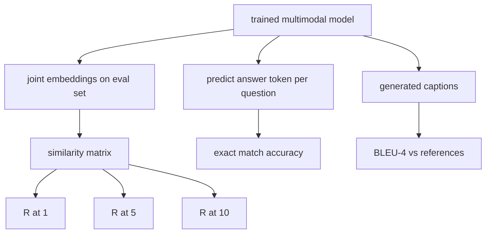

# 多模态评估

> 训练只是 loop 的一半。另一半是测量。本课从 primitives 构建三个 evaluation surfaces：image-caption retrieval 用 R@1、R@5、R@10 报告；visual question answering 用 exact match accuracy 报告；image captioning 用 BLEU-4 报告。每个 metric 都是一个作用在模型输出和 synthetic eval suite 上的函数，并能在数秒内运行。

**类型:** Build
**语言:** Python
**先修:** Phase 19 lessons 58-62 (Track E foundations: encoder, transformer, projection, cross-attention fusion, pretraining)
**时间:** ~90 minutes

## 学习目标

- 从 image embeddings 与 caption embeddings 之间的 similarity matrix 计算 Recall@K。
- 从把 (image, question) pairs 映射到固定 answer vocabulary 的模型中，计算 exact-match VQA accuracy。
- 不依赖任何外部库，从 generated 和 reference token sequences 计算 BLEU-4。
- 在 lesson 62 训练出的模型之上运行三个 evals，并使用 synthetic suite。

## 要解决的问题

当 training loss plateau 时，很容易宣布 multimodal model 完成。Training loss 衡量的是训练分布上的拟合；它不衡量模型能否在 held-out batch 中排序 pairs、回答问题，或写出人类能接受的 caption。三个 eval surfaces 是标准做法：

- **Retrieval (R@1, R@5, R@10)。** 为 query caption 构建 joint embedding；按 cosine 对 eval pool 中的每张 image 排名；报告匹配 image 是否落在 top 1、top 5、top 10。对称形式（image-to-text）同理运行。
- **Visual question answering (exact match)。** 给定 (image, question)，模型输出 answer token。Exact match 对每个 sample 是一位结果：predicted answer 是否等于 reference answer？在 eval set 上取平均。
- **Captioning (BLEU-4)。** 生成 caption。针对 reference captions 计算 1-gram 到 4-gram precisions 的 geometric mean，并带 brevity penalty。Multi-reference 是标准形式（一张 image，多条 reference captions）。

每个 metric 都是很薄的函数。本课在代码中全部构建它们，让数学具体，同时把 surface 保持在你能控制的范围内。真实 benchmark suites（MS-COCO、VQA v2、GQA、OK-VQA）会接入同样的函数形状。

## 核心概念



### 从 similarity matrix 计算 Recall@K

构建 image embeddings 与 caption embeddings 之间的 `(N, N)` cosine similarity matrix。对每一行，按 descending similarity 排序 columns。Recall@K 是 diagonal column index 是否位于 top K positions 的行比例。对称 Recall@K（caption-to-image）在 transposed matrix 上计算。两个数字都会报告。对 N=100 的 eval，R@1 = 0.6 表示 100 条 captions 中有 60 条把正确 image 检索为 top match。

### VQA exact match

对每个 (image, question, answer)，encode image，embed question，通过 decoder fuse，然后读出 next token。predicted token id 与 reference id 比较，相等则正确。在 eval set 上平均。真实 VQA datasets 对每个 question 带多个 human-annotated answers，并使用 soft-accuracy formula（10 个 annotators 中至少 3 个同意时为 1.0，低于此则缩放）；本课为了清晰使用 single-answer exact match。

### BLEU-4

```text
BLEU-4 = BP * exp(mean(log p1, log p2, log p3, log p4))
```

其中 `p_n` 是 modified n-gram precision（generated n-grams 中出现在任意 reference 的 clipped count，除以 generated n-grams 总数），`BP` 是 brevity penalty：

```text
BP = 1                if generated length > reference length
   = exp(1 - r/g)     otherwise, where r is reference length and g is generated
```

小样本中某些 `p_n` 可能为 zero，因此需要 smoothing。实现使用 Chen and Cherry “method 1”（对任何 zero count 的 numerator 和 denominator 都加 1），这是 low-count regimes 中最安全的默认值。

### Synthetic eval suite

一个 50-sample eval suite 在内存中构建，使用 lesson 62 中相同的 mock corpus pattern，但 seed 是 held-out。suite 由三个列表组成：

- `pairs`: 50 个 (image, caption_ids) pairs，用于 retrieval。
- `vqa`: 50 个 (image, question_ids, answer_id) triples。
- `caps`: 50 个 (image, [reference_caption_ids, ...]) entries，每张 image 最多 3 个 references。

suite 由 seed 决定，并且从 training corpus 中 held out，所以 metrics 是在模型从未见过的数据上计算的。把 suite 持久化到 JSON 留作练习（见下文）。

| Metric | Range | Random baseline (N=50) |
|--------|-------|------------------------|
| R@1 | 0 to 1 | 0.02 (1 / N) |
| R@5 | 0 to 1 | 0.10 |
| R@10 | 0 to 1 | 0.20 |
| VQA EM | 0 to 1 | 1 / vocab |
| BLEU-4 | 0 to 1 | small but nonzero |

对 synthetic data 上的 50-step training run，metrics 不应期望很高；它们应该高于 random baseline，这正是 demo 检查的内容。

## 动手实现

`code/main.py` 实现：

- `recall_at_k(sim_matrix, k)`，返回两个方向上位于 `[0, 1]` 的 float。
- `vqa_exact_match(predictions, references)`，返回 `int` equality 的 mean。
- `bleu4(generated, references, smoothing=True)`，支持 multi-reference。
- `build_eval_suite(seed, n_samples, vocab_size, max_len)`，返回三个 deterministic eval lists。
- `evaluate(model, suite)`，运行全部三个 metrics 并返回 numbers 的 `dict`。
- 一个 demo：加载 lesson 62 中 freshly-initialized multimodal model，先 evaluate，再训练 50 steps 后再 evaluate，并打印 before/after metrics。

运行：

```bash
python3 code/main.py
```

输出：before/after metric table 会显示 retrieval 从 near-random 朝模型学到的 signal 改善，VQA 高于 random，BLEU-4 也改善（synthetic structure 足以带来 4-gram precision lift）。

## 实际使用

每个 metric 都直接映射到 production benchmark：

- **Retrieval。** MS-COCO 5K val、Flickr30K、ImageNet zero-shot 都是同一个 similarity matrix 上的 R@K 问题。把 synthetic eval 换成真实文件，函数签名不变。
- **VQA。** VQA v2、GQA、OK-VQA 使用同样 exact-match 形状（VQA v2 用 soft-acc 替代 single-answer EM）。
- **BLEU-4。** MS-COCO captioning、NoCaps、Flickr30K captioning 都使用 BLEU-4 加 CIDEr 和 METEOR。添加 CIDEr 只是多一个函数。

真实 benchmark 中，把 `build_eval_suite` 换成真实 loader，并保留函数体。数学与 benchmark 无关。

## 测试

`code/test_main.py` 覆盖：

- recall@k 在 perfect identity similarity matrix 上返回 1.0，在 flipped one 上当 k < N 时返回 0.0
- recall@k 遵守 `k <= N` upper bound
- generated 与某个 reference 完全相等时，bleu4 返回 1.0
- disjoint vocabulary 上 bleu4 返回 0.0
- vqa exact match 等于相等 pairs 的比例
- build_eval_suite 返回预期数量的 pairs、vqa items 和 caption entries

运行：

```bash
python3 -m unittest code/test_main.py
```

## 练习

1. 给 captioning metrics 添加 CIDEr。CIDEr 在 n-grams 上使用 TF-IDF weighting，会奖励 informative tokens。

2. 实现 soft-accuracy VQA：每个 question 有多个人类答案；如果有任何匹配，accuracy 是 `min(human_count / 3, 1)`。复刻 VQA v2。

3. 添加 NaN-safe 版本的 `bleu4`，处理 empty generated sequences 而不崩溃。

4. 在 R@K 旁边计算 mean reciprocal rank (MRR)。MRR 对 correct item 在 top K 之后的位置敏感；R@K 对它是否落在 top K 内敏感。

5. 在训练期间五个 checkpoints（step 0, 10, 20, 30, 40, 50）上运行 eval，并绘制 learning curve。确认 metric trajectories 跟踪 loss trajectory。

## 关键术语

| Term | What it means |
|------|---------------|
| R@K | queries 中 correct match 落在 top K results 内的比例 |
| Exact match | 最简单的 VQA scoring：predicted answer 等于 reference |
| BLEU-4 | 1-gram 到 4-gram precisions 的 geometric mean，带 brevity penalty |
| Multi-reference | captioning metric 为每张 image 接受多条 reference captions |
| Held-out | eval set 从与 training corpus 不相交的 seed 中采样 |

## 延伸阅读

- VQA v2 paper，关于 soft-accuracy formula 和 dataset statistics。
- CIDEr paper，关于 TF-IDF-weighted n-gram captioning。
- BLEU original (Papineni et al., 2002)，关于 smoothing variants。
- MS-COCO captioning eval scripts，canonical reference implementation。
