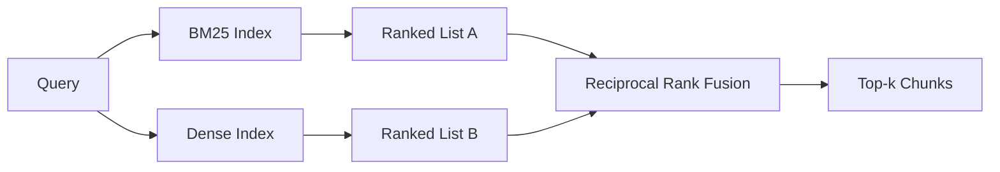

# BM25 与稠密嵌入的混合检索

> Lexical 和 semantic retrieval 会在相反的 query distributions 上失败。带 reciprocal rank fusion 的 hybrid retrieval 不是插值，而是投票，并且这个投票会赢下每类 query。

**类型:** Build
**语言:** Python
**先修:** Phase 11 lessons 04 (embeddings), 06 (RAG); Phase 19 Track B foundations (lessons 20-29); Phase 19 lesson 64 (chunking strategies)
**时间:** ~90 minutes

## 学习目标
- 从 Robertson and Sparck Jones formulation 从零实现 BM25，包含 field weighting、document length normalization，以及可调 k1 和 b。
- 基于 deterministic mock embedding 构建 dense retriever，让 loop offline 运行。
- 严格按 Cormack、Clarke 和 Buettcher 2009 年发表的方式实现 reciprocal rank fusion，并解释为什么它支配 score-weighted interpolation。
- 调整 RRF k constant 和 per-modality weights，并在小型 fixture corpus 上读取 trade-offs。

## 要解决的问题

当 query 携带 corpus 中逐字出现的 literal identifier 时，lexical search 获胜。查询 `AbortMultipartOnFail` 时，BM25 能在微秒级返回正确的 Go function。同一个 query 如果被 embedded，会落在三个 similarity clusters 的边界上，dense retriever 会把错误文件排第一。

当 query 从 corpus literal tokens 中被改写出去时，dense search 获胜。用户问 “how do we handle cancelled uploads” 时，从未输入 abort 或 multipart。BM25 会返回 “uploading large files” 这篇 documentation chunk，因为那页包含 uploads。Dense retrieval 会找到 summary 中提到 cancellation 的 abort function。

二者之间的选择不是静态的。query distribution 才是变量。生产 RAG system 通过同一个 endpoint 处理两类 queries，所以 retrieval 必须同时处理两类。这就是 hybrid retrieval。merge step 是必须正确的部分。

## 核心概念



### 一段话理解 BM25

BM25 通过对 query terms 求和来为 query-document pair 打分：inverse document frequency factor 乘以带 length-normalization correction 的 saturating term-frequency factor。两个 knob。`k1` 控制 term-frequency saturation；默认 1.5 是发表建议值，没有 benchmark 就不要动。`b` 控制 document length 影响多少；默认 0.75 表示长文档会被惩罚，但不是线性惩罚。

IDF formula 使用 smoothed Robertson and Sparck Jones definition：`log((N - df + 0.5) / (df + 0.5) + 1)`。log 里的 plus-one 在某个 term 出现在超过半数 corpus 时保持 IDF 为正。这在小 corpus 中很重要，因为 stopwords 从技术上看也可能很稀有。

Field weighting 让你告诉 BM25：symbol name 上的 match 比 body 中的 match 更重要。实现是在 indexing 期间给 term counts 乘 multiplier，而不是 scoring time。这样数学保持一致，也避免每个 field 单独打分。

### 一段话理解 Dense retrieval

用 embedding model 把每个 chunk embed 成固定维度 vector。query time 时，embed query，按 cosine 对每个 chunk 排名，并返回 top-k。model 是决定质量的变量。retrieval algorithm 本身只有两行：dot product 和 sort。

本课使用 deterministic hash-based embedding，这样你可以在没有网络调用的情况下阅读 fusion math。hash 会把 token-keyed offsets 加进 96-dimensional vector 并 normalize。cosine ranks 跨运行是 deterministic，这正是 test suite 需要的。

### Reciprocal rank fusion，发表公式

两个 ranked lists。对出现在任一 list 中的每个 candidate，累加它的 reciprocal-rank contributions。2009 年论文默认使用 `1 / (k + rank)`，其中 k 等于 60。按 total score 排序。整个算法就是这样。

发表的 constant k = 60 不是任意的。k = 60 时，rank-1 contribution 是 1 / 61，rank-10 contribution 是 1 / 70。contribution 衰减很慢，所以 deep candidates 仍能投票。更小的 k 会让 top results 主导。更大的 k 会压平 contribution curve。

我们的实现有两个可调 knob。`k` constant。一对 per-modality weights，让你在有先验证据表明某个 modality 在你的 corpus 上更好时，可以 boost BM25 或 dense。把 rank contribution 乘以 weight 是最简单的原则性实现；它保留 rank-decay shape，并保持 scale-free。

### 为什么 fusion 胜过 score-weighted interpolation

BM25 scores 无界且依赖 corpus。Cosine similarities 被限制在 -1 到 1。线性组合 `alpha * bm25 + (1 - alpha) * cosine` 需要 per-corpus alpha tuning，并且每次 reindex 都会坏。rank-based fusion 不会。两个 ranks 在 modalities 之间可比。已发表的 RRF baseline 在 2010 年以来所有公开 TREC track 中都胜过 score-interpolation。

这与你在 Vespa 和 Weaviate 文档中听到的 RankFusion vs RRF 论点相同。它们得出相同结论：除非你有很强证据要 interpolate scores，否则保持 rank-based。

## 动手实现

`code/main.py` 实现：

- `tokenize(text)` - 快速 regex tokenizer。
- `BM25Index` - field-weighted，带 `add` 和 `search`，并有可调 k1、b。
- `mock_embed`, `DenseIndex` - 与 lesson 64 相同的 deterministic embedding，所以 chunks 可比较。
- `rrf(rankings, k, weights)` - 带 multi-modality weights 的发表版 fusion。
- `HybridRetriever` - 组合 BM25 和 dense。
- demo `main()`：加载一个小型 fixture corpus，运行三个 queries，分别命中每个 retriever 的强项和弱点，并打印每个 modality 产出的 rankings 以及 fused list。

运行：

```bash
python3 code/main.py
```

并排阅读 demo output。literal identifier query 在 BM25 rank 1、dense rank 4、RRF rank 1。paraphrased query 在 BM25 rank 6、dense rank 1、RRF rank 1。ambiguous query 在 BM25 rank 3、dense rank 3、RRF rank 1。fusion 不是 tie-breaker；它是在每类 query 上获胜的系统。

## 调整 knobs

| Knob | Default | Move it up when | Move it down when |
|------|---------|----------------|------------------|
| BM25 k1 | 1.5 | Terms repeat in documents and you want frequency to matter more | Documents are short and term repetition is noise |
| BM25 b | 0.75 | Long documents really do say less per word | Document length is uncorrelated with topic |
| RRF k | 60 | Deep candidates should keep voting | The top-1 should dominate |
| BM25 weight | 1.0 | Your corpus contains literal identifiers and queries match them | Your queries are user-paraphrased |
| Dense weight | 1.0 | Queries are paraphrased | Queries are literal |

通过在 held-out query set 上重新运行 lesson 68 的 eval harness 来调参，而不是靠直觉。

## Demo 会隐藏的失败模式

**Out-of-vocabulary tokens。** BM25 的 IDF 从 corpus 中计算，所以只出现在 query 中的 terms 贡献为 zero。Dense embeddings 会为同一个 term 幻觉出一个 vector。在 out-of-corpus identifiers 上，dense modality 会返回看似合理但错误的 neighbors。fusion 能吸收这一点，因为 BM25 什么都不返回，rank contribution 会消失，但前提是你按 document 去重，而不是按 chunk。

**Stop-token domination。** 对单词 “the” 做 BM25 会在 corpus 上产出 uniform ranking。在 indexer 中过滤 stop tokens，或接受 high-IDF terms 会自然主导。

**Identical content across modalities。** 如果你的 corpus 小到 BM25 的 top-1 也是 dense 的 top-1，RRF 会给你同一个 top-1 和同样的 neighbors。这是正确行为，不是失败，但会让 fusion 看起来不可见。在 eval 中加入一对 adversarial queries，验证 fusion 真的在工作。

## 实际使用

生产模式：

- 在进程内 index BM25；瓶颈是 term-frequency dictionary，不是 vectors。
- 在单独 store 中 index dense vectors（本课用 flat list；生产中你会用 HNSW）。
- 并行运行两种 queries；fusion 是 union 上的常数时间 merge。
- 持久化每个 retrieved hit 的 modality，让下游 reranker 能看到哪个 modality 为它投票。

## 交付成果

Lesson 66 会拿本课 fused top-k，并用 cross-encoder rerank。Lesson 68 会用 precision、recall、MRR 和 nDCG 评估整条 pipeline。本课的 hybrid retriever 是 lesson 69 end-to-end system 的第一阶段。

## 练习

1. 用 provider 的真实 model 替换 `mock_embed`。重新运行 demo，并报告 paraphrased query 上 dense-only ranking 如何变化。
2. 添加第三个 modality：单独 index chunk summaries，并作为第三个 ranked list 融合。测量增益。
3. 在 10、30、60、100、200 上 sweep RRF k。绘制 lesson 68 的 recall@k curve。报告曲线在你的 corpus 上达到峰值的 k。
4. 正确实现 BM25F（per-field length normalization，而不是 multiplier trick），并在 symbol matches 最重要的 corpus 上比较。

## 关键术语

| Term | What people say | What it actually means |
|------|-----------------|------------------------|
| BM25 | “Lexical search” | 带 idf x saturating tf x length normalization 的 probabilistic ranking |
| RRF | “Rank fusion” | 跨 ranked lists 累加 1 / (k + rank)；k = 60 default |
| k1 | “TF saturation” | 控制重复 term 多快停止增加更多 score |
| b | “Length penalty” | 0 表示忽略 document length，1 表示 full normalization |
| Field weighting | “Symbol boost” | indexing 时重复 tokens，以 boost 该 field 中的 matches |
| Rank-based vs score-based fusion | “为什么 RRF 胜过 linear” | ranks 在 modalities 间可比；scores 不可比 |

## 延伸阅读

- Cormack, Clarke, Buettcher, "Reciprocal Rank Fusion outperforms Condorcet and individual rank learning methods", SIGIR 2009
- Robertson, Walker, Beaulieu, Gatford, Payne, "Okapi at TREC-3" (original BM25 paper)
- [Vespa: Hybrid Retrieval with BM25 and Embeddings](https://docs.vespa.ai/en/tutorials/hybrid-search.html)
- [Weaviate: Hybrid Search](https://weaviate.io/developers/weaviate/search/hybrid)
- Phase 11 lesson 06 - RAG fundamentals
- Phase 19 lesson 64 - 这里被 index 的 chunks 的 chunkers
- Phase 19 lesson 66 - 消费 fused top-k 的 cross-encoder reranker
