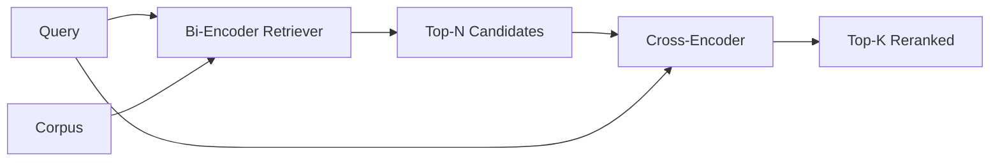

# Cross-Encoder Reranker

> bi-encoder 独立 embed query 和 document。cross-encoder 把它们拼接起来并同时读取二者。cross-encoder 是最聪明的 reader，也是最慢的。把它用作 bi-encoder top-k 之后的第二阶段，它值得这份成本。

**类型:** Build
**语言:** Python
**先修:** Phase 11 lesson 06 (RAG), Phase 11 lesson 07 (advanced RAG); Phase 19 Track B foundations (lessons 20-29); Phase 19 lesson 65 (hybrid retrieval feeding this stage)
**时间:** ~90 minutes

## 学习目标
- 通过 input shape、parameter count 和 per-query cost 区分 bi-encoder retriever 与 cross-encoder reranker。
- 从零实现一个小型 cross-encoder：作为 transformer block 消费 packed (query, document) sequence，并输出单个 relevance scalar。
- 接线 two-stage retrieve-then-rerank pipeline：用便宜的 retriever 检索 top-N，用 cross-encoder 把 N rerank 成 top-K，并返回 K。
- 在小型 fixture corpus 上测量 latency-vs-quality trade-off，并为给定 latency budget 选择正确的 N。

## 要解决的问题

bi-encoder 把 query 和 document 映射到同一个 vector space，并按 cosine 排名。两个 encodings 从不彼此看见。模型必须在盲于 query 的情况下，把 document 的一切有用信息压进一个 vector。这很快：index time 每个 document 一次 embedding，query time 每个 query 一次 embedding；这也是 corpus scale 排名的唯一办法。

代价是 precision。两个整体 topic 相同的 documents 可能有几乎相同的 embeddings，即使其中一个回答了 query，另一个没有。bi-encoder 无法分辨它们。

cross-encoder 通过把 query 和 document 一起读取来解决。模型接收 `[query] [SEP] [document]` 作为单一 sequence，跨 join 运行 full attention，并产出一个 relevance scalar。document 的每个 token 都能 attend 到 query 的每个 token。模型用完整 context 决定 score。

成本是 throughput。bi-encoder 一次 embed、永久 query；cross-encoder 每个 (query, document) pair 运行一次。对 1000 万 document corpus 来说，每个 query 是 1000 万次 forward passes。在 request budget 中不可运行。

解决方案是 staging。用 bi-encoder 检索 top-N。用 cross-encoder 把 N rerank 成 top-K。N 很小（50 到 200），cross-encoder 的 quality lift 集中在真正重要的位置。总 latency 仍在 request budget 内。总 quality 是 cross-encoder 的 quality，但受 bi-encoder 在 N 处的 recall 限制。

## 核心概念



### cross-encoder 的 input shape

标准 packing 是 `[CLS] query_tokens [SEP] document_tokens [SEP]`。CLS-position output 会喂给单个 linear head，输出 relevance scalar。一些实现会用 mean-pooling 替代 CLS；差异很小。重点是模型为每个 pair 产出一个数字。

22M-parameter cross-encoder（已发表的 `ms-marco-MiniLM-L-6-v2` weight class）是典型生产点。更小的模型质量损失比 latency 收益更快。更大的模型（例如 568M parameters 的 `bge-reranker-v2-m3`）保留给 offline reranking，或 K 很小的 first-page reranking。

### 为什么本课训练一个 tiny 版本

真实 cross-encoder 是 finetuned encoder transformer。生产中你会加载 checkpoint 并运行它。本课目标是展示 model shape 和 latency-quality curve 的 shape，而不是训练 state-of-the-art ranker。因此我们构建一个小型 `nn.Module`，包含一个 transformer block、multi-head attention（默认 4 heads）和一个 regression head。它从 seed 确定性初始化，所以 demo 无需磁盘 weights 也可复现。

toy model 会从 fixture corpus 学到正确形状：相关 query-document pairs 的 predicted scores 高于不相关 pairs。end-to-end pipeline 会 rerank bi-encoder 输出，rerank top-k 与 gold labels 相关。

### Latency vs quality

two-stage pipeline 有一个可调参数：N。在 held-out query set 上从 5 到 100 sweep N，就会得到曲线。

| N | Recall@1 of stage 2 | Cross-encoder forward passes per query | Latency |
|---|--------------------|---------------------------------------|---------|
| 5 | 0.62 | 5 | low |
| 20 | 0.81 | 20 | medium |
| 50 | 0.86 | 50 | high |
| 100 | 0.86 | 100 | very high |

上面的数字说明的是形状，不是来自本 fixture 的测量。形状是真实的。总会在 20 到 50 candidates 左右出现一个 knee，rerank lift 在那里饱和。超过 knee 就是在为没有收益的内容付费。

用 eval curve 加 latency budget 选择 N。cross-encoder 不能把 recall 提升到 bi-encoder 在 N 处的 recall 以上，所以低 N 不只是限制 latency，也限制 quality。

## 动手实现

`code/main.py` 实现：

- `CrossEncoder` - 一个小型 `torch.nn.Module`：token embedding、一个带 multi-head attention 和 feedforward 的 transformer block、mean-pooled head 输出一个 scalar。
- `tokenize_pair(query, document)` - 把两个 strings 打包成单个 id sequence，并带上标记边界的 type ids，deterministic 且 stdlib。
- `train_tiny(pairs)` - 在手工标注的 (query, document, relevance) triple list 上做一次 supervised training，让模型在 fixture 上产出合理 scores。
- `rerank(query, candidates, top_k)` - 生产接口。
- `pipeline(query, retriever, top_n, top_k)` - two-stage flow。
- demo `main()`：按 lesson 65 的 pattern 加载 corpus，检索 top-N，rerank 到 top-K，并排打印两个 lists，并报告每个阶段 latency。

运行：

```bash
python3 code/main.py
```

输出会展示 bi-encoder 的 top-N、cross-encoder 的 top-K 和 timing summary。cross-encoder 每次调用更慢，但不会在整个 corpus 上运行。two-stage total 保持在 request budget 内，同时能挑出 bi-encoder 排在第二或第三的答案。

## Demo 会隐藏的失败模式

**Cross-encoder 不是对称的。** `rerank(q, d)` 和 `rerank(d, q)` 是不同 scores。永远先喂 query。如果你不小心交换，recall 会崩。

**N 太低，无法暴露 bug。** 如果设置 N = K，cross-encoder 不能 reorder；只能 reweight。lift 看起来是 zero。选择至少三倍 K 的 N。

**Training data 泄漏进 eval。** 如果 hand-labeled training pairs 包含 eval queries，rerank 看起来会很神奇。即使在 fixture 上，也要严格分离 train 和 eval。

**Production weights 很密集。** 一个 22M-parameter cross-encoder 在 float32 下是 88MB。在承诺 sub-100ms p95 之前，先规划 model server memory。

**Batching 很重要。** 真实 cross-encoder 会把 N 个 candidates 放进一个 batch 中运行。本课在 `_batch_encode` 中这样做：构建 batched id 和 type-id tensors，调用 `torch.tensor(...)`，并运行一次 forward pass。跳过 batching，latency 会乘以 N。

## 实际使用

生产模式：

- 把 bi-encoder、cross-encoder 和 N 一起 pin。改变任何一个都会使 eval 失效。
- 按 (query, document_id) hash 缓存 reranker output。稳定 corpus 上同一 query 会 rerank 成同一 order；cache hits 会免费削减 latency。
- 记录 rank-1 cross-encoder score。top-1 score 低于 corpus-specific threshold 的 query 是 out-of-domain hit；把它作为 “I am not confident” 暴露给 LLM。

## 交付成果

Lesson 68 会端到端评估这条 two-stage pipeline。Lesson 69 会把这个 reranker 接在 lesson 65 的 hybrid retriever 后面、answer generator 前面。reranker 是 end-to-end system 的第二阶段。

## 练习

1. 从 5 到 50 sweep N，并绘制 reranked output 的 recall@1。找到这个 fixture 上的 knee。
2. 把 cross-encoder 训练十个 epochs，而不是一个。测量每个 epoch 上 positive 和 negative pairs 的 score-margin。
3. 用 CLS-token head 替换 mean-pooling。比较这个 fixture 上的 convergence。
4. 添加第二个 cross-encoder head，预测二分类 “is this answer in the document” label。inference 时同时使用两个 heads；一个用于 ranking，一个用于 threshold。
5. 用 lesson 65 中的 bi-encoder 替换 deterministic mock bi-encoder，并串联两个阶段。测量相对 bi-encoder alone 的 top-K 变化。

## 关键术语

| Term | What people say | What it actually means |
|------|-----------------|------------------------|
| Bi-encoder | “Vector retriever” | 独立 encode query 和 doc；用 cosine 排名 |
| Cross-encoder | “Reranker” | 联合 encode (query, doc)；输出一个 relevance scalar |
| Two-stage pipeline | “Retrieve and rerank” | 便宜 retriever 返回 N，昂贵 reranker 保留 K |
| N (candidate budget) | “Rerank pool” | cross-encoder 每个 query scoring 的 candidates 数量 |
| Mean-pooling head | “Mean of last hidden” | 把 encoder 的 last-layer outputs 平均成一个 vector |

## 延伸阅读

- Nogueira, Cho, "Passage Re-ranking with BERT", 2019 - canonical cross-encoder ranker paper
- Reimers, Gurevych, "Sentence-BERT: Sentence Embeddings using Siamese BERT-Networks", 2019 - bi-encoders vs cross-encoders
- [SentenceTransformers Cross-Encoders documentation](https://www.sbert.net/examples/applications/cross-encoder/README.html)
- [BGE Reranker v2 model card](https://huggingface.co/BAAI/bge-reranker-v2-m3)
- Phase 19 lesson 65 - 喂给这个 rerank stage 的 hybrid retriever
- Phase 19 lesson 68 - 测量 rerank 带来 lift 的 eval
