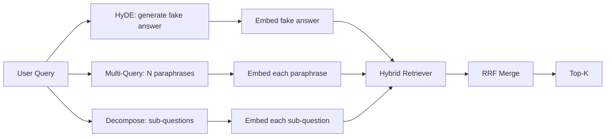

# Query Rewriting: HyDE、Multi-Query 和 Decomposition

> 用户输入的 query 不是 retriever 想要的 query。rewriting 在 retrieval 前架起桥梁，让 index 看到更接近答案形状的东西。

**类型:** Build
**语言:** Python
**先修:** Phase 11 lessons 04 (embeddings), 06 (RAG); Phase 19 Track B foundations (lessons 20-29); Phase 19 lessons 64 and 65
**时间:** ~90 minutes

## 学习目标
- 实现 Hypothetical Document Embeddings (HyDE)：生成一个假答案，embed 它，并用该 vector 而不是 query vector 做 retrieval。
- 实现 multi-query expansion：把一个 query rewrite 成 N 个 paraphrases，用每个检索，并通过 reciprocal rank fusion 合并 union。
- 实现 query decomposition：把复杂问题拆成 sub-questions，分别检索后合并。
- 在 fixture 上正面对比三个 rewriters，并解释各策略什么时候获胜。
- 接入一个 mock LLM，让它产出 deterministic、on-fixture outputs，从而让 rewriter loop offline 运行。

## 要解决的问题

用户输入 “what does our team do when uploads fail and the budget is gone?”。corpus 中有一篇 doc 写着 “AbortMultipartOnFail aborts an in-flight S3 multipart upload and decrements the per-bucket retry budget when the upload fails”。query 和 document 没有共享 noun phrase。BM25  miss。bi-encoder 把这个 document 排第三或第四，因为 query vector 落在 embedding space 中更偏向 cancelled jobs 文档的区域，而不是 aborted uploads 文档。lesson 66 的 two-stage rerank 如果答案位于 top-N 中，可以抢救它；但如果它连 top-N 都进不了，reranker 永远看不到。

修复方法是在 query 触碰 retriever 前 rewrite 它。2023 年论文 “Precise Zero-Shot Dense Retrieval without Relevance Labels”（Gao et al.）引入 HyDE：让 LLM 写出会回答该 query 的 document，embed 这个 hypothetical document，并用它的 embedding 作为 retrieval vector。hypothetical document 位于 embedding space 的正确区域，因为它用 corpus 的声音写成。query vector 没做到这一点。

两个近亲技术与 HyDE 配套。Multi-query expansion（Microsoft 的 GraphRAG 使用的术语）生成 query 的 N 个 paraphrases，分别检索，然后 merge。Decomposition（在 2024 Stanford DSPy 工作中以 “subquery decomposition” 流行）把 “what does our team do when uploads fail and the budget is gone” 拆成两个问题：“what happens when an upload fails” 和 “what happens when the retry budget is gone”。两次 retrieval，一个 merged result，答案的两个部分都可触达。

本课实现三者，并在同一个 fixture corpus 上运行它们。

## 核心概念



### HyDE 详解

HyDE 用 LLM 写出的 hypothetical document vector 替换用户的 query vector。prompt 很短：

```text
You are a domain expert. Write a one-paragraph passage that answers the question
below. Use the same vocabulary and phrasing the documentation in this domain would
use. Do not refuse. Do not say you do not know.

Question: {user_query}

Passage:
```

LLM 的答案作为 factual answer 是错的，因为 LLM 不知道你的 corpus。这没关系。retriever 不关心事实正确性，只关心 token distribution。hypothetical passage 包含 “abort”、“multipart”、“bucket”、“budget” 等词，因为这个主题的 documentation passage 会这么写。embed 这个 passage。vector 会落在真实 passage 附近。

生产中你会把 hypothetical document 限制在两三句话。更长的 hypotheticals 会收集更多 noise。更短的则会丢失 HyDE 需要的 lexical signal。

### Multi-query expansion 详解

生成用户 query 的 N 个 paraphrases。最简单 prompt：

```text
Rewrite the following question in {N} different ways. Each rewrite must preserve
the original intent. Number them 1 to {N}. Do not add explanations.
```

对每个 paraphrase 检索 top-k。用 RRF（lesson 65 中同一个算法）合并 N 个 ranked lists。便宜、并行、deterministic。

当用户措辞只是提出同一问题的多种有效方式之一，而某个 rewrite 会问得更好时，multi-query 获胜。当所有 rewrites 都同样糟，因为原始 query 在同一方式上就很糟时，它会失败。

### Decomposition 详解

一次 retrieval 无法满足多面向问题。Decomposition 让 LLM 把问题拆成 sub-questions，系统按 sub-question 检索。prompt：

```text
The following question may require information from multiple distinct topics.
Decompose it into a list of sub-questions. Each sub-question must be answerable
independently. If the question is already atomic, return it unchanged.

Question: {user_query}
```

按每个 sub-question retrieval。merge。Decomposition 适用于包含 conjunctions、multi-clause comparisons 或两个无关 topics 的问题。对 atomic questions，它是错误工具；decomposer 的工作是返回单个 question，而不是发明假 sub-questions。

### 为什么三者都存在

三者互补。HyDE 弥合 query-corpus token gap。Multi-query 覆盖 paraphrase variance。Decomposition 覆盖 multi-topic queries。生产系统会三者都运行，并按 query 选择策略（lesson 69 的 end-to-end system 展示 selector）。

## Mock LLM

本课 offline 运行。mock LLM 是一个以用户 query 为 key 的小型 lookup table，并为未见 queries 提供 fallback。lookup table 包含：

- 对每个 fixture query：一个写好的 hypothetical passage、三个 paraphrases，以及一个 decomposition。
- 对未知 query：一个 deterministic transformation：取 query 的 content words，通过 synonym map 扩展，并返回结果。

mock 的形状才重要，数据本身不重要。生产中你把 mock 换成真实 model call。retriever 不变。

## 动手实现

`code/main.py` 实现：

- `MockLLM` - 上述 deterministic stand-in。
- `HyDERewriter` - 调用 LLM 写 hypothetical document，以 `RewriteResult` 返回 rewriter output，包含 hypothetical text 和 retriever 应该使用的 query。
- `MultiQueryRewriter` - 调用 LLM 生成 N 个 paraphrases，返回 query list。
- `DecomposeRewriter` - 调用 LLM 做 decomposition，返回 sub-questions。
- `retrieve_with_rewriter` - 接收 rewriter 和 retriever，运行 rewrites，并 fuse results。
- 一个 demo：在 fixture 上运行三个 rewriters，并打印哪个 strategy 最先返回 gold answer document。

retriever 形状复用 lesson 65（hybrid BM25 + dense）。fusion 是同一个 RRF。唯一新形状是 rewriter interface，它很小。

运行：

```bash
python3 code/main.py
```

输出是 per-strategy ranking 和 final summary。HyDE 在 phrasing-mismatched query 上获胜。Multi-query 在 paraphrase-variance query 上获胜。Decomposition 在 multi-topic query 上获胜。fallback（没有 rewriter）至少会在三者之一上失败。

## Demo 会隐藏的失败模式

**HyDE 幻觉了错误的 corpus-specific identifiers。** 模型发明一个 function name。由于这个发明名称现在是 index 中不存在的 high-weight token，hypothetical 在正确 doc 上的 BM25 score 会坍缩。限制 hypothetical 长度，并在 fusion 中降低 BM25 weight。

**Multi-query rewrites 全部收敛。** 弱模型产出三个几乎相同的 paraphrases。N 次 retrieval 返回同一 top-k。RRF merge 不比单次 retrieval 更好。给 rewrite prompt 添加显式 diversity instruction，并用 Jaccard 检测 duplicates。

**Decomposition over-splits。** decomposer 把 atomic question 变成一个列表。retrievals 都返回同一 document，但 rank 降低。merge 比原 query 更差。在 fan-out 前用一个 “are these sub-questions distinct enough” pass 检测。

**Latency 倍增。** HyDE 花费一次 LLM call。Multi-query 花费一次 LLM call 来生成 N rewrites，然后 N 次 retrieval。Decomposition 花费一次 LLM call 来 decompose，然后 M 次 retrieval。retrievals 并行运行；LLM call 是 floor。

## 实际使用

生产模式：

- 按 query length 做 per-query strategy selection：atomic short queries 用 multi-query，complex multi-clause queries 用 decomposition，jargon-heavy queries 用 HyDE。
- 按 query hash 缓存 rewriter output。许多 queries 会重复。
- 三者并行运行，并用 RRF 把三组 result sets fuse 成一个。成本是三次 LLM calls 和一次 fusion；质量是三种策略覆盖面的 union。

## 交付成果

Lesson 69 会把这个 rewriter stage 接在线 lesson 65 的 retriever 和 lesson 66 的 reranker 前。Lesson 68 会评估 rewriter 对 retrieval recall 的 lift。

## 练习

1. 实现 RAG-Fusion（multi-query 的 2024 variant）：rewriter 的 paraphrases 有意保持 diversity，然后由 rerank step（lesson 66）选择最终 list。
2. 添加第四种策略：step-back prompting（让 LLM 给出更一般的问题，在其上 retrieval，然后缩窄）。在 fixture 上比较。
3. 通过添加 “is the question atomic” head，训练 decomposer 识别 atomic queries。测量前后的 over-split rate。
4. 用真实 model call 替换 mock LLM。测量你的 stack 上每种策略的 latency。
5. 给每个 rewrite 添加 confidence score。丢弃低于 threshold 的 rewrites。测量对 recall 的影响。

## 关键术语

| Term | What people say | What it actually means |
|------|-----------------|------------------------|
| HyDE | “Fake-document retrieval” | LLM 写出答案；embed 它，并在其上 retrieval，而不是 query |
| Multi-query | “Paraphrase expansion” | query 的 N 个 rewrites；检索 N 次，用 RRF merge |
| Decomposition | “Subquery split” | multi-topic queries 被拆成 sub-questions，分别 retrieval |
| Atomic query | “Single-topic” | 不发明假 sub-questions 就无法再 decomposed |
| Step-back | “Abstract the query” | 询问更一般的问题，retrieve，再 narrow |

## 延伸阅读

- Gao, Ma, Lin, Callan, "Precise Zero-Shot Dense Retrieval without Relevance Labels" (HyDE), 2023
- Microsoft Research, "Multi-Query Expansion for Retrieval"
- Stanford DSPy, "Subquery Decomposition for Multi-Hop QA"
- [LlamaIndex query transformations documentation](https://docs.llamaindex.ai/en/stable/optimizing/advanced_retrieval/query_transformations/)
- Phase 11 lesson 07 - advanced RAG patterns
- Phase 19 lesson 65 - 本 rewriter 喂给的 retriever
- Phase 19 lesson 68 - 测量 rewriter lift 的 eval
