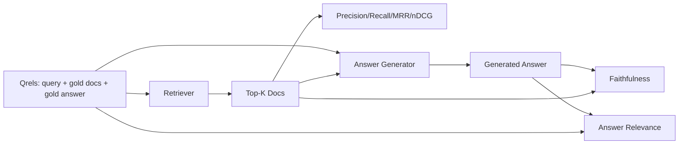

# RAG 评估：Precision、Recall、MRR、nDCG、Faithfulness 与 Answer Relevance

> 如果你不能同时给 retrieval 和 answer 打分，就不能发布系统。二者不是同一个 metric，同一个 prompt 会在不同轴上失败。

**类型:** Build
**语言:** Python
**先修:** Phase 11 lessons 06 (RAG), 10 (evaluation); Phase 19 Track B foundations (lessons 20-29); Phase 19 lessons 64, 65, 66, 67
**时间:** ~90 minutes

## 学习目标
- 从 gold qrels 计算四个 retrieval metrics：precision@k、recall@k、MRR (mean reciprocal rank) 和 nDCG@k。
- 计算两个 answer-grade metrics：faithfulness（每个 claim 都 grounded in retrieved context）和 answer relevance（answer 回答了 question）。
- 构建一个 fixture qrels file（queries、gold doc ids、gold answer text），让 eval 端到端读取。
- 读取 metric values 来诊断 pipeline 在哪里失败：retrieval、ranking、generation 或 grounding。

## 要解决的问题

RAG system 至少有四个 moving parts：chunker、retriever、reranker、generator。任何一个都可能导致错误答案。没有 per-stage metrics，你就是盲飞。

用户报告一个错误答案。是因为 chunker 切断了 answer span？是因为 retriever 没把 chunk 放进 top-k？是因为 reranker 把正确 chunk 推到了位置一之后？还是因为 generator 忽略 chunk 并编造了内容？只看 answer 你无法判断。你需要：

- Retrieval metrics，给 retriever 产出的结果打分。
- Ranking metrics，给正确 chunk 在 order 中的位置打分。
- Faithfulness，给 generator 是否停留在 retrieved context 内打分。
- Answer relevance，给 answer 是否真正回应 question 打分。

本课基于 fixture qrels file 构建全部六个指标。eval 是 offline 且 deterministic 的；生产中你把 mock LLM-as-judge 换成真实模型。

## 核心概念



### Precision@k

retriever 返回的 top-k documents 中，有多少比例在 gold set 中？如果 gold 有三篇 documents，而 top-3 返回其中两篇和一篇错误文档，precision@3 是 2 / 3。当 irrelevant retrieved chunk 成本很高时使用 precision（generator 会把 tokens 浪费在它上面，或 chunk 会污染 answer）。

### Recall@k

gold documents 中，有多少比例出现在 top-k 中？如果 gold 有三篇 documents，top-5 包含全部三篇，recall@5 是 1.0。当 missed answer 成本很高时使用 recall（你宁愿多看到一个错误 chunk，也不愿完全错过 answer chunk）。

生产 RAG 中通常被引用的 headline metric 是 recall@k。Generation 可以轻易丢掉 irrelevant chunks；它不能从从未见过的 chunk 中发明答案。

### MRR (Mean Reciprocal Rank)

对每个 query，找到 ranked list 中第一个 relevant document 的位置。reciprocal rank 是 1 / position。对 query set 取 mean。MRR 是 retriever 把最佳答案放到顶部能力的单数字摘要。

MRR 对 position-1 权重很高。gold doc 在 rank 1 的 query 贡献 1.0。Rank 2 贡献 0.5。Rank 10 贡献 0.1。这个 metric 被 list 顶部主导。

### nDCG@k

Normalized Discounted Cumulative Gain。完整公式会给每个 retrieved document 分配 gain（常见为 relevant 是 1，not 是 0），按 position 的 log 折扣，求和，再除以 ideal DCG（完美排序时的 DCG）。范围 0 到 1。

nDCG 能处理 graded relevance：gold 可以说 “doc A is 3, doc B is 2, doc C is 1”。MRR 和 recall@k 会把一切压平为 binary。当 corpus 中每个 query 有多个部分相关 documents 时，使用 nDCG。

### Faithfulness

对 generated answer 中的每个 claim，检查该 claim 是否被 retrieved context 支持。标准实现使用 LLM-as-judge prompt，接收 (claim, context)，返回 yes 或 no。metric 是通过的 claims 比例。

Faithfulness 抓住 generator 编造内容的失败模式。即使 retriever 返回了正确 chunks，一个会 hallucinate 的 generator 也是坏的。Faithfulness 也被称为 groundedness、support、attribution。

本课用 deterministic mock judge 实现 faithfulness：检查每个 claim 的 tokens 与 retrieved context 的重叠是否超过 threshold。生产中换成真实 model call。metric 形状相同。

### Answer relevance

answer 是否真的回应了 question？Faithfulness 问 “answer 是否 grounded in context?”。Answer relevance 问 “answer 是否 grounded in question?”。忠实但跑题的 answer 在 faithfulness 上高、在 relevance 上低。简短、切题但忽略 context 的 answer 在 relevance 上高、在 faithfulness 上低。

标准实现同样使用 LLM-as-judge：给 (question, answer)，询问 answer 是否回应 question。本课实现一个 token-overlap-plus-judge stand-in。

## fixture qrels

```python
{
  "qid": "q1",
  "query": "what is the abort threshold for multipart uploads",
  "gold_doc_ids": ["d1", "d3"],
  "gold_answer_substring": "three failed parts",
  "graded_relevance": {"d1": 3, "d3": 2},
}
```

每个 query 携带：
- query string，
- 一组 gold doc ids（用于 precision / recall / MRR），
- graded relevance dict（用于 nDCG），
- gold answer substring（作为每个 qrel 的 reference metadata 保存；本课中的 faithfulness 是通过把 extracted claims 与 retrieved context 对比来计算，而不是与这个 substring 对比）。

生产中你会标注这些。本课交付一个手工构建的 fixture，让 eval 开箱即跑。

## 动手实现

`code/main.py` 实现：

- `precision_at_k(retrieved, gold, k)` - literal definition。
- `recall_at_k(retrieved, gold, k)` - literal definition。
- `mean_reciprocal_rank(retrieved_list_of_lists, gold_list)` - queries 上的 mean。
- `ndcg_at_k(retrieved, graded_relevance, k)` - binary 或 graded gains 的 DCG / IDCG。
- `extract_claims(answer)` - 把 answer 拆成 sentence-shaped claims。
- `faithfulness(claims, context_texts, judge)` - 被 judge 判为 supported 的 claims 比例。
- `answer_relevance(question, answer, judge)` - judge 判断 answer 是否回应 question。
- `MockJudge` - deterministic token-overlap judge，让 eval offline 运行。
- `evaluate_pipeline(pipeline_fn, qrels, ks)` - 运行每个 metric 的 orchestrator。
- 一个 demo：针对 qrels 运行三个 pipeline variants（chunker baseline、hybrid retrieval、hybrid + rerank），并打印 metrics table。

运行：

```bash
python3 code/main.py
```

输出会在单个 metrics table 中展示每个 variant 的 precision@k、recall@k、MRR、nDCG@k、faithfulness 和 answer relevance。hybrid retrieval 行在 recall 上胜过 chunker baseline；rerank 行在 MRR 上胜过 hybrid。

## 读取 metrics 诊断失败

| Symptom | Likely cause | What to fix |
|---------|-------------|-------------|
| Low recall@k, low precision@k | Chunker cut the answer or retriever cannot find it | Chunker boundaries (lesson 64) or retriever modality (lesson 65) |
| Decent recall@k, low MRR | Right chunk is in top-k but not at position 1 | Reranker (lesson 66) |
| High MRR, low faithfulness | Generator invents content despite right context | Generation prompt; force-cite-or-refuse |
| High faithfulness, low relevance | Answer is grounded but off-topic | Query rewriter (lesson 67) or generation prompt |
| All four high, users still complain | Eval set is unrepresentative | Expand qrels with real user queries |

## Demo 会隐藏的失败模式

**LLM-as-judge bias。** 模型会把自己的 outputs 判断得比实际更 faithful。judge 使用与 generator 不同的 model family，或手工标注 sample。

**Qrels rot。** corpus 变化时，gold answers 会漂移。2024 年 1 月 q1 的 gold doc 到 2024 年 10 月可能不再是正确答案，因为团队重命名了 function。安排季度 qrels review。

**Faithfulness micro-checks 漏掉 macro-claims。** per-sentence faithfulness 可以通过，但整体 answer structure 仍然误导。在 automated metric 之上添加 sample-level qualitative review。

**Recall@k 掩盖 per-query failures。** 90% average recall 可能隐藏某个 query class 总是 miss。按 query class（literal、paraphrased、multi-topic）切分 qrels，并报告 per-slice。

## 实际使用

生产模式：

- 每次 retriever 或 generator 变化都运行 eval。把 recall@k regression 当作 test failure。
- 持久化 per query 的 metric trace。用户投诉时，查找匹配的 qrels entry，看它本应是否被抓住。
- 给 qrels 分层：CI 中运行 20 queries 的 smoke set；nightly 运行 200 queries 的 regression set；weekly 运行 2000 queries 的 deep set。

## 交付成果

Lesson 69 会接线整个 pipeline（chunker、retriever、reranker、generator），并用这个 eval 评估 end-to-end system。

## 练习

1. 添加第五个 retrieval metric：hit-rate@k。把它与 recall@k 比较。解释它们什么时候不同。
2. 实现 graded faithfulness：0（unsupported）、1（partially supported）、2（fully supported）。相应更新 metric。
3. 用真实 model call 替换 mock judge。测量 mock 和 real judge 在 fixture 上的 disagreement。
4. 添加 query-class slice（“literal”、“paraphrased”、“multi-topic”）。报告 per-slice metrics。
5. 添加 “answer length” metric，并把它与 faithfulness 相关联。绘制曲线。

## 关键术语

| Term | What people say | What it actually means |
|------|-----------------|------------------------|
| Precision@k | “Hit rate over retrieved” | top-k 中属于 gold 的比例 |
| Recall@k | “Hit rate over gold” | gold 中出现在 top-k 的比例 |
| MRR | “First-hit position” | 第一个 relevant document 的 1 / rank 的 mean |
| nDCG@k | “Graded ranking quality” | top-k 上的 DCG 除以 ideal DCG |
| Faithfulness | “Groundedness” | answer claims 中被 retrieved context 支持的比例 |
| Answer relevance | “Did it address the question?” | answer 是否匹配 question 的 intent |
| Qrels | “Gold labels” | 带 gold documents 和 answers 的 labeled queries 集合 |

## 延伸阅读

- Buckley, Voorhees, "Evaluating Evaluation Measure Stability", SIGIR 2000 - ranking metrics 的 canonical paper
- Jarvelin, Kekalainen, "Cumulated Gain-based Evaluation of IR Techniques" - nDCG paper
- [Ragas: Automated Evaluation of RAG Pipelines](https://docs.ragas.io)
- [Anthropic, Evaluating RAG](https://www.anthropic.com/news/evaluating-rag)
- Phase 11 lesson 10 - evaluation framework foundations
- Phase 19 lessons 64-67 - 这里被 evaluated 的 components
- Phase 19 lesson 69 - 这个 eval 打分的 end-to-end pipeline
