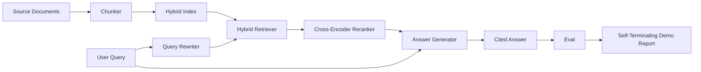

# 端到端 RAG 系统

> 六课组件。一个 pipeline。一个 eval loop。一个 self-terminating demo。这就是你要发布的系统。

**类型:** Build
**语言:** Python
**先修:** Phase 11 lessons 06 (RAG), 10 (evaluation); Phase 19 Track B foundations (lessons 20-29); Phase 19 lessons 64, 65, 66, 67, 68
**时间:** ~90 minutes

## 学习目标
- 把 chunker、hybrid retriever、query rewriter、cross-encoder reranker 和 answer generator 组合成单个 end-to-end pipeline。
- 实现一个 answer generator，它按 chunk anchor 为 claims 添加 citations，并带 refuse-on-low-confidence fallback。
- 用 lesson 68 eval 评估 assembled pipeline，并证明 staged build 在每个 metric 上都胜过相同组件的 isolated 版本。
- 构建一个 self-terminating CLI demo：ingest fixture corpus，运行固定 query set，并以 summary report 和 exit code zero 退出。

## 要解决的问题

六个孤立组件证明不了任何东西。chunker 可以在 corpus 上赢得 recall@5，却在系统的 recall@5 上失败，因为 retriever 无法 rank chunker 发出的内容。reranker 可以在 synthetic candidate pool 上提升 MRR，却在真实 bi-encoder candidates 上失败，因为 bi-encoder 在 rerank budget 处的 recall 太低。query rewriter 可以在单个 query 上提升 gold doc，却在下一个 query 上破坏结果，因为 LLM mock 返回了退化 hypothetical。

诚实的 integration test 是：整条 pipeline 端到端运行在同一个 fixture qrels 上，用同一个 metric，用一个 orchestrator file 把一切接起来。这就是本课构建的内容。如果 integrated pipeline 上的 metrics 胜过每个 stage 的 isolated demo metrics，你就证明了系统。

## 核心概念



### Wiring choices

pipeline 是一个小图。每个 stage 都是带清晰 signature 的 function。

| Stage | Input | Output |
|-------|-------|--------|
| Chunker | Document text | List of Chunk records |
| Retriever | Query string | Top-N Chunk records |
| Rewriter (optional) | Query string | List of rewrites + hypothetical |
| Reranker | Query, candidates | Top-K Chunk records with cross scores |
| Generator | Query, top-K Chunk records | Answer string with citations |

当每个 signature 稳定时，composition 就很直接。本课的 `Pipeline` class 持有五个 stages，并提供按顺序运行它们的 `query` method。每个 stage 都可替换：传入不同 chunker、retriever、rewriter、reranker 或 generator，pipeline 仍然能运行。

### 带 citations 的 answer generator

generator 是最后一层，也是最容易破坏的一层。本课交付一个 deterministic mock generator，它会：

1. 接收 top-K reranked chunks。
2. 选择最多两个 chunks，它们的 text 与 query 具有最高 content-token overlap。
3. 发出一个 answer，由每个 selected chunk 中的一句话拼接而成，并在每句话后添加 `[doc_id:chunk_index]` anchor。
4. 如果没有 chunk 的 overlap 高于 refuse threshold，则发出不带 citation 的 “I do not know”。

生产中你会把 mock 换成带下面 prompt template 的真实 LLM call：

```text
You are answering a question using only the snippets below.
Cite every claim with the anchor in parentheses.
If the snippets do not answer the question, say "I do not know".

Question: {query}

Snippets:
{enumerated chunks with anchors}

Answer:
```

refuse-on-low-confidence path 是记录 cross-encoder rank-1 score 的全部原因。如果它低于 corpus threshold，generator 就拒绝。这是对 hallucinated answers 的 safety valve。

### self-terminating demo

demo 端到端运行所有东西。它打印一个 query 的 per-stage breakdown，在四个 fixture qrels 上运行 eval，打印 metrics table，并且只有当所有 lesson 68 metrics 都达到 demo 中设定的 thresholds 时才以 status zero 退出。如果任何 metric 低于 threshold，demo 会用 non-zero status 退出，并用 message 命名失败的 metric。

这就是 CI smoke test 的形状。pipeline offline、快速、deterministic 地运行。fixture 上的 thresholds 故意设得紧，这样六课中任何 regression 都会让 demo 失败。

## 动手实现

`code/main.py` 实现：

- `Chunk` - 在所有 stages 间传递的 record（扩展 lesson 64 的形状，加入 chunk_index 和 source doc_id）。
- `Chunker` - 从 lesson 64 选择一个 strategy（默认 recursive split）。
- `HybridIndex` - 打包 lesson 65 的 BM25 + dense + RRF。
- `Rewriter` (optional) - 按 query length 和 conjunctions 是否存在，选择 lesson 67 的 HyDE、multi-query、decomposition。
- `Reranker` - lesson 66 中训练好的 cross-encoder，使用更小的 fixture training set，几秒内收敛。
- `Generator` - deterministic mock generator，带 citations 和 refuse-on-low-confidence。
- `Pipeline` - 用 `query(question)` method 组合五个 stages，并返回 `Result(answer, top_k, latency_ms_per_stage)`。
- `run_demo()` - ingest corpus，运行三个 fixture queries，运行 eval，打印 results，并按 threshold 设置 exit code。

运行：

```bash
python3 code/main.py
```

输出是一个 printed query trace、完整 eval table 和最终 pass/fail status。fixture 上返回 exit code 0。

## Demo 会隐藏的失败模式

**Chunker boundary drift。** 如果你在 eval qrels labeling pass 和 demo 之间切换 chunker strategy，gold doc ids 不再对齐。把 chunker strategy 锁在 qrels file 中。demo 包含一个命名 chunker 的 header。

**Reranker training set 泄漏进 eval。** lesson 66 中的 14 个 training triples 包含与 eval queries 相似的 queries。生产中严格 hold out eval queries。demo 的 eval queries 有意与 rerank training set 不相交。

**Mock generator 隐藏 hallucination risk。** mock 不能 hallucinate，因为它只发出 retrieved chunks 中的文本。lesson 会指出这一点，并把生产 swap-in path 指向真实模型。

**No streaming。** pipeline 在每个 stage 结束后返回完整 answer。生产系统会 stream generator output。streaming 不在范围内；answer-grade metrics 无论如何都作用在 final string 上。

**Latency 是 offline 的。** mock LLM calls 是常数时间。真实 LLM calls 会主导。要在 request scope 内规划 latency budget；本课的 per-stage timing 只衡量 CPU work。

## 实际使用

生产模式：

- 把 pipeline file 放在一个 orchestrator 下，并显式定义 stage interfaces。避免把 wiring 分散到整个 repo。
- 每次 merge 前，只要 touched stage，就运行 eval。如果 eval 下降，merge 不落地。
- 持久化每个 CI run 的 metric trace，这样可以把 regressions 归因到 stage swap。
- 添加一个 20 queries 的 smoke set（regression set 的 subset），在 30 seconds 内运行；完整 regression set 每晚运行。

## 交付成果

本课中的 pipeline file 是 Phase 19 Track F 后续 lessons 假设的形状。后续 lessons 会在上面添加 ingestion automation、incremental re-index、telemetry 和 serving layer。retrieval、rerank、rewrite 与 eval 两半在这里完成。

## 练习

1. 在 rewriter 中添加 per-query strategy selector：lesson 67 的 heuristics（length、conjunctions、jargon ratio）选择 HyDE、multi-query 或 decomposition。
2. 在 env flag 后面为 generator 添加真实 LLM call。默认使用 mock。测量 latency delta。
3. 扩展 demo，接受 `--corpus path` flag 来加载真实 corpus。重新运行 eval 和 threshold check。
4. 给 chunker 添加 `--strategy` flag。测量每种 strategy 对 end-to-end recall 的贡献。
5. 添加 streaming generator interface，并把它喂给 eval。确认 faithfulness 作用在 final string 上，而不是 streamed prefix。

## 关键术语

| Term | What people say | What it actually means |
|------|-----------------|------------------------|
| Pipeline | “RAG pipeline” | 从 ingestion 到 cited answer 的组合 stages |
| Citation anchor | “Source link” | 附加到每个 claim 的 (doc_id, chunk_index) reference |
| Refuse-on-low-confidence | “I do not know” | 当 reranker top-1 score 低于 threshold 时，generator 不返回答案 |
| Smoke set | “CI eval” | 每个 PR check 中运行的最小 qrels subset |
| Stage interface | “Function signature” | 每个 pipeline stage 的稳定 input 和 output type |

## 延伸阅读

- [Anthropic, Building search and retrieval](https://www.anthropic.com/news/contextual-retrieval)
- [Pinterest, MCP internal search](https://medium.com/pinterest-engineering) - reference production architecture
- [Ragas: Automated Evaluation of RAG Pipelines](https://docs.ragas.io)
- Phase 11 lesson 06 - RAG fundamentals
- Phase 19 lessons 64-68 - 这里组合的 components
