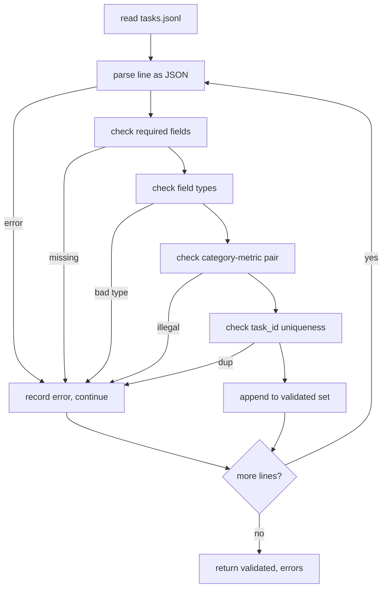

# 任务规范格式

> 一个 eval harness 的好坏，只取决于它的任务所遵守的契约。在写第一行评分函数之前，先冻结 JSONL 形状和 metric 词表。

**类型:** Build
**语言:** Python
**先修:** Phase 19 Track B foundations
**时间:** ~90 min

## 学习目标

- 定义一种 JSONL task record schema，用一个形状覆盖算术题、选择题、代码执行、分类和自由文本摘要。
- 固定一组封闭的 metric 名称词表，让下游 lesson（71-73）可以只根据一个字段分派。
- 把 few-shot examples 和 post-processing rules 指定为 task 的一部分，而不是 runner 的一部分，这样同一个 prompt 在不同模型上会产生同一个 target。
- 实现严格 validator，在 malformed records 进入 runner 之前拒绝它们。
- 交付一组 10-task fixture，覆盖规范的每个分支，让 validator 有真实内容可验证。

## 为什么需要冻结规范

研究型 codebase 积累 eval scripts 的速度，往往比积累 tests 更快。六个月后，每个 notebook 都有自己的 JSON shape，每个 metric 都被重新实现两遍，任何 run 之间都无法比较。修复方法很无聊：选一个 schema，写一个 validator，拒绝其他所有东西。这就是本课要做的事。

这个形状借鉴了 BIG-bench、HELM 和 lm-eval 风格 harness 的思路，但字段名是我们自己的。每个字段只有一个 owner。runner 读取 task，metric 读取 targets，post-process step 规范化 generation。pipeline 中途没有任何字段可变。

## 记录形状

一个 task 是单行上的一个 JSON object。harness 读取 `tasks.jsonl`，并独立验证每一行。坏行会中止那条 record，而不是中止整个 run。

```json
{
  "task_id": "arith_001",
  "category": "arithmetic",
  "prompt": "Compute the result. Question: 17 + 24\nAnswer:",
  "targets": ["41"],
  "metric_name": "exact_match",
  "few_shot_examples": [
    {"prompt": "Question: 2 + 2\nAnswer:", "completion": "4"}
  ],
  "post_process": "strip_whitespace",
  "metadata": {"difficulty": "easy"}
}
```

必填字段是 `task_id`、`category`、`prompt`、`targets`、`metric_name`、`post_process`。`few_shot_examples` 和 `metadata` 可选。未知的 top-level 字段会导致验证失败。

## 字段规则

`task_id` 是不含 whitespace 的字符串。validator 会强制它在文件内唯一。

`category` 是 `arithmetic`、`mcq`、`code_exec`、`classification`、`summary` 之一。category 会约束合法的 metric 和 post-process 组合。一个 `code_exec` task 必须使用 `metric_name = code_exec`，而一个 `mcq` task 必须使用 `metric_name = exact_match`，并匹配单字母 target。

`prompt` 是非空字符串。validator 禁止 trailing whitespace，也会拒绝 prompt body 中已经包含 few-shot block 的 records。Few-shot rendering 发生在 runner 中，而不是 author 这里。

`targets` 是非空 string list。对 `exact_match`，任意元素匹配即算正确。对 `f1` 和 `rouge_l`，最高分 target 胜出。对 `mcq`，list 正好包含一个元素。

`metric_name` 是 `exact_match`、`f1`、`bleu_4`、`rouge_l`、`accuracy`、`code_exec` 之一。词表是封闭的。新增 metric 需要一节新 lesson，也需要这里的新条目。

`few_shot_examples` 是 `{prompt, completion}` pair 的 list。validator 把列表上限设为八项，以保持 prompts 有界。

`post_process` 是 `none`、`strip_whitespace`、`lower`、`extract_letter`、`extract_code_block`、`extract_first_line` 之一。每条规则只有一种确定性行为。validator 禁止组合规则。

## Validator 行为



validator 返回两个 list：validated records，以及 error records。error records 会包含出错行、违反的规则和出错字段。除非显式设置 `--allow-bad-tasks` flag，否则只要 error list 非空，runner 就会拒绝启动。

## Few-shot 渲染

runner 会把 few-shot examples 拼接到 prompt 前面，中间用一个 blank line 分隔。每个模型都走同一条 code path，所以唯一的方差来源应该是模型本身。authors 写一次 examples，而不是为每个 provider 写一遍。

```python
def render(task):
    parts = []
    for ex in task.get("few_shot_examples", []):
        parts.append(ex["prompt"] + " " + ex["completion"])
    parts.append(task["prompt"])
    return "\n\n".join(parts)
```

## Post-process 规则

post-process step 在 generation 之后、metric 之前运行。它是确定性的、无状态的。

- `none` 原样返回字符串。
- `strip_whitespace` 去掉前导和尾随 whitespace。
- `lower` 把字符串转成 lowercase。
- `extract_letter` 返回第一个匹配 `[A-E]` 的字符，用于 MCQ。
- `extract_code_block` 返回第一个 triple-backtick fenced block 的 body，用于 code-exec。
- `extract_first_line` 返回第一个非空行，用于 summary classification。

需要这个列表之外规则的 task，应该放进一节新 lesson。

## 本课不做什么

它不评分，不调用模型，不运行代码。这些内容分别出现在 lesson 71、72 和 75。本课冻结的是它们共同遵守的契约。

这组 10-task fixture 覆盖两个 arithmetic item、两个 MCQ item、两个 code-exec item、两个 classification item 和两个 summarisation item。validator 会让全部 10 个通过。另有一个 fixture（`tasks_bad.jsonl`）会触发每条规则，validator 返回的 error 数量也正好对应这些触发项。

## 如何阅读代码

`main.py` 定义 `TaskSpec`、`validate_task`、`validate_file` 和一个 CLI entry point。fixture loader 是 `load_fixtures`。render 和 post-process helpers 与 validation 放在一起，这样 lesson 75 的 runner 只需要 import 一个 module。

先从头到尾读 `main.py`，再读 `code/tests/test_spec.py`。tests 固定了每条 validation rule 和每种 post-process 行为。`main.py` 底部的 demo 会验证 bundled fixture 并打印 summary。

## 继续深入

真实 eval suites 增长 category，就像 schemas 增长 column 一样。清醒的做法是：拒绝添加任何 category，除非同时添加 metric、post-process rule 和至少一个 fixture task。把 spec 当作 database migration。每个变更都要被 review、versioned，并配套 tests。本课中的 validator 就是这道 gate。
