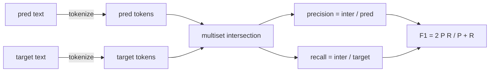
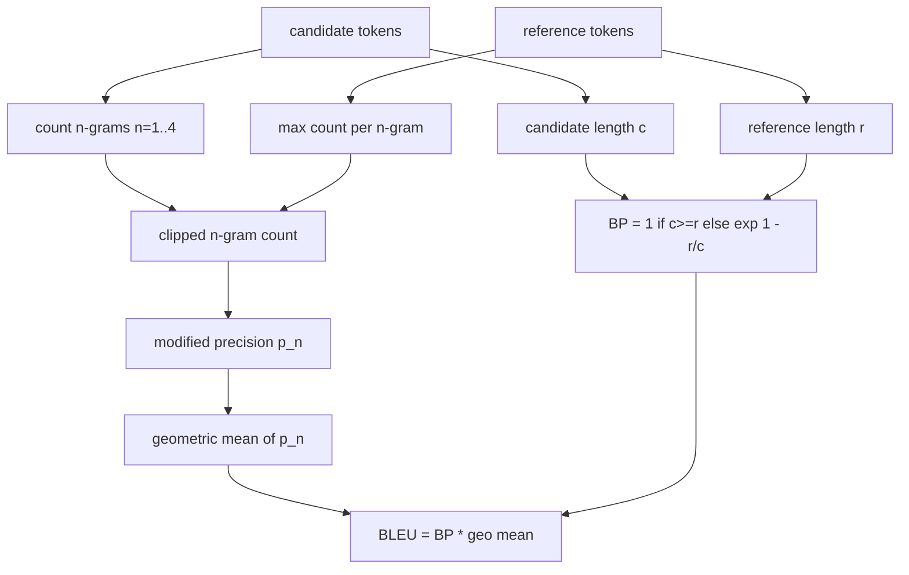

# 经典指标

> BLEU、ROUGE-L、F1、exact-match、accuracy。五个 metrics 仍然覆盖了大多数已发表 LLM eval 数字。亲手从第一性原理实现每一个，你才知道这个数字到底意味着什么。

**类型:** Build
**语言:** Python
**先修:** Phase 19 Track B foundations, lesson 70
**时间:** ~90 min

## 学习目标

- 用显式 tokenisation rules 实现 token-level exact-match、F1 和 accuracy。
- 从零实现 BLEU-4：modified n-gram precision、n 等于 1 到 4 的 geometric mean、brevity penalty。
- 使用 longest common subsequence 实现 ROUGE-L，并用 F-beta 组合 precision 和 recall。
- 基于 lesson 70 的 `metric_name` 字段分派，让 runner 保持 metric-agnostic。
- 用来自 worked examples 的 reference vectors 固定行为，而不是依赖 third-party library。

## 为什么要重新实现

你会读到一篇论文报告 BLEU 28.3，另一篇报告 BLEU 0.283。你会发现两个 libraries 的 ROUGE-L scores 相差十分，因为一个会截断到 lowercase，另一个不会。停止困惑最快的方法，是自己写一遍 metrics，然后指出 tokenizer 在哪一行决定、smoothing 在哪一行应用。之后，跨论文比较数字就变成了阅读 metric setup，而不是争论 libraries。

stdlib 加 numpy 足够了。BLEU 是计数和 clamp。ROUGE-L 是 dynamic programming。F1 是 tokens 上的 set intersection。最难的是选择一个 tokenizer，并承诺使用它。

## Tokenisation

tokenizer 是 `re.findall(r"\w+", text.lower())`。Lowercase，alphanumeric runs，丢弃 punctuation。本课中每个 metric 都使用这个确切 tokenizer。runner 没有选择权。如果你替换 tokenizer，你就在运行一个不同的 benchmark。

```python
TOKEN_RE = re.compile(r"\w+", re.UNICODE)
def tokenize(text):
    return TOKEN_RE.findall(text.lower())
```

这是一个刻意的简化。production setups 会关心 CJK、contractions 和 code identifiers。本课重点是：tokenizer 是契约，而不是旋钮。

## Exact match

```python
def exact_match(pred, targets):
    return float(any(pred.strip() == t.strip() for t in targets))
```

它对每个 task 返回 1.0 或 0.0。对 dataset 的 aggregate 是 mean。这是 arithmetic、MCQ 和短 classification tasks 的主力指标。

## Token-level F1

为 prediction 和 target 建立 token multiset。Precision 是 multiset intersection 除以 prediction 的 multiset。Recall 是同一个 intersection 除以 target 的 multiset。F1 是 harmonic mean。实现会处理 empty-prediction 和 empty-target edge cases。



对 multi-target tasks，我们取 target list 中最佳 F1。这与文献中广泛报告的 SQuAD-style 行为一致。

## BLEU-4

BLEU 是经典 machine-translation metric，并且仍然出现在 summarisation work 中。我们使用的是 corpus-level BLEU-4，带标准 brevity penalty，并在 modified n-gram counts 上使用 additive-one smoothing，这样单个缺失的 4-gram 不会把 score 推到零。

对每个 candidate-reference pair，我们计算 n 等于 1、2、3、4 时的 modified n-gram precision。Modified precision 会用任意 reference 中该 n-gram 的最大出现次数来 clip candidate n-gram count，因此 candidate 不能靠重复一个 phrase 来虚增。四个 precisions 的 geometric mean 会再乘上 brevity penalty。



smoothing rule 是 Lin 和 Och 称为 method 1 的规则：在取 log 之前，对每个 n-gram precision 的 numerator 和 denominator 都加一。这样当 reference 没有匹配的 4-gram 时可以避免 `log 0`，同时在长 candidates 上仍接近 unsmoothed value。

## ROUGE-L

ROUGE-L 比较 candidate 和 reference token sequences 的 longest common subsequence。LCS 能捕捉 word order，同时不强制 contiguous，这就是它成为默认 summarisation metric 的原因。我们用标准 dynamic-programming table 计算 LCS length，然后得到 recall 为 `lcs / reference length`，precision 为 `lcs / candidate length`，并用 beta 等于一的 F-beta 组合成对称 F1 形式。

```python
def lcs_length(a, b):
    n, m = len(a), len(b)
    dp = numpy.zeros((n + 1, m + 1), dtype=int)
    for i in range(n):
        for j in range(m):
            if a[i] == b[j]:
                dp[i+1, j+1] = dp[i, j] + 1
            else:
                dp[i+1, j+1] = max(dp[i+1, j], dp[i, j+1])
    return int(dp[n, m])
```

numpy table 让实现更易读；纯 Python lists 也可以。选择 ROUGE-L 的 tasks 会为每个 task 支付 O(n m) 成本。对典型 summary length，这通常低于一毫秒。

## Accuracy

对 multi-target classification tasks，accuracy 会简化为针对单个 normalised target 的 exact-match。我们把它暴露为独立函数，这样 dispatcher 可以基于 `metric_name` 分派，而不需要在 runner 内部进行 string comparisons。

## Dispatch 契约

唯一 entry point 是 `score(metric_name, prediction, targets)`。它返回 `[0, 1]` 中的 float。runner 不根据 metric name 分支。它把调用交出去，并写入结果。这就是 lesson 75 会连接 lesson 70 task spec 的 surface。

```python
def score(metric_name, pred, targets):
    if metric_name == "exact_match":
        return exact_match(pred, targets)
    if metric_name == "f1":
        return max(f1_score(pred, t) for t in targets)
    if metric_name == "bleu_4":
        return max(bleu4(pred, t) for t in targets)
    if metric_name == "rouge_l":
        return max(rouge_l(pred, t) for t in targets)
    if metric_name == "accuracy":
        return accuracy(pred, targets)
    raise ValueError(f"unknown metric_name: {metric_name}")
```

`code_exec` 在 lesson 72 中处理，并会在那里接入 dispatcher。

## 本课不做什么

它不调用模型。除了 lesson 70 的 post-process rules 已经做过的规范化之外，它不再规范化 generations。它不计算 confidence intervals。它不做 BLEURT 或 BERTScore（那些需要模型，属于另一节 lesson）。重点是地基：五个 metrics、一个 tokenizer、一张 dispatch table。

## 如何阅读代码

`main.py` 把每个 metric 定义为 free function，外加一个 dispatcher。reference vectors 位于文件底部的 `_reference_examples` block。demo 会对八个 examples 运行 dispatcher，并打印 per-metric scores。`code/tests/test_metrics.py` 中的 tests 固定 reference vectors，并覆盖每个 edge case（empty prediction、empty reference、no shared tokens、exact match、repeated phrase clipping）。

从头到尾读 `main.py`。functions 按复杂度排序。exact_match 和 accuracy 各一行。F1 六行。BLEU 和 ROUGE-L 是较重的部分，并且包含关于 smoothing rule 和 LCS recurrence 的详细 comments。

## 继续深入

经典 metrics 是必要的，但并不充分。它们奖励表层 overlap，却会漏掉 meaning。修复方式是在你信任经典地基之后，再叠加 model-based metrics（BLEURT、BERTScore、GEval）。那是之后的 lesson。现在：让这五个 metrics 可工作，用 tests 固定它们，你就拥有了一个 auditable、fast、reproducible 的 metric stack。
