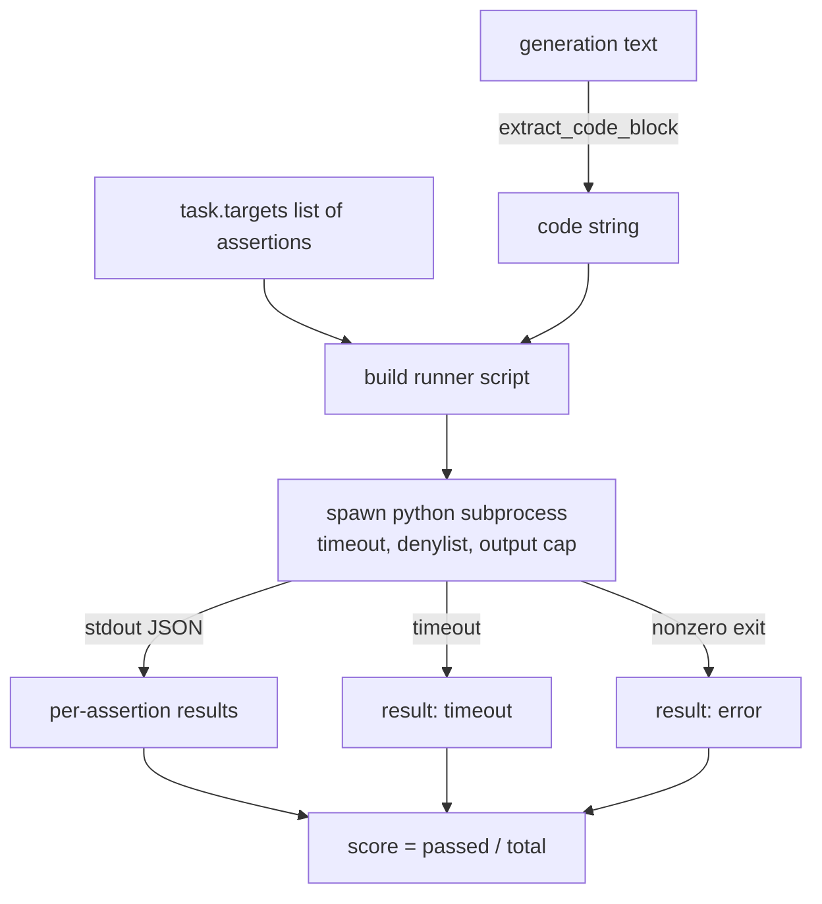
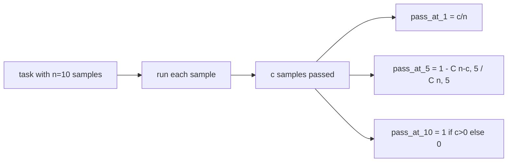

# 代码执行指标

> 生成的代码通过 tests 时才算正确。eval harness 必须提取代码、在不拖垮 host 的情况下运行它，并诚实统计 pass-rates。本课构建的就是这层 surface。

**类型:** Build
**语言:** Python
**先修:** Phase 19 Track B foundations, lessons 70 and 71
**时间:** ~90 min

## 学习目标

- 从 free-form generation 中提取 code block，并让行为与 lesson 70 的 post-process rule 一致。
- 在隔离 subprocess 中执行 candidate code，并带 wall-clock timeout、output cap 和 import denylist。
- 将 task 评分为 supplied assertion strings 中通过的比例。
- 为从同一个模型采样多个 generations 的 tasks 计算 pass-at-k。
- 把 sandbox crashes、syntax errors 和 timeouts 作为 first-class fail modes 处理，并给出 runner 可记录的 distinct exit codes。

## 为什么使用隔离 subprocess

Inline `exec` 是安全性和稳定性隐患。生成的 `while True: pass` 会永远阻塞 eval。生成的 `import shutil; shutil.rmtree('/')` 的灾难性也正如它看起来那样。修复方式是：为每个 candidate 启动一个新的 Python interpreter，通过 stdin 传入 code，把 assertion results 写到 stdout，并在超时后 kill process。host eval process 会继续运行。

HumanEval、MBPP、BigCodeBench 和 LiveCodeBench 等真实 eval 都使用 subprocess sandbox。有些会再叠加 Docker。我们有意停在 subprocess：它 portable、stdlib，而且能捕获 educational eval 中真正重要的 failure modes。production deployments 会添加 seccomp、network isolation 和 read-only filesystem。下一节 hardening lesson 不属于这条 track。

## Code-exec task 的形状

一个 `code_exec` task 会在 `targets` 中携带 assertion strings。runner 从 generation 中提取 fenced code block，围绕它构建 test harness，然后运行结果。



score 是 `[0, 1]` 中的 fraction。一个有三条 assertions 的 task，如果通过两条，就得到 0.667。无论什么失败，runner 都返回同一个 shape：subprocess crashes 会被映射到 normalised error code，而不是让 Python traceback 冒泡到 harness。

## Denylist

denylist 基于 import。在运行 candidate code 之前，runner script 会把危险 modules 的 imports 改写为一个会 raise `ImportError("denied")` 的 stub。这个列表刻意保守：`os.system`、`subprocess`、`socket`、`requests`、`urllib`、`urllib.request`、`urllib.error`、`urllib.parse`、`ctypes`、`shutil`、`http.client`、`asyncio.subprocess`。

我们不假装它是 bulletproof。坚决对抗的代码可以逃出 Python 中任何 in-process sandbox。denylist 是 backstop。真正承重的 controls 是 wall-clock timeout 和 output cap。

```python
DENIED = {
    "os.system": True,
    "subprocess": True,
    "socket": True,
    "shutil": True,
    "requests": True,
    "urllib": True,
    "ctypes": True,
}
```

我们通过前置 `import sys` 和一个会 monkey-patch `os.system` 使其 raise 的 guard 来包裹 candidate。完整 template 在 `main.py` 中。

## Wall-clock timeout

每个 subprocess 默认获得三秒 wall-clock budget。runner 使用 `subprocess.run(..., timeout=t)`。如果 timeout 触发，runner 捕获 `TimeoutExpired`、kill process，并为 task 记录一个 `timeout` exit reason。该 task 的 score 为零。runner 继续处理下一个。

timeout 可以通过 `task.metadata.timeout_s` 按 task 配置。长运行 unit tests 可以要求更多时间；lesson 70 的 validator 会把值 cap 在三十秒，保持 suite 有界。

## Output cap

subprocess 可能刷爆 stdout，耗尽 host memory。runner 会把 stdout stream 到 buffer 中，一旦 running total 超过 256 KB 就 kill child。结果记录为 `exit_code = error`，detail string 为 `"output overflow"`。当 generation 意外写出会打印的 infinite loop 时，这种情况会在实践中出现。

## Pass-at-k

Pass-at-k 是 HumanEval 等使用的 unbiased estimator。给定每个 task 的 `n` 个 independent samples，其中 `c` 个通过，那么从 `n` 个样本中抽取大小为 `k` 的样本且至少包含一个 passing solution 的概率是：

```text
pass_at_k(n, c, k) = 1 - C(n - c, k) / C(n, k)
```

当 `n - c < k` 时，numerator 未定义，值为 `1`。实现会直接处理这个 edge case。我们暴露 `pass_at_k(n, c, k)`，供 lesson 74 的 leaderboard layer 使用。



## Exit codes

runner 为每个 task 返回五种 outcomes 之一：

- `pass` 表示每条 assertion 都通过。
- `assertion_fail` 表示 code 运行了，但至少一条 assertion failed。
- `syntax_error` 表示 code 无法 import 或有 SyntaxError。
- `timeout` 表示 wall clock 到期。
- `error` 表示其他任何 crash，包括 denylist hits 和 output overflow（overflow 会以 detail `"output overflow"` 呈现）。

score 仍然是 fraction。exit code 是 metadata。downstream lessons 可以决定把 timeout 计为 zero，还是计为 missing data。

## 本课不做什么

它不会给你真正的 sandbox。它不会运行来自 open web 的 untrusted code。它不处理 file I/O 或 network calls 这类 stateful tasks。那些需要 container 或 microVM。本课重点是契约：一个隔离 subprocess、一个 denylist、一个 timeout、一个 output cap、一套清晰的 exit-code vocabulary，以及 pass-at-k math。

## 如何阅读代码

`main.py` 定义 `extract_code`、`run_candidate`、`score_code_exec` 和 `pass_at_k`。subprocess runner script 会被构建成字符串，并作为 `-c` 传给一个新的 Python interpreter。`code/tests/test_exec.py` 中的 tests 会用 HumanEval 风格 worked examples 覆盖四个 exit codes 和 pass-at-k。

从头到尾读 `main.py`。runner template 是承重部分。盯住 assertion loop，直到你能预测它写回 parent process 的 JSON envelope。

## 继续深入

subprocess shape 可工作后，下一件事是 portability。不同 Python versions 在 Windows 上处理 SIGKILL 的方式不同。最干净的修复是把 runner 放进 Docker image。再下一步，是用真实 unit test files 替代 assertion strings，让 eval 匹配 production CI 的做法。到那时就别再把 assertion strings 叫 tests 了；它们是 toy tests，也有 toy failure modes。
