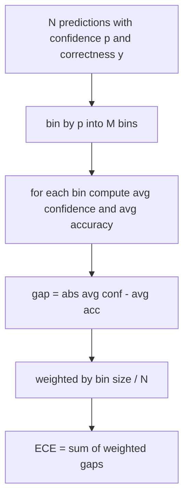
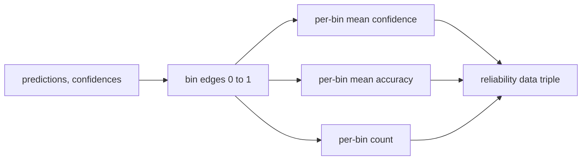

# Perplexity 与 Calibration

> 如果模型对一千个答案都说自己有 90 percent confident，却只答对六百个，它就没有良好 calibration。calibration 是可信 eval 的一半。另一半是 perplexity，它告诉你模型是否认为 held-out text 本身合理。

**类型:** 构建
**语言:** Python
**先修:** Phase 19 Track B foundations, lessons 70 and 71
**时间:** ~90 分钟

## 学习目标

- 根据 model adapter 提供的 token negative log-probabilities，在 held-out corpus 上计算 token-level perplexity。
- 根据分箱后的 predicted probabilities，计算 classifier 或 multiple-choice eval 的 expected calibration error (ECE)。
- 计算 Brier score（相对于 correctness indicator 的 mean squared error），并解释它何时能做到 ECE 做不到的事。
- 构建绘制 confidence-versus-accuracy 曲线所需的 reliability diagram data。
- 将三者接入 eval harness，让 runner 能在 model report 上附加 `perplexity`、`ece` 和 `brier` 数字。

## perplexity 告诉你什么

Perplexity 是每 token 平均 negative log-likelihood 的指数。越低越好。perplexity 为一意味着模型给每个真实 token 都分配了概率一。perplexity 等于 vocabulary size 意味着模型是均匀分布，什么也没学到。真实数字位于两者之间：一个强的 2026 base model 在 WikiText-103 上约为八到十二。差的模型在同一文本上会到五十以上。

harness 自己不计算 log-probabilities。它们来自 model adapter。harness 负责聚合：接收一组 per-token log-probabilities、一组每个 sequence 的 token counts，并返回 corpus perplexity。

```python
def perplexity(neg_log_probs, token_counts):
    total_nll = sum(neg_log_probs)
    total_tokens = sum(token_counts)
    return math.exp(total_nll / total_tokens)
```

实现会处理 zero-token edge cases，并断言 negative log-probabilities 是非负的。常见错误是忘记取负：adapter 返回 `log p` 而不是 `-log p`，会产生低于一的 perplexity，这是不可能的。函数会把它捕捉为 contract violation。

## ECE 衡量什么

Expected calibration error 会按 confidence 把 predictions 分到固定数量的 bins，然后测量每个 bin 内 confidence 与 accuracy 的平均差距，并按 bin size 加权。



标准形式在 `[0, 1]` 上使用十个等宽 bins。实现支持任意正整数数量。我们暴露 `bins` 参数，使 runner 可以在 publishing convention（10）和 comparison convention（15）之间选择。

ECE 会受 bin count 和 sample size 偏置影响。十个 bins、一百条 predictions 时，你无法区分 0.02 ECE 和随机噪声。实现会随 ECE 一起返回 populated bins 数量，让 runner 能在样本太少时拒绝报告单个数字。

## Brier score 做了 ECE 做不到的什么

ECE 只关心平均差距。一个模型在一半 bins 上过度自信、另一半 bins 上信心不足，可能有很低 ECE，却在局部 calibration 上很差。Brier score 测量每个 prediction 相对真实 outcome 的 squared error，因此会直接惩罚分散误差。

对于 binary outcomes，Brier 是 `mean((p_i - y_i)^2)`。它可以分解为 reliability、resolution 和 uncertainty。我们计算 score 和 decomposition。runner 报告 scalar，但会为 dashboard 记录 decomposition。

```python
def brier(p, y):
    return float(np.mean((p - y) ** 2))
```

## Reliability diagram data

reliability diagram 会绘制 predicted confidence 和每个 bin 中 empirical accuracy 的关系。对角线代表 perfect calibration。函数返回三个数组：per-bin average confidence、per-bin average accuracy 和 per-bin count。绘图代码在下游；本课止步于数据形状。



返回 tuple 正是调用层绘图或计算自定义 ECE 变体（adaptive ECE、sweep ECE 等）所需的东西。我们返回 numpy arrays，这样下游代码无需转换。

## confidence 来源

harness 不假设 confidence 来自 softmax。它接受每个 prediction 的任意 `[0, 1]` 数字。对于 multiple-choice tasks，自然 confidence 是 `softmax over option log-likelihoods`。对于 free-text，自然 confidence 是模型自报概率，或平均 log-likelihood 的指数。eval 只消费这个数字。来源是 adapter 的工作。

## 边界情况

- 全部 predictions 错误：ECE 是平均 confidence，Brier 很高，perplexity 取决于模型如何看待文本。
- 全部 predictions 正确且 confidence 很高：ECE 接近零，Brier 接近零。
- p=0.5 的完全不确定 predictor：ECE 是 0.5 减 accuracy，Brier 是 0.25 减一个 correction term。
- 空输入：ECE、Brier 和 reliability 返回 `0.0`（或 zero-filled arrays）。perplexity 在 zero-token 情况下返回 `NaN`。这些路径都不发出 warning；runner 检查值，并决定报告还是跳过。

这些情况都写进了测试。真实 benchmark 上的真实模型通常不会碰到它们，但 buggy adapter 或小样本会碰到，而 runner 不应该崩溃。

## Dispatch

Calibration 不是 F1 那样的 per-task metric。它是 per-model report。runner 会跨整个 eval 累积 `(confidence, correct)` pairs，然后计算一次 ECE、Brier 和 reliability data。Perplexity 在 held-out text corpus 上计算，独立于逐任务 scoring。

接口是：

```python
report = CalibrationReport.from_predictions(confidences, correct)
report.ece          # float
report.brier        # float
report.reliability  # tuple of three numpy arrays
report.populated_bins  # int
```

`PerplexityResult.from_token_nll(neg_log_probs, token_counts)` 返回 perplexity 和每 token average negative log-likelihood。

## 本课不做什么

本课不调用模型。不实现 softmax。不从 output tokens 估计 confidence；那是 adapter 的工作。不做 temperature scaling 或 Platt scaling；那些是不同课程中的 post-hoc fixes。本课目标是让三个数字（perplexity、ECE、Brier）可信且可复现。

## 如何阅读代码

`main.py` 定义 `perplexity`、`expected_calibration_error`、`brier_score`、`reliability_diagram`，以及 `CalibrationReport` / `PerplexityResult` dataclasses。demo 在已知 ground truth 的 synthetic predictions 上运行：一个 well-calibrated model、一个 overconfident model、一个 underconfident model。`code/tests/test_calibration.py` 中的测试固定了每个 edge case，以及 synthetic predictors 的 reference values。

从上到下阅读 `main.py`。函数顺序从 scalar 到 vector，再到 report。每个函数都有一个短 docstring，说明 math 和 contract。

## 继续扩展

Calibration 是 published eval 中最常被忽略的轴。大多数 leaderboards 只报告一个 accuracy number，然后就算完成。一个 accuracy 获胜但 Brier 失败的模型，比一个 accuracy 低几分但能可靠报告不确定性的模型更不适合生产部署。一旦你有了 calibration plumbing，就在 held-out validation slice 上添加 temperature scaling，重新计算 ECE，观察 gap 缩小。那是单独课程，但地基在这里。
