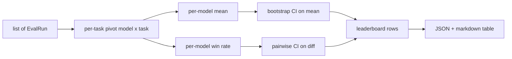
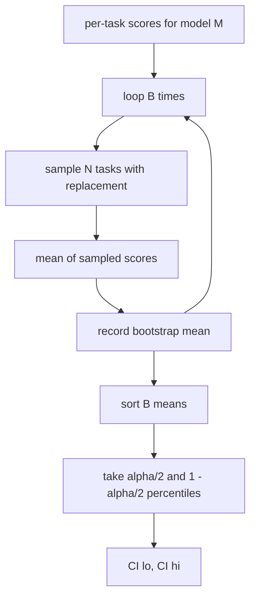

# Leaderboard 聚合

> per-task scores 很容易。跨异构任务给 per-model rankings 排序更难。在千条预测的 leaderboard 上做 statistical significance，是大家最常跳过的部分。本课不跳过它。

**类型:** 构建
**语言:** Python
**先修:** Phase 19 Track B foundations, lessons 70, 71, 73
**时间:** ~90 分钟

## 学习目标

- 将多个模型、多个任务上的 per-task scores 聚合成整洁的 per-model row。
- 归一化异构 scores，避免 pass rates 和 BLEU values 对 aggregate 产生过度影响。
- 按 mean 和 win-rate 给模型排名，并解释什么时候哪种 summary 更合适。
- 计算每个模型 mean score 和 pairwise differences 的 bootstrap confidence intervals。
- 将 leaderboard 输出为 JSON report，以及 lesson 75 的 runner 可粘贴到 CI comment 中的 markdown table。

## 输入形状

aggregator 消费一组 `EvalRun` records：

```python
@dataclass
class EvalRun:
    model_id: str
    task_id: str
    metric_name: str
    score: float          # in [0, 1]
    category: str
```

lesson 75 的 runner 会为每个 `(model, task)` pair 发出一条 record。aggregator 不关心 score 是怎么产生的。它预期 normalisation 已经发生：每个 score 都在 `[0, 1]` 内。

## 输出

会产生三张表：



leaderboard row 包含：`model_id`、`mean_score`、`mean_ci_lo`、`mean_ci_hi`、`win_rate`、`tasks_completed`，以及一个可选的 `categories` map，用于 per-category mean。

## 归一化

如果一个任务的分数在 `[0, 1]`，另一个在 `[0, 100]`，第二个会静默主导 mean。aggregator 会验证每个 input score 都位于 `[0, 1]`，否则拒绝运行。修复位于上游：metric 应该已经返回 fraction。Lessons 71 到 73 会强制该契约。

## Mean 和 win-rate

两种排名方案服务于不同目标。

Mean score 是一个模型的 per-task scores 平均值。它是 leaderboards 报告的 headline number。它对 outliers 和 task imbalance 敏感。

Win-rate 统计一个模型在同一任务上击败所有其他模型的频率。对每个 task，score 最高的模型获胜（ties split）。Win rate 等于 wins 除以该模型有 score 的 task 数量。它对 outliers 和 scale differences 不那么敏感，但会丢失信息。

```python
def win_rate(model_id, runs_by_task, all_models):
    wins, total = 0, 0
    for task_id, runs in runs_by_task.items():
        scores = {r.model_id: r.score for r in runs if r.model_id in all_models}
        if model_id not in scores:
            continue
        total += 1
        best = max(scores.values())
        if scores[model_id] >= best:
            wins += 1
    return wins / total if total else 0.0
```

harness 会同时报告两者。lesson 75 的 runner 默认按 mean 排名；markdown 中 win-rate 那一列也在，方便用户偏好它时直接查看。

## Bootstrap confidence intervals

per-model means 会带一个 confidence interval，通过对 tasks 做 bootstrap resampling 估计。我们有放回地重采样 task ids，计算重采样集合上的 mean，重复 `B` 次，然后在水平 `alpha` 下取 percentile interval。



对于 pairwise comparisons，我们 bootstrap 每个 task 上的差值 `score_A - score_B`，取 percentile interval，并报告它。用户可以直接看 interval 是否排除零。如果排除零，差异在 alpha 水平下显著。如果没有，leaderboard 会把模型视作并列。

low-level helpers（`bootstrap_mean_ci`、`bootstrap_pairwise_diff`）默认 `B=1000`；public aggregators（`aggregate`、`pairwise_diffs`）默认 `b=500`，让 demo 和 tests 保持快速。默认 alpha 是 0.05。本课让 bootstrap 保持 pure numpy，不用 scipy。

## Categories

如果设置了 `EvalRun.category`，aggregator 还会报告 per-category mean。这就是每个 leaderboard 上写着 `math`、`reasoning`、`code`、`safety` 的列。它能让 runner 发现某个模型总体不错但 code 薄弱，而 headline mean 会隐藏这种信息。

## Markdown rendering

leaderboard 会渲染为 markdown table：

```text
| Rank | Model | Mean | 95% CI | Win rate | Tasks |
|------|-------|------|--------|----------|-------|
| 1    | gpt   | 0.78 | 0.74-0.82 | 0.62 | 50 |
| 2    | claude| 0.75 | 0.71-0.79 | 0.34 | 50 |
| 3    | random| 0.10 | 0.07-0.13 | 0.04 | 50 |
```

table 按 mean score 排序。CI 渲染为两位小数。长 model ids 会截断到二十个字符。

## 本课不做什么

本课不运行模型。不调用 metric layer。不实现 adaptive ECE 或其他 calibration variants；那些是 lesson 73 的内容。不实现 task weighting。这里每个 task 权重相同。生产 leaderboards 会给 tasks 加权；我们通过 `weight` 字段保留 hook，但 aggregator 中忽略它。如果你需要，加权可以放在后续课程中添加。

## 如何阅读代码

`main.py` 定义 `EvalRun`、`LeaderboardRow`、`aggregate`、`bootstrap_mean_ci`、`bootstrap_pairwise_diff` 和 `render_markdown`。demo 会构建三种模型和十二个任务的 synthetic suite，聚合后打印 leaderboard 和 pairwise diff table。`code/tests/test_leaderboard.py` 中的测试固定了 bootstrap、markdown rendering、win-rate edge cases 和 empty-input behaviour。

从上到下阅读 `main.py`。data shape（EvalRun、LeaderboardRow）在前，aggregator 在后，bootstrap 第三，rendering 最后。每个函数都有聚焦的 contract。

## 继续扩展

自然下一步是 paired-task significance，而不是 unpaired bootstrap。如果 model A 和 B 都跑了同一百个 tasks，合适的检验是 task-by-task differences 上的 paired bootstrap，我们已经实现。再往后，你会需要一个尊重 task families 的 hierarchical bootstrap（math problems 彼此并不独立；一个 arithmetic error pattern 会影响其中十道）。那是后续内容。本课的重点是把地基做对，让 eval 报告一个你能 defend 的数字。
