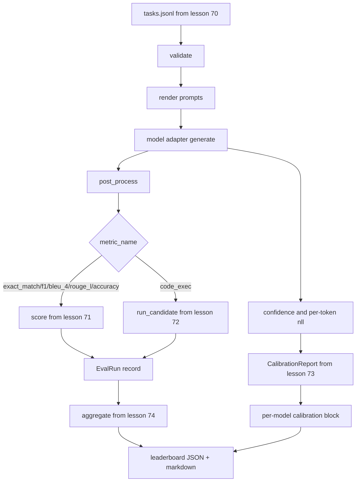

# 端到端 Eval Runner

> 五课 plumbing，一课 glue。runner 读取 lesson 70 的 task spec，通过 adapter 调用模型，用 lessons 71 和 72 打分，附加 lesson 73 的 calibration report，并发出 lesson 74 的 leaderboard。Demo 会自终止。

**类型:** 构建
**语言:** Python
**先修:** Phase 19 Track B foundations, lessons 70 through 74
**时间:** ~90 分钟

## 学习目标

- 定义一个 `ModelAdapter` interface，让任何模型（mock、local、API）都能用很小的方法表面满足它。
- 在 worker pool 中并行执行任务，基于 fixture JSONL 文件运行 eval。
- 在一趟中组合 metric layer（exact_match、F1、BLEU-4、ROUGE-L、code_exec）和 calibration layer。
- 发出 per-model `EvalRun` records，并直接送入 leaderboard aggregator。
- 同时输出 JSON report 和 markdown table；clean run 时自终止并返回 exit zero，validation 或 runtime failure 时返回 non-zero。

## 流水线



runner 是集成点。Lessons 70 到 74 各自拥有一个模块，runner 会组合它们。runner 不复制这些模块中的任何逻辑：它导入它们。

## adapter interface

adapter 是 runner 和任意模型之间的接口。interface 有意保持很小。

```python
class ModelAdapter:
    model_id: str

    def generate(self, prompt: str, task: TaskSpec) -> Generation: ...
```

`Generation` 是一个 dataclass，包含：

- `text`: 模型的自由形式输出
- `confidence`: `[0, 1]` 中的 float，表示模型对答案的自报概率
- `token_nll`: 可选，生成 tokens 的 negative log-likelihood 总和
- `token_count`: 可选，生成 tokens 数量

runner 中的 mock adapters 提供三种风格：`RuleBasedAdapter`（确定性、近乎完美）、`NoisyAdapter`（过度自信、经常错误）和 `BiasedAdapter`（擅长一个 category，另一个很差）。demo 会在 lesson 70 fixture 上运行三者。

## 并行执行

runner 使用 `concurrent.futures.ThreadPoolExecutor` 按模型并行运行任务。worker count 默认为八和 task count 中较小者。线程足够，因为真实模型调用的瓶颈是 network I/O。code-exec path 会在任务内部生成自己的 subprocess，executor 只负责调度等待。

为了 deterministic tests，runner 暴露 `run_eval(adapters, tasks, parallel=False)`，让测试可以固定执行顺序。

## 单趟 scoring loop

对每个 task：

1. 渲染 prompt（few-shot prefix 加 prompt body）。
2. 调用 adapter 并记录调用耗时。
3. 根据 task rule 后处理 generation。
4. 分派到 metric layer。
5. 构建带 score 和 metric metadata 的 `EvalRun` record。
6. 将 `(confidence, correct)` pair 追加到 calibration buffer。

`correct` signal 对 exact_match-style metrics（`exact_match`、`accuracy`、`code_exec`）使用 `score >= 1.0`，对 graded metrics 使用 `score >= 0.5`。阈值位于 `_correct_from_score`，runner 不暴露 public override。

## 聚合

每个 task 都得到结果后，runner 会调用 lesson 74 的 `aggregate` 和 `pairwise_diffs`，以及 lesson 73 的 `CalibrationReport.from_predictions`。输出是一个单一 JSON envelope：

```json
{
  "leaderboard": [...],
  "pairwise": [...],
  "calibration": {
    "model_id_a": {"ece": 0.04, "brier": 0.10, "populated_bins": 8, ...},
    ...
  },
  "summary": {
    "tasks": 10,
    "models": 3,
    "wall_seconds": 1.2
  }
}
```

runner 还会向 stdout 写一张 markdown table，方便用户粘贴到 PR review。

## 自终止 demo

demo 会在 lesson 70 的十个 fixture tasks 上运行三个 mock adapters。wall time 应低于十秒。clean run 的 exit code 是零。

clean-run criteria 是：

- 每个 task 都通过 lesson 70 validation。
- 每个 task 都通过 lessons 71 和 72 scoring。
- calibration report 在 lesson 73 下无错误聚合。
- leaderboard 将 rule-based adapter 严格排在 random adapter 之上。

如果任一项破坏，runner 会返回 non-zero，并在 JSON envelope 中带上 structured error。

## 本课不做什么

本课不调用真实模型。不实现 API key flow 或 rate-limit handling。不实现 streaming 或 partial generation；adapter 每次调用返回一个 generation。不做 retries 或 caching。这些关注点位于 adapter layer；runner 与 metric 和 provider 都无关。

## 如何阅读代码

`main.py` 是集成。它通过一个小 `_load_sibling` helper 从其他五课模块导入，helper 会按相对路径解析它们。dataclasses `Generation`、`EvalReport` 和 `ModelAdapter` 在本地定义。mock adapters 位于文件底部。

从上到下阅读 `main.py`。先略读 imports，再看 `run_eval`，再看 `_score_one`，最后看 adapters。末尾 demo 是入口点。

`code/tests/test_runner.py` 中的测试固定了 adapter interface、single-pass loop、parallel-vs-sequential equivalence、calibration buffer 和 JSON envelope shape。

## 继续扩展

这个 runner 是地基。生产 eval system 会添加：按 `(task_id, model_id, model_version)` 设键的 results cache、跟踪每次运行 dollars 和 tokens 的 cost ledger、对 rate limits 做 backoff 的 retry layer、pass-at-k tasks 的 sampling policy，以及长 suites 的 streaming output format。每一项都是包裹 runner 的单一关注点，不改变 metric 或 aggregation layers。这种分离正是 contract 的意义。

mock 跑通之后，为真实 provider 添加 adapter。选一个有免费层的 provider，写三十行 glue，看 leaderboard 亮起来。然后添加第二个 provider，让 harness 做它该做的工作。
