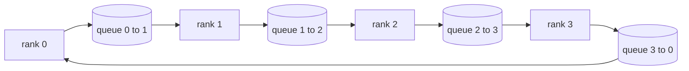

# 从零构建 Collective Ops

> 支撑分布式训练的四个 collective operations 是 allreduce、broadcast、allgather 和 reduce_scatter。训练框架提供的其他 primitive 都是围绕这些的包装。在 `multiprocessing.Queue` mesh 上构建它们一次，用 reference implementation 验证它们，track 的其余部分就变成 plumbing。

**类型:** 构建
**语言:** Python
**先修:** Phase 19 Track C lessons 42-49
**时间:** ~90 分钟

## 学习目标

- 用两趟实现 ring allreduce（reduce-scatter 然后 allgather），并证明 per-rank communication volume 是每个 element 2(N-1)/N bytes。
- 在 `multiprocessing.Queue` 上的 point-to-point sends 之上构建 broadcast、allgather 和 reduce_scatter。
- 用同一输入上的 `torch.distributed` gloo reference 验证每个 primitive。
- 根据 cluster shape、latency floor 和 bandwidth ceiling，为 ring 与 tree 的选择辩护。

## 要解决的问题

N 个 ranks 上的朴素 allreduce 会把 N 倍 tensor 发送到 root，再广播 N 倍回来。每 rank bandwidth 按 O(N) 扩展，root 成为瓶颈，wall-clock floor 是最慢链路乘以 N。Ring allreduce 会把它摊平成 2(N-1) 个大小为 T/N 的 chunks，因此 per-rank bytes 降到 2T(N-1)/N，与 cluster size 无关。Tree allreduce 在小 N 和高延迟链路上获胜，因为深度是 log2(N) hops，而不是 2(N-1)。如果为 cluster shape 选错 topology，最慢 GPU 会决定 step time。

你在本 track 中会阅读的每个 distributed training framework 都依赖这四个 primitives。PyTorch DDP 用每个 parameter bucket 一次 allreduce 来同步 gradients。ZeRO 通过 reduce_scatter 分片 optimiser state，并通过 allgather 广播更新后的 parameters。FSDP 把完整 forward 变成 allgather 加 reduce_scatter。Pipeline parallel 需要 broadcast 在 stage groups 之间传递 activations。如果你不能实现这四个 collectives，就无法推理训练为什么卡住、gradient mismatch 为什么出现在 rank 3、或者为什么换 topology 后 pipeline bubble 翻倍。

## 核心概念



### 两趟 ring allreduce

把 tensor 切成 N 个等大小 chunks，索引为 0..N-1。每个 rank 拥有与自身 rank 相同的 chunk index。Pass 1，reduce-scatter，运行 N-1 步。在 step s，rank r 将 chunk (r - s) mod N 发送到 rank (r + 1) mod N，并从 rank (r - 1) mod N 接收 chunk (r - s - 1) mod N，把收到的 chunk 累加到本地副本中。N-1 步后，rank r 拥有 chunk r 的完整 sum。Pass 2，allgather，再运行 N-1 步，把完成的 chunks 沿 ring 旋转，直到每个 rank 都持有每个 chunk 的完整 sum。

| Primitive | Per-rank bytes | Steps | When to use |
|-----------|---------------|-------|-------------|
| Ring allreduce | 2T(N-1)/N | 2(N-1) | Large T, fat-pipe homogeneous cluster |
| Tree allreduce | T log2(N) | 2 log2(N) | Small T or high-latency links |
| Broadcast | T | log2(N) tree | Parameter init, scalar config |
| Allgather | T(N-1)/N | N-1 | Sharded forward, ZeRO unshard |
| Reduce_scatter | T(N-1)/N | N-1 | ZeRO gradient sharding |

### Queue mesh 作为 NCCL 的替身

NCCL 运行在 PCIe 和 NVLink 上，并带有 hardware-offloaded reductions。CPU 上没有这些。每条 ring edge 一个 `multiprocessing.Queue` 会给你有序 point-to-point delivery，且单 producer 单 consumer。reduction 在 user space 中发生，所以你会付出 Python overhead，但 wire pattern 与 NCCL ring allreduce 完全一致。在 queue 版本上推理 correctness，cluster 行为也随之可推理。

### 用 gloo 验证

每个 primitive 都配有 unit test，把它的输出与同一 world size、同一 tensor 上用 gloo backend 初始化的 `torch.distributed` 输出比较。如果你的 ring allreduce 与 gloo 的差异超过 float32 epsilon，测试会失败。用 reference implementation 验证是不可协商的；没有它，primitive 看起来正确，直到真实训练跑到第 10000 步才暴露问题。

## 动手实现

`code/main.py` 实现：

- `Mesh` class，将 N 个 `multiprocessing.Queue` instances 接成 ring，并为每个 rank 暴露 `send(dst, tensor)` 和 `recv(src)`。
- `ring_allreduce(mesh, rank, world_size, tensor)`，运行两趟算法。
- `broadcast(mesh, rank, world_size, tensor, src)`，通过 logarithmic tree 实现。
- `allgather(mesh, rank, world_size, tensor)`，使用 N-1 次 rotations。
- `reduce_scatter(mesh, rank, world_size, tensor)`，作为 allreduce 的前半部分。
- `_gloo_reference(op, world_size, tensor)`，用 gloo 让同一输入跑过 `torch.distributed`，用于 byte-equal comparison。

运行：

```bash
python3 code/main.py
```

输出：per-primitive verification table，对比 queue-mesh 和 gloo outputs，随后是 per-rank byte counter，用来证明 2T(N-1)/N scaling。

## 生产中的模式

三个模式会把 primitives 加固到可以上线。

**Bucket gradients before allreduce.** 一个 1B-parameter model 有数万个 gradient tensors。每个 tensor 一次 allreduce 会支付 N 次 latency floor。DDP 会把 gradients bucket 成约 25 MB chunks，每个 bucket 发起一次 allreduce；小 tensors 搭大 tensors 的车。没有 bucketing，latency overhead 会主导 step。

**Overlap communication with computation.** Backward 按反向层序逐层计算 gradients。最后一层 gradient 一准备好，就发起它的 allreduce，同时下一层继续计算。PyTorch DDP 用 bucket-ready hooks 连接这一点。当网络有 slack 时，overlap 会把可见通信时间减半。

**Pick ring or tree by message size, not religion.** NCCL 带一个 topology detector，会对大于约 1 MB 的 messages 选择 ring，对更小的 messages 选择 tree。crossover 是 bandwidth-versus-latency：高于 1 MB 时，bandwidth term 2T(N-1)/N 主导，ring 获胜；低于 1 MB 时，log2(N) hop count 获胜。硬编码某个 topology 会在错误 message size 上损失吞吐。

## 实际使用

生产模式：

- **PyTorch DDP.** backward 后对 bucketed gradients 调用 `dist.all_reduce`。bucket size 可调；默认 25 MB 对 100Gbit Ethernet 来说合理。
- **DeepSpeed ZeRO.** 发起 reduce_scatter 来分片 gradients，并在 forward 之前 allgather 来重构完整 parameters。本课 primitives 正是 ZeRO 调用的那些。
- **FSDP.** Forward 从 allgather 开始，unshard 该层，计算，然后用 reduce_scatter reduce 并丢弃 unshard。同样 primitives，不同 schedule。

## 交付成果

在 lessons 77-81 中使用 queue-mesh primitives。Lesson 77 把 allreduce 接入 DDP。Lesson 78 把 reduce_scatter 接入 ZeRO。Lesson 79 把 broadcast 接入 pipeline activations。Lesson 81 将四者组合进 end-to-end demo。

## 练习

1. 添加 tree allreduce 变体，并按 message size 在 ring 和 tree 之间切换。测量 crossover。
2. 添加 `recv_timeout_ms`，让 stalled rank 浮出 deadline error，而不是永远挂起。
3. 将 `multiprocessing.Queue` 替换为 TCP sockets，实现四个 primitives。同样 tests，真实 wire。
4. 添加 bandwidth instrumentation hook，把 per-rank byte counter 记录到 JSONL。
5. 在 4 个 ranks 上比较 1KB、1MB、16MB tensors 的 ring 与 tree wall-clock time。用实证结果为 crossover 辩护。

## 关键术语

| 术语 | 常见说法 | 实际含义 |
|------|----------------|------------------------|
| Allreduce | “Sum across ranks” | 调用结束后，每个 rank 都持有同一个 reduced tensor |
| Ring | “The fast topology” | 大小为 T/N 的 N-1 个 chunks 沿 cycle 流动两次 |
| Tree | “The log topology” | reduction 沿 binary tree 进行；深度为 log2(N) hops |
| Allgather | “Concatenate shards” | 每个 rank 最终都有其他所有 rank 的 shard |
| Reduce_scatter | “Split the sum” | 每个 rank 最终只持有一个 chunk 的 sum |
| Bucket | “Fuse small tensors” | 将 N 个小 allreduces 合并成一个大的 allreduce |

## 延伸阅读

- [PyTorch Distributed: NCCL collectives](https://pytorch.org/docs/stable/distributed.html#collective-functions)
- [Horovod ring allreduce paper](https://arxiv.org/abs/1802.05799)
- [NCCL topology and algorithm selection](https://docs.nvidia.com/deeplearning/nccl/user-guide/docs/index.html)
- [Patarasuk and Yuan, Bandwidth optimal allreduce algorithms](https://www.cs.fsu.edu/~xyuan/paper/09jpdc.pdf)
- Phase 10 Lesson 05 - distributed training overview
- Phase 19 Lesson 77 - DDP wired on top of these primitives
