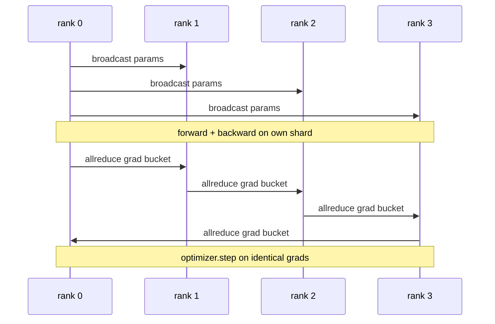

# 从零实现数据并行 DDP

> DistributedDataParallel 是 allreduce 之上的一个 hook。包一层模型，从 rank 0 广播初始参数，让每个 rank 以完全相同的状态开始；在每个参数上安装 backward hook，对梯度发起 allreduce；剩下的就是梯度下降。整个模式 200 行就能写完。

**类型:** Build
**语言:** Python
**先修:** Phase 19 Track C lessons 42-49
**时间:** ~90 min

## 学习目标

- 接好一个形如 `DistributedDataParallel` 的 wrapper：广播初始参数，并在 backward 之后 allreduce 梯度。
- 使用 `torch.multiprocessing.spawn` 在基于文件 rendezvous 的 gloo backend 上启动 N 个 CPU rank。
- 通过在相同数据上顺序训练同一个模型，并展示每一步参数等价，证明梯度同步的正确性。
- 说明 buckets（梯度融合）和 overlap（backward 期间通信）为何是把可工作的 DDP 变成生产级 DDP 的两个关键改动。

## 要解决的问题

一个 10 亿参数模型加上 12 GB activation，放不进单张消费级 GPU。即便能放下，训练也可能持续数周。数据并行把 batch 拆给 N 个 rank，每个 rank 在自己的 shard 上计算 forward 和 backward；每一步都把所有 rank 的梯度求和，让 N 份模型副本保持一致。优化器 step 使用的就是这个求和后的梯度。

没有梯度同步，N 个副本到第 2 步就会分叉。模型不再是“一个在更多数据上训练的模型”，而是 N 个碰巧共享初始权重的独立模型。梯度同步做得很差时（每个参数一次 allreduce、没有 overlap、没有 bucketing），网络会成为瓶颈，GPU 空等链路。DDP 的手艺在于让梯度同步相对于计算几乎免费。标准 PyTorch DDP 通过梯度分桶、把 allreduce 与下一层 backward 重叠、并在 NVLink 上使用 NCCL 来实现这一点。我们可以在 CPU 上用 gloo 做出这三件事，并学到同样的经验。

## 核心概念



### DDP 需要的三个操作

| 阶段 | Collective | 为什么 |
|-------|-----------|-----|
| Init | broadcast from rank 0 | 每个 rank 都从相同参数开始 |
| After backward | allreduce of each grad | 优化器 step 使用的是平均梯度 |
| Sometimes | broadcast of buffers | Batchnorm running stats 保持同步 |

### 为什么取 mean 而不是 sum

Allreduce-SUM 除以 world_size 得到平均梯度。mean 对 world_size 不敏感：在 1 个 rank 上调好的 learning rate 到 4 个 rank 上仍然可用，因为每一步的梯度量级没有改变。不除法的 Allreduce-SUM 会迫使你每次改变集群规模时重新调 learning rate。DDP 包装 SUM 并做除法；本课也照做。

### 为什么要 bucket 梯度

一个 transformer 有成千上万个参数 tensor。每个 tensor 一次 allreduce，会把 gloo 的延迟下限支付成千上万次。DDP 把梯度分组到约 25 MB 的 bucket 中，每个 bucket 发起一次 allreduce。通过网络传输的总字节数相同，但延迟被 bucket 摊薄。本课的小模型把所有东西放进一个 bucket；这种结构会迁移到真实规模。

### 为什么固定 seed

每个 rank 必须用 `torch.manual_seed(seed + rank)` 做 shuffling，但参数初始化要用 `torch.manual_seed(seed)`。单个共享 seed 会让每个 rank 看到相同的 batch 顺序（破坏数据并行）；参数使用 rank-specific seed 会让初始参数在浮点 epsilon 级别不同，梯度同步之后副本也不再相同。seed 模式要写对，否则参数等价测试会在第 1 步失败。

## 动手实现

`code/main.py` 实现：

- `MiniMLP`：一个 3 层 MLP，小到几秒内收敛，大到足以暴露接线逻辑。
- `DistributedDataParallel(model, world_size)`：构造时广播参数，返回一个 wrapper，其 `sync_grads` 会把 allreduce 累加得到的梯度除以 world_size。
- `worker(rank, world_size, ...)`：完整训练循环，使用 gloo 初始化 `torch.distributed`，执行 forward、backward、sync、step。
- `_reference_single_process_loop(...)`：在一个 rank 上按顺序用相同数据训练同一个模型，供测试逐步验证参数在字节级别等价。

运行：

```bash
python3 code/main.py
```

输出：一张逐步训练表，对比 single-process loss 和参数 checksum 与 4 个 rank 上 DDP 运行的结果。两条路径产生的 loss 曲线在浮点 epsilon 内完全一致，证明梯度同步正确。

## 实际生产中的模式

有三种模式能把 DDP 加固到可上线。

**查找未使用参数。** 一些 forward 路径会条件性跳过参数（early exit、mixture-of-experts router）。被跳过的参数没有梯度，但 DDP 的 bucket-ready hook 仍会等待它们，allreduce 会 deadlock。`find_unused_parameters=True` 会告诉 DDP 在 reduce 之前查看哪些参数拿到了梯度。代价是每一步要遍历计算图，所以除非 forward 有分支，否则保持关闭。

**静态图优化。** 当 forward 在各步之间稳定时，`static_graph=True` 允许 DDP 预计算 bucket schedule。这个优化在规模化时很重要：预计算每步能省几毫秒，累积到 10000 步就很可观。

**梯度累积需要小心。** 在 K 个 microbatch 上累积梯度而不在每个 microbatch 都同步，是 10x throughput 的收益。DDP 暴露 `no_sync()` 作为 context manager，用来暂停 post-backward allreduce。忘了这个 manager，就会白白 allreduce K 次，throughput 掉到底。

## 实际使用

生产模式：

- **PyTorch DDP.** 标准实现。`torch.nn.parallel.DistributedDataParallel(model)` 会接好 bucketing、overlap 和 no_sync context。
- **HuggingFace Accelerate.** 增加一个 launcher，处理 `torchrun` env vars 和模型包装。底层仍是同一个 DDP。
- **Megatron-LM data parallel.** 将 DDP 与 tensor parallel 结合用于大模型；data-parallel 部分仍是 backward 后 allreduce 的模式。

## 交付成果

Lesson 78（ZeRO sharding）用 reduce_scatter 替换逐参数 allreduce，让每个 rank 只存储自己的优化器状态 shard。Lesson 81 会把 DDP 与 ZeRO 组合进 end-to-end demo。

## 练习

1. 增加可配置大小的梯度 bucket，并在更深的模型上测量相对于每参数一次 allreduce 的加速。
2. 把 `no_sync()` 实现为 context manager，并验证 K 个 microbatch 的梯度累积与 single-process baseline 匹配。
3. 增加 `find_unused_parameters` 模式，让 forward 有时跳过某个 MLP 层；没有该 flag 时运行应该 deadlock。
4. 用只基于 `torch.distributed.barrier()` 的同步替换 gloo，体会 allreduce-based sync 和 barrier-based sync 的区别。
5. 对 batch size 1、16、256 测量梯度同步开销占 step time 的比例，并解释其扩缩规律。

## 关键术语

| 术语 | 人们常说 | 实际含义 |
|------|----------------|------------------------|
| DDP | "Data parallel" | 广播参数并在每一步 allreduce 梯度的 wrapper |
| Bucket | "Fuse grads" | 把 N 个小 allreduce 合并成一个大的 allreduce |
| Overlap | "Hide comm" | 在后续层仍在计算 backward 时发起 allreduce |
| no_sync | "Accumulate" | 为梯度累积跳过 post-backward allreduce |
| find_unused | "Branchy forward" | 在 reduce 前检测没有 grad 的参数 |

## 延伸阅读

- [PyTorch DistributedDataParallel docs](https://pytorch.org/docs/stable/generated/torch.nn.parallel.DistributedDataParallel.html)
- [PyTorch DDP internals tutorial](https://pytorch.org/tutorials/intermediate/ddp_tutorial.html)
- [Li et al, PyTorch Distributed: Experiences on Accelerating Data Parallel Training](https://arxiv.org/abs/2006.15704)
- Phase 19 Lesson 76 - DDP 建立在其上的 collectives
- Phase 19 Lesson 78 - ZeRO sharding 用 reduce_scatter 替换 per-param allreduce
