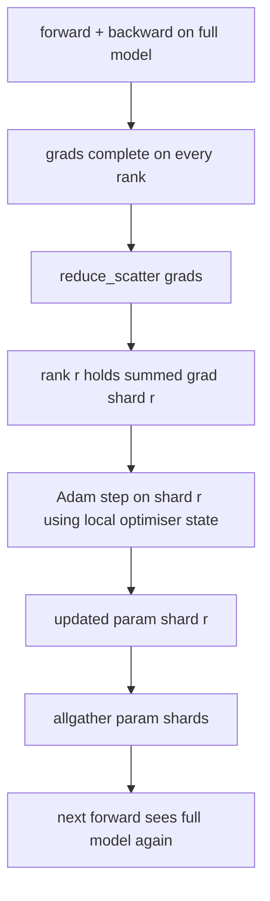

# ZeRO 优化器状态分片

> Adam 为每个参数存储两个 moment estimate，二者都是 float32。一个 7B 参数模型会带着 56 GB 的优化器状态。ZeRO stage 1 把它们切分到 N 个 rank 上；每个 rank 拥有优化器的 1/N。本地 step 之后，更新后的参数 shard 广播回去，每个 rank 重建完整模型，下一步开始。收益是在训练栈中最大的单项分配上实现线性内存下降。

**类型:** Build
**语言:** Python
**先修:** Phase 19 Track C lessons 42-49
**时间:** ~90 min

## 学习目标

- 将优化器状态（first moment、second moment、fp32 master copy）切分到 N 个 rank 上，让每个 rank 拥有 1/N。
- 使用 reduce_scatter 只把每个 rank 自己 shard 的梯度和交付给它，然后用 allgather 把更新后的参数 shard 广播回去。
- 计算 stage 1、stage 2、stage 3 相对于 vanilla DDP 的内存节省表。
- 根据模型大小和带宽预算，说明如何选择 stage 1、stage 2 或 stage 3。

## 要解决的问题

Vanilla DDP 会复制一切：参数、梯度和优化器状态在每个 rank 上都完整存在。对于 fp16 的 7B 参数模型，这意味着每个 rank 有 14 GB 参数、14 GB 梯度和 28 GB 优化器状态。优化器状态是最大的一项，也是最容易分片的一项，因为它只在 step 期间被访问，而不是在 forward 或 backward 期间。

ZeRO stage 1 对优化器状态分片。每个 rank 持有 Adam moments 的 1/N。backward 之后，不再 allreduce 完整梯度并本地 step，ZeRO 使用 reduce_scatter，让每个 rank 只接收自己 shard 的求和梯度。该 rank 用 master parameters 的 shard 执行优化器 step。随后更新后的参数 shard 通过 allgather 回来，让每个 rank 为下一次 forward 拿到完整模型。优化器内存除以 N。每一步的链路流量与 DDP 相同：一次 reduce_scatter 加一次 allgather 在带宽上等于一次 allreduce。内存赢了，throughput 保持。

## 核心概念



### ZeRO 的阶段

| Stage | 分片内容 | 每个 rank 的内存 | 每步通信 |
|-------|----------------|------------------|---------------|
| DDP | 无 | params + grads + optim | 1x allreduce |
| ZeRO-1 | optimiser state | params + grads + optim/N | 1x reduce_scatter + 1x allgather |
| ZeRO-2 | optim + grads | params + grads/N + optim/N | 1x reduce_scatter + 1x allgather |
| ZeRO-3 | optim + grads + params | params/N + grads/N + optim/N | 1x allgather per layer + 1x reduce_scatter per layer |

Stage 1 是成本最低的胜利，因为优化器状态主导预算。Stage 2 需要 gradient-shard accumulation 逻辑，但带宽相同。Stage 3（FSDP）为每个 forward 和 backward 支付逐层通信，换取参数 shard 的内存下降。本课完整实现 stage 1。

### 内存数学，真实数字

对于一个使用 Adam 以 mixed precision 训练、拥有 P 个参数的模型：

| 项 | Vanilla | ZeRO-1 | 为什么 |
|------|---------|--------|-----|
| fp16 params | 2P bytes | 2P bytes | forward 需要 |
| fp16 grads | 2P bytes | 2P bytes | backward 需要 |
| fp32 master copy | 4P bytes | 4P/N bytes | 只有 optim 使用它 |
| fp32 first moment | 4P bytes | 4P/N bytes | 只有 optim 使用它 |
| fp32 second moment | 4P bytes | 4P/N bytes | 只有 optim 使用它 |
| Total | 16P bytes | 4P + 12P/N bytes |   |

在 N=8 时：vanilla 16P，ZeRO-1 5.5P，下降 65%。在 N=64 时：vanilla 16P，ZeRO-1 4.19P，下降 74%。

### 为什么 reduce_scatter 优于 allreduce 后再分片

Allreduce 会把完整的求和梯度给每个 rank。如果你只需要 shard r，那么 rank r 上被 reduce 的梯度中有 (N-1)/N 是浪费的。Reduce_scatter 精确交付每个 rank 拥有的 shard；每个 rank 的字节数与 allreduce 相同（因为 allreduce 是 reduce_scatter + allgather），但后半段被稍后的参数 shard allgather 替代。净链路流量与 DDP 相同，内存被切分。

## 动手实现

`code/main.py` 实现：

- `flatten_params(module)` 和 `unflatten_into(module, flat)`：把模型参数打包成一个连续 tensor，并解包回去。flat layout 让按 rank 分片变成简单 slice。
- `ZeroOptimizer(model, world_size, rank, lr)`：拥有该 rank 的 master copy shard 和 Adam moments。
- `step()`：对 flat gradient 运行 reduce_scatter，对该 rank 的 shard 执行 Adam，并 allgather 更新后的参数。
- 一个 demo：训练 3 层 MLP 20 步，并打印每步内存预算与 vanilla DDP baseline 的对比。

运行：

```bash
python3 code/main.py
```

输出：逐步 loss 和内存表，展示 ZeRO-1 在每个 rank 上只持有优化器状态的 1/N，而 DDP 持有完整副本。

## 实际生产中的模式

有三种模式能把 ZeRO 加固到可上线。

**分片 checkpoint 很重要。** ZeRO-1 的优化器状态分布在各 rank 之间；checkpoint 必须记录哪个 rank 拥有什么。Lesson 80 会构建 sharded checkpoint manifest，用于在相同 world size 上恢复 ZeRO run。没有它，保存的状态在重启时不可读。

**Mixed precision 是重点。** ZeRO 是 mixed-precision 技术；被分片的是 fp32 master copy。不使用 mixed precision 运行 ZeRO，会为 fp32 master 支付内存税，却没有对应的 fp16 forward 收益。生产运行总是把 ZeRO 与 autocast 或 bf16 weights 配套。

**Stage 1 是近乎免费的收益。** 通信按带宽看与 DDP 相同。内存节省随 N 线性增长。唯一成本是优化器 shard 的 bookkeeping。生产栈默认使用 stage 1，除非参数 shard 内存也成为问题；那时 stage 2 或 3 用通信换内存。

## 实际使用

生产模式：

- **DeepSpeed ZeRO.** 参考实现。`deepspeed_config.json` 选择 stage 1/2/3 和 partition size。
- **PyTorch FSDP.** PyTorch-native 等价物。`ShardingStrategy.SHARD_GRAD_OP` 是 ZeRO-2；`FULL_SHARD` 是 ZeRO-3。
- **HuggingFace Accelerate.** 在统一配置下包装 DeepSpeed 和 FSDP。

## 交付成果

Lesson 79（pipeline parallel）是正交的分片轴：它不是在同一个模型上切分优化器状态，而是把层切分到各 rank。Lesson 81 会把 DDP + ZeRO 组合进 end-to-end demo。

## 练习

1. 扩展到 ZeRO-2：对梯度分片，每个 rank 只存储自己 shard 的梯度，可在 backward 后把非 shard 部分清零来实现。
2. 增加内存 profiler，打印 rank 0 上实际 fp32 字节使用量与公式预测的对比。
3. 测量 vanilla DDP 与 ZeRO-1 的每步 wall-clock time，并分解为 forward、backward、comm。
4. 在 ZeRO-1 下实现 gradient clipping：L2 norm 必须通过对 local norm squared 执行 allreduce 来跨所有 shard 计算。
5. 用 allreduce 而不是 reduce_scatter 实现一个 "naive ZeRO"，测量链路时间差异。用数字为 reduce_scatter 的选择辩护。

## 关键术语

| 术语 | 人们常说 | 实际含义 |
|------|----------------|------------------------|
| ZeRO-1 | "Shard the optimiser" | 每个 rank 持有 fp32 master + Adam moments 的 1/N |
| ZeRO-2 | "Shard grads too" | 每个 rank 在 reduce_scatter 后还会丢弃非 shard 梯度 |
| ZeRO-3 | "Shard params" | 每个 rank 持有 fp16 params 的 1/N；forward 逐层 allgather |
| Master copy | "fp32 weights" | 优化器更新的高精度参数副本 |
| Reduce_scatter | "Split the sum" | 只把每个 rank 自己 shard 的求和梯度交付给它 |

## 延伸阅读

- [Rajbhandari et al, ZeRO: Memory Optimizations Toward Training Trillion Parameter Models](https://arxiv.org/abs/1910.02054)
- [DeepSpeed ZeRO documentation](https://www.deepspeed.ai/tutorials/zero/)
- [PyTorch FSDP documentation](https://pytorch.org/docs/stable/fsdp.html)
- Phase 19 Lesson 76 - 本课依赖的 reduce_scatter 和 allgather
- Phase 19 Lesson 80 - ZeRO state 必须使用的 sharded checkpointing
