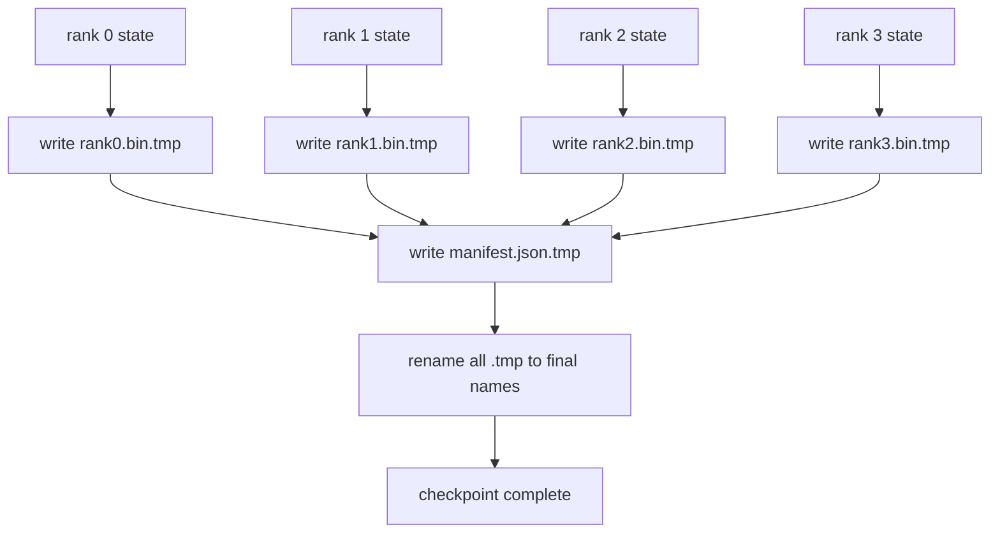

# Sharded Checkpoint 与 Atomic Resume

> 一个 70B 参数训练任务每隔几小时就会因为节点故障暂停。checkpoint format 决定你损失 30 分钟还是 30 小时。Sharded checkpoint 会并行写入每个 rank 的 shard，并在 manifest 中记录 ownership。Resume 从各自文件加载每个 rank 的 shard，在相同 world size 上重建状态，让优化器像什么都没发生一样继续 step。Atomic write 能防止半成品 checkpoint 污染下一次 resume。

**类型:** Build
**语言:** Python
**先修:** Phase 19 Track C lessons 42-49
**时间:** ~90 min

## 学习目标

- 把 multi-rank checkpoint 保存为每个 rank 一个 shard file，加上记录 rank ownership 的 manifest。
- 使用 atomic write 模式（写到 temp path 再 rename），让写入中途 crash 永远不会产生半成品 checkpoint。
- 从 manifest resume，验证 fp16 参数和 ZeRO 优化器状态在每个 rank 上都字节级相同。
- 针对三种 failure modes 为 manifest schema 辩护：world-size change、shard count mismatch 和 partial write。

## 要解决的问题

Vanilla checkpoint 会把所有参数和优化器状态读入 rank 0、gather，然后写成单个文件。对于 70B 模型，这是 1.1 TB 状态要穿过一个 rank 的网络端口。写入会阻塞其他每个 rank，因为它们空等 gather。IO 带宽是最慢那块单 GPU 的网络链路，而不是聚合带宽。在真实集群上，gather-then-write 可能比前一小时训练耗时更久，这意味着 job 每个训练日交付不到一个 checkpoint。

Sharded checkpoints 反转这个模式：每个 rank 并行把自己的 shard 写到自己的文件。Manifest 记录哪个 rank 拥有哪个 shard，因此 resume 可以把每个 shard 放回原处。聚合写入带宽随集群扩展。一个 1 TB checkpoint 通过一个 rank 要 4 小时，通过 64 个 rank 要 4 分钟。此外 manifest 还为不兼容 resume 提供契约：world-size change 可检测，partial writes 可检测，load path 可以响亮失败，而不是静默使用陈旧数据。

## 核心概念



### Manifest schema

```json
{
  "world_size": 4,
  "step": 1234,
  "wall_clock_seconds": 4521,
  "shards": [
    {"rank": 0, "path": "rank0.bin", "sha256": "...", "param_shard_offset": 0, "param_shard_numel": 65536},
    {"rank": 1, "path": "rank1.bin", "sha256": "...", "param_shard_offset": 65536, "param_shard_numel": 65536}
  ],
  "schema_version": 1
}
```

三个字段是承重的。`world_size` 让不同规模上的 resume 响亮失败，而不是静默损坏。每个 shard 的 `sha256` 会捕获 partial 或 corrupted writes。每个 shard 的 `param_shard_offset` 和 `param_shard_numel` 让 loader 在正确位置重建 flat parameter tensor。

### Atomic write

标准模式：把每个 shard 写到 `<name>.tmp`，把 manifest 写到 `manifest.json.tmp`，对每个文件 fsync，然后 rename。在同一个 filesystem 内，POSIX rename 是 atomic；要么新文件完整出现，要么仍然是旧文件。最终 rename 之前 crash 会让上一个 checkpoint 仍保持 live。没有 atomic write 时，crash 可能留下一个 partial shard，以及一个指向它的 present manifest，导致 load 在 resume 时损坏优化器状态。

### Schema 必须防御的三种 failure modes

| Failure | 症状 | 防御 |
|---------|---------|---------|
| World-size change | 使用 N=4 的 manifest 在 N=8 上 resume | manifest 中 world_size mismatch，响亮失败 |
| Shard count mismatch | resume 看到的 rank*.bin 文件少于 manifest 中的 shards | 枚举 shards，验证每一个都存在 |
| Partial write | shard file 在 flush 中途被截断 | load 时做 sha256 verification |

每种防御都会早早拒绝坏 load；另一种选择是静默损坏，100 步后 loss 变成 NaN 才显现。

### 为什么是 per-rank files，而不是一个大文件

通过 `O_APPEND` 并发写一个文件在 POSIX 上对 byte-aligned writes 可行，但实践中一个 shard 内的 offset 会跨越 MB 级区域，locking 会主导开销。Per-rank files 没有竞争，并且在底层 filesystem 是并行的（Lustre、GPFS）时受益于 striping。生产栈（DeepSpeed、FSDP、NeMo）都因此使用 per-rank files。

## 动手实现

`code/main.py` 实现：

- `ShardManifest` dataclass，包含上述 schema 以及 `to_json`/`from_json`。
- `save_sharded(state_dict_per_rank, dir, step)`：使用 atomic temp-then-rename 模式，把每个 rank 的 binary state 写入自己的文件，然后写 manifest。
- `load_sharded(dir, expected_world_size)`：读取 manifest，验证每个 shard 的 sha256，并返回 per-rank state dicts。
- 一个 round-trip test：构建 per-rank state，save，load，assert 字节级相同。

运行：

```bash
python3 code/main.py
```

输出：写入 4 个 shard files 加 manifest，然后重新加载并通过字节级等价验证。

## 实际生产中的模式

有三种模式能把 checkpoint 加固到可上线。

**Async write.** 生产栈在单独线程或进程上发起 checkpoint write，让训练继续。Barrier 在下一次 checkpoint：前一次保存完成之前，不要开始下一次保存。DeepSpeed 的 `async_io` flag 正是这样做。本课保持同步写入，让步骤可见。

**先写本地快速磁盘，再异步上传。** 写入本地 NVMe（快），再 async-upload 到 S3 或 GCS。这种两层模式保留集群内 checkpoint 的快速 resume，同时把 durable copy 发到集群外用于归档。Manifest 携带 local path；upload manifest 携带 remote path。

**Rotation 很重要。** 生产运行保留最近 K 个 checkpoint（通常 3-5 个），并轮换删除最旧的。没有 rotation，磁盘会在运行中被填满，下一个 checkpoint 失败。有了 rotation，下一次保存会先删除最旧 checkpoint，释放预算。

## 实际使用

生产模式：

- **DeepSpeed checkpointing.** `deepspeed.save_checkpoint(tag=step)` 写 per-rank files 和一个指向 active tag 的 `latest` 文件。
- **PyTorch FSDP checkpointing.** `torch.distributed.checkpoint` 使用决定 per-rank layout 的 `Planner` 保存 sharded state。
- **NeMo.** 用统一的 `save_to_checkpoint` API 包装 DeepSpeed 和 FSDP，并增加 metadata。

## 交付成果

Lesson 81 会保存 end-to-end DDP+ZeRO 运行的 sharded checkpoint，并在相同 world size 上重新加载，证明 resume contract 成立。

## 练习

1. 增加 async write：在线程中启动 save，让训练继续。下一次 save 前阻塞等待前一次完成。
2. 增加 `last_5_steps` rotation：保留最近 5 个 checkpoint，在保存新 checkpoint 前删除最旧的。
3. 为 inner-loop reload 增加只用 CRC 的快速验证路径（rotation 把一个 checkpoint 滚动成新的 active，不做完整 sha256）。
4. 增加 cross-world-size load：通过读取 manifest、concatenate、重新 sharding，实现从 N=4 到 N=8 的 shard rebalance。
5. 增加到 fake S3（第二个目录）的 upload，并写 upload manifest。为两层存储策略辩护。

## 关键术语

| 术语 | 人们常说 | 实际含义 |
|------|----------------|------------------------|
| Sharded checkpoint | "Per-rank save" | 每个 rank 并行写自己的 shard file |
| Manifest | "Index" | 记录 shard paths、offsets 和 sha256 的 JSON file |
| Atomic write | "tmp then rename" | 写入 .tmp 后执行 POSIX rename，让 crash 时旧文件仍 live |
| Partial write | "Truncated shard" | 写入期间 crash 产生损坏 shard；sha256 会捕获它 |
| Rotation | "Keep last K" | 写入新 checkpoint 前删除最旧 checkpoint，以约束磁盘使用 |

## 延伸阅读

- [DeepSpeed checkpointing](https://www.deepspeed.ai/tutorials/checkpointing/)
- [PyTorch torch.distributed.checkpoint](https://pytorch.org/docs/stable/distributed.checkpoint.html)
- [POSIX rename atomicity](https://pubs.opengroup.org/onlinepubs/9699919799/functions/rename.html)
- Phase 19 Lesson 78 - 本 checkpoint 要保存的 ZeRO state
- Phase 19 Lesson 81 - end-to-end demo 会 round-trip 已保存状态
