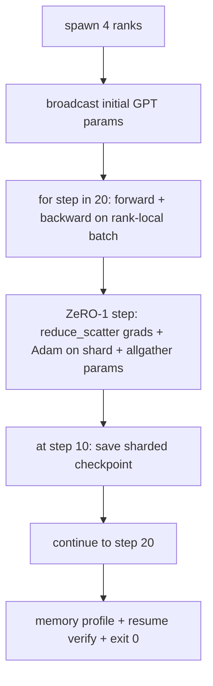

# 端到端分布式训练

> Lessons 76 through 80 各自构建了一个部件。这里是总装：一个 tiny GPT 跨 4 个模拟 rank 训练，用 DDP 做梯度同步，用 ZeRO-1 做优化器状态分片，并在中途写一个 sharded checkpoint。Demo 运行 20 步，自行终止，打印 loss curve 加 memory profile，并写入可恢复 checkpoint。

**类型:** Build
**语言:** Python
**先修:** Phase 19 Track C lessons 42-49
**时间:** ~90 min

## 学习目标

- 将 DDP（lesson 77）、ZeRO-1（lesson 78）和 sharded checkpoints（lesson 80）组合进一个训练循环。
- 在 4 个模拟 rank 上，用小型 synthetic corpus 训练一个 2-layer transformer language model 20 步。
- 打印 per-step loss table、per-rank memory profile，以及能在相同 world size 上字节级恢复的 checkpoint manifest。
- 为组合方式辩护：每个部件都已在前面 lessons 中独立可测，本课证明它们能够组合。

## 要解决的问题

Capstone 是证明部件能够拼起来。Lesson 76 实现了 collectives。Lesson 77 把它们包装成 DDP。Lesson 78 用 reduce_scatter 切分优化器状态。Lesson 79 分析了 pipeline。Lesson 80 保存了 sharded checkpoint。每课都带着自己的测试独立成立。真实训练运行会同时使用每个 primitive；如果组合有错，loss 会发散，checkpoint 会拒绝恢复，或者 per-rank memory 会在本该下降时增长。

本课运行 end-to-end demo，并验证四个 invariant：(a) loss 在 20 步内以浮点噪声范围单调下降，(b) 每个 rank 在每一步都持有相同的 parameter norm，(c) per-rank optimiser memory 等于 ZeRO-1 公式 12P/N bytes，(d) 第 10 步的 checkpoint 在重启时字节级重新加载。Demo 自行终止：20 步、单个命令、exit 0。

## 核心概念



### Mini GPT

模型有意做得很小：2 个 transformer block，embed dim 32，4 个 attention heads，vocab 64，sequence length 16，batch 4。总计几千个参数。它大到足以 exercise 每个接线决策（multi-head attention 走标准 masked path；LayerNorm 有要同步的 weights；LM head 是投回 vocab 的独立 linear projection）。它也小到能让 4 个 CPU rank 上的 20 步在几秒内完成。

### 组合规则

| Lesson piece | 它负责什么 | 留给 loop 的内容 |
|--------------|--------------|----------------------------|
| DDP broadcast | Initial parameter sync | 构造时调用一次 |
| ZeRO-1 step | Gradient sync, master copy update, parameter broadcast | 每步调用一次，替代 optimiser.step |
| Sharded checkpoint | Persist per-rank state, manifest with sha256 | 在 rank 0 上调用，state 通过 allgather 收集 |
| Training loop | Forward, backward, loss logging | 按顺序调用以上三者 |

Loop 不需要知道 reduce_scatter 或 rendezvous files。ZeRO 和 checkpoint modules 暴露窄接口，由 loop 组合。

### 为什么是 tiny GPT，而不只是 MLP

Lesson 77 的 MLP 足以验证梯度同步。Tiny GPT 增加三件事：vocab 上的独立 LM head（本课为了清晰没有 tying；完整 GPT 通常把 head 与 token embedding 绑定）、softmax+cross-entropy 作为 loss（比 MSE 有更多数值边界情况），以及不对称 forward（embeddings，然后 attention，然后每层 MLP）。Capstone 若仍使用 MLP，会隐藏组合是否正确处理 LayerNorm 或 embedding layer grad shape。

### Self-terminating 意味着 exit 0

Loop 运行固定 20 步并退出。没有 `while True`，没有人工干预，没有从外部状态 resume。一个能无人值守运行、结束时留下完整日志的 capstone，才证明系统正确接线。如果某个部件 deadlock，demo 永远不返回，test rig 会捕获。

## 动手实现

`code/main.py` 实现：

- `MiniGPT`：带 masked self-attention 和独立 LM head 的 2-layer transformer。
- `make_corpus(seed, total_tokens)`：确定性的 next-token-prediction 数据。
- `_train_worker`：每个 rank spawn 一个；广播 init params，运行 loop，调用 ZeRO step，并在第 10 步写 sharded checkpoint。
- `verify_resume`：主运行结束后，在进程内重新加载 step-10 checkpoint，并 assert 保存的 master shards 与内存快照逐字节匹配。
- `main`：编排整个 demo，打印 loss table、memory profile 和 verification result。

运行：

```bash
python3 code/main.py
```

输出：20 行 loss table、4 行 per-rank memory profile、一个 checkpoint manifest，以及成功时的 "RESUME VERIFIED" 行。

## 实际生产中的模式

三种模式能为真实运行补完组合。

**每 K 分钟 checkpoint，而不是每 K 步。** Step time 会随 seq length 和 microbatch count 变化。10 分钟 checkpoint cadence 无论模型大小如何，都捕获同样的计算量。本课为简单使用 step-based；生产使用 wall-clock-based。

**尽早检测 divergence。** 生产运行会在 backward 后添加 NaN guard 和 loss-spike detector；如果 loss 在一步内跳升超过 2x，就回滚到前一个 checkpoint，而不是让优化器进入退化状态。本课 loss curve 平滑，所以 guard 未使用，但 hook 保留。

**聚合跨 rank 的 memory profile。** 真实运行中 per-rank memory 会因 rank 而异（持有最大 pipeline stage 的 rank 会有更多 activations）。生产记录跨 rank 的 max 和 mean；本课打印 per-rank，用来展示公式匹配。

## 实际使用

生产模式：

- **DeepSpeed.** 在一个 config 下组合 DDP + ZeRO + pipeline + activation checkpointing。本课组合就是微缩版的 DeepSpeed 形态。
- **PyTorch FSDP.** Native 等价物。带 `ShardingStrategy.SHARD_GRAD_OP` 的 `FullyShardedDataParallel` 是 ZeRO-2。
- **NeMo and Megatron-LM.** 为最大模型增加 tensor parallel；除此之外，组合形态相同。

## 交付成果

完整 track 到此结束。这 6 课组合起来，就是真实团队在采用 DeepSpeed 前会构建的分布式训练子系统；抽象已在 gloo 上被证明，failure modes 也已被 exercise。Phase 17（infrastructure and production）是把它带到真实集群的地方。

## 练习

1. 为 attention head 增加 tensor-parallel split，并验证 loss 与 single-rank baseline 匹配。两个 rank：每个 rank 一半 heads，对 attention output 执行 allreduce。
2. 增加跨 4 个 microbatch 的 gradient accumulation，并证明梯度等于一个大 batch 的梯度。
3. 增加 resume-from-step-10 路径，真正继续训练到 step 20，并产生与原始运行相同的 final loss。
4. 增加 metrics export（loss、grad norm、step time）到 JSONL，让运行能在事后可视化。
5. 增加 NaN guard，在 loss spike 时回滚到前一个 checkpoint，并用一步 LR multiplier 强制造成 spike 来 exercise rollback。

## 关键术语

| 术语 | 人们常说 | 实际含义 |
|------|----------------|------------------------|
| End-to-end | "Wire it all up" | 一个 run 组合所有部件，而不是每个部件一个 unit test |
| Memory profile | "GB per rank" | 每个 rank 为 params、grads、optimiser state 持有的字节数 |
| Resume contract | "Save and load" | checkpoint round-trip 后 per-rank state 字节级相同 |
| Self-terminating | "Bounded run" | 固定 step count，完成时 exit 0，无需人工介入 |

## 延伸阅读

- [DeepSpeed end-to-end training tutorial](https://www.deepspeed.ai/getting-started/)
- [PyTorch FSDP advanced tutorial](https://pytorch.org/tutorials/intermediate/FSDP_advanced_tutorial.html)
- [Megatron-LM training script reference](https://github.com/NVIDIA/Megatron-LM)
- Phase 19 Lessons 76-80 - 本课组合的每个部件
- Phase 17 - 把组合迁移到真实集群
