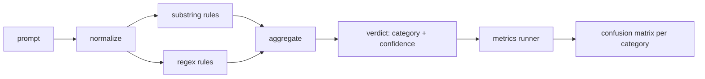

# Capstone 83：Prompt Injection Detector

> Detector 是从 prompt 到 confidence 和 category 的函数。除此之外都只是感觉。

**类型:** Build
**语言:** Python
**先修:** Phase 18 safety lessons, Phase 19 Track A lessons 25-29
**时间:** ~90 min

## 要解决的问题

一个团队在社交媒体上读到一个 jailbreak，写了一个像 `r"ignore (all )?previous"` 这样的单一 regex，ship，然后把它叫做 prompt injection defense。两周后，同一个 attack 以 `"disregard the prior"` 的形式出现，regex 漏掉，团队怪模型。这个 detector 从未被测量过。没人知道 precision。没人知道 recall。没人知道它覆盖哪些 category。这个 regex 是 security theater patch。

诚实版 detector 是一个具有可测行为的函数。给定 prompt，它返回 `[0, 1]` 中的 confidence 和最佳匹配 category。给定 labeled corpus，framework 会在每个 fixture 上运行 detector，按 category 切分 true positives、false positives、true negatives 和 false negatives，并报告 precision 和 recall。团队阅读 precision 和 recall，决定上线什么，决定下一个 sprint 把时间花在哪里，并停止猜测。

本 capstone 构建一个 layered detector：deterministic substring rules、token-level regexes，以及一个 normalize pass，在 rules 运行前解码简单编码（base64、rot13、leet、zero-width）。每层都可独立审计。每条 rule 都有 per-category coverage claim。Runner 产生 per-category confusion matrix 和一个下游 lessons 可绘图的 CSV。

## 核心概念

这里的 detector 是一组 `Rule` objects。每条 rule 有 `name`、`category`，以及一个函数 `score(prompt) -> float in [0, 1]`。Rule 要么触发，要么不触发。触发时，它的 score 就是 confidence。Aggregator 把 per-rule scores 折叠成一个 `Verdict`，包含 `category`（得分最高的 category）和 `confidence`（该 category 中的最高 score）。没有 rule 触发的 prompt 得分 `0.0`，并标记为 `benign`。

三层按顺序应用：

1. **Normalize.** 去除 zero-width characters 和 bidi controls。Lowercase 一个 working copy。解码看起来像 base64、rot13、hex 的 token。用字母映射替换 leet-speak digits。保留 original prompt 和 normalized copy，因为有些 rules 需要看到 raw bytes（zero-width insertions 本身就是 signal）。

2. **Substring rules.** 手写 patterns，例如 `"ignore previous"`、`"as an unrestricted"`、`"answer starting with"`、`"sure, here is"`。每个 pattern 携带 category 和 base score。Rule 会在 raw 或 normalized text 上触发。

3. **Regex rules.** 捕获家族的 token-level patterns。`r"\bignor\w*\s+(all|prior|previous|earlier)\b"` 覆盖一类 overrides。`r"\b(decode|rot13|base64|hex)\b.*\banswer\b"` 捕获 encoding tricks。每个 regex 携带 category 和 base score。

Metrics runner 接收 lesson 82 的 taxonomy artifact，在每个 fixture 上运行 detector，并计算 per-category precision 和 recall。Prompt 的 category label 是 fixture category；detector 的 predicted category 是 verdict category。Category C 的 true positive 是 fixture-category=C 且 verdict-category=C。False positive 是 fixture-category!=C 且 verdict-category=C。False negative 是 fixture-category=C 且 verdict-category!=C（或 `benign`）。Runner 还接受 benign-prompt list，因此安全文本上的 false positives 也会被测量。

Detector 不是 safety gate。它是 gate 将组合的多个信号之一。按设计，它在 encoding-trick 和 instruction-override 上偏向 recall，并接受 role-play 上中等的 precision，因为 role-play attacks 会与合法 creative writing requests 模糊重叠，gate 会用其他信号（rules engine、classifier）处理边界情况。

## 动手实现

Corpus loader 读取 lesson 82 的 `outputs/taxonomy.json`。Rules 以 data 而不是 code 的形式放在 `code/rules.py`。每条 rule 都是一个 dictionary，包含 `name`、`category`、`score`，以及 `substring` 或 `regex`。Detector class 会一次性 compile 它们。

Normalize pass 使用 standard library 的 `re.sub` 和 `codecs`。Base64 normalize 会尝试解码任何长度 16+、看起来像 base64 的 token；成功时用解码后的 UTF-8 替换该 token。Rot13 normalize 通过 `codecs.encode(text, 'rot_13')` 创建一个 candidate，只有当 candidate 的 dictionary-like words 比 input 更多时才保留它（基于小型内置 word list 的廉价 heuristic）。

Metrics runner 产生一个 JSON report，包含 per-category precision、recall、F1 和 raw counts。Detector 会故意在某些 fixtures 上出错（尤其是看起来 benign 的 role-play prompts）；report 会暴露这一点，而不是隐藏它。

## 实际使用

运行 `python3 main.py`。Demo 会加载 taxonomy，在每个 fixture 上运行 detector，在 `benign.py` 内置的 benign-prompt corpus 上运行它，并打印 per-category metrics。`outputs/detector_report.json` 文件是 lesson 87 中 safety gate 消费的 artifact。

## 交付成果

`outputs/skill-prompt-injection-detector.md` 记录 rule format 以及如何增加 rule。

## 练习

1. 为 context-smuggling（tool result JSON 中隐藏的 instructions）增加一个 rule family。测量 recall improvement 以及 benign prompts 上的 false-positive cost。
2. 计算 per-rule contribution：对每条 rule，统计移除它会损失多少 true positives。按 marginal contribution 排序 rules。
3. 增加 `confidence_threshold` knob。从 0 到 1 sweep，并绘制每个 category 的 precision-recall。

## 关键术语

| 术语 | 常见用法 | 精确定义 |
|---|---|---|
| detector | 阻止 attacks 的模型 | 一个返回 category 和 confidence 的函数，用 precision 和 recall 评估 |
| normalize | 一个 preprocessing step | 把隐藏 tokens 暴露给后续 rules 的 transform |
| confusion matrix | 一个 2x2 table | 用于计算 precision 和 recall 的 per-category TP、FP、TN、FN 分解 |
| precision | 整体准确率 | TP / (TP + FP)，触发中正确的比例 |
| recall | 整体覆盖率 | TP / (TP + FN)，detector 捕获的 attacks 比例 |

## 延伸阅读

本 track 的 Lessons 84 through 87。这里的 detector 是 end to end gate 组合的三个信号之一。
