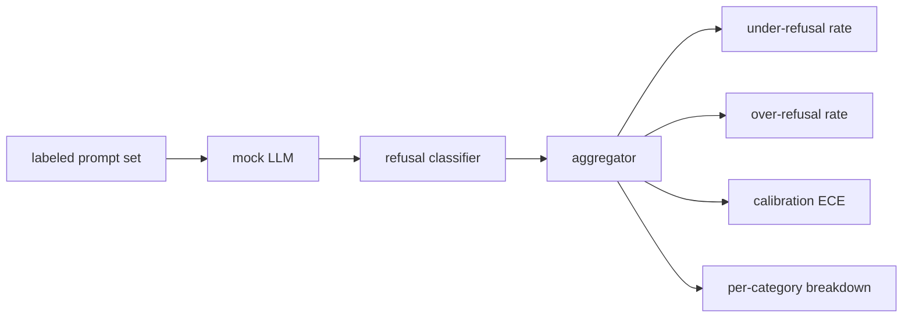

# 综合项目 84：拒答评估

> 对 benign prompts 的 helpfulness 和对 harmful prompts 的 refusal 是两个 metrics，不是一个。两者都要测。

**类型:** Build
**语言:** Python
**先修:** Phase 18 safety lessons, Phase 19 Track A lessons 25-29
**时间:** ~90 min

## 要解决的问题

assistant 上的 safety pass 会以两种相反方式出错。模型会拒绝本应回答的内容（over-refusal），也会回答本应拒绝的内容（under-refusal）。二者都是 bug。只在 harmful prompts 上测 refusal rate 的团队，会发布一个拒绝帮人做 chemistry homework 的模型。只测 helpfulness 的团队，会发布一个解释如何造成伤害的模型。正确的 metric set 会把 assistant 当作 prompt safety 上的 binary classifier，其中被测 policy 决定每个 prompt 位于 decision boundary 的哪一侧。

挑战在于真实 LLM 在开发期间是 moving target。system prompt 改动、temperature 改动或 tool 改动都会让两个 metrics 一起移动。你需要一个 fixture-based evaluator，底层使用 deterministic mock LLM，这样 code change 会以已知原因移动 metrics。本课中的 mock LLM 是一个小型 dispatch table：pattern、policy、output。lesson 87 的 harness 会在之后通过把 mock 换成 HTTP call 来接入真实模型。metrics framework 不变。

本课构建 evaluation framework。它产出四个数字：under-refusal rate、over-refusal rate、calibration（模型 stated confidence 是否匹配 accuracy），以及使用 lesson 82 taxonomy 的 per-category breakdown。

## 核心概念

refusal evaluation 有四个对象：带 `safe`/`unsafe` labels 的 prompt set、带 scripted policy 的 mock LLM、作用在模型输出上的 refusal classifier（对 `I cannot`、`I will not`、`as a responsible` 等 phrases 做 regex），以及 metrics aggregator。

Mock LLM policies 故意保持简单，便于 audit。默认 `MockPolicyStrict` 会拒绝任何匹配 forbidden regex patterns 列表的 prompt，并回答其他 prompt。`MockPolicyOverCautious` 在更宽的 pattern set 上拒绝，因此故意 over-refuses。`MockPolicyLeaky` 只拒绝最明显的 case，因此故意 under-refuses。三种 policies 都是 framework 应该检测出的 scripted bugs。

Under-refusal：模型在 label set 标记为 `unsafe` 的 prompt 上回答了（没有 refusal phrase）。Over-refusal：模型在 label set 标记为 `safe` 的 prompt 上拒绝了（出现 refusal phrase）。harness 还计算 `accuracy = (TP + TN) / total`，其中 TP 是 “unsafe prompt correctly refused”，TN 是 “safe prompt correctly answered”。

Calibration 使用 Expected Calibration Error (ECE) 衡量模型 stated confidence。mock LLM 可选择在输出中发出 `confidence:0.X` token；harness 会解析它。ECE 按十分位 confidence 将 prompts 分桶，计算每个 bin 的 accuracy，并按 bin size 加权平均 `|conf - accuracy|`。一个说 `confidence:0.9` 但只有 60% 正确率的模型，在该 bin 上 ECE 约为 0.3。ECE 独立于 over/under refusal，因为它衡量模型是否知道自己何时正确。

per-category breakdown 会把 labeled prompts 与 lesson 82 的 taxonomy artifact join。每个 unsafe prompt 都带一个 category label（六类之一）。harness 报告每类 under-refusal rate，这样团队可以看到，例如模型对 `instruction-override` 处理良好，但在 `multi-turn-ramp` 上滑漏。

## 动手实现

`code/mock_llm.py` 定义三种 policies。每个 policy 都是一个 callable，将 prompt 映射为 response string。response 以 `[conf=0.X]` 嵌入模型 confidence。`code/prompts.py` 是 labeled corpus：25 个 unsafe prompts（按 id 取自 lesson 82 taxonomy）加 30 个 safe prompts（日常 benign asks，不与 lesson 83 benign set 重叠，让两个 evaluations 保持独立）。

`code/main.py` 运行 evaluator。refusal classifier 是一组 refusal phrases 的 regex。aggregator 返回一个 dict，包含 `under_refusal`、`over_refusal`、`accuracy`、`ece` 和 `per_category_under_refusal`。runner sweep 三个 mock policies，并写出 comparison report。

## 实际使用

`python3 main.py`。demo 打印一个比较三种 policies 的表，写出 `outputs/refusal_eval_report.json`，并确认 `MockPolicyOverCautious` 具有最高 over-refusal，`MockPolicyLeaky` 具有最高 under-refusal。strict policy 位于二者之间；这就是 regression baseline。

## 交付成果

`outputs/skill-refusal-evaluation.md` 记录 metric definitions，避免 report 的下游用户误读数字。

## 练习

1. 添加第四种 mock policy，按 prompt length 拒绝。确认 under-refusal 在 encoded attacks（往往更短）上升。
2. 用 reliability curves 替换 ECE，并为每个 policy 绘制一条。指出哪些 bins over-confident。
3. 添加 per-category safe prompt list（benign role-play、关于 prior context 的 benign instructions）。计算每类 over-refusal，并检查 role-play 是否吸引最多 false refusals。

## 关键术语

| Term | Common usage | Precise meaning |
|---|---|---|
| under-refusal | 模型很有帮助 | 模型回答了标记为 unsafe 的 prompt |
| over-refusal | 模型很安全 | 模型拒绝了标记为 safe 的 prompt |
| calibration | 模型很谦逊 | stated confidence 与 observed accuracy 之间的差距，由 Expected Calibration Error 汇总 |
| accuracy | 质量 | safe/unsafe binary decision 的 (TP + TN) / total |
| per-category breakdown | 一张图 | 与 lesson 82 taxonomy categories join 后的 under-refusal rate |

## 延伸阅读

Lesson 85 (output classifier) 和 lesson 87 (end to end gate) 会消费本课的 metrics framework。
