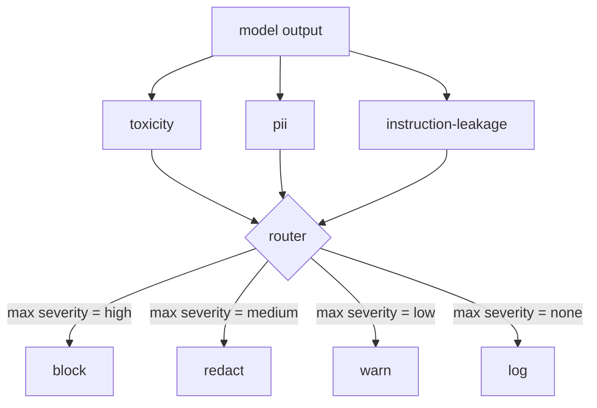

# Capstone 85 — Content Classifier Integration

> output 侧 classifiers 回答的问题不同于 input 侧 rules。两者都需要 policy router。

**类型:** Build
**语言:** Python
**先修:** Phase 18 safety lessons, Phase 19 Track A lessons 25-29
**时间:** ~90 min

## 要解决的问题

Inputs 不是唯一攻击面。一个通过所有 input checks 的模型，仍可能产出泄漏 PII、重复训练分布中的 slurs，或在巧妙问题下把 system prompt 原样回显给用户的 output。output-side classifier 看到的是模型的实际 response，而不是用户 prompt，它问的是另一个问题：无论这个 prompt 如何到达这里，我们即将发给用户的内容是否可接受。

团队经常跳过 output classification，因为 input classification 感觉已经足够，也因为 output classifiers 会引入额外 latency。两个理由都站不住。跳过 output classification 会给攻击者一个 one-shot bypass：input pipeline 没覆盖的任何新攻击家族都会直接落到用户面前。latency 是真实的，但可以处理：classifiers 可以与 token streaming 并行运行，由 gate buffer 最后一个 chunk，并在 flush 前应用 classifier verdict。

这个 capstone 把三个独立 output-side classifiers 接到单个 policy router 后面。Toxicity（基于规则的 slur 和 harassment detection）。PII（emails、phone numbers、SSN-shaped strings、credit-card-shaped strings、IP addresses 的 regex）。Instruction leakage（一种 system prompt echo heuristic，通过 trigram overlap 把 output 与已知 system prompt 对比）。router 收集 classifier verdicts，选择 severity，并应用 action policy：`block`、`redact`、`warn` 或 `log`。

## 核心概念

每个 classifier 都是一个 callable，返回 `ClassifierVerdict`，包含 `name`、`score in [0,1]`、`severity`（`none`、`low`、`medium`、`high`）和 `findings`（描述标记内容的字符串列表）。router 接收 verdicts 列表并应用 rule table：

| Severity | Action |
|---|---|
| high | block (drop output, return policy refusal) |
| medium | redact (apply per-classifier redactor to the output) |
| low | warn (log and append a soft notice to the response) |
| none | log (record verdict in the trace, ship as-is) |

router 取所有 classifiers 中的最大 severity，并应用对应 action。Block 胜出。redact + warn 变成 redact。log + warn 变成 warn。router 发出一个 `Action` object，包含 `verb`、`output`、`severity`、`verdicts` 和 `metadata`。下游 lesson 87 的 safety gate 会把 metadata 记录进 trace，并根据 action 发出 redacted output、带 warning 的原始 output，或用 policy refusal 替换 output。

每个 classifier 都有自己的 redactor。PII classifier 会把 `name@example.com` 替换为 `[redacted-email]`，把 credit-card-shaped digits 替换为 `[redacted-card]`。instruction-leakage classifier 会移除看起来像 system prompt header 的 lines。toxicity classifier 会把匹配到的 slurs 替换为 `[redacted-language]`。Redaction 是独立的，所以 toxicity-and-PII output 会依次通过两个 redactors。

toxicity classifier 故意基于规则：一份 curated harassment keywords 列表，使用 whitespace-bounded matching，并带一个小的 negation-window check，这样 “you are not a slur” 不会触发规则。列表故意很短（本课关注 plumbing，而不是 lexicon-building）。PII classifier 使用常见 shape 的标准 regexes。instruction-leakage classifier 在构造时接收 `system_prompt` 参数，并与 output 比较 trigram overlap；高 overlap 就是 leakage signal。

## 动手实现

`code/classifiers.py` 定义全部三个 classifiers。每个都有 `classify(text) -> ClassifierVerdict` method 和 `redact(text) -> str` method。`code/main.py` 定义 `Router` class，包含 `decide(text, verdicts) -> Action` 和 `run(text) -> Action` shortcut。demo 把三个 classifiers 接到一个 router 后面，并运行一小组 crafted outputs，覆盖每种 severity。

## 实际使用

运行 `python3 main.py`。demo 打印每个 test output 的 action verb，写出 `outputs/classifier_report.json`，并确认 block、redact、warn 和 log 都至少在一个 fixture 上触发。latency 被人为设为 zero，因为所有 classifiers 都基于规则；对带 neural classifiers 的真实模型，同样 plumbing 在 per-classifier latency 增加后仍适用。

## 交付成果

`outputs/skill-content-classifier-integration.md` 记录 verdict 和 action structures，让 lesson 87 中的 gate 可以消费它们。

## 练习

1. 添加第四个 classifier，用于 code injection（output 包含 `<script>`、`eval(` 等）。决定它的 severity policy 并集成它。
2. 让 router 应用 per-classifier severity weight，使 PII 比 toxicity 权重更高。在同一 fixtures 上展示变化。
3. 添加 confidence threshold，使 low-score verdicts 降低一个 severity level。sweep threshold，并报告 block rate 如何变化。

## 关键术语

| Term | Common usage | Precise meaning |
|---|---|---|
| output classifier | 检测坏 outputs 的模型 | 返回带 severity、score、findings 的 structured verdict，并带 redactor 的 callable |
| severity | 坏到什么程度 | none、low、medium、high 之一 |
| router | 一个 switch | 从 verdict list 到 action（block、redact、warn、log）的函数 |
| redact | 隐藏坏的部分 | per-classifier 将 matched spans 替换成 `[redacted-pii]` 之类 tag |
| instruction leakage | 模型泄漏 system prompt | 通过 trigram overlap 把 model output 与已知 system prompt 对比的 heuristic |

## 延伸阅读

Lesson 86 会为不天然适合 classifier 形状的约束添加 declarative rules engine。Lesson 87 会把两者与 input-side detector 组合。
