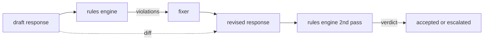

# 综合项目 86：宪法规则引擎

> 一条 rule 是 name、predicate 和 explanation。三者缺一的东西只是 vibe，不是 rule。

**类型:** Build
**语言:** Python, YAML
**先修:** Phase 18 safety lessons, Phase 19 Track A lessons 25-29
**时间:** ~90 min

## 要解决的问题

Classifiers 覆盖可识别的 failures。Rules engines 覆盖契约性的 failures。编写 coding assistant 的团队想要这样的约束：“每个包含代码的 response 都必须以 runnable block 或 stated assumption 结尾。”运行 customer support bot 的团队想要：“每个 refusal 都必须提供 next step。”这些约束不是天然 classifier targets。它们是作用在 response、conversation 和 system policy 上的 predicates，并且需要能被非工程师阅读。

诚实表示是 declarative file。constitution 以 YAML 形式与 code 一起放在 version control 中，并有单独 review process。每条 rule 都有 `name`、`predicate`、`severity` 和 `explanation` template。engine 加载文件，对 candidate output 评估每条 rule，并为触发的每条 rule 返回 structured `Violation`。这个 capstone 中的 rules engine 用 `all_of`、`any_of` 和 `not_` 组合 predicates，因此单条 rule 可以表达 “如果 response 包含 code，它必须以 runnable block 结束，并且不能引用 internal-only library。”

本课另一半是 revision。只会 block 的 rules engine 只完成了一半。能提出修复的 rules engine 才有操作价值：assistant 起草 response，engine 标记 violations，fixer 产出 revised response，engine 确认 revision 满足 rules。本课交付一个 minimal fixer（每条 rule 一个 regex replacement）和 draft 与 revised 之间的 structured diff（逐行 additions、removals、edits）。

## 核心概念



rule 的形状是：

```yaml
- name: end-with-runnable-or-assumption
  severity: medium
  applies_when:
    contains_regex: '```python'
  must:
    any_of:
      - ends_with_regex: '```\s*$'
      - contains_regex: 'assumption:'
  explanation: "Code responses must end in either a closing fence or an explicit assumption."
  fix:
    append_if_missing: "\n\nAssumption: example inputs are valid."
```

Predicates 是 atomic 的：`contains_regex`、`not_contains_regex`、`ends_with_regex`、`starts_with_regex`、`max_words`、`min_words`。Compositions 是 `all_of`、`any_of`、`not_`。engine 先评估 `applies_when`；如果 rule 不适用，violation 记录为 `not_applicable`。否则 engine 评估 `must`，并产出 `pass` 或 `violation`。

Severities 是 `low`、`medium`、`high`，镜像 lesson 85。下游 gate（lesson 87）把 `high` rule violation 当作 `high` classifier verdict 一样处理：block。

fixer 是一组 declarative operations：`append_if_missing`、`prepend_if_missing`、`replace_regex`。每个 operation 按 name 把 rule 映射到 transform。fixer 故意限制为 local edits；structural rewrites 属于单独的 refusal-and-help layer，本课不覆盖。

diff 对 original 和 revised 计算。它是 `Change` records 的列表，带 `op`（add、remove、edit）和相关 text。下游 gate 可以记录 diff，让 human reviewer 随时间 audit fixer 的行为。

## 动手实现

`code/rules.yml` 保存 constitution。`code/main.py` 中的 loader 接受 YAML file（当 PyYAML 可用时）或 JSON file（内置）。本课交付一个 `rules.yml`，lesson tests 会通过两条 code paths 解析它。`code/main.py` 定义 `Engine`、`Fixer` classes 和 `diff` function。Compositions 通过递归评估，并在 `any_of` 上 short-circuit。

交付的 constitution 包含：

- `no-empty-refusal` (medium) - refusal 必须包含 suggestion 或 redirect
- `end-with-runnable-or-assumption` (medium) - code responses 必须干净关闭
- `no-pii-in-examples` (high) - example data 不能包含 emails 或 phone shapes
- `cite-when-asserting-fact` (low) - 以 “According to” 开头的 lines 必须包含 parenthetical citation
- `no-internal-library-leak` (high) - words `internal-only` 和 `policybot-internal` 不得出现在 output 中
- `bounded-length` (low) - responses 不得超过 800 words

## 实际使用

`python3 main.py`。demo 会把三个 draft responses 通过 engine，打印 violations，运行 fixer，打印 diff，并写出 `outputs/rules_report.json`。其中一个 fixture 有 non-applicable rule（draft 中没有 code block），report 会为该 rule 显示 `not_applicable`，让团队看到 engine 明确评估过它。

## 交付成果

`outputs/skill-constitutional-rules-engine.md` 记录 rule grammar 和 fixer operations。

## 练习

1. 添加一条 rule：当 prompt 提到 safety 时，每个 response 都必须包含 phrase “If this is urgent”。使用 composition。
2. 用带 named slots 的 templating fixer 替换 regex fixer。在新设计下展示一条 rule 被 rewrite。
3. 添加 metrics endpoint：给定 drafts corpus，返回 per-rule violation rate，让团队看到哪条 rule over-firing。

## 关键术语

| Term | Common usage | Precise meaning |
|---|---|---|
| constitution | 模糊的 policy doc | 带 predicates、severities 和 explanations 的 YAML rules file |
| predicate | 一个 check | 从 text 到 bool 的 callable，可以是 atomic，也可以通过 all_of/any_of/not_ 组合 |
| violation | 一个 failure | 带 rule name、severity、explanation 和 matched span 的 structured record |
| fixer | model fine-tune | deterministic per-rule transform，把 draft 映射成 revised |
| diff | string compare | draft 和 revised 之间 add、remove、edit operations 的 structured list |

## 延伸阅读

Lesson 87 会把这个 engine 与 input-side detector 和 output-side classifier 组合成单个 safety gate。
